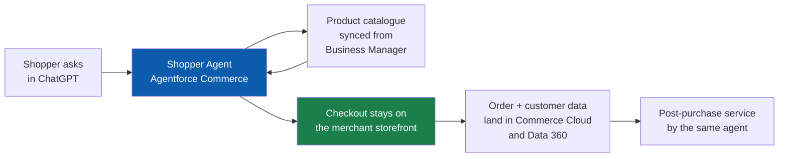
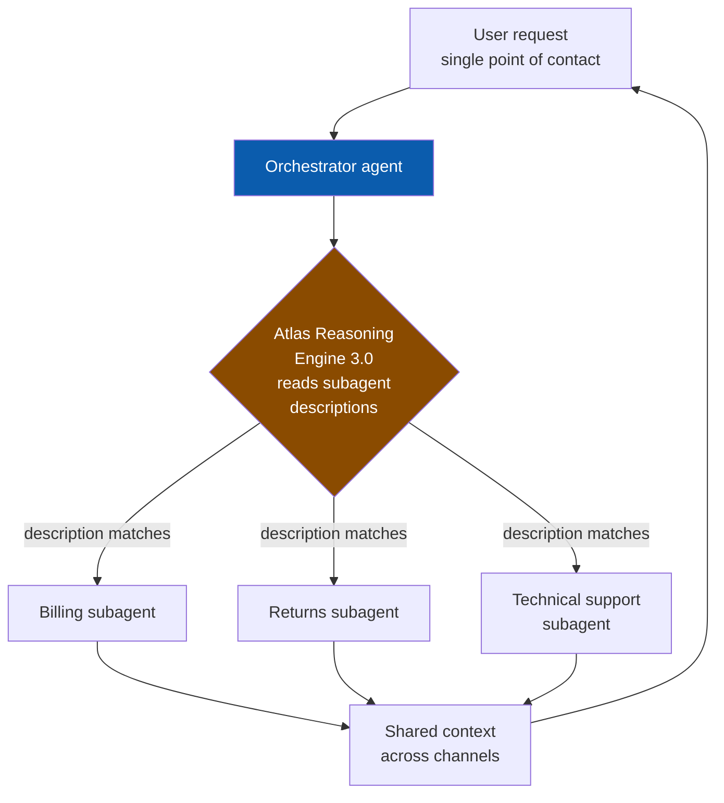

# Agentforce — July 27, 2026

_Scan window: July 26–27, 2026 (24h), extended to July 24–27 (72h) because the 24h window was empty. The 72h window overlaps the [July 26 scan](2026-07-26.md), which already captured everything new in it — so this note is mostly **verified gap-fill**: real, dated announcements the radar had not yet recorded, plus one **status correction** to an entry that was wrong. Every entry carries its actual announcement date; nothing here is dressed up as breaking news._

## Table of Contents

**New Features**

- [Agentforce Commerce is GA with Shopper, Buyer and Merchant agents selling inside ChatGPT](#agentforce-commerce-is-ga-with-shopper-buyer-and-merchant-agents-selling-inside-chatgpt)
- [IT Service Domain Pack ships 50 plus prebuilt agents into Slack, Teams and the IT Service Desk](#it-service-domain-pack-ships-50-plus-prebuilt-agents-into-slack-teams-and-the-it-service-desk)
- [Agentforce Voice adds global languages in Beta](#agentforce-voice-adds-global-languages-in-beta)

**Release Notes**

- [Correction: Multi-Agent Orchestration reached GA in June, and Atlas 3.0 routes on agent descriptions](#correction-multi-agent-orchestration-reached-ga-in-june-and-atlas-30-routes-on-agent-descriptions)

**Scan coverage**

- [What this scan did not find](#what-this-scan-did-not-find)

---

## Agentforce Commerce is GA with Shopper, Buyer and Merchant agents selling inside ChatGPT

_Gap-fill: announced **July 6, 2026**, outside both scan windows, but absent from this radar until now — and it is the largest Agentforce surface the radar was missing._

Salesforce made three prebuilt commerce agents **generally available**: the **Shopper Agent** (B2C — carries a customer from product discovery through checkout and into post-purchase service, speaking in the brand's voice), the **Buyer Agent** (B2B — meets buyers where they already are, in WhatsApp and SMS), and the **Merchant Agent** (back office — lets a merchandising team organise catalogues, sort products and react to trends in plain language instead of clicking through Business Manager). The headline capability is not the agents themselves but *where they sell*: **native ChatGPT integration is GA as of July 2026**, with Google Search — including **AI Mode** — and the Gemini app following later this summer. "Native" is the load-bearing word: the product catalogue syncs to ChatGPT **directly from Business Manager** (the B2C Commerce admin console), with no third-party middleware in between.

**Why this matters to you as a practitioner, not a retailer.** This is the first Salesforce product where the *customer's session starts outside Salesforce entirely* — inside someone else's AI assistant — and Salesforce is the fulfilment and data layer behind it. That inverts the usual grounding problem. Normally you worry about giving an agent good context; here you are publishing your context into a model you do not control, so **product data quality becomes an externally-visible asset**. Attribute mapping, catalogue hygiene and merchandising metadata stop being internal tidiness and start being the thing that determines whether ChatGPT recommends your product or a competitor's. Note also that Salesforce's current architecture **keeps checkout on the merchant's own site** rather than completing the transaction inside the assistant — which preserves order data ownership and the post-purchase relationship, and is worth knowing because competing agentic-commerce designs do not all make that choice.

**Numbers Salesforce is using to sell it** (vendor-supplied, treat as directional): retailers running their own shopper agents grew sales **59% faster** than those that had not adopted them, and during the 2025 year-end holiday season AI **influenced 20% of global online sales**, worth roughly **US$262 billion**.

**Status:** GA. Shopper, Buyer and Merchant agents generally available as of the July 6, 2026 announcement. ChatGPT integration GA July 2026. Google Search / AI Mode and Gemini app **announced**, arriving later in summer 2026.

**Sources:** [As AI Agents Transform Commerce, Salesforce Unleashes Its Biggest Agentforce Commerce Release Yet (Salesforce press release, July 6 2026)](https://www.salesforce.com/ap/news/press-releases/2026/07/06/as-ai-agents-transform-commerce-salesforce-unleashes-its-biggest-agentforce-commerce-release-yet/) · [Same announcement, Salesforce Newsroom](https://www.salesforce.com/news/stories/agentforce-commerce-announcement/) · [Salesforce Makes Agentforce Commerce Generally Available Ahead of Peak Season (CX Today)](https://www.cxtoday.com/crm/salesforce-agentforce-commerce-generally-available/) · [Agentforce Commerce GA lands ahead of peak season (Martech Notes)](https://www.martechnotes.com/salesforces-agentforce-commerce-ga-lands-ahead-of-peak-season-with-shopper-buyer-and-merchant-agents/) · [Agentforce Sells in ChatGPT. Is Your Data Ready? (Sirocco Group)](https://www.siroccogroup.com/agentforce-sells-in-chatgpt-is-your-data-ready/)

---

## IT Service Domain Pack ships 50 plus prebuilt agents into Slack, Teams and the IT Service Desk

_Gap-fill: part of the **Summer '26** release, not previously captured here._

Salesforce's **IT Service Domain Pack** now ships **more than 50 specialised agents out of the box**, deployed into **Slack, Microsoft Teams and the IT Service Desk**. A "domain pack" is Salesforce's term for a bundle of pre-built, pre-tuned agents and actions for one business function — you are configuring and grounding them rather than authoring topics from a blank page. The pack targets the high-volume, low-complexity end of internal IT: password resets, licence provisioning, and common Tier 1 tickets, with intent detection so the agent decides what the employee actually wants before routing. It also leans on proactive resolution — surfacing the fix in the channel the employee is already in, rather than waiting for a ticket to be filed.

**Why it matters.** Two things. First, it is more evidence of the direction the Help Agent already established: Salesforce is moving from *"here is a builder, go author an agent"* toward *"here is a working agent, go ground it"* — which changes what an AI-Salesforce architect is actually paid for. The differentiated work moves to data architecture, permissions and integration, because the agent logic arrives pre-written. Second, employee-facing IT agents are the easiest internal Agentforce business case to defend, since Tier 1 ticket cost is already measured in most organisations — making this a good candidate for a first internal deployment before customer-facing risk is taken on.

**Status:** Summer '26 release feature. Salesforce describes the agents as deployed out of the box; confirm per-agent GA/Beta status in your org's release notes before committing to a delivery date.

**Sources:** [Summer '26 Release: 10 Innovations Bringing the Agentic Enterprise to Life (Salesforce)](https://www.salesforce.com/news/stories/summer-2026-product-release-announcement/) · [Salesforce Summer '26: The First-90-Days Agentforce Plan (Digital Applied)](https://www.digitalapplied.com/blog/salesforce-summer-26-agentforce-first-90-days-plan) · [Salesforce Summer '26 Release Notes](https://help.salesforce.com/s/articleView?id=release-notes.salesforce_release_notes.htm&language=en_US&release=262&type=5)

---

## Agentforce Voice adds global languages in Beta

_Gap-fill: **Summer '26** feature. The radar covered Agentforce Voice but not its language coverage._

**Expanded Global Language Support for Agentforce Voice** ships in **Beta** in Summer '26, taking the voice channel beyond its previous English-and-French footprint. For context on the wider platform: text and chat channels support English plus six additional languages at GA, with nine more in Beta — voice trails that, which is the normal pattern because a voice channel needs speech recognition, synthesis *and* reasoning quality in each language, not just reasoning. The specific voice language matrix is **not publicly enumerated** in Salesforce documentation as of this scan, so the honest answer for a design conversation is "Beta, list unpublished, confirm with your account team."

**Why it matters practically.** Language coverage is the single most common reason a voice pilot cannot scale from one region to a global rollout, and it is usually discovered late. If you are scoping a multi-region Agentforce Voice deployment, treat per-language availability as a **hard dependency to confirm in writing before design**, not a detail to check during build. Beta status also means no uptime or accuracy commitment — acceptable for an internal pilot, hard to defend for a customer-facing contact centre.

**Status:** Beta, Summer '26. Public language list unavailable; verify with Salesforce directly.

**Sources:** [Summer '26 Release: 10 Innovations Bringing the Agentic Enterprise to Life (Salesforce)](https://www.salesforce.com/news/stories/summer-2026-product-release-announcement/) · [Salesforce Summer '26 Release Notes](https://help.salesforce.com/s/articleView?id=release-notes.salesforce_release_notes.htm&language=en_US&release=262&type=5) · [Salesforce Summer '26: The First-90-Days Agentforce Plan (Digital Applied)](https://www.digitalapplied.com/blog/salesforce-summer-26-agentforce-first-90-days-plan)

---

## Correction: Multi-Agent Orchestration reached GA in June, and Atlas 3.0 routes on agent descriptions

This radar recorded **Multi-Agent Orchestration (MAO)** as **Beta** in [agentforce-platform.md](../agentforce-platform.md). Multiple secondary sources date its **general availability to June 15, 2026**, as part of Summer '26 — so the Beta label here was stale, and that has now been corrected in the topic file. Worth flagging honestly: Salesforce Help still documents the in-builder wiring step as **"Connect Agent as Subagent (Beta)"**, so the product page and the setup documentation disagree. Verify the label in your own org's Setup before you quote a status to a client.

The more useful technical detail that came with GA: **Atlas Reasoning Engine 3.0 routes work by reading each specialist agent's description** — not by following a fixed decision tree. That confirms and sharpens what the radar already said about subagent descriptions being a routing contract. It means the description field is not documentation; it is **executable configuration**. A vague description ("handles billing things") produces mis-routing that looks like a model failure but is really a specification failure, and it will be intermittent — the worst kind of bug to diagnose. Write each one like an API contract: what the agent does, what it explicitly does not do, and what inputs it expects.

**Status:** GA as of June 15, 2026 per secondary sources (Summer '26). Salesforce Help still labels the *Connect Agent as Subagent* builder step as Beta — treat the discrepancy as unresolved and check in-org.

**Sources:** [Salesforce Agentforce Multi-Agent Orchestration Hits GA (TechTimes, June 16 2026)](https://www.techtimes.com/articles/318456/20260616/salesforce-agentforce-multi-agent-orchestration-hits-ga-agent-descriptions-now-drive-reliability.htm) · [Summer '26 Release: 10 Innovations (Salesforce)](https://www.salesforce.com/news/stories/summer-2026-product-release-announcement/) · [Multi-Agent Orchestration (Salesforce Help)](https://help.salesforce.com/s/articleView?id=ai.agent_multi_orch.htm&type=5) · [Salesforce Announces Summer '26: Agentforce Goes Multi-Agent (ACTGSYS)](https://actgsys.com/en/blog/salesforce-agentforce-summer-26-multi-agent-sme-2026-06)

---

## What this scan did not find

**No new first-party Agentforce announcement was published between July 26 and July 27, 2026.** Extending to the 72-hour window (July 24–27) surfaced only material the [July 26 scan](2026-07-26.md) had already captured — the `agentforce-adlc` work and the VA Agentic ELA. Specifically checked and found empty: the Salesforce Developers blog produced nothing newer than the [Headless 360 MCP Server Beta](https://developer.salesforce.com/blogs/2026/07/announcing-the-headless-360-mcp-server-beta) post from earlier in July, and **Winter '27 release notes are still not public** (Release Update *enforcement* begins September 2026 — that remains the thing to watch).

Rather than pad a quiet day, this note spends its length on four verified items the radar had genuinely missed, each dated to when it actually happened.

**One methodology caveat, repeated from the last scan because it still applies:** `salesforce.com`, `salesforceben.com`, `futurumgroup.com` and `arxiv.org` all **blocked automated fetching** during this scan (HTTP 403 at the egress proxy). First-party pages were reached through search-engine summaries rather than direct retrieval, and GitHub was the only source fetched in full. Where a claim here rests on a secondary source it is linked as such and labelled in the Status line. Nothing was asserted that could not be corroborated across at least two independent sources.

**Status:** Scan completed 2026-07-27. 24h window: empty. 72h window: no new material beyond the prior scan.

**Sources:** [Salesforce Developers Blog](https://developer.salesforce.com/blogs) · [Agentforce 360 Announcements](https://www.salesforce.com/agentforce/what-is-new/) · [Salesforce Summer '26 Release Notes](https://help.salesforce.com/s/articleView?id=release-notes.salesforce_release_notes.htm&language=en_US&release=262&type=5) · [SalesforceAIResearch/agentforce-adlc commit history](https://github.com/SalesforceAIResearch/agentforce-adlc/commits/main)
