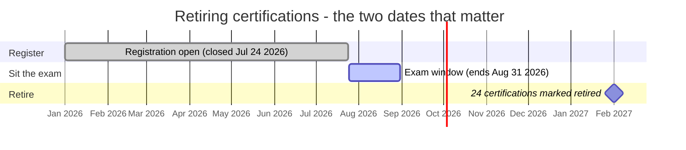

# Agentforce — July 28, 2026

_Scan window: July 27–28, 2026 (24h), extended to July 25–28 (72h) because the 24h window was empty. **Both windows produced no new Salesforce announcement.** Rather than pad the file, this note records **verified gap-fill**: real, dated changes the radar had not captured. The lead is a two-month-old flagship product this radar had somehow never recorded at all — **Agentforce Coworker**, in Beta since May 21 — followed by a certification deadline that passed four days ago and still has a live consequence. Every entry carries its actual date; nothing here is dressed up as breaking news._

## Table of Contents

**Product**

- [Agentforce Coworker has been in Beta since May 21 and this radar never recorded it](#agentforce-coworker-has-been-in-beta-since-may-21-and-this-radar-never-recorded-it)

**Learning & Certification**

- [Registration for the 24 retiring certifications closed on July 24 and the exam window shuts August 31](#registration-for-the-24-retiring-certifications-closed-on-july-24-and-the-exam-window-shuts-august-31)
- [16 certifications were renamed on July 24 and Agentforce is now in most of the names](#16-certifications-were-renamed-on-july-24-and-agentforce-is-now-in-most-of-the-names)

**Ecosystem**

- [The ADLC toolkit has been quiet since July 24](#the-adlc-toolkit-has-been-quiet-since-july-24)

**Scan coverage**

- [What this scan did not find](#what-this-scan-did-not-find)

---

## Agentforce Coworker has been in Beta since May 21 and this radar never recorded it

The largest gap this scan found is not a new announcement — it is a two-month-old one that never reached these notes. **Marc Benioff announced [Agentforce Coworker](https://www.salesforce.com/agentforce/coworker/) on May 21, 2026**, called it the biggest thing Salesforce shipped that quarter, and framed it as effectively *replacing* Salesforce Search. It has been **Beta and available to all Agentforce customers** since. It is live in the Salesforce global search bar and in Slack today, with web, **Microsoft Teams, ChatGPT, Claude** and a desktop app slated for later in 2026.

What makes it worth a full entry rather than a line is that it **inverts the pattern of every other Agentforce advance this year**. Agent Script, Multi-Agent Orchestration and Custom Scorers are all about *authoring* — writing, versioning and testing agent definitions. Coworker is authored by nobody. You enable it in Setup, assign users, and it inherits the org: sharing rules, field-level security, data spaces, permissions. There is no place to specify what it should do, which means the entire design surface is **what it is allowed to see**.

**The technical shape.** Setup → Quick Find *Agentforce Coworker* → optionally *Set Up Data Space* → *Get Started* → *Turn On* → *Turn on End User Experience* (a disclaimer consent checkbox) → *Manage Users* → assign. The admin needs the **Agentforce Coworker Admin** permission set; user access rides on the **`Access_Ai_Search`** permission set group, though Salesforce recommends assigning through *Manage Users* rather than the group directly. **Enterprise, Unlimited and Agentforce 1** editions only, and **explicitly not Government Cloud Plus**. One side effect deserves flagging: **turning on Coworker automatically enables Einstein**.

**The data-source model is the part to internalize.** Slack is **federated, not ingested** — queried live through Slack Authentication configured in Salesforce, so it is always fresh but bound by Slack's own limits (180 queries/minute sustained per user JWT, ~1000 burst). Google Drive and SharePoint are **ingested** on a **1 hr incremental** crawl, capped at **5,000 files** each, with **PDFs ≤ 100 MB and other files ≤ 4 MB**; SharePoint additionally refuses files with security labels or tags, empty Excel files and OneNote. Any DMO in the data space can be added. The Search Agent itself is capped at **100 RPM**.

**One marketing claim does not survive checking.** Secondary coverage widely repeats that Coworker connects **"270+ external data sources."** The first-party Beta limits page lists **three**: Salesforce CRM, Data 360 objects, and Slack — with **Google Drive, SharePoint and Jira in pilot only**, requiring an account executive to enable. That is a large enough gap between the pitch and the product to matter in a scoping conversation.

**Billing runs two models simultaneously**, per user, according to that user's license. Seat-based (Agentforce 1, or Agentforce for Sales/Service/Industries) makes **searching CRM or Slack free** — zero Flex Credits, zero Data Services Credits. Usage-based draws **Flex Credits** for prompts and **Data Services Credits** for data queries and unstructured/intelligent processing. Guest, unauthenticated and portal users are always usage-based. And a seat-licensed user can still consume credits if user-based AI permissions were never configured — the documented reason that setup step exists.

**What it means practically for you.** Two things. First, this is the Agentforce capability most likely to come up in a Geeksoft client conversation without anyone having built anything, because the deployment story is "turn it on" — so the useful expertise is the governance answer, not the build. Enable it in a dev org, log in as a restricted user, and ask for something they should not be able to see; knowing first-hand that sharing holds is worth more than the feature list. Second, it is **Beta with no announced GA date**, and Beta Services Terms mean consumption carries **no refund or credit rights** — prototype freely, but keep it off delivery commitments until GA lands.

**One date to hold loosely.** The **May 21** announcement date is corroborated across multiple secondary sources, but a third-party setup walkthrough is published at a **May 10** URL — eleven days earlier. Either the feature was visible in orgs before Benioff announced it, or one of the dates is wrong. Neither first-party page states an announcement date. Nothing here depends on it; note it before quoting the date precisely to anyone.

**Status:** Beta since 2026-05-21, available to all Agentforce customers. **No GA date announced** as of 2026-07-28. Salesforce CRM, Data 360 objects and Slack supported; Google Drive, SharePoint and Jira pilot-only. Not available on Government Cloud Plus. Now written up in full at [02-salesforce-ai/10-agentforce-coworker](../../02-salesforce-ai/10-agentforce-coworker/notes.md) and on the [Agentforce platform topic file](../agentforce-platform.md).

**Sources:** [Agentforce Coworker developer guide (Beta)](https://developer.salesforce.com/docs/data/agentforce-coworker/guide/agentforce-coworker-a-home.html) · [Turn On Agentforce Coworker (Beta)](https://developer.salesforce.com/docs/data/agentforce-coworker/guide/agentforce-coworker-turn-on-infrastructure.html) · [Limits and Guidelines (Beta)](https://developer.salesforce.com/docs/data/agentforce-coworker/guide/agentforce-coworker-limits-and-guidelines.html) · [Billing Considerations (Beta)](https://developer.salesforce.com/docs/data/agentforce-coworker/guide/agentforce-coworker-billing-considerations.html) · [Salesforce Announces Agentforce Coworker: AI 'In Every Search Bar' (Salesforce Ben)](https://www.salesforceben.com/salesforce-announces-agentforce-coworker-ai-in-every-search-bar/) · [Meet Your Users' New AI Teammate (Salesforce Admins)](https://admin.salesforce.com/blog/2026/meet-your-users-new-ai-teammate-introducing-agentforce-coworker) · [How to Setup Agentforce Coworker (salesforceblogger.com)](https://www.salesforceblogger.com/2026/05/10/how-to-setup-agentforce-coworker-a-new-search-experience-for-salesforce/)

---

## Registration for the 24 retiring certifications closed on July 24 and the exam window shuts August 31

Salesforce is retiring **24 certifications** on **February 1, 2027**, and the gate to get one has already partly closed: **July 24, 2026 was the last day to register** for any of those exams. If you registered before that date you can still sit the exam up to **August 31, 2026**; after that the exams are gone. The retirement is a catalogue clean-up — Salesforce is pruning credentials that no longer map to current products or to skills the job market asks for — and it runs alongside the Agentforce rebranding of the surviving certifications. Importantly, a retired certification is **not invalidated**: if you pass before the deadline it stays on your Trailblazer profile permanently, simply flagged as retired from February 1, 2027, and it still evidences the knowledge. What it loses is public verification — retired credentials remain visible on your own profile but stop appearing on the public verification pages a recruiter or partner would check.

**What it means practically for you.** The decision window is closed, so the only live question is the sit-by date. If you hold a registration for a retiring exam, **August 31 is a hard wall** — put it in the calendar and treat it as unmovable, because there is no extension path once the exam is decommissioned. If you did not register, the path forward is the current catalogue, and the Agentforce-branded certifications are where Salesforce is putting its investment.

**Status:** Announced and in effect. Registration closed July 24, 2026. Final exam date August 31, 2026. Retirement date February 1, 2027.

**Sources:** [Salesforce Is Retiring 24 Certifications: Here's What You Need to Know (Salesforce Ben)](https://www.salesforceben.com/salesforce-is-retiring-24-certifications-heres-what-you-need-to-know/) · [Salesforce 2027 Certification Retirements: Everything You Need to Know (Apex Hours)](https://www.apexhours.com/salesforce-2027-certification-retirements-everything-you-need-to-know/) · [Salesforce is retiring 24 certifications: what to decide before July 24 (K2 University)](https://k2university.com/news/salesforce-is-retiring-24-certifications-what-to-decide-before-july-24/) · [The Salesforce Certification Lifecycle](https://www.salesforce.com/blog/salesforce-certification-lifecycle/)

---

## 16 certifications were renamed on July 24 and Agentforce is now in most of the names

On the same day, **16 certifications changed name**, with **"Agentforce" replacing the old cloud-based branding** in most of them. These are **cosmetic changes only** — exam content is unchanged, exam codes are unchanged, and nobody needs to retake anything. The rename applied automatically: if you hold an affected credential, the title on your Trailblazer profile updated itself on **July 24, 2026** with no action required from you. Representative examples:

| Old name | New name |
|---|---|
| Salesforce Certified Sales Cloud Consultant | Salesforce Certified Agentforce Sales Consultant |
| Salesforce Certified Service Cloud Consultant | Salesforce Certified Agentforce Service Consultant |
| Salesforce Certified Data Cloud Consultant | Salesforce Certified Data 360 Consultant _(renamed earlier, March 27, 2026)_ |

**Why it matters practically.** The friction is entirely outside Salesforce's systems. Your Trailblazer profile self-updated, but your **CV, LinkedIn headline and email signature did not** — and recruiters increasingly search on the new terms. A profile still reading "Salesforce Certified Sales Cloud Consultant" now looks dated against a search for "Agentforce Sales Consultant", which is a real, if unglamorous, cost. This is also a useful signal about direction: Salesforce is aligning the credential catalogue with the Agentforce 360 product portfolio, the same rebranding that turned Data Cloud into Data 360, so expect the *content* of these exams to drift toward agentic material at the next refresh even though this particular change didn't touch it.

**Status:** In effect since July 24, 2026. Naming change only — no content change, no re-certification required. The complete list of 16 is published in Salesforce's Certification Name Changes FAQ.

**Sources:** [Salesforce Certification Retirements and Renames Explained (Salesforce Time)](https://salesforcetime.com/2026/06/10/salesforce-certification-retirements-and-renames-explained/) · [2026/2027 Salesforce Certification Roadmap & Agentforce Branding Changes](https://www.mhamzas.com/blog/2026/06/13/2026-2027-salesforce-certification-roadmap-agentforce-branding-changes/) · [Salesforce Certifications Changes 2027: What's Retiring, Renaming, And Why It Matters](https://salesforcetrail.com/salesforce-certifications-changes-2027/) · [Salesforce Rebrands Data Cloud Consultant to Data 360 Consultant](https://www.passcert.com/news_Salesforce-Rebrands-Data-Cloud-Consultant-to-Data-360-Consultant-Data-Con-101-Exam-Guide_2851.html)

---

## The ADLC toolkit has been quiet since July 24

The `agentforce-adlc` repository from Salesforce AI Research — the Claude Code skill set covering the whole Agentforce agent lifecycle, recorded in the [July 26 scan](2026-07-26.md) — shows a **"last updated" date of July 28, 2026** on its GitHub repository listing, which looks like fresh activity but is not. Checking the underlying feeds directly: the newest commit on `main` is still **July 24, 2026** (`Merge pull request #43`, "Improve AgentScript authoring guidance and validation"), and the releases feed contains **no published releases at all**. The July 28 timestamp reflects repository metadata, not code. This is worth writing down because a repo listing's "Updated" column is a weak signal that routinely reads as activity when nothing shipped.

**What it means for you.** Nothing changed in the toolkit you'd be learning from, so the July 26 notes remain current. The verification technique generalises: when a GitHub listing claims recent activity, confirm against `commits/main.atom` and `releases.atom` before treating it as a real change.

**Status:** No change. Latest `main` commit July 24, 2026; no releases published. Open-source research tooling, CC BY-NC 4.0, not a supported Salesforce product.

**Sources:** [agentforce-adlc commit history](https://github.com/SalesforceAIResearch/agentforce-adlc/commits/main) · [agentforce-adlc](https://github.com/SalesforceAIResearch/agentforce-adlc) · [SalesforceAIResearch repositories](https://github.com/SalesforceAIResearch)

---

## What this scan did not find

Checked and genuinely empty for **July 25–28, 2026**: no new Agentforce product announcement, no new Salesforce press release, no new Salesforce Developers blog post (the most recent remains [Announcing the Headless 360 MCP Server Beta](https://developer.salesforce.com/blogs/2026/07/announcing-the-headless-360-mcp-server-beta) from early July), and no Agentforce release-note change surfaced in the window. **Winter '27 release notes are still not public** — sandbox preview is expected around **August 29, 2026**, so the preview notes should land in the next few weeks and are the single most likely source of the next substantial entry here.

Note also that several sources in this scan were reached through search rather than direct fetch: `salesforce.com`, `admin.salesforce.com`, `help.salesforce.com` and `salesforceben.com` all returned HTTP 403 to automated fetching, so first-party pages were read via search extracts. `developer.salesforce.com` fetched cleanly, which is why the Coworker entry above leans on the developer guide for every technical claim — setup path, permission sets, rate limits, billing — and cites the marketing and blog coverage only for the announcement and its framing. Where a fact mattered — the July 24 dates, and the contradiction between "270+ data sources" and the three the Beta docs list — it was corroborated across independent sources before being written down.

**Status:** Scan completed 2026-07-28. 24h window: empty. 72h window: empty. Entries above are dated gap-fill, not new announcements.

**Sources:** [Salesforce Developers Blog](https://developer.salesforce.com/blogs) · [Salesforce Winter '27 Release Date + Preview Information](https://www.salesforceben.com/salesforce-winter-27-release-date-preview-information/) · [Salesforce Summer '26 Release Notes](https://help.salesforce.com/s/articleView?language=en_US&id=release-notes.salesforce_release_notes.htm)
