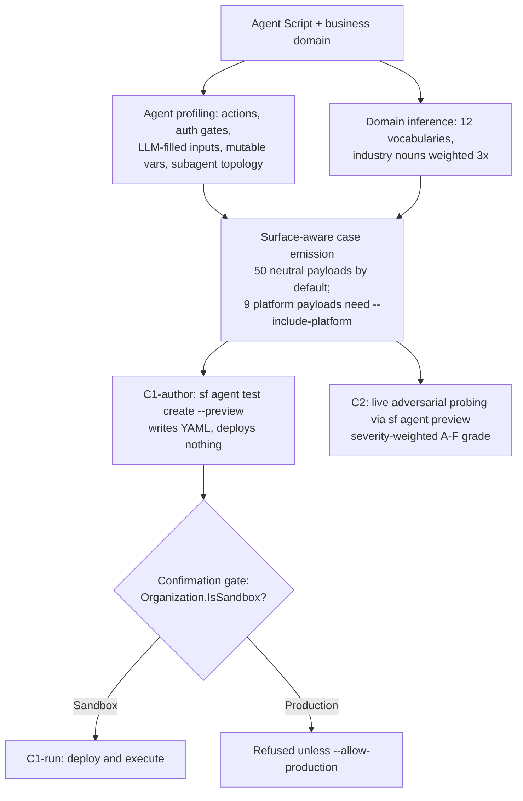

# Agentforce — July 29, 2026

_Scan window: July 28–29, 2026 (24h). **The 24h window is not empty this time.** After three consecutive scans that found nothing, the `agentforce-adlc` toolkit from Salesforce AI Research pushed **five merged pull requests on July 28** — including one that **deletes a skill you may have installed** and two that change how the tooling behaves on your machine without you asking. The [July 28 note](2026-07-28.md) recorded this repo as "quiet since July 24" and verified that its GitHub "updated" timestamp was stale metadata. That verification was correct on July 28; it stopped being true roughly twelve hours later, at 21:48–22:50 UTC that same evening. Everything below is first-party, read from the repository's own commit feed and pull requests._

**One framing caveat before the entries.** `agentforce-adlc` is **open-source research tooling under CC BY-NC 4.0, not a supported Salesforce product**. Nothing here is a platform release, and none of it carries a Salesforce SLA. It matters anyway, because it is the most detailed public statement of how Salesforce's own research org thinks Agentforce agents should be built, tested and secured — and because if you have the plugin installed, these changes are already on your machine.

## Table of Contents

**Breaking Changes & Removals**

- [The /agentforce-secure skill was deleted and its work now lives inside /agentforce-test as Mode C](#the-agentforce-secure-skill-was-deleted-and-its-work-now-lives-inside-agentforce-test-as-mode-c)

**Guardrails & Safety**

- [A new hook blocks DELETE without WHERE in quoted SOQL](#a-new-hook-blocks-delete-without-where-in-quoted-soql)
- [Hooks are now gated to Salesforce projects only](#hooks-are-now-gated-to-salesforce-projects-only)

**New Features**

- [A new skill registers and manages MCP servers in the Agentforce registry](#a-new-skill-registers-and-manages-mcp-servers-in-the-agentforce-registry)

**Authoring Guidance**

- [Eight voice latency anti-patterns and seven rules for voice-safe actions](#eight-voice-latency-anti-patterns-and-seven-rules-for-voice-safe-actions)

**Scan coverage**

- [What this scan did not find](#what-this-scan-did-not-find)

---

## The /agentforce-secure skill was deleted and its work now lives inside /agentforce-test as Mode C

This is the consequential one, and it is a **removal as much as an addition**. The standalone **`/agentforce-secure` skill no longer exists** — [PR #44](https://github.com/SalesforceAIResearch/agentforce-adlc/pull/44), merged July 28, folded it wholesale into `/agentforce-test` as a third operating mode, **Mode C**. If you have the plugin installed and invoke `/agentforce-secure` out of habit, it is gone; the capability moved rather than disappeared, but the command surface changed.

**What the old design got wrong is the interesting part.** The retired skill shipped a **static suite of 57 OWASP LLM Top 10 cases** — *OWASP LLM Top 10* being the industry list of the ten most common ways language-model applications get attacked, prompt injection and insecure output handling among them — and those 57 cases were **hard-coded around Salesforce-the-vendor**. The PR gives a concrete illustration: pointed at a Delta Air Lines complaint agent, the suite probed it with questions about citing Salesforce security bulletins, which an airline agent has no business answering, while the risks that actually mattered for that agent — **rebooking a flight without verifying the passenger, leaking passenger records** — were never tested at all. The suite was busy and irrelevant simultaneously, which is the worst combination a security test can have, because it produces a green report that means nothing.

**Mode C inverts this: the tests are derived from the agent under test, not from a catalogue.** Three things happen before a single payload is emitted. *Agent profiling* reads the agent's own Agent Script to extract its attack surface — which actions exist, where authorization gates sit, which inputs are filled by the LLM (those are the **injection sinks**, the places attacker-controlled text reaches a decision), which variables are mutable, and how subagents are wired together. *Domain inference* works out what business the agent is in, using 12 specialised vocabularies with industry-specific nouns weighted 3× as anchors. Then *surface-aware case emission* generates only tests that make sense for that agent — **an agent with no write actions gets no bulk-mutation cases**, because it cannot perform one. The 59-entry payload catalogue is split into **50 neutral entries** that adapt to any industry and **9 platform entries** framed around Salesforce administration and SOQL; only the neutral ones deploy by default, and you opt into the platform set with `--include-platform` when the agent genuinely administers Salesforce.

**The three sub-modes matter operationally, because they differ in blast radius.** `C1-author` writes security test YAML via `sf agent test create --preview` and **deploys and executes nothing** — pure authoring. `C1-run` deploys and executes, but **refuses to run against a non-sandbox org** unless you explicitly pass `--allow-production`, after a confirmation gate that queries `Organization.IsSandbox` and prints the org alias, type and name so you can see what you are about to hit. `C2` does live adversarial probing through `sf agent preview` and returns **severity-weighted A–F grades inline**. There is a second safety change worth internalising: **live actions now require an explicit `--live-actions` flag**, and the default simulates every operation. That flip — simulate by default, execute on request — is the correct default for a tool that drives real Apex, Flows and Prompt Templates, and it is the kind of default you should copy into your own tooling.

**What it means practically for you.** Two takeaways, one immediate and one durable. Immediately: **start with `C1-author`**. It produces the test specification without touching an org, which lets you read what the tool thinks your agent's attack surface is before anything executes — and that reading is often more educational than the test results. Durably: the lesson here generalises well beyond this repo. **A security suite that does not know what your agent does is theatre.** When you are asked in a client conversation how an Agentforce agent was security-tested, the answer that carries weight is "the cases were generated from the agent's own script and its business domain," not "we ran the standard 57." The end-to-end validation numbers give a sense of the shape: against the Delta agent, **74 test cases deployed cleanly — 25 agent-specific plus 49 generic** — with all 18 multi-turn conversation histories accepted server-side and zero vendor-specific language leaking through.

**Status:** Merged to `main` July 28, 2026 in open-source research tooling (CC BY-NC 4.0). **Not a Salesforce product release** — no GA/Beta designation applies and no release train carries it. `/agentforce-secure` is removed; use `/agentforce-test` Mode C.

**Sources:** [PR #44 — merge agentforce-secure into agentforce-test as Mode C](https://github.com/SalesforceAIResearch/agentforce-adlc/pull/44) · [agentforce-adlc commit history](https://github.com/SalesforceAIResearch/agentforce-adlc/commits/main) · [agentforce-adlc repository](https://github.com/SalesforceAIResearch/agentforce-adlc)

---

## A new hook blocks DELETE without WHERE in quoted SOQL

[PR #27](https://github.com/SalesforceAIResearch/agentforce-adlc/pull/27), merged July 28 and contributed by an outside developer (`akhilesharora`), adds a guardrail hook that **refuses a `DELETE` statement with no `WHERE` clause when it appears inside quoted SOQL**. A *hook* here is Claude Code's mechanism for intercepting a tool call before it runs; the toolkit uses hooks to stop destructive operations rather than merely warning about them afterwards. The specific hole being closed is worth understanding: a delete written as a plain string and passed to dynamic execution can slip past checks that only inspect statically-analysable code, because the dangerous shape is hidden inside a quoted literal until runtime.

**Why this deserves its own entry rather than a line in a changelog.** An unqualified `DELETE` is the canonical irreversible mistake in a Salesforce org, and the failure mode with agentic tooling is not that the developer types it — it is that **a model generates it while composing dynamic SOQL and it executes before anyone reads it**. That is a genuinely new class of risk introduced by letting an LLM author queries, and it is exactly the kind of thing that guardrails, not code review, have to catch. The fix landing as a community contribution rather than an internal one is also a small signal about the repo: it is taking outside patches on its safety surface.

**What it means practically for you.** If you write Agentforce actions or Apex that build SOQL dynamically, treat this as a pattern to reproduce in your own environment rather than a feature you receive. The generalisable rule: **validate the shape of generated queries at the point of execution, not at the point of authoring**, because the string is only dangerous once it is assembled.

**Status:** Merged to `main` July 28, 2026. Open-source research tooling (CC BY-NC 4.0), not a Salesforce product release.

**Sources:** [PR #27 — fix(hooks): block DELETE without WHERE in quoted SOQL](https://github.com/SalesforceAIResearch/agentforce-adlc/pull/27) · [agentforce-adlc commit history](https://github.com/SalesforceAIResearch/agentforce-adlc/commits/main)

---

## Hooks are now gated to Salesforce projects only

[PR #13](https://github.com/SalesforceAIResearch/agentforce-adlc/pull/13), merged July 28, makes the toolkit's hooks **fire only inside Salesforce projects** instead of everywhere the plugin is installed. Previously, installing the ADLC plugin meant its hooks were active in every repository you opened with Claude Code — including projects with no connection to Salesforce at all, where the guardrails have nothing useful to say and can only get in the way.

**This is a behaviour change that reaches your machine without you doing anything**, which is why it is worth recording even though it adds no capability. If you noticed ADLC hooks intervening in unrelated work and could not see why, this is the fix, and the change is in the direction you would want: **narrower scope, fewer false interventions**. The general lesson for anyone building agent tooling is that a globally-installed plugin needs a project-detection gate as a matter of course — a guardrail that fires in the wrong context does not merely waste a cycle, it teaches the user to ignore guardrails, which is a durable cost.

**What it means practically for you.** Nothing to do. If you have the plugin installed globally, hooks will now stay quiet outside Salesforce projects. Note the flip side when debugging: **if you expect a guardrail to fire and it does not, check that the directory actually looks like a Salesforce project** to the detection logic — that is now a live reason for silence.

**Status:** Merged to `main` July 28, 2026. Open-source research tooling (CC BY-NC 4.0), not a Salesforce product release.

**Sources:** [PR #13 — Gate hooks to Salesforce projects only](https://github.com/SalesforceAIResearch/agentforce-adlc/pull/13) · [agentforce-adlc commit history](https://github.com/SalesforceAIResearch/agentforce-adlc/commits/main)

---

## A new skill registers and manages MCP servers in the Agentforce registry

[PR #41](https://github.com/SalesforceAIResearch/agentforce-adlc/pull/41), merged July 28 after nine commits and two internal approvals, adds a skill for **managing MCP server registrations in the Agentforce registry**, filed under `agentforce-generate`. *MCP* — the Model Context Protocol — is the open standard by which a model reaches external tools and data; an *MCP server* publishes a set of callable tools, and the Agentforce registry is where an org declares which of those servers its agents are permitted to use.

**Why this is more significant than its one-line PR title suggests.** Registration is the seam where Agentforce stops being a closed system. An agent's capability set has, until now, largely been the actions you authored for it; an MCP registry entry means an agent can reach a tool surface that somebody else built and versioned. That makes **registration a governance decision, not a configuration step** — whoever can register a server can widen what every agent in the org is able to do. Automating that registration through a skill is convenient and, for the same reason, worth watching: convenience on a governance boundary is how permissions quietly sprawl.

**What it means practically for you.** This is the mechanism that connects the two halves of the current Salesforce MCP story — the growing set of first-party servers on one side (the Data 360 MCP Server covered in [today's Data 360 note](../02-data-cloud/2026-07-29.md), the Headless 360 MCP Server Beta from the [July 26 scan](2026-07-26.md)) and Agentforce agents on the other. Learning the registry model now is worth more than learning any individual server, because the servers will keep changing and the registration-and-permission model is what you will actually be asked to reason about. One honest limit on this entry: **the PR page describes the skill's purpose but not its full command surface**, and the repository README does not yet document MCP management at all — so treat the capability as confirmed and the details as still to be read out of the skill itself.

**Status:** Merged to `main` July 28, 2026. Open-source research tooling (CC BY-NC 4.0), not a Salesforce product release. Not yet reflected in the repository README.

**Sources:** [PR #41 — Mcp management](https://github.com/SalesforceAIResearch/agentforce-adlc/pull/41) · [agentforce-adlc repository](https://github.com/SalesforceAIResearch/agentforce-adlc) · [agentforce-adlc commit history](https://github.com/SalesforceAIResearch/agentforce-adlc/commits/main)

---

## Eight voice latency anti-patterns and seven rules for voice-safe actions

[PR #45](https://github.com/SalesforceAIResearch/agentforce-adlc/pull/45) (with [PR #42](https://github.com/SalesforceAIResearch/agentforce-adlc/pull/42) carrying the same title), merged July 28, is **documentation only — no code or asset changes** — and adds two reference documents that extend the voice modality work first recorded in the [July 26 scan](2026-07-26.md). The first, `voice-latency-heuristics.md`, catalogues **eight field-derived latency anti-patterns**: synchronous writes on the live-call path, bulky raw retrieval, chained callouts, over-decomposed subagent routing, long-turn nudge-timer trips, TTS number garble, premature end-of-turn under noise, and SIP hops. Each carries a detection method, an impact assessment and a remediation, classified as either *flag-only* or *auto-apply*.

**The reason these are worth learning as a set is that voice punishes design choices text forgives.** In a chat agent, decomposing work across several subagents costs a second or two nobody notices. On a live call, that same decomposition is dead air, and dead air makes callers talk over the agent — which trips end-of-turn detection, which corrupts the turn. Several entries on the list are the same failure viewed from different angles: *over-decomposed subagent routing*, *chained callouts* and *sync writes on the live-call path* all describe putting something slow between the caller finishing a sentence and the agent starting one. Two others — *TTS number garble* and *premature end-of-turn under noise* — are not latency at all but **perception failures**, the same class the MFCL Audio benchmark isolates in [yesterday's AI Research note](../03-salesforce-ai-research/2026-07-28.md): the agent's intent is right and the audio channel corrupts it.

The second document adds **seven rules for authoring voice-safe actions** in `actions-reference.md`: write plain-English speakable descriptions; use speakable parameter names; enumerate small value sets in the input description rather than as formal enums; add a lookup step for internal IDs; structure error responses to be voice-friendly; emit an acknowledgment phrase for slow-running actions; and **read back a confirmation before any state-changing operation**. That last one is the rule to carry: on a phone call there is no diff to review and no screen to check, so read-back before mutation is the only confirmation the caller ever gets.

**What it means practically for you.** The rule about **looking up internal IDs rather than asking for them** is the highest-value item on the list and the one most often missed — no caller can read a Salesforce record ID aloud, so any action whose input is an ID needs a lookup step in front of it or it cannot be used by voice at all. One caveat to hold: the document names **no numeric latency thresholds** — no millisecond budgets, no target turn times. It is architectural guidance, so you will still need your own measurements to know whether a given agent is fast enough.

**Status:** Merged to `main` July 28, 2026. Documentation only. Open-source research tooling (CC BY-NC 4.0), not a Salesforce product release.

**Sources:** [PR #45 — Add voice latency heuristics + voice-safe action authoring guidance](https://github.com/SalesforceAIResearch/agentforce-adlc/pull/45) · [PR #42 — same title](https://github.com/SalesforceAIResearch/agentforce-adlc/pull/42) · [PR #39 — Add voice modality support across ADLC skills](https://github.com/SalesforceAIResearch/agentforce-adlc/pull/39) · [agentforce-adlc repository](https://github.com/SalesforceAIResearch/agentforce-adlc)

---

## What this scan did not find

Checked and genuinely empty for **July 28–29, 2026**: no new Agentforce product announcement, no Salesforce press release, no Agentforce release-note change, and no new Salesforce Developers blog post. **Winter '27 release notes remain unpublished** — sandbox preview is still expected around **August 29, 2026**, which puts the preview notes roughly four weeks out and makes them the most likely source of the next genuinely large entry in this file.

**A note on method, because yesterday's scan was wrong in an instructive direction.** The [July 28 note](2026-07-28.md) checked `commits/main.atom`, found July 24 as the newest commit, and correctly concluded the repo's July 28 "updated" timestamp was stale metadata. That conclusion was sound when it was drawn and false a few hours later: the five PRs above merged at **21:48–22:50 UTC on July 28**, after that scan ran. The lesson is not that the verification technique failed — it is that **a negative finding carries a timestamp**, and "quiet since July 24" was only ever a claim about the moment it was checked. Where a scan reports emptiness, the useful thing to record alongside it is the time of the check.

Access limitations were the same as previous scans and shaped which sources are cited above: `salesforce.com`, `help.salesforce.com`, `developer.salesforce.com/blogs` and `salesforceben.com` all returned **HTTP 403** to automated fetching, so first-party marketing and release-note pages were reachable only through search extracts. GitHub fetched cleanly, which is why every technical claim in this file is sourced to a pull request or commit feed that could be read directly — the strongest evidence available in this window, and first-party for the tooling it describes.

**Status:** Scan completed 2026-07-29. 24h window: **five merged pull requests found**, all in open-source research tooling. No Salesforce product release in the window.

**Sources:** [agentforce-adlc merged pull requests](https://github.com/SalesforceAIResearch/agentforce-adlc/pulls?q=is%3Apr+is%3Amerged) · [agentforce-adlc commit history](https://github.com/SalesforceAIResearch/agentforce-adlc/commits/main) · [Salesforce Winter '27 Release Date + Preview Information](https://www.salesforceben.com/salesforce-winter-27-release-date-preview-information/) · [Salesforce Summer '26 Release Notes](https://help.salesforce.com/s/articleView?language=en_US&id=release-notes.salesforce_release_notes.htm)
