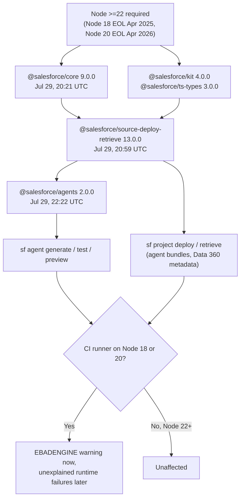

# Agentforce — July 30, 2026

_Scan window: July 29–30, 2026 (24h). **The 24h window is not empty.** The lead item is a **breaking change you will hit on your own machine and in CI**: on the evening of July 29 the whole Salesforce DX Node library stack cut major versions and **dropped Node 18 and 20**, including [`@salesforce/agents`](https://github.com/forcedotcom/agents) — the library behind every `sf agent` command. Alongside it, Salesforce's `sf-pi` extension bundle shipped **native Agent Script quality analysis with publication gates**, `agentforce-adlc` opened a PR adding an **Agent Script "doctor"**, and the **React Native Agentforce SDK reached npm at 0.3.0**. Every timestamp below is UTC, read from the repositories' own commit feeds and release pages._

**One framing note.** Nothing in this window is a platform release — there is no new Agentforce feature in an org today because of it. What changed is the **toolchain around Agentforce**: how you build, lint, test, publish and embed agents. That is the layer where your day-to-day actually lives, and one entry here can break a green pipeline tomorrow morning.

## Table of Contents

**Breaking Changes**

- [The DX toolchain dropped Node 18 and 20 — `@salesforce/agents` is now 2.0.0](#the-dx-toolchain-dropped-node-18-and-20--salesforceagents-is-now-200)

**New Features**

- [sf-pi adds native Agent Script quality analysis and gates activation behind release evidence](#sf-pi-adds-native-agent-script-quality-analysis-and-gates-activation-behind-release-evidence)
- [The React Native Agentforce SDK is installable from npm at 0.3.0](#the-react-native-agentforce-sdk-is-installable-from-npm-at-030)

**Proposed / In Review**

- [An Agent Script "doctor" and six named anti-patterns are proposed in agentforce-adlc PR #46](#an-agent-script-doctor-and-six-named-anti-patterns-are-proposed-in-agentforce-adlc-pr-46)

**Release Notes**

- [sf CLI 2.145.6 went stable — and one small change matters for CI](#sf-cli-21456-went-stable--and-one-small-change-matters-for-ci)

**Scan coverage**

- [What this scan did not find](#what-this-scan-did-not-find)

---

## The DX toolchain dropped Node 18 and 20 — `@salesforce/agents` is now 2.0.0

Between **20:21 and 22:22 UTC on July 29, 2026**, three Salesforce DX libraries released **major versions whose only headline change is a runtime requirement**: `@salesforce/core` **9.0.0**, `@salesforce/source-deploy-retrieve` **13.0.0**, and `@salesforce/agents` **2.0.0**. All three carry the same commit — `feat!: require Node >=22, drop EOL Node versions` — which raises `engines.node` to **`>=22.0.0`** and **removes support for Node 18 and Node 20**. The dependency majors moved with them: SDR 13 requires `@salesforce/core ^9.0.0`, `@salesforce/kit ^4.0.0` and `@salesforce/ts-types ^3.0.0`; `@salesforce/agents` 2.0.0 requires core `^9.0.0`, kit `^4.0.0` and SDR `^13.0.0`. The `!` in `feat!` is [Conventional Commits](https://www.conventionalcommits.org/) notation for a breaking change — it is what drove the major version bump automatically.

**Why this is the most consequential item in the window, despite being a version number.** `@salesforce/agents` is not a peripheral package. It is the **library that implements the `sf agent` command family** — `sf agent generate`, `sf agent test create/run/results`, `sf agent preview` — which means it sits underneath *every* automated way you currently exercise an Agentforce agent, including the ADLC toolkit's test modes covered in the [July 29 note](2026-07-29.md). `source-deploy-retrieve` is the engine behind `sf project deploy` and `sf project retrieve`, so it sits underneath every metadata deployment, agent bundles included. A runtime floor that moves under both of those is a change to the **shape of your pipeline**, not to a feature.

**What "EOL" means here, because it is the actual justification.** Node 18 left long-term support in **April 2025** and Node 20 in **April 2026**; both are past their maintenance windows and receive no security patches. Salesforce dropping them is housekeeping rather than caprice — but housekeeping that lands as a hard failure. The failure mode is worth picturing precisely: npm will *install* the new majors on Node 20 while printing an `EBADENGINE` warning, and the code may then break at runtime in ways that do not obviously point back to the Node version. A pipeline that pins `node:20` and runs `npm install -g @salesforce/cli` or `npm install @salesforce/agents` gets a warning today and a mystery tomorrow.

**What it means practically for you.** Three concrete things. **(1) Check your CI image, not your laptop.** Local installs of `sf` from the Salesforce installers or tarballs **bundle their own Node** — those builds began shipping Node 24 in February 2026 — so an installer-based CLI is insulated. What is exposed is anything **npm-installed against a system Node**: `npm install -g @salesforce/cli` in a Docker image, a GitHub Actions job with `actions/setup-node@v4` pinned to `18` or `20`, or your own Node scripts that import `@salesforce/agents` or `@salesforce/source-deploy-retrieve` directly. **(2) Pin deliberately if you cannot move yet.** `@salesforce/agents` **1.11.7** (released July 28) is the last Node 18/20-compatible line; pinning buys time but stops security patches, so treat it as a week, not a quarter. **(3) Expect the plugins to follow.** The CLI plugins depend on these libraries, so the floor propagates: `salesforcecli/plugin-data` was still shipping patch releases against `@salesforce/core 8.32.6` as of July 26, and will inherit the requirement when it takes core 9. Upgrading the runner once is far cheaper than discovering the floor plugin by plugin.

**Status:** **Released** to npm, July 29, 2026 — `@salesforce/core` 9.0.0, `@salesforce/source-deploy-retrieve` 13.0.0, `@salesforce/agents` 2.0.0. Breaking change (`engines.node >= 22.0.0`). Library releases on their own cadence — **not tied to a Salesforce release train**, so no Summer '26 / Winter '27 gate applies.

**Sources:** [`@salesforce/agents` releases — 2.0.0](https://github.com/forcedotcom/agents/releases) · [`forcedotcom/agents` commit history](https://github.com/forcedotcom/agents/commits/main) · [`source-deploy-retrieve` commit history — 13.0.0](https://github.com/forcedotcom/source-deploy-retrieve/commits/main) · [`sfdx-core` commit history — 9.0.0](https://github.com/forcedotcom/sfdx-core/commits/main) · [`salesforcecli/plugin-data` commit history](https://github.com/salesforcecli/plugin-data/commits/main) · [forcedotcom/cli issue #3445 — upcoming update to Node.js v24](https://github.com/forcedotcom/cli/issues/3445)

---

## sf-pi adds native Agent Script quality analysis and gates activation behind release evidence

[`salesforce/sf-pi`](https://github.com/salesforce/sf-pi) — a Salesforce-published, Apache 2.0 bundle of extensions for the **pi coding agent**, aimed at developers working in Salesforce codebases — shipped **v0.250.0 on July 28 at 20:29 UTC** with `feat(sf-agentscript): add native quality analysis`, then **v0.251.0 on July 29 at 16:20 UTC** with `feat: streamline Salesforce instructions and gate agent activation`. Two more patches in between hardened screenshot file handling and cleared code-scanning alerts. The bundle releases very frequently — six releases across those two days — so read the version numbers as a stream rather than as milestones.

**What the `sf-agentscript` extension actually is, because the name undersells it.** It is a **lifecycle manager for Agent Script**, not a linter. Its four tool families cover *authoring* (create bundles, compile and format `.agent` files, reference-safe renames and field updates), *preview* (start live-org sessions, send test utterances, get compact trace reports), *eval* (generate test specs, run multi-turn regression suites, produce release contracts), and *lifecycle* (publish inactive versions, **gate activation on release evidence**, list versions, manage Service Agent users). There is a `/sf-agentscript doctor` command for validating SDK and environment setup, and `/sf-agentscript check <file>` for manual compilation.

**The quality analysis is an 18-rule catalogue with severities that carry consequences.** Findings are graded **High / Moderate / Low / Info**, all v1 rules default **On** (future experimental rules default Off), and — this is the part worth internalising — **High-severity findings block publication unless explicitly acknowledged**. That converts linting from advice into a gate. "Native" in the commit title means the analysis now runs in-process within the extension rather than being delegated out, which is why it can sit synchronously in front of a publish step.

**The release-evidence rule is the genuinely instructive design.** Evidence that an agent version passed its tests has **no time expiry** — instead, the extension states it "remains valid while the exact org, `BotVersion`, baseline identity, and designated-suite digest remain unchanged." Read that as a small lesson in how to think about test freshness: an arbitrary "results expire after 7 days" rule is both too strict (nothing changed) and too loose (everything changed on day 2). **Invalidate on identity, not on elapsed time.** A `BotVersion` is Salesforce's versioned record of a bot/agent definition; a *suite digest* is a hash of the test suite. Change either — or point at a different org — and the evidence is void. Copy that pattern into your own release gates and you will have fewer false green lights.

**What it means practically for you.** The honest caveat first: **this runs inside the `pi` coding agent, not in VS Code, and not everyone will adopt that runtime**. Two things are still worth extracting even if you never install it. First, the **shape of a mature Agent Script pipeline is now visible in a public artifact**: compile → deterministic review → eval suite → publish inactive → gate activation on evidence. That progression is a better mental model for agent DevOps than anything in the product docs, and it maps cleanly onto what you would build with `sf agent` commands yourself. Second, note that the templates use **subagents rather than deprecated topic blocks** — a small confirmation of where Agent Script authoring has landed, which matters if you learned the topic-based model first and have not deliberately retired it.

**Status:** **Released** — v0.250.0 (July 28) and v0.251.0 (July 29), open source under Apache 2.0. Salesforce-published tooling for the `pi` coding agent; **not a supported Salesforce product** and not part of a release train. Requires Node ≥ 22.19.

**Sources:** [`salesforce/sf-pi` releases](https://github.com/salesforce/sf-pi/releases) · [`sf-pi` commit history](https://github.com/salesforce/sf-pi/commits/main) · [`sf-agentscript` extension README](https://github.com/salesforce/sf-pi/blob/main/extensions/sf-agentscript/README.md) · [`salesforce/sf-pi` repository](https://github.com/salesforce/sf-pi)

---

## The React Native Agentforce SDK is installable from npm at 0.3.0

[`salesforce/AgentforceMobileSDK-ReactNative`](https://github.com/salesforce/AgentforceMobileSDK-ReactNative) released **`@salesforce/react-native-agentforce` 0.3.0** on **July 28, 2026 at 17:13 UTC**, followed by two publish-pipeline fixes the same evening (bumping the workflow from Node 20 to Node 22 at 18:01, then fixing the bridge build in standalone CI at 20:09 — the same Node 22 migration as the entry above, seen from the release-engineering side). The headline is distribution: **the bridge is now installable from npm**, published via trusted OIDC with build provenance, rather than requiring you to vendor the repository.

**What the SDK does.** It embeds Agentforce agents into **iOS and Android React Native apps**, in two distinct modes that are worth keeping straight: **Service Agent** (anonymous, customer-facing — no login required) and **Employee Agent** (OAuth-authenticated, acting as a known user). This release steps the underlying native SDKs to the **262.1** line — iOS `AgentforceSDK` 17.31.6 with `AgentforceVoice` 2.5.2, Android 15.66.2.

**The API surface grew in ways that matter for real apps.** New capabilities include `serviceUISettings`, `sendUtterance` on a conversation (send a message programmatically rather than only through the UI), `dismissConversation` that **preserves chat history** instead of discarding it, and a **`UIDelegate` bridge that forwards native SDK events into JavaScript** — that last one is what makes the agent's lifecycle observable from React Native rather than a black box behind a native view. On voice: **voice is now enabled for Service Agents** and the **silence timeout is configurable**, which is the knob that decides how long the agent waits before assuming the caller has finished speaking. Configuration adds `sfap_api` to the default OAuth scopes and supports a custom `agentLabel`. Android fixes cover secure-form reappearance, logout crashes, conversation re-initialisation 404s, and system-bar insets, and **`minSdk` was lowered from 30 to 29** — widening device coverage rather than narrowing it.

**What it means practically for you.** If a client conversation involves "put the agent in our app," this is now a **dependency you can add** rather than a project you fork — that alone changes the estimate. Two details to hold. First, the **configurable silence timeout** connects directly to the voice latency guidance recorded in the [July 29 note](2026-07-29.md): premature end-of-turn under noise was one of the eight anti-patterns there, and this is the client-side control that tunes it. Second, be careful with the version: **0.3.0 is a pre-1.0 release**, so treat the API as unstable and pin exactly. The rapid publish-fix commits on the same evening are a reminder that the distribution path itself is young.

**Status:** **Released** — `@salesforce/react-native-agentforce` 0.3.0, July 28, 2026. **Pre-1.0** and Apache 2.0; the native SDKs it wraps are Salesforce-supported product SDKs at the 262.1 (Summer '26) line. Release-note detail read from the repository's releases page; **the page's own date field reads 2024, which is inconsistent with the commit timestamps** — the July 28, 2026 dates above come from the commit feed and are the ones to trust.

**Sources:** [`AgentforceMobileSDK-ReactNative` releases](https://github.com/salesforce/AgentforceMobileSDK-ReactNative/releases) · [commit history](https://github.com/salesforce/AgentforceMobileSDK-ReactNative/commits/main) · [repository](https://github.com/salesforce/AgentforceMobileSDK-ReactNative)

---

## An Agent Script "doctor" and six named anti-patterns are proposed in agentforce-adlc PR #46

[PR #46](https://github.com/SalesforceAIResearch/agentforce-adlc/pull/46) — **opened July 29, 2026 and still open with no reviews** — adds an **AgentScript Doctor** workflow plus public guidance on Agent Script anti-patterns to the `agentforce-adlc` toolkit. Flagging the state clearly, because it changes how much weight to put on it: **this has not merged**, so it may change substantially or not land at all. It is included here because the *diagnostic vocabulary* it introduces is useful whether or not the code ships.

**The doctor is a diagnose-and-repair loop, not a linter.** Its stated sequence: **reconstruct the intended use cases** (derived from user requirements, approved specs, existing tests and reachable behaviour), **identify actionable findings**, **apply minimal repairs**, then **compare baseline against candidate**. That last step is the one most tools skip — it is the difference between "I changed something" and "I can show the change is an improvement." Coverage spans instruction overrides, prompt text that impersonates control flow, routing, action contracts, outputs, state, lifecycle, transitions, side effects, architecture, capability honesty and evaluation integrity. For large agents it requires **bounded repair batches with parser checks between them**, which is the right instinct: a big automated rewrite of an agent definition is exactly where an LLM-driven repair goes quietly wrong.

**The six named anti-patterns are the part to memorise.** Each is a mistake you can make this week in an `.agent` file:

- **Misleading pipe-text indentation** — in a block scalar (`|`), indentation is *content*, not structure; text that looks nested to you is a flat string to the parser.
- **Fake step sequencing** — prose that reads like an ordered procedure ("first do X, then Y") inside instructions, where nothing actually enforces the order. The model may comply; it is not obliged to.
- **Ungated actions** — an action reachable without the authorization check you assumed was in the path. This is the same class of hole that Mode C security profiling hunts for.
- **Turn-ending setters** — a state assignment that terminates the turn as a side effect, so subsequent logic silently never runs.
- **Stale state** — variables that outlive their meaning and get read later as though still current.
- **Competing side-effect owners** — two places that both write the same external effect, so which one wins depends on routing rather than on design.

**Why "prompt text that impersonates control flow" deserves special attention.** It is the single most common way an Agent Script author fools themselves. Agent Script's whole value proposition is **deterministic structure around a non-deterministic model** — and if your determinism is written as English inside an instruction block rather than as an actual transition or gate, you have the *feeling* of control with none of the mechanism. The doctor checking for "capability honesty" and "evaluation integrity" points at the same underlying failure: claiming an agent can or cannot do something, without a structural reason it is true.

**What it means practically for you.** Read the six anti-patterns as a **review checklist for your own `.agent` files today** — they need no tooling to apply, and *turn-ending setters* plus *misleading pipe-text indentation* are both the kind of bug that produces behaviour nobody can explain. Then wait on the tool itself: the PR reports **116 tests passing** and forward tests against both an intentionally flawed agent and a large isolated one, but an unreviewed PR is a proposal, and the [July 29 note](2026-07-29.md) is a fresh reminder that this repository's contents change fast.

**Status:** **Open pull request** (opened July 29, 2026, unreviewed) in open-source research tooling under CC BY-NC 4.0. **Not a Salesforce product release**; no release train applies. May change or be rejected.

**Sources:** [PR #46 — Add AgentScript doctor and common-pitfall guidance](https://github.com/SalesforceAIResearch/agentforce-adlc/pull/46) · [`agentforce-adlc` pull requests](https://github.com/SalesforceAIResearch/agentforce-adlc/pulls) · [`agentforce-adlc` repository](https://github.com/SalesforceAIResearch/agentforce-adlc)

---

## sf CLI 2.145.6 went stable — and one small change matters for CI

The [Salesforce CLI release notes](https://github.com/forcedotcom/cli/blob/main/releasenotes/README.md) were updated on **July 29 at 18:29 UTC**, with **2.145.6 marked `stable`** (dated July 29, 2026) and **2.146.3 as `stable-rc`**. Nothing here is Agentforce-specific — **no new `sf agent` commands landed** — but two items are worth a minute.

The one to actually use: **`sf auth accesstoken store` now reads a piped token from stdin** instead of prompting interactively. That removes a genuine friction point in automation, where an interactive prompt either hangs the job or forces an `expect`-style workaround. Alongside it, `sf template generate apex class` gained **`Batchable`** (strongly typed, inline SOQL) and **`Queueable`** (with a `Finalizer`) templates, and an `SF_LOG_ROTATION_PERIOD` set above `1d` now falls back to `1d` with a warning rather than crashing. In the release candidate, **source tracking no longer hangs with "Polling for N SourceMembers timed out"** after deploying platform events, big objects, external objects or custom metadata types — if you have been living with that warning in a deploy pipeline, the fix is queued.

**What it means practically for you.** Treat the stdin change as the actionable one and pair it with the Node 22 entry above: both are about making an unattended pipeline behave predictably. One caution on reading these notes: the release-notes file lists **2.146.3 with a future date (August 5, 2026)** because release-candidate entries are written ahead of promotion. A dated line in that file is a *planned* promotion, not evidence that a version is already stable.

**Status:** **2.145.6 stable** (July 29, 2026); **2.146.3 stable-rc**, notes dated ahead to August 5, 2026. Salesforce CLI ships weekly, independent of release trains.

**Sources:** [Salesforce CLI release notes](https://github.com/forcedotcom/cli/blob/main/releasenotes/README.md) · [`forcedotcom/cli` commit history](https://github.com/forcedotcom/cli/commits/main) · [PR #3613 — Update release notes for version 2.146.3](https://github.com/forcedotcom/cli/pull/3613)

---

## What this scan did not find

Checked and genuinely empty for **July 29–30, 2026**: **no Agentforce product announcement**, no Salesforce press release, no Agentforce release-note change, and no new Salesforce Developers blog post. **Winter '27 release notes remain unpublished**, with sandbox preview still expected around **August 29, 2026** — roughly four weeks out and still the most likely source of the next genuinely large entry in this file.

Two verified negatives worth recording, because absence is information:

- **`agentforce-adlc` merged nothing in this window.** Its newest commit on `main` is still **July 28 at 22:50 UTC** — the tail of the five-PR burst written up in the [July 29 note](2026-07-29.md). PR #46 above is open, not merged, so the repository's shipped state is unchanged since yesterday.
- **`salesforce/agentscript`, the open-source Agent Script language repository, is quiet.** Newest commit **July 24** (`chore: Drop version computation, changesets from publish`), preceded by a July 23 internal→open-source sync. The dialects (base, `agentforce`, `agentfabric`) and the compiler are unchanged this window. Worth restating the boundary from that repository's own README, since it is easy to misread the Apache 2.0 licence: Agent Script "compiles to a Salesforce-internal specification format that executes on Salesforce infrastructure" — **the language and tooling are open, the runtime is not**.

One pattern to recognise when reading GitHub as a source: several Salesforce repositories showed **July 29 commits that are pure compliance chores** — `Set valid GUSINFO in CODEOWNERS (OSPO compliance)` appears across unrelated repositories on the same day. An org-wide administrative sweep looks exactly like activity in a commit feed and means nothing technically. Filter it out.

Access limitations were the same as previous scans and shaped the sourcing above: `salesforce.com`, `help.salesforce.com`, `developer.salesforce.com/blogs` and `salesforceben.com` all returned **HTTP 403** to automated fetching, and `arxiv.org` abstract pages did too, so first-party marketing and release-note pages were reachable only through search extracts. GitHub and `raw.githubusercontent.com` fetched cleanly, which is why every technical claim above is sourced to a commit feed, a release page or a file read directly from the repository.

**Status:** Scan completed **2026-07-30**. 24h window: **five items found**, all in developer tooling — one breaking change, two releases, one open PR, one CLI promotion. **No Agentforce platform release in the window.**

**Sources:** [`agentforce-adlc` commit history](https://github.com/SalesforceAIResearch/agentforce-adlc/commits/main) · [`salesforce/agentscript` commit history](https://github.com/salesforce/agentscript/commits/main) · [`salesforce/agentscript` repository](https://github.com/salesforce/agentscript) · [Salesforce Winter '27 Release Date + Preview Information](https://www.salesforceben.com/salesforce-winter-27-release-date-preview-information/) · [Salesforce Summer '26 Release Notes](https://help.salesforce.com/s/articleView?language=en_US&id=release-notes.salesforce_release_notes.htm)
