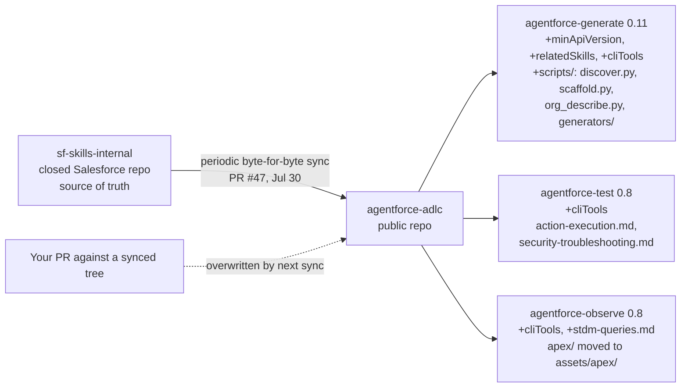

# Agentforce — July 31, 2026

_Scan window: July 30–31, 2026 (24h), extended to July 28–31 (72h) because the strict 24h window held exactly one merge. **No Salesforce product announcement, press release or release-note change landed in the window.** What did land is three pieces of first-party developer tooling, all read directly from GitHub: a skills sync in `agentforce-adlc` that reveals how that repository is actually maintained, the first npm publish of the **Agentforce Mobile SDK for React Native** with voice switched on for Service Agents, and two releases of `sf-pi` that complete Agent Script compile diagnostics. Items dated July 28 that were already covered in the [July 29 note](2026-07-29.md) are not repeated here._

## Table of Contents

**Release Notes & Tooling Updates**

- [The public ADLC skills are a mirror, and PR #47 is the proof](#the-public-adlc-skills-are-a-mirror-and-pr-47-is-the-proof)
- [sf-pi completes Agent Script compile diagnostics and gates agent activation](#sf-pi-completes-agent-script-compile-diagnostics-and-gates-agent-activation)

**New Features**

- [Agentforce Mobile SDK for React Native 0.3.0 ships as an npm package and turns on voice for Service Agents](#agentforce-mobile-sdk-for-react-native-030-ships-as-an-npm-package-and-turns-on-voice-for-service-agents)

**Scan coverage**

- [What this scan did not find](#what-this-scan-did-not-find)

---

## The public ADLC skills are a mirror, and PR #47 is the proof

[PR #47](https://github.com/SalesforceAIResearch/agentforce-adlc/pull/47), merged **July 30, 2026 at 06:59 UTC**, synchronises three skill trees — `agentforce-generate`, `agentforce-test` and `agentforce-observe` — with an internal Salesforce repository called **`sf-skills-internal`**, described in the PR as a **byte-for-byte mirror of the source of truth**. That phrase is the entry. Until now it was reasonable to read `agentforce-adlc` as an open-source project that happens to be run by Salesforce people; PR #47 says plainly that it is a **downstream publication of a closed repository**, and that the public commit history is a release channel rather than a development history. If you were planning to contribute upstream, that changes the calculus — a change made in the public repo lives in a tree that gets overwritten wholesale on the next sync.

**What actually moved.** `agentforce-generate` got new metadata fields in its `SKILL.md` — **`minApiVersion`**, **`relatedSkills`** and **`cliTools`** — condensed Optimize and MCP sections, eleven refreshed reference files, and an entirely new `scripts/` tree containing `discover.py`, `scaffold.py`, `org_describe.py` and a `generators/` directory. `agentforce-test` picked up the `cliTools` block plus updated `action-execution.md` and `security-troubleshooting.md`. `agentforce-observe` picked up `cliTools`, a new `stdm-queries.md` reference, and had its `apex/` directory relocated to **`assets/apex/`**. The `cliTools` field is the interesting one for day-to-day use: it declares which Salesforce CLI commands a skill expects to be able to invoke, which means a skill can now fail fast with a clear message instead of erroring deep inside a shell call when `sf` is missing or too old. `minApiVersion` does the same job for the org — it states the minimum Salesforce API version the skill's metadata assumes.

**Two details worth reading precisely.** First, **the skill version numbers did not change** — generate stayed at 0.11, test and observe at 0.8, and plugin and marketplace versions stayed at 0.11.0 — even though eleven reference files and a whole `scripts/` tree moved. So **version numbers on these skills do not tell you whether the content changed**; only the commit history does. Second, the `apex/` → `assets/apex/` relocation is a **path change**, so any local script or note of yours that referenced the old path is now pointing at nothing. All 111 repository tests passed, and the source branch was deleted after merge.

**What it means practically for you.** Three things. Treat the public repo as **read-and-consume, not contribute-and-influence** — file issues rather than PRs against synced skill trees, because a sync will win. Pin the **commit SHA**, not the skill version, if you ever need to reproduce a result from this toolkit. And when you read `SKILL.md` for any of these three skills from now on, **read `cliTools` and `minApiVersion` first** — they are the fastest available statement of what the skill needs from your machine and your org before it will work at all.

**Status:** Merged to `main` **July 30, 2026**. Open-source research tooling under **CC BY-NC 4.0** — **not a Salesforce product release**, so no GA/Beta designation applies and no release train carries it. Skill versions unchanged; content changed.

**Sources:** [PR #47 — sync from sf skills](https://github.com/SalesforceAIResearch/agentforce-adlc/pull/47) · [agentforce-adlc commit history](https://github.com/SalesforceAIResearch/agentforce-adlc/commits/main) · [agentforce-adlc merged pull requests](https://github.com/SalesforceAIResearch/agentforce-adlc/pulls?q=is%3Apr+is%3Amerged) · [agentforce-adlc repository](https://github.com/SalesforceAIResearch/agentforce-adlc)

---

## sf-pi completes Agent Script compile diagnostics and gates agent activation

`salesforce/sf-pi` — a Salesforce-maintained bundle of extensions for the **`pi` coding agent**, giving it Apex and LWC language-server diagnostics, Agent Script authoring tools and Data 360 connectivity — cut **three releases inside the window**: **v0.251.0** on July 29 at 16:21 UTC, **v0.252.0** on July 30 at 04:58 UTC and **v0.252.1** on July 30 at 15:11 UTC. The most consequential of the three is the smallest: v0.252.1's `fix(sf-agentscript): make target and compile diagnostics complete`. **Agent Script** is Salesforce's open, schema-driven language for declaring what an agent *is* — its state, its flow, its control hooks — with execution deliberately decoupled from the specification; *compile diagnostics* are the errors and warnings the tooling reports when it turns that specification into a Salesforce runtime spec. "Complete" here means the diagnostic set now reports the full range of target and compile problems rather than a partial one.

**Why an incomplete diagnostic set is worse than an absent one.** If your linter reports nothing, you know you have to check by hand. If it reports *some* errors, you learn to trust it, and the errors it silently omits become the ones that reach a deployed agent. For Agent Script specifically this bites harder than for ordinary code, because the language's whole design point is that you can validate the specification locally while **the runtime that executes it stays proprietary and Salesforce-hosted** — the local compiler is the only feedback loop you get before an org is involved. Completing the diagnostics closes the gap between what the local toolchain can tell you and what the remote runtime will actually reject.

**The other two releases are smaller but point the same direction.** v0.251.0 `streamline Salesforce instructions and gate agent activation` puts a gate in front of agent activation, so the agent extensions engage under stated conditions instead of always — the same narrowing move `agentforce-adlc` made on July 28 when it gated its hooks to Salesforce projects only. v0.252.0 `audit Pi 0.83 and delegate gateway retries` hands retry handling for the model gateway down to the underlying `pi` runtime rather than reimplementing it in the Salesforce layer. Both are unglamorous and both are the right shape: **fewer places doing the same job, and tooling that stays quiet until it is relevant.**

**What it means practically for you.** `sf-pi` is not a supported Salesforce product and you do not need to adopt `pi` to take something from this. The transferable point is that **Agent Script now has a local compile step you can actually rely on**, and that is the cheapest quality gate available in Agentforce authoring — catching a spec error at compile time costs seconds, catching it after deployment costs an org round-trip and a confused agent. If you are writing Agent Script by hand, find the compile diagnostics in whatever tooling you use and run them before you deploy.

**Status:** Open-source releases **v0.251.0 (July 29, 2026)**, **v0.252.0** and **v0.252.1 (July 30, 2026)**. Community/maintainer tooling from a Salesforce engineer, not a supported Salesforce product and not part of a release train. Agent Script itself is Apache 2.0; its runtime remains proprietary.

**Sources:** [sf-pi releases](https://github.com/salesforce/sf-pi/releases) · [sf-pi commit history](https://github.com/salesforce/sf-pi/commits/main) · [salesforce/sf-pi repository](https://github.com/salesforce/sf-pi) · [salesforce/agentscript — Agent Script language](https://github.com/salesforce/agentscript)

---

## Agentforce Mobile SDK for React Native 0.3.0 ships as an npm package and turns on voice for Service Agents

**Version 0.3.0** of the Agentforce Mobile SDK for React Native was released on **July 28, 2026**, and its headline is a distribution change: it is **the first publish of the JavaScript bridge as an installable npm package, `@salesforce/react-native-agentforce`**, shipped through npm trusted publishing with build provenance. Before this, consuming the bridge meant working from the repository; now it is an ordinary dependency. *Build provenance* means npm records a verifiable link between the published tarball and the CI run and source commit that produced it — worth knowing as a supply-chain property, because it lets a consumer check that a package really came from the repository it claims to.

**The functional changes matter more than the plumbing.** The release **enables voice for Service Agents** — Service Agent being the customer-facing, anonymously-authenticated configuration, as distinct from Employee Agent, which authenticates workforce users through the Salesforce Mobile SDK — and adds a **configurable voice silence timeout**, the interval of quiet after which the SDK decides the caller has finished speaking. That single setting is the knob behind a failure mode the [July 29 note](2026-07-29.md) covered from the authoring side: *premature end-of-turn under noise*, where the agent cuts the caller off mid-sentence. Having it configurable per app rather than fixed is what lets you tune for a noisy environment. The bridge API also grew **`sendUtterance`** and **`dismissConversation`**, which let host app code drive the conversation programmatically instead of only rendering it.

**The underlying native SDKs moved a release train.** 0.3.0 bumps to **Agentforce SDK 262.1 (iOS 17.31.6, Android 15.66.2)** from the 260.x line the earlier 0.1.0 and 0.2.0 releases carried. Salesforce Help uses `release=262` for its **Summer '26** release notes and `260` for Winter '26, so this is a move onto the Summer '26 train — treat that mapping as inferred from URL parameters rather than stated in the release itself. Alongside it: **Android minimum SDK dropped from 30 to 29**, widening device coverage by one Android generation, plus fixes for a secure form reappearing on Android, Employee Agent logout crashes and navigation problems, a keyboard viewport regression, `sfap_api` OAuth scope support, and custom agent labels in chat headers.

**What it means practically for you.** Two takeaways even if you never open a React Native project. **Voice reaching the customer-facing Service Agent configuration on mobile is a scope expansion, not a polish item** — it means voice is no longer confined to contact-centre channels, and the voice-safe authoring rules from the July 29 note apply to anything you build for it. And the **minimum-SDK drop from 30 to 29** is the kind of detail that decides whether a rollout covers your install base; check it before promising mobile Agentforce coverage to anyone.

**Status:** **Release 0.3.0, July 28, 2026** — a `0.x` SDK release, so not GA-designated. Published to npm as `@salesforce/react-native-agentforce`. Bundles Agentforce SDK 262.1 (iOS 17.31.6 / Android 15.66.2). Apache 2.0.

**Sources:** [AgentforceMobileSDK-ReactNative releases](https://github.com/salesforce/AgentforceMobileSDK-ReactNative/releases) · [AgentforceMobileSDK-ReactNative repository](https://github.com/salesforce/AgentforceMobileSDK-ReactNative) · [Repository commit history](https://github.com/salesforce/AgentforceMobileSDK-ReactNative/commits/main) · [Salesforce Summer '26 Release Notes](https://help.salesforce.com/s/articleView?language=en_US&id=release-notes.salesforce_release_notes.htm)

---

## What this scan did not find

**Checked and genuinely empty for July 30–31, 2026**: no Agentforce product announcement, no Salesforce press release, no Agentforce release-note change and no new Salesforce Developers blog post. `agentforce-adlc` merged **nothing on July 29 and nothing on July 31** — PR #47 on July 30 is the only merge since the July 28 burst. `salesforce/agentscript`, the Agent Script language repository itself, has been quiet since **July 24**, so the language specification did not move even though the tooling around it did.

**Winter '27 release notes remain unpublished.** Sandbox preview is still expected around **August 29, 2026**, which puts the preview notes roughly four weeks out and keeps them the most likely source of the next genuinely large entry in this file. Until then, expect this folder to keep being fed by repository activity rather than by product announcements.

**One near-miss worth naming.** The Salesforce Developers blog published *Introducing a New Connect REST API Experience* in July 2026 — a consolidation of the Connect REST API reference into a single page covering the Agentforce, Chatter, CMS, Commerce, Experience Cloud, Files and Personalization API families. It is Agentforce-adjacent and useful, but **its exact publication date could not be established** and the post itself returned HTTP 403 to automated fetching, so it cannot be placed inside this scan's window and is recorded here rather than as an entry.

**Method note.** Every technical claim above was read directly from GitHub, which fetches cleanly. First-party Salesforce domains — `salesforce.com`, `help.salesforce.com`, `developer.salesforce.com/blogs` — plus `salesforceben.com`, `tableau.com`, `venturebeat.com`, `cloudwars.com` and `releasebot.io` all returned **HTTP 403** to automated fetching throughout this scan and were reachable only through search extracts. That constraint is why this file cites pull requests and release pages rather than marketing pages, and it is a standing limitation of these scans rather than a one-off.

**Status:** Scan completed **2026-07-31**. 24h window (July 30–31): **one merged pull request plus two tooling releases**. 72h window (July 28–31): **one additional SDK release (0.3.0)**. No Salesforce product release in either window.

**Sources:** [agentforce-adlc merged pull requests](https://github.com/SalesforceAIResearch/agentforce-adlc/pulls?q=is%3Apr+is%3Amerged) · [salesforce/agentscript commit history](https://github.com/salesforce/agentscript/commits/main) · [Salesforce Winter '27 Release Date + Preview Information](https://www.salesforceben.com/salesforce-winter-27-release-date-preview-information/) · [Introducing a New Connect REST API Experience](https://developer.salesforce.com/blogs/2026/07/introducing-a-new-connect-rest-api-experience) · [Salesforce Summer '26 Release Notes](https://help.salesforce.com/s/articleView?language=en_US&id=release-notes.salesforce_release_notes.htm)
