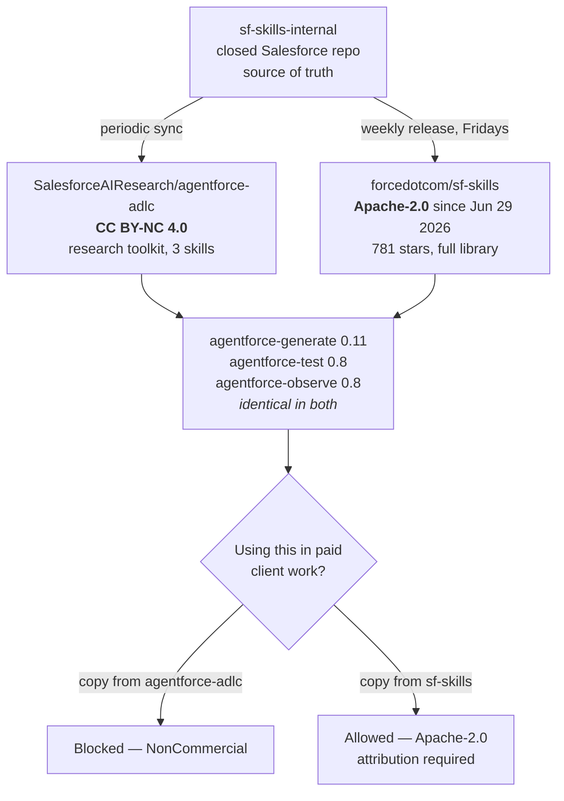

# Agentforce — August 01, 2026

_Scan window: July 31 – August 1, 2026 (24h), extended to July 29 – August 1 (72h). **No Salesforce press release, product announcement or release-note change landed in either window.** What did land is the largest single week of first-party Agentforce skill publishing this radar has recorded: `forcedotcom/sf-skills` **1.33.0**, shipping **10 new and 16 updated skills** on July 31, including the first skill dedicated to standing up a **Help Agent** — the product that went GA in July '26. Chasing that release also settled a question the [July 31 note](2026-07-31.md) left open about the closed `sf-skills-internal` repository, and the answer materially changes what you are allowed to do with these skills at work. Items dated July 28–30 already covered in the [July 31 note](2026-07-31.md) are not repeated here._

## Table of Contents

**New Features**

- [sf-skills 1.33.0 ships 10 new and 16 updated skills, led by a Help Agent setup skill](#sf-skills-1330-ships-10-new-and-16-updated-skills-led-by-a-help-agent-setup-skill)

**Licensing & Governance**

- [The same Agentforce skills are published under two licences, and only one allows commercial use](#the-same-agentforce-skills-are-published-under-two-licences-and-only-one-allows-commercial-use)

**Release Notes & Tooling Updates**

- [AgentforceMobileService-iOS moves to SPM binary distribution 6.11.2](#agentforcemobileservice-ios-moves-to-spm-binary-distribution-6112)

**Scan coverage**

- [What this scan did not find](#what-this-scan-did-not-find)

---

## sf-skills 1.33.0 ships 10 new and 16 updated skills, led by a Help Agent setup skill

On **July 31, 2026 at 17:57 UTC**, `forcedotcom/sf-skills` — Salesforce's public library of **agent skills** for building on the platform — tagged **1.33.0**, described in its own commit as *"Release 10 new + 16 updated skills"*. A *skill*, in the sense of the open **Agent Skills specification** this repo follows, is a folder containing a `SKILL.md` file that tells an AI coding agent *when* to take over a task and *how* to do it, plus supporting scripts and reference material. It is not code you call; it is procedural knowledge an agent loads when your request matches its trigger conditions. The release touched **26 skill directories and 2,393 files**, and it is installable with `npx skills add forcedotcom/sf-skills` or automatically inside **Agentforce Vibes**, Salesforce's AI development environment.

**The headline addition is `service-helpagent-coordinate` (v0.9).** This is the first skill built specifically around the **Help Agent** — the prepackaged Agentforce Service Agent that reached **GA in July '26** with pay-per-resolution pricing. The skill drives *"a guided four-checkpoint flow"* covering setup, channel configuration, grounding on Salesforce Knowledge, and go-live. Read its trigger list and you can see the shape of the product: it fires on embedding a chat widget in an Experience Cloud or LWR site, on putting an agent on web chat, voice or phone, and on grounding an agent in Knowledge articles. Two details are worth noticing. It declares `minApiVersion: "67.0"` — a **higher** floor than the `66.0` the core `agentforce-generate` skill requires, so it needs a newer org. And it *"hard-stops on"* channels that are announced but not yet shippable, which is an honest and unusual design choice: the skill refuses rather than improvising when you ask for something that does not exist yet.

**The other nine new skills cluster into two groups**, and the clustering tells you where Salesforce is investing. Three are `service-digital-engagement-*` skills — `channel-configure`, `deployment-configure` and `messaging-site-integrate` — which are exactly the plumbing a Help Agent needs to reach a customer, and which `service-helpagent-coordinate` lists as related skills. Three are Experience Cloud front-end skills: `experience-lwr-site-generate`, `experience-lds-data-requirements-generate` and `experience-ui-bundle-mfa-configure`. The rest are platform utilities: `platform-report-generate`, `platform-data-and-tooling-api-context-get`, and `platform-sandbox-configure`. **`platform-sandbox-configure` is the one to look at even if you never use skills**, because it ships at **version 1.0** — not 0.x like almost everything else in the library — and it carries a metadata field this radar has not seen before:

```yaml
accessCheck:
  - type: "userPerm"
    value: "ManageSandboxes"
```

That declares the **org permission** the skill requires before it will run, the same way `cliTools` (added in the July 30 sync) declares the local CLI it needs. Together they mean a skill can now fail fast with *"you lack ManageSandboxes"* instead of dying inside a REST call. **Declared preconditions are the quiet quality story in this library**, and they are worth copying if you author skills of your own.

**The three `agentforce-*` skills were updated too, and their trigger text is where the product news actually leaks.** `agentforce-generate` (0.11) now names `sf agent mcp` explicitly — registering, listing and deleting **MCP servers**, whitelisting and approving MCP tools, and configuring MCP authentication. *MCP*, the Model Context Protocol, is the open standard by which a model reaches external tools; that command surface existing in a shipped skill is a stronger signal than a roadmap slide. `agentforce-test` (0.8) now covers **security testing explicitly** — *"OWASP LLM Top 10, red-teaming, penetration testing, prompt-injection tests, a security grade"* — which is a real scope expansion from functional testing, and the single most useful thing in this release for anyone who has to defend an agent in a review. `agentforce-observe` (0.8) remains the Data-Cloud-facing one and is covered in [today's Data Cloud note](../02-data-cloud/2026-08-01.md).

**What it means practically for you.** The library now releases **weekly, on Fridays** — 1.28/1.29 on July 3, then July 10, 17, 24 and 31 — so this is a cadence you can plan around rather than a one-off. Three concrete moves. If you are standing up a Help Agent, **read `service-helpagent-coordinate` before you touch the Quick Setup wizard**, because its four checkpoints are the closest thing to an official implementation order that exists in public. If you review agents, **pull `agentforce-test` 0.8 and use its OWASP LLM Top 10 material as your checklist** — you no longer have to invent one. And whatever you take, **note the version and the release tag**, because the README itself warns to *"expect frequent changes"* and that skills *"may be renamed, restructured, or removed between releases"* without API stability guarantees.

**Status:** Open-source release **1.33.0, July 31, 2026** (work item `@W-23641814@`, commit `40db639`). **Apache-2.0.** This is a Salesforce-maintained public library, **not a supported Salesforce product** — no release train, no SLA, and an explicit stability disclaimer. The **Help Agent** it configures is separately **GA as of July '26**. Individual skill versions remain 0.x except `platform-sandbox-configure` at 1.0.

**Sources:** [forcedotcom/sf-skills](https://github.com/forcedotcom/sf-skills) · [sf-skills releases](https://github.com/forcedotcom/sf-skills/releases) · [sf-skills commit history](https://github.com/forcedotcom/sf-skills/commits/main) · [sf-skills CHANGELOG](https://github.com/forcedotcom/sf-skills/blob/main/CHANGELOG.md) · [service-helpagent-coordinate SKILL.md](https://github.com/forcedotcom/sf-skills/blob/main/skills/service-helpagent-coordinate/SKILL.md) · [platform-sandbox-configure SKILL.md](https://github.com/forcedotcom/sf-skills/blob/main/skills/platform-sandbox-configure/SKILL.md) · [agentforce-test SKILL.md](https://github.com/forcedotcom/sf-skills/blob/main/skills/agentforce-test/SKILL.md) · [Salesforce Launches Agentforce Help Agent That Deploys in Minutes and Only Charges for Resolutions](https://www.salesforce.com/news/stories/agentforce-help-agent-announcement/)

---

## The same Agentforce skills are published under two licences, and only one allows commercial use

The [July 31 note](2026-07-31.md) reported that `SalesforceAIResearch/agentforce-adlc` is a **byte-for-byte downstream mirror** of a closed internal repository called `sf-skills-internal`, and — reading the AnchorBench licence work the same week — treated **CC BY-NC 4.0** as a hard stop for using that material in paid client work. Both statements were correct. **What was missing is that `sf-skills-internal` has a second public outlet, and it is licensed differently.**

**The evidence is direct.** The `agentforce-generate` skill in `forcedotcom/sf-skills` and the one in `SalesforceAIResearch/agentforce-adlc` are the **same skill**: identical `version: "0.11"`, identical `minApiVersion: "66.0"`, identical `relatedSkills` list, and a description string that matches word for word down to the `sf agent mcp` trigger clause. The same holds for `agentforce-test` and `agentforce-observe`, both at `0.8` in both repositories. Two public repositories, two different GitHub organisations, one upstream. But `forcedotcom/sf-skills` carries **Apache-2.0** — switched from Creative Commons on **June 29, 2026** in commit `a9a7700` by Jim Jagielski of Salesforce's open-source programme office, a change that rewrote `LICENSE.txt` wholesale — while `agentforce-adlc` remains **CC BY-NC 4.0**, which forbids use *"primarily for commercial advantage or monetary compensation."*

**Why this is the most consequential item in today's scan.** *NonCommercial* and *consulting deliverable* do not coexist. Under the July 31 reading, a practitioner who wanted to use `agentforce-test`'s security material inside a client engagement had to re-implement it from the ideas rather than copy the artifact. That constraint attaches to **the copy you took, not to the skill itself** — and the copy in `forcedotcom/sf-skills` is Apache-2.0, a permissive OSI-approved licence that allows commercial use, modification and redistribution with attribution. **Same content, same version, no restriction.** So the practical answer is not "re-implement it," it is "take it from the other repository."



**Read the caveats precisely, because this is a licensing claim.** `forcedotcom/sf-skills` does not state anywhere that it syncs from `sf-skills-internal`; that link is **inferred** from three skills matching exactly, at matching versions, across two Salesforce-controlled organisations, one of which explicitly names the internal repo. The inference is strong but it is an inference. `agentforce-adlc` also carries material that `sf-skills` does not — it is a research toolkit with its own harness around the three skills — so **"take it from sf-skills instead" applies to the skills, not to everything in the ADLC repo.** And Apache-2.0 has real obligations: retain the licence and notice, state your changes. It is permissive, not public domain.

**What it means practically for you, and it generalises.** When the same artifact appears in more than one place, **the licence travels with the copy, not with the content** — so "can I use this commercially?" is not a question about a skill, it is a question about a URL. Three habits. Before using any Salesforce open-source AI material at work, **check which organisation you cloned from**: `forcedotcom` and `salesforce` are the product-engineering orgs and trend permissive; `SalesforceAIResearch` is the research org and trends CC BY-NC. **Prefer `forcedotcom/sf-skills` as your default source** for the three `agentforce-*` skills. And **record the licence at the commit you took**, because — as the June 29 relicensing here and the July 30 AnchorBench rewrite both show — licence text on these repositories moves without any version number changing.

**Status:** Standing finding, not a dated announcement — surfaced **August 1, 2026** while verifying the 1.33.0 release. `forcedotcom/sf-skills`: **Apache-2.0**, relicensed from Creative Commons **June 29, 2026**. `SalesforceAIResearch/agentforce-adlc`: **CC BY-NC 4.0**, unchanged. Neither is a supported Salesforce product. The shared-upstream relationship is **inferred from identical skill content and versions**, not stated by Salesforce. This corrects the practical conclusion of the [July 31 note](2026-07-31.md); that note's description of `agentforce-adlc` itself remains accurate.

**Sources:** [forcedotcom/sf-skills](https://github.com/forcedotcom/sf-skills) · [sf-skills LICENSE.txt](https://github.com/forcedotcom/sf-skills/blob/main/LICENSE.txt) · [Relicensing commit — Creative Commons to Apache 2.0, June 29 2026](https://github.com/forcedotcom/sf-skills/commit/a9a77002cb98c27a7fd77b866e6eef542403400c) · [sf-skills agentforce-generate SKILL.md](https://github.com/forcedotcom/sf-skills/blob/main/skills/agentforce-generate/SKILL.md) · [agentforce-adlc agentforce-generate SKILL.md](https://github.com/SalesforceAIResearch/agentforce-adlc/blob/main/skills/agentforce-generate/SKILL.md) · [SalesforceAIResearch/agentforce-adlc](https://github.com/SalesforceAIResearch/agentforce-adlc) · [PR #47 — sync from sf skills](https://github.com/SalesforceAIResearch/agentforce-adlc/pull/47) · [Apache License 2.0](https://www.apache.org/licenses/LICENSE-2.0) · [Creative Commons BY-NC 4.0 licence text](https://creativecommons.org/licenses/by-nc/4.0/)

---

## AgentforceMobileService-iOS moves to SPM binary distribution 6.11.2

`forcedotcom/AgentforceMobileService-iOS` took one commit in the window — `f86eb61`, *"Update Package.swift for SPM binary distribution 6.11.2"*, on **July 31, 2026 at 19:51 UTC**. `Package.swift` is the **Swift Package Manager** manifest, and a *binary distribution* means the package points at a precompiled `.xcframework` rather than shipping source to be built. So this is a **version pointer bump to 6.11.2**, not a code change in the repository itself — the substance is in a binary published elsewhere, and the commit does not describe what changed inside it.

**Why note something this small.** Because it is the only other first-party Agentforce movement in the window, and because it is the iOS-native sibling of the React Native SDK whose 0.3.0 release the [July 31 note](2026-07-31.md) covered at length. That release bundled **Agentforce SDK 262.1 (iOS 17.31.6)**; this repository versions independently at 6.11.x, so **do not try to reconcile the two numbering schemes** — they are different artifacts with different version lines, and assuming otherwise is an easy way to pin the wrong thing.

**What it means practically for you.** Almost nothing, unless you ship an iOS app with an embedded Agentforce service layer — in which case, take the bump and watch for a matching entry in the mobile SDK release notes, since the binary's changelog is not in this repository. The transferable point is the one above: **Salesforce's Agentforce mobile artifacts do not share a version line**, so track each dependency separately rather than assuming a single "Agentforce mobile version" exists.

**Status:** Single repository commit, **July 31, 2026**. A manifest pointer to **binary distribution 6.11.2**; no release was published on the repository's releases page and no changelog accompanies the bump. Not a product announcement and not tied to a release train.

**Sources:** [AgentforceMobileService-iOS commit history](https://github.com/forcedotcom/AgentforceMobileService-iOS/commits/main) · [forcedotcom/AgentforceMobileService-iOS](https://github.com/forcedotcom/AgentforceMobileService-iOS) · [AgentforceMobileSDK-ReactNative releases](https://github.com/salesforce/AgentforceMobileSDK-ReactNative/releases)

---

## What this scan did not find

**No Salesforce product news of any kind landed between July 31 and August 1, 2026** — no press release, no Agentforce announcement, no release-note change, no Salesforce Developers blog post. That is now the fifth consecutive scan with no first-party product announcement, and it remains the expected shape of the calendar rather than a gap in coverage.

**Repository by repository, so the emptiness is checkable.** `SalesforceAIResearch/agentforce-adlc` — **nothing since PR #47 on July 30**; no commits July 31 or August 1. `salesforce/sf-pi` — **nothing since v0.252.1 on July 30 at 15:11 UTC**; the release feed and the commit feed both stop there. `salesforce/agentscript`, the Agent Script language itself, has been quiet since **July 24**, so for the second scan running the tooling moved while the language specification did not. `salesforce/AgentforceMobileSDK-ReactNative` — last release **0.3.0 on July 28**. `forcedotcom/Einstein-GPT-for-Developers` — last commit **July 2**, despite the organisation listing page suggesting recent activity.

**One methodological correction worth recording, because it caused a wrong turn mid-scan.** Several repositories this radar tracks live under **`forcedotcom`**, not `salesforce` — including `sf-skills`, `salesforcedx-vscode` and `AgentforceMobileService-iOS`. Requesting them under the wrong organisation returns a clean **HTTP 404**, which is indistinguishable from "this repository is private" and briefly looked like evidence that `sf-skills` was closed. It is not: it is public, Apache-2.0 and has 781 stars. **A 404 on GitHub means "not found at this path," never "does not exist"** — worth remembering before concluding anything is unavailable.

**The standing fetch limitation is unchanged.** `salesforce.com`, `help.salesforce.com`, `developer.salesforce.com/blogs`, `salesforceben.com` and `tableau.com` all returned **HTTP 403** to automated fetching throughout this scan, and `api.github.com` returned 403 through the network path available here. Everything above was read from `github.com` and `raw.githubusercontent.com`, which fetch cleanly, plus a local clone used to diff the 1.33.0 release directly. Read the empty findings as **"nothing found through reachable sources,"** not "nothing exists."

**Winter '27 remains the next large entry.** Release notes are still unpublished, sandbox preview is still expected around **August 29, 2026**, and **Dreamforce 2026 is confirmed for September 12–14** in San Francisco — which is where the Winter '27 feature wave will be framed. Until late August, expect this folder to keep being fed by repository activity, and expect `forcedotcom/sf-skills` to be the most reliable weekly source in it.

**Status:** Scan completed **2026-08-01**. 24h window (July 31 – August 1): **one skill-library release, one manifest bump, one standing licensing finding**. 72h window (July 29 – August 1): **no additional items beyond those already recorded on July 31**. No Salesforce product release in either window.

**Sources:** [agentforce-adlc commit history](https://github.com/SalesforceAIResearch/agentforce-adlc/commits/main) · [sf-pi releases](https://github.com/salesforce/sf-pi/releases) · [sf-pi commit history](https://github.com/salesforce/sf-pi/commits/main) · [salesforce/agentscript commit history](https://github.com/salesforce/agentscript/commits/main) · [forcedotcom/Einstein-GPT-for-Developers](https://github.com/forcedotcom/Einstein-GPT-for-Developers/commits/main) · [Salesforce Winter '27 Release Date + Preview Information](https://www.salesforceben.com/salesforce-winter-27-release-date-preview-information/) · [Salesforce Summer '26 Release Notes](https://help.salesforce.com/s/articleView?language=en_US&id=release-notes.salesforce_release_notes.htm)
