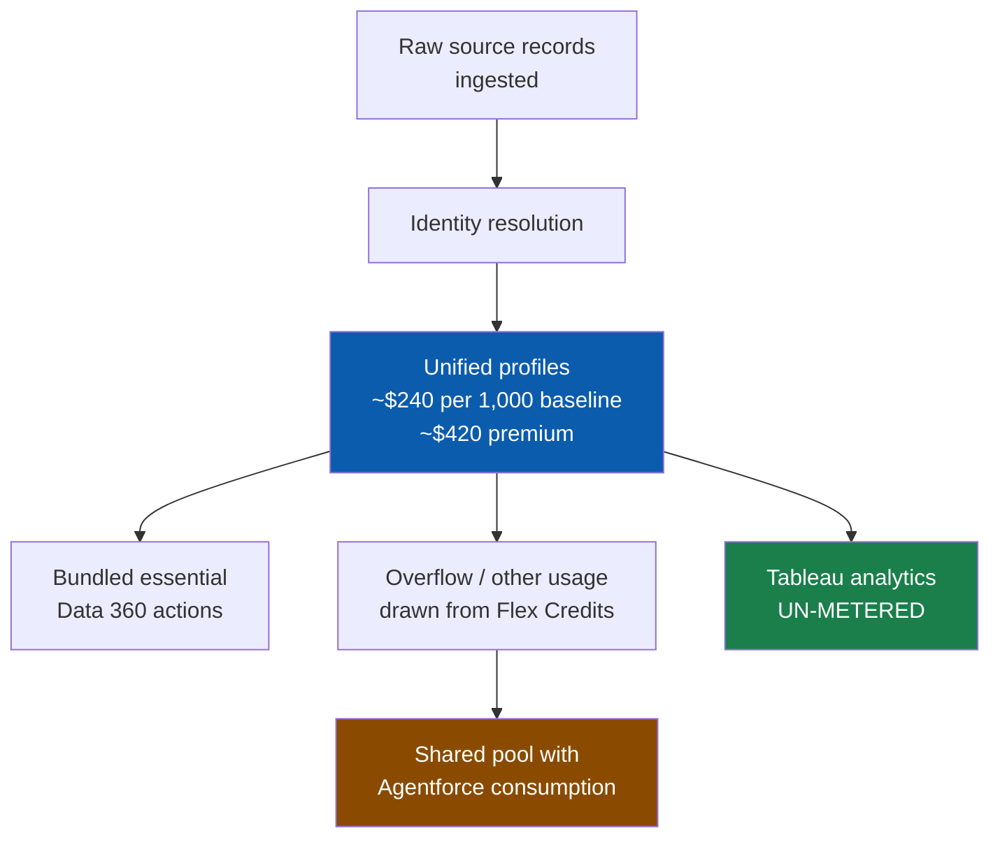
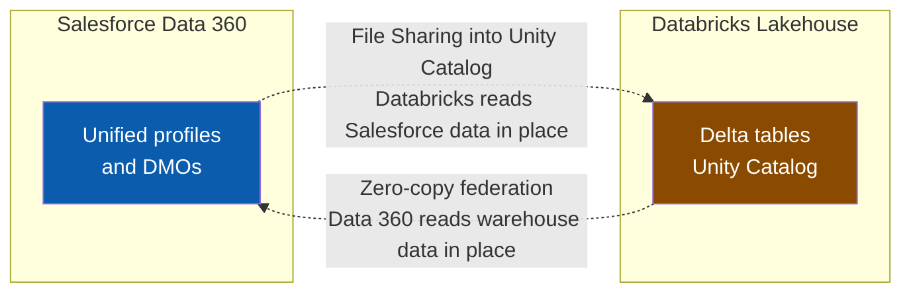

# Data Cloud / Data 360 — July 27, 2026

_Scan window: July 26–27, 2026 (24h), extended to July 24–27 (72h) because the 24h window was empty. The 72h window overlaps the [July 26 scan](2026-07-26.md), which already captured what was new in it — so this note is **verified gap-fill**: dated changes the radar had not recorded, most importantly a commercial change that affects every Data 360 design decision._

## Table of Contents

**Pricing and Packaging**

- [Data 360 pricing was rebuilt around profiles and Flex Credits](#data-360-pricing-was-rebuilt-around-profiles-and-flex-credits)

**Ecosystem**

- [Databricks reads Data 360 in place through Unity Catalog file sharing](#databricks-reads-data-360-in-place-through-unity-catalog-file-sharing)

**Scan coverage**

- [What this scan did not find](#what-this-scan-did-not-find)

---

## Data 360 pricing was rebuilt around profiles and Flex Credits

_Gap-fill: effective **March 2, 2026**, well outside the scan window — but it is not recorded anywhere in this radar, and it is the single commercial fact that most changes how you design a Data 360 implementation._

Salesforce overhauled Data 360 pricing and packaging in three connected moves. **First**, a new **profile-based SKU**: roughly **$240 per 1,000 profiles** at the baseline tier and **$420 per 1,000** for premium, which bundles a set of essential Data 360 actions into a flat per-profile cost. A "profile" here means a unified individual record after identity resolution — not a raw source row — so the count you are billed on is the output of your identity-resolution ruleset, not the volume you ingested. **Second**, Data 360 was **added to the Flex Credits model**, meaning Data 360 consumption and Agentforce consumption now draw from the *same pooled, fungible credit balance* rather than sitting in separate contracts. **Third**, Data 360 usage **inside Tableau analytics was un-metered** — querying Data 360 from Tableau no longer burns credits.

**Why this changes your architecture, not just your invoice.** Under the old credit-metered model, the instinct was to minimise processing: fewer segment refreshes, leaner calculated insights, batch rather than streaming. Profile-based pricing inverts that instinct — once you have paid for the profile, *using* it harder costs nothing extra within the bundle, so the optimisation target moves from "process less" to **"resolve fewer, better profiles."** That puts real money behind identity-resolution quality: duplicate or under-matched profiles now inflate a recurring per-profile bill directly. The Flex Credits pooling is the quieter strategic point — it removes the internal argument about whether a given workload's cost belongs to the "data team" or the "AI team," which is exactly the friction that stalls grounding projects. And the Tableau un-metering is a deliberate nudge: Salesforce wants analytics consumption of Data 360 to be free at the margin so the platform gets used as the reporting substrate.

**Choose your model deliberately.** Profile-based pricing gives a flat, forecastable cost and suits a stable, well-understood audience. Flex Credits give pay-per-use control and suit spiky or exploratory workloads. They are not mutually exclusive — the profile SKU covers the bundled actions, Flex Credits absorb what sits outside it. See [pricing-and-certification.md](../pricing-and-certification.md) for how this sits alongside Agentforce Flex Credits and pay-per-resolution.

**Status:** In effect since **March 2, 2026**. Public list pricing — always confirm against a current quote before using these figures in a proposal, because Salesforce list pricing moves and regional pricing differs.

**Sources:** [Can Salesforce's Data 360 Pricing Overhaul Deliver Predictable ROI? (Futurum Group)](https://futurumgroup.com/insights/can-salesforces-data-360-pricing-overhaul-deliver-predictable-roi/) · [Data 360 Pricing (Salesforce)](https://www.salesforce.com/data/pricing/) · [Data 360 Pricing Calculator (Salesforce)](https://www.salesforce.com/data/pricing/calculator/) · [Salesforce Data 360 & Agentforce Pricing Guide: Flex Credits, Conversations & AELAs (Vantage Point)](https://vantagepoint.io/blog/sf/data-360-agentforce-pricing-flex-credits-guide) · [Salesforce Data 360 Credit Optimization Guide (Jitendra Zaa)](https://www.jitendrazaa.com/blog/salesforce/salesforce-data-360-credit-optimization-guide-march-2026/)

---

## Databricks reads Data 360 in place through Unity Catalog file sharing

_Background gap-fill, not news: public preview **June 5, 2025**, **GA October 2025**. It is here because it is the mirror image of zero-copy, the radar never recorded it, and confusing the two directions is a common architecture-review mistake._

**Salesforce Data 360 File Sharing into Databricks Unity Catalog** lets Databricks query Data 360 objects **directly, in place**, using Databricks compute — no ingestion pipeline, no duplicated copy. Unity Catalog is Databricks' governance layer for data and AI assets; **Lakehouse Federation** is the Databricks feature that lets it query external systems as if they were native tables. Salesforce exposes Data 360 objects as shared files that Unity Catalog registers and Databricks SQL reads, with authentication handled through **IAM Workload Identity Federation** — a secretless mechanism, meaning no long-lived API key is stored on either side. Databricks positions it as going beyond ordinary query federation on both performance and cost, because Databricks SQL reads the underlying files rather than pushing per-query round trips through an API.

**The distinction to hold onto.** Data 360's own **zero-copy federation** points *outward*: Data 360 queries Snowflake, BigQuery, Databricks, Redshift where that data lives, so Salesforce agents can be grounded in warehouse data without importing it. Unity Catalog file sharing points *inward*: the data scientist's Databricks notebook reads Salesforce-resident data without exporting it. Same principle — do not move the data — opposite direction of travel. In a real programme you will often need both, and the design question is which system owns which join. Get the direction wrong in a design review and you will architect an unnecessary pipeline.

**Status:** GA since October 2025 (public preview June 5, 2025). Documented for Databricks on AWS, Azure and Google Cloud.

**Sources:** [Announcing Public Preview: Salesforce Data 360 File Sharing in Unity Catalog (Databricks)](https://www.databricks.com/blog/announcing-public-preview-salesforce-data-360-file-sharing-unity-catalog) · [Lakehouse Federation for Salesforce Data 360 File Sharing (Databricks on AWS)](https://docs.databricks.com/aws/en/query-federation/salesforce-data-cloud-file-sharing) · [Lakehouse Federation for Salesforce Data 360 File Sharing (Azure Databricks, Microsoft Learn)](https://learn.microsoft.com/en-us/azure/databricks/query-federation/salesforce-data-cloud-file-sharing) · [Lakehouse Federation for Salesforce Data 360 File Sharing (Databricks on Google Cloud)](https://docs.databricks.com/gcp/en/query-federation/salesforce-data-cloud-file-sharing)

---

## What this scan did not find

**No new Data 360 announcement, release note or developer-blog post appeared between July 26 and July 27, 2026.** Extending to 72 hours (July 24–27) surfaced nothing beyond what the [July 26 scan](2026-07-26.md) already recorded — the VA Agentic ELA naming Data 360 as the grounding layer, and the developer-surface changes (`SET OPTIONS` in SOQL, Python Code Extensions, the Data 360 MCP Server) captured in [data-360.md](../data-360.md). Specifically checked and empty: no movement on **Intelligent Context**, **Tableau Semantics** or **zero-copy connector coverage**, and **Winter '27 release notes are still not public**.

**Methodology caveat, unchanged from the last scan:** `salesforce.com`, `futurumgroup.com`, `salesforceben.com` and `databricks.com` all **blocked automated fetching** during this scan (HTTP 403 at the egress proxy), so first-party pages were reached through search-engine summaries rather than direct retrieval. Both entries above are corroborated across multiple independent sources, and the pricing figures in particular should be re-verified against a live quote before any commercial use.

**Status:** Scan completed 2026-07-27. 24h window: empty. 72h window: no new material beyond the prior scan.

**Sources:** [Data 360 release notes (Salesforce Help)](https://help.salesforce.com/s/articleView?id=release-notes.rn_c360_truth.htm&language=en_US&release=262&type=5) · [Salesforce Developers Blog](https://developer.salesforce.com/blogs) · [Agentforce 360 Announcements](https://www.salesforce.com/agentforce/what-is-new/)
