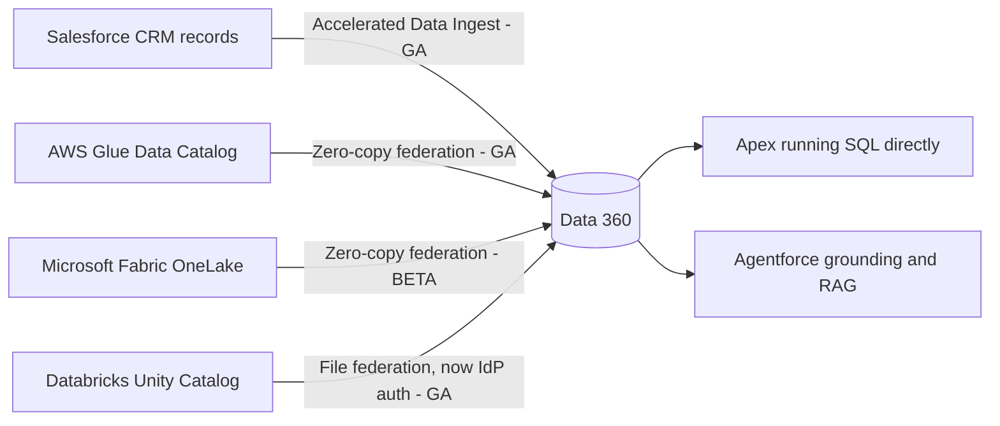

# Data Cloud / Data 360 — July 28, 2026

_Scan window: July 27–28, 2026 (24h), extended to July 25–28 (72h) because the 24h window was empty. **Neither window produced a new Data 360 announcement.** This note is therefore **verified gap-fill**: Summer '26 capabilities with real GA/Beta status that the radar had not recorded, all of which change how fresh and how reachable your grounding data is. Each entry carries its actual release, not the scan date._

## Table of Contents

**New Features**

- [Accelerated Data Ingest is GA and closes the CRM to Data 360 latency gap](#accelerated-data-ingest-is-ga-and-closes-the-crm-to-data-360-latency-gap)
- [AWS Glue federation is GA, Microsoft Fabric OneLake federation is Beta, and Databricks gains IdP auth](#aws-glue-federation-is-ga-microsoft-fabric-onelake-federation-is-beta-and-databricks-gains-idp-auth)
- [Apex can now run SQL directly against Data 360](#apex-can-now-run-sql-directly-against-data-360)

**Learning & Certification**

- [The Data 360 Consultant exam kept its Data-Con-101 code through the rename](#the-data-360-consultant-exam-kept-its-data-con-101-code-through-the-rename)

**Scan coverage**

- [What this scan did not find](#what-this-scan-did-not-find)

---

## Accelerated Data Ingest is GA and closes the CRM to Data 360 latency gap

**Accelerated Data Ingest** is now **generally available**, giving Data 360 **real-time access to Salesforce CRM data without pipeline delays**. To see why this matters you need the old shape of the problem: historically, getting CRM records into Data 360 meant a scheduled ingestion job — a *pipeline* that ran on a cadence (often hourly, sometimes less often), so the copy of a Case or Opportunity that Data 360 held was always somewhat behind the record a human was looking at in the CRM. For analytics that lag is tolerable. For agents it is not, because an agent grounded on Data 360 would answer from stale state — telling a customer their order hadn't shipped when the CRM had been updated twenty minutes earlier.

**What it means practically for you.** This removes the most common and most embarrassing failure mode in agent grounding: **confidently wrong answers caused by ingestion lag rather than by the model**. It also removes a design workaround — the pattern of bypassing Data 360 and calling CRM directly from an agent action purely to get fresh data, which cost you the unified profile and the governance that comes with it. When you debug an agent that gave an out-of-date answer, ingestion freshness should now move *down* your list of suspects, and retrieval configuration should move up.

**Status:** GA. Summer '26 release. Data 360 ships on a monthly cadence, so confirm activation in your own org's release notes.

**Sources:** [The Salesforce Developer's Guide to the Summer '26 Release](https://developer.salesforce.com/blogs/2026/06/the-salesforce-developers-guide-to-the-summer-26-release) · [Data 360 in Summer '26: New Connectors, Document AI, and Real-Time Ingest](https://agentexchange.in/blog/data-360-summer-26) · [Data 360 release notes](https://help.salesforce.com/s/articleView?id=release-notes.rn_c360_truth.htm&release=262&type=5)

---

## AWS Glue federation is GA, Microsoft Fabric OneLake federation is Beta, and Databricks gains IdP auth

Data 360's **zero-copy federation** — querying data where it already lives instead of copying it in — gained three distinct status changes in Summer '26. **AWS Glue Data Catalog federation reached GA.** **Microsoft Fabric OneLake federation entered Beta.** And the **Databricks file federation connector added identity-provider (IdP) authentication**, meaning the connection can now authenticate through your organisation's existing identity provider rather than relying solely on connector-local credentials. Zero-copy matters because the alternative — physically replicating a lakehouse into Data 360 — costs storage, creates reconciliation work, and guarantees the copy drifts from the source; federation queries the source in place, so there is exactly one version of the truth.

**What it means practically for you.** Read the status labels carefully, because they are the whole decision. **GA on AWS Glue** means you can put it in a production architecture and a client proposal. **Beta on Microsoft Fabric OneLake** means you can prototype and demonstrate it, but it carries no support commitment and no upgrade guarantee — do not let it become load-bearing in a delivery plan. The **Databricks IdP change is a security-review unlock**: "how does this connection authenticate, and can we govern it centrally?" is the question that stalls zero-copy projects, and IdP auth is the answer that satisfies it.

**Status:** AWS Glue Data Catalog federation **GA**. Microsoft Fabric OneLake federation **Beta**. Databricks file federation connector IdP authentication, Summer '26. Databricks file sharing via Unity Catalog has been GA since October 2025.

**Sources:** [The Salesforce Developer's Guide to the Summer '26 Release](https://developer.salesforce.com/blogs/2026/06/the-salesforce-developers-guide-to-the-summer-26-release) · [Data 360 in Summer '26: New Connectors, Document AI, and Real-Time Ingest](https://agentexchange.in/blog/data-360-summer-26) · [Data Cloud – Zero Copy Connectivity](https://www.salesforce.com/data/connectivity/zero-copy/) · [Announcing public preview: Salesforce Data 360 file sharing with Unity Catalog (Databricks)](https://www.databricks.com/blog/announcing-public-preview-salesforce-data-360-file-sharing-unity-catalog)

---

## Apex can now run SQL directly against Data 360

Summer '26 lets you **execute SQL queries from Apex** against Data 360, alongside the existing Data 360 Direct API. Until now, Apex reaching into Data 360 meant SOQL — Salesforce's own object query language, which is deliberately constrained and does not express the joins, aggregations and window functions that analytical work over a lakehouse actually needs — or an HTTP callout to the Direct API, with the boilerplate, error handling and governor-limit exposure that callouts carry. Running SQL from Apex removes that impedance mismatch: the query language now matches the shape of the data being queried.

**What it means practically for you.** This is the piece that makes Data 360 a genuine backing store for custom logic rather than a system you integrate with at arm's length. An Apex-implemented Agentforce action can now compute something non-trivial over Data 360 — a rolling aggregate, a multi-table join — in one query instead of several round trips. Pair it with the [`SET OPTIONS` SOQL clause](../data-360.md) already in the radar and note the trap that comes with it: **queries against data lake objects need their dataspace specified, or they return zero records silently rather than erroring.**

**Status:** Summer '26 release. Verify the exact GA/Beta designation in your org's Data 360 release notes before relying on it in production.

**Sources:** [The Salesforce Developer's Guide to the Summer '26 Release](https://developer.salesforce.com/blogs/2026/06/the-salesforce-developers-guide-to-the-summer-26-release) · [Data 360 in Summer '26: New Connectors, Document AI, and Real-Time Ingest](https://agentexchange.in/blog/data-360-summer-26)

---

## The Data 360 Consultant exam kept its Data-Con-101 code through the rename

The radar already records that the consultant certification is now the **Salesforce Certified Data 360 Consultant**; two details it was missing are worth pinning down. The rename took effect on **March 27, 2026**, and the **exam short code remained `Data-Con-101`** — unchanged from the Data Cloud Consultant era. Content and functional scope did not change with the name; existing credentials stayed valid and updated automatically on Trailblazer profiles. This rename ran ahead of the larger wave of **16 certification renames on July 24, 2026** covered in [today's Agentforce note](../01-agentforce/2026-07-28.md).

**What it means practically for you.** The stable exam code is the useful part. Study material, practice exams and booking references indexed under `Data-Con-101` are still the right material despite carrying the old product name, so a resource labelled "Data Cloud Consultant" is not automatically out of date — check the code, not the title. Do sanity-check the exam guide's release alignment separately, because Data 360 ships monthly and the certification refreshes on the seasonal cadence.

**Status:** In effect since March 27, 2026. Naming change only; exam code `Data-Con-101` unchanged; no re-certification required.

**Sources:** [Salesforce Rebrands Data Cloud Consultant to Data 360 Consultant: Data-Con-101 Exam Guide](https://www.passcert.com/news_Salesforce-Rebrands-Data-Cloud-Consultant-to-Data-360-Consultant-Data-Con-101-Exam-Guide_2851.html) · [Salesforce Certified Data 360 Consultant (Spring '26): Complete Guide, New Syllabus & Key Changes](https://www.salesforcekeeda.com/2026/03/Salesforce-Certified-Data-360-Consultant.html) · [Data 360 Consultant certification (K2 University)](https://k2university.com/certifications/data-cloud-consultant/)

---

## What this scan did not find

Checked and genuinely empty for **July 25–28, 2026**: no new Data 360 announcement, no new monthly release-note entry surfaced in the window, and no Data 360 press release. The most recent first-party Data 360 developer post remains [Announcing the Headless 360 MCP Server Beta](https://developer.salesforce.com/blogs/2026/07/announcing-the-headless-360-mcp-server-beta) from early July, already in the radar.

Two items were chased and deliberately **not** written up as entries. **Context Indexing** was reported in June as expected to reach GA "later in July 2026" — no confirmation of that GA could be found in any source, so its status is **unverified** and it is recorded here as an open question rather than as a shipped feature. **Document AI upgrades and secondary indexes** appear in Summer '26 summaries but without a status designation precise enough to be worth a full entry; both are worth re-checking when the Winter '27 notes publish.

**Status:** Scan completed 2026-07-28. 24h window: empty. 72h window: empty. Entries above are dated gap-fill, not new announcements.

**Sources:** [Data 360 release notes](https://help.salesforce.com/s/articleView?id=release-notes.rn_c360_truth.htm&release=262&type=5) · [The Salesforce Developer's Guide to the Summer '26 Release](https://developer.salesforce.com/blogs/2026/06/the-salesforce-developers-guide-to-the-summer-26-release) · [Salesforce Developers Blog](https://developer.salesforce.com/blogs)
