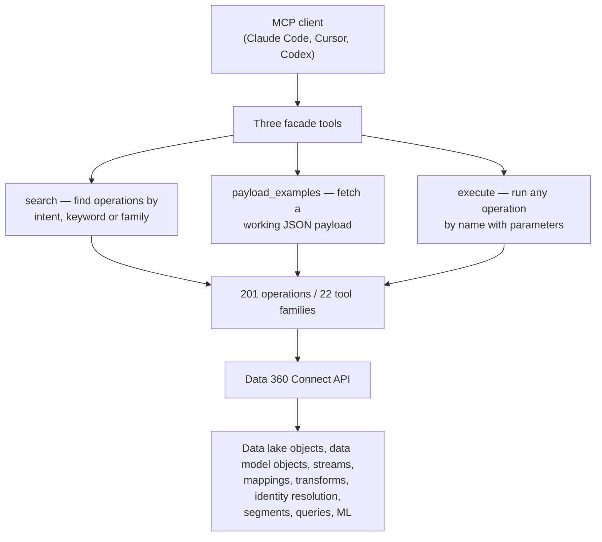

# Data Cloud / Data 360 — July 29, 2026

_Scan window: July 28–29, 2026 (24h), extended to July 26–29 (72h) because the 24h window was empty. **Both windows produced no new Data 360 announcement, release note, or code change.** Rather than pad the file, this note records **verified gap-fill**: the **Data 360 MCP Server**, a Developer Preview this radar has never captured, which is distinct from the Headless 360 MCP Server recorded in the [July 26 scan](2026-07-26.md) and is the piece that connects Data 360 to the MCP registry work that landed in Agentforce tooling yesterday. Everything below is read from the repository itself; the entry is dated to its real announcement, not dressed up as breaking news._

## Table of Contents

**Developer Tooling & APIs**

- [The Data 360 MCP Server puts 200 REST operations behind three tools](#the-data-360-mcp-server-puts-200-rest-operations-behind-three-tools)

**Scan coverage**

- [What this scan did not find](#what-this-scan-did-not-find)

---

## The Data 360 MCP Server puts 200 REST operations behind three tools

The **Data 360 MCP Server** ([`forcedotcom/d360-mcp-server`](https://github.com/forcedotcom/d360-mcp-server)) is an open-source **Developer Preview** that exposes the Data 360 Connect API to any MCP-compatible client — Claude Code, Cursor, Codex. *MCP*, the Model Context Protocol, is the open standard by which a model reaches external tools; an *MCP server* publishes a set of callable tools and the client's model decides when to call them. It was announced in **May 2026** and is not new this week — it appears here because this radar has never recorded it, and because the [Agentforce note for today](../01-agentforce/2026-07-29.md) covers a new skill for registering MCP servers in the Agentforce registry, which is the mechanism that would eventually point an agent at exactly this kind of server. **Do not confuse it with the Headless 360 MCP Server** from the [July 26 scan](2026-07-26.md): that one is the platform-wide Beta with roughly 100 skills, while this is Data 360-specific and one maturity step behind it.

**The design problem it solves is worth understanding on its own merits, independent of Salesforce.** The Data 360 Connect API has roughly **190–200 REST operations**. The naive way to build an MCP server is to register each operation as its own tool — and that fails, because every tool definition consumes context in the model's prompt whether or not it is used, and a couple of hundred of them crowds out the actual work. This server instead fronts everything with **three facade tools**: `search` (find the right operation by intent, keyword or family), `payload_examples` (fetch a working JSON payload for a complex call), and `execute` (run any underlying operation by name with parameters). Behind that facade sit **201 operations across 22 tool families** — data lake objects, data model objects, data streams, mappings, transforms, identity resolution, segments, queries, machine learning. The model discovers what it needs at call time rather than carrying the whole catalogue in its head.

**The `payload_examples` tool is the quietly clever part.** Data 360's more involved operations — an identity-resolution ruleset, a transform definition — take deeply nested JSON that a model will confidently hallucinate the shape of. Giving it a working example on demand is a much cheaper fix than hoping it remembers the schema, and it is a pattern directly worth stealing: **when a model has to produce structured input for an unfamiliar API, serve it a known-good example rather than a schema description.**

**What it means practically for you.** Two things, one enabling and one cautionary. Enabling: this is the fastest available route to **learning the Data 360 object model by doing** — you can ask a coding agent to create a data stream or inspect an identity-resolution ruleset and read the API calls it makes, which teaches the model of the product faster than clicking through Setup. Cautionary: the Developer Preview constraints are real and rule it out of anything shared. It is **STDIO transport only**, runs a **single user and org per process**, and needs **Java 17+ and Maven 3.9+** locally — this is a laptop tool, not a service. Authentication takes either an access token or OAuth client credentials with automatic refresh, auto-detected from environment variables, which is convenient and means **you should be deliberate about which org those environment variables point at**. One detail deserves a governance flag before you set it up in a client context: the semantic search feature is powered by an **optional OpenAI API key**, so enabling it sends your search terms to a third party. That is a fine trade-off on a personal dev org and a conversation you need to have before it touches anything else.

**Status:** **Developer Preview**, open source, announced May 2026. Salesforce has stated a **hosted, generally available version is planned** — "scheduled for GA in 2026" — which would remove the local Java/Maven setup and run as a Salesforce-hosted MCP server alongside the other product servers. No GA date is confirmed. Repository activity is modest and **outside this scan window**: the newest commit is **July 2, 2026** ("Sync internal master"), with 15 stars and 10 forks.

**Sources:** [forcedotcom/d360-mcp-server on GitHub](https://github.com/forcedotcom/d360-mcp-server) · [d360-mcp-server commit history](https://github.com/forcedotcom/d360-mcp-server/commits/main) · [Introducing the Data 360 MCP Server (Developer Preview) — Salesforce Developers Blog](https://developer.salesforce.com/blogs/2026/05/introducing-the-data-360-mcp-server-developer-preview) · [Introducing the Data 360 MCP Server — Your Unified Data, Ready for Any Agent](https://www.salesforce.com/blog/introducing-the-data-360-mcp-server-your-unified-data-ready-for-any-agent/) · [Salesforce Headless Data 360: A First Look at the New MCP Capabilities (Salesforce Ben)](https://www.salesforceben.com/salesforce-headless-data-360-a-first-look-at-the-new-mcp-capabilities/)

---

## What this scan did not find

Checked and genuinely empty for **July 26–29, 2026**. No new Data 360 release note, no product announcement, no pricing change, and no commit to the Data 360 MCP Server repository since **July 2**. This is the **fourth consecutive scan** in which the Data 360 24-hour window has produced nothing, which is consistent with where the release calendar sits rather than a failure of the scan: **Summer '26 shipped in June**, and Salesforce's own documentation notes that Summer '26 changes are listed under June 2026. **Winter '27 release notes are still unpublished**, with sandbox preview expected around **August 29, 2026** — that is where the next real Data 360 entry will come from.

Several candidate items were checked and **correctly rejected as out of window**, which is worth recording so future scans do not re-open them:

| Candidate | Actual date | Why rejected |
|---|---|---|
| Databricks ↔ Data 360 file sharing in Unity Catalog | Public preview June 2025, GA October 2025 | Over a year old; already covered in the [July 27 scan](2026-07-27.md) |
| Data 360 pricing overhaul — three models, Flex Credits | Effective March 2, 2026 | Already covered in full in the [July 27 scan](2026-07-27.md) |
| Free ingestion from core Salesforce connectors | Effective February 2026 | Part of the same pricing change, already covered |
| Data 360 MCP Server | Announced May 2026 | Out of window, but never recorded — written up above as gap-fill |
| `d360-mcp-server` repository activity | Newest commit July 2, 2026 | Outside both the 24h and 72h windows |

**Method note.** Every first-party Salesforce domain returned **HTTP 403** to automated fetching throughout this scan — `salesforce.com`, `help.salesforce.com` (including the Data 360 release-notes page), `developer.salesforce.com/blogs` and `salesforceben.com` — so those sources were reachable only through search extracts. GitHub fetched cleanly. That is why the single entry above is anchored to a repository that could be read directly, and why the emptiness of the window should be read as **"nothing surfaced through search across four days"** rather than as a byte-level check of the release notes. Given that the same conclusion held across four independent scans, the finding is solid; the caveat is honest rather than hedging.

**Status:** Scan completed 2026-07-29. 24h window: empty. 72h window: empty. The single entry above is dated gap-fill from May 2026, not a new announcement.

**Sources:** [Salesforce Summer '26 Release Notes](https://help.salesforce.com/s/articleView?language=en_US&id=release-notes.salesforce_release_notes.htm) · [Data 360 release notes](https://help.salesforce.com/s/articleView?id=release-notes.rn_c360_truth.htm&language=en_US&release=262&type=5) · [About Data 360 Releases](https://help.salesforce.com/s/articleView?id=data.c360_a_dc_releases.htm&language=en_US&type=5) · [Salesforce Winter '27 Release Date + Preview Information](https://www.salesforceben.com/salesforce-winter-27-release-date-preview-information/) · [d360-mcp-server commit history](https://github.com/forcedotcom/d360-mcp-server/commits/main)
