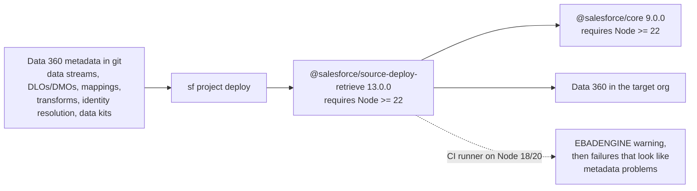

# Data Cloud / Data 360 — July 30, 2026

_Scan window: July 29–30, 2026 (24h), extended to July 27–30 (72h) because Data 360 **product** news was empty again — the **fifth consecutive scan** with no Data 360 announcement, release note or status change. What the window did produce is real but sits in the **developer surface**: the DX Node 22 break reaches Data 360 deploy pipelines, the Python Data 360 connector's deprecated v1 got CI attention while v2 sits in beta, and a Salesforce-published reference app quietly added fail-safe handling to its Data 360-grounded prompt templates. All timestamps UTC, read from the repositories directly._

**Read the shape of this note as the finding.** Three scans ago Data 360 was empty and the honest response was gap-fill. Today it is empty *of announcements* but not of consequences — the things that broke or shifted are in the plumbing between Data 360 and everything that deploys against it. That is where a practitioner actually gets hurt, so it is where this note looks.

## Table of Contents

**Breaking Changes**

- [The Node 22 requirement reaches Data 360 metadata deployments](#the-node-22-requirement-reaches-data-360-metadata-deployments)

**Deprecations**

- [The Python `salesforce-cdp-connector` is deprecated — v2 is `salesforce-datacloud-connector`, still beta](#the-python-salesforce-cdp-connector-is-deprecated--v2-is-salesforce-datacloud-connector-still-beta)

**Ecosystem**

- [A Salesforce reference app added fail-safe messaging to its Data 360-grounded prompt templates](#a-salesforce-reference-app-added-fail-safe-messaging-to-its-data-360-grounded-prompt-templates)

**Scan coverage**

- [What this scan did not find](#what-this-scan-did-not-find)

---

## The Node 22 requirement reaches Data 360 metadata deployments

On **July 29, 2026 at 20:59 UTC**, `@salesforce/source-deploy-retrieve` released **13.0.0** with a breaking change: `engines.node` raised to **`>=22.0.0`**, **dropping Node 18 and 20**. Its dependency `@salesforce/core` did the same thing 38 minutes earlier at **9.0.0**. The full toolchain story — including `@salesforce/agents` 2.0.0 — is in [today's Agentforce note](../01-agentforce/2026-07-30.md); this entry covers the part that lands specifically on Data 360 work, because it is easy to assume a "CLI library" change has nothing to do with your data platform.

**It does, because SDR is the deploy engine, not a CLI detail.** *`source-deploy-retrieve`* (SDR) is the library that converts local metadata source into a deployment and back again — it is what `sf project deploy` and `sf project retrieve` actually run. **Data 360 configuration is metadata**: data streams, data lake objects and data model objects, mappings, transforms, identity-resolution rulesets, data kits, calculated insights. If you manage any of that as source in a repository and deploy it through a pipeline — which is the whole premise of the Data 360 DevOps practice — then **SDR is in your critical path** and its runtime floor is now yours.

**The failure mode is quiet, which is what makes it worth pre-empting.** npm will still install SDR 13 on Node 20; it prints an `EBADENGINE` warning and proceeds. So a Data 360 deploy job does not fail cleanly with "wrong Node version" — it may work, then break later in a way that points at your metadata rather than at your runner. A deployment error that appears to be about a `DataStreamDefinition` and is actually about Node 18 is an expensive afternoon.

**What it means practically for you.** Check the Node version of **every runner that touches Data 360 metadata** before your next deploy — a GitHub Actions job with `actions/setup-node` pinned to 18 or 20, a Docker image built on `node:20`, or any custom Node script that imports SDR to inspect or transform metadata. Upgrading the runner to Node 22 is a one-line change; discovering the floor mid-release is not. One clarification that saves needless work: if your pipeline installs `sf` from the **Salesforce installers or tarballs**, those **bundle their own Node** (Node 24 since February 2026) and are insulated. The exposure is specifically **npm-installed** CLI and libraries running on the system Node.

**Status:** **Released** — `@salesforce/source-deploy-retrieve` 13.0.0 and `@salesforce/core` 9.0.0, July 29, 2026. Breaking change. Library releases on their own cadence; **not tied to a Salesforce release train**, so no Data 360 release note will announce it.

**Sources:** [`source-deploy-retrieve` commit history — 13.0.0](https://github.com/forcedotcom/source-deploy-retrieve/commits/main) · [`sfdx-core` commit history — 9.0.0](https://github.com/forcedotcom/sfdx-core/commits/main) · [Agentforce note, July 30, 2026](../01-agentforce/2026-07-30.md) · [forcedotcom/cli issue #3445 — upcoming update to Node.js v24](https://github.com/forcedotcom/cli/issues/3445)

---

## The Python `salesforce-cdp-connector` is deprecated — v2 is `salesforce-datacloud-connector`, still beta

[`forcedotcom/salesforce-cdp-connector`](https://github.com/forcedotcom/salesforce-cdp-connector) saw two commits on **July 29, 2026** — `Run v1 Python package CI on all PRs` at **17:46 UTC** and a CODEOWNERS compliance update at **18:46**. On their own, minor. What they surface is the fact worth knowing: **the package most Python users reach for to query Data 360 is deprecated**, and its replacement is still a pre-release.

**What the connector is and why it matters for AI work.** It is a **read-only Python client for querying Data 360** — you open a connection, execute SQL-like queries against Data 360, and pull results into Python, including **straight into a pandas DataFrame**. That makes it the standard route for exploratory analysis, notebook work, feature engineering and anything where you want Data 360 data next to scikit-learn or a model-training loop rather than inside a Salesforce UI. Authentication covers JWT, username/password, OAuth access tokens and client credentials, and you can target a **non-default dataspace** at connection time — worth remembering, because querying the wrong dataspace returns a confidently empty result rather than an error.

**The deprecation is explicit, and the replacement's status is the catch.** The repository states plainly: *"This package is deprecated and will be removed once `salesforce-datacloud-connector` reaches GA."* The v2 package — `salesforce-datacloud-connector` **2.0.0b1** — was added alongside v1 on **June 2, 2026**, and `b1` means **beta 1**: you install it with `pip install --pre salesforce-datacloud-connector`, because pip will not resolve a pre-release without that flag. So the current state is a genuine gap: **v1 is deprecated but supported, v2 is the future but not GA, and no GA date is published.** The July 29 CI change — removing path filters so the v1 package builds on *all* pull requests — reads as maintainers making sure the deprecated line does not silently rot during that gap. That is a mildly reassuring signal, not a promise.

**What it means practically for you.** For **new work**, take v2 and pass `--pre`, accepting beta risk, since anything you build on v1 has a stated removal date. For **existing notebooks and scripts**, keep v1 running but **stop treating it as permanent**: pin the version explicitly, note where the import lives, and budget a migration once v2 reaches GA. And take the general lesson, which recurs across the Salesforce Python ecosystem: **a package name change often carries a support-status change with it**. `salesforce-cdp-connector` → `salesforce-datacloud-connector` also tracks the product rename from *Customer Data Platform* to *Data Cloud* to *Data 360*, and the rename is the clue that a lifecycle boundary is nearby.

**Status:** **v1 `salesforce-cdp-connector` — deprecated**, removal tied to v2 GA, still receiving CI maintenance as of July 29, 2026. **v2 `salesforce-datacloud-connector` 2.0.0b1 — Beta** (pre-release), published June 2, 2026. **No GA date announced.**

**Sources:** [`salesforce-cdp-connector` repository](https://github.com/forcedotcom/salesforce-cdp-connector) · [README — deprecation notice and install commands](https://github.com/forcedotcom/salesforce-cdp-connector/blob/master/README.md) · [commit history](https://github.com/forcedotcom/salesforce-cdp-connector/commits/master)

---

## A Salesforce reference app added fail-safe messaging to its Data 360-grounded prompt templates

[`salesforce/next-gen-wealth`](https://github.com/salesforce/next-gen-wealth) — Salesforce's Apache 2.0 **Agentic Advisor Suite** for Financial Services Cloud — merged two small PRs on **July 29, 2026 at 18:05 and 18:07 UTC**: *"Update Client Pulse HH PromptTemplate with new fail-safe message on F…"* and the same change for the PersonAccount variant. The day before, at **19:40 UTC on July 28**, it took its **June/2026 drop** (flexipage and relationship-graph changes). Small commits; a genuinely useful lesson.

**What the app is, since it doubles as a worked example.** It deploys an advisor-facing agentic suite onto Financial Services Cloud: daily task summaries, AI client insights, meeting preparation, household relationship visualisation, built from **prompt templates, meeting playbook definitions and flows**. Critically for this note, it **integrates with Data 360 and requires manual DMO mapping after deployment** — a *DMO*, or Data Model Object, being Data 360's canonical modelled entity that harmonised source data is mapped into. So the app is one of the few public artifacts showing an end-to-end path from Data 360 objects through prompt templates to an advisor's screen.

**The interesting bit is what a "fail-safe message" implies.** *Client Pulse* is a prompt template producing a summary of a client or household. Its grounding comes from Salesforce and Data 360 data — and a grounded prompt template has a failure mode that generic prompting does not: **the grounding query can come back empty or error, and the model will still happily produce a fluent answer**. Adding an explicit fail-safe message means the template now has a defined behaviour for that path instead of leaving the model to improvise over nothing. This is the same trap recorded earlier in this radar in a different guise: an agent grounded on Data 360 **cannot distinguish "no matching record" from "ingestion failed last Tuesday,"** and left alone it will assert the former. A wealth advisor reading "no notable changes for this household" when the truth is "the data pipeline broke" is a materially worse outcome than reading an error.

**What it means practically for you.** Make this a standing review question for every prompt template you write: **what does this template say when its grounding returns nothing?** If the answer is "whatever the model decides," you have a silent-wrong-answer generator, and the fix is cheap — an explicit instruction for the empty and error paths, then a test case that exercises it. Two caveats on the source: this is a **reference implementation, not a product** — it ships as deployable metadata under Apache 2.0, and its Data 360 wiring is manual by design — and the commit titles are truncated in the feed, so the precise wording of the fail-safe message is not quoted here. The pattern is the takeaway, not the copy.

**Status:** **Released** to the public repository — prompt-template updates merged July 29, 2026; the **June/2026 drop** landed July 28, 2026. Open-source reference application (Apache 2.0) for Financial Services Cloud; **not a Salesforce product** and not part of a release train. Requires FSC managed package plus manual Data 360 DMO mapping post-deploy.

**Sources:** [`salesforce/next-gen-wealth` repository](https://github.com/salesforce/next-gen-wealth) · [commit history](https://github.com/salesforce/next-gen-wealth/commits/main) · [PR #14](https://github.com/salesforce/next-gen-wealth/pull/14) · [PR #13](https://github.com/salesforce/next-gen-wealth/pull/13)

---

## What this scan did not find

Checked and genuinely empty for **July 29–30, 2026**, and for the 72-hour extension back to July 27: **no Data 360 product announcement, no Data 360 release-note change, no status change (GA / Beta / Pilot) on any Data 360 feature, and no Salesforce blog or newsroom post about Data 360.** That is the **fifth consecutive scan** with no Data 360 product news, which is now a pattern rather than a coincidence — Data 360 features ship on a **monthly** cadence documented inside the release notes rather than through announcements, so a daily radar will keep finding nothing between drops. The realistic next signals are the **monthly Data 360 release-note section** and **Winter '27 preview notes**, expected around the **August 29, 2026** sandbox preview.

Specific negatives verified in this window:

- **The Data 360 MCP Server is unchanged.** [`forcedotcom/d360-mcp-server`](https://github.com/forcedotcom/d360-mcp-server) — the Developer Preview written up in the [July 29 note](2026-07-29.md) — has its newest commit on **July 2, 2026** ("Sync internal master"), one open PR (`Add sf_cli auth mode`, open since May 5) and two open issues. **No movement toward the promised hosted GA.**
- **`datacloud-jdbc`'s only July 29 commit is a compliance chore.** `chore(codeowners): set valid GUSINFO for OSPO compliance` at 18:28 UTC — no functional change. The JDBC driver's last real release is **1.0.0 on May 26, 2026**. Recording this explicitly because the repository *looks* freshly updated in a listing: an **org-wide OSPO CODEOWNERS sweep touched many unrelated Salesforce repositories on July 29**, and that class of commit is metadata noise. Learn to filter it, or a compliance sweep will read as a busy week.
- **`datacloud-customcode-python-sdk` is quiet** — newest commit **July 23** (CODEOWNERS), with the substantive recent work being an Einstein predict response fix (July 15) and the removal of beta labelling on **June 16** now that **Data 360 Custom Code is GA**.
- **No zero-copy or partner news.** Nothing new from the Snowflake, Databricks, BigQuery or Redshift federation surfaces in the window; the Databricks Unity Catalog file-sharing integration remains at its **October 2025 GA**.

Access limitations were unchanged: `help.salesforce.com` (including the Data 360 release-notes article), `salesforce.com`, `developer.salesforce.com/blogs` and `salesforceben.com` all returned **HTTP 403** to automated fetching, so the monthly Data 360 release-note section could not be read directly — only through search extracts, which are not reliable for "what changed this week." **That is a real blind spot for this area specifically**, and worth stating plainly: an absence of Data 360 findings here is partly an absence of readable Data 360 sources, not proof that nothing shipped.

**Status:** Scan completed **2026-07-30**. 24h window: **no Data 360 product news**; three developer-surface items found (one breaking change, one deprecation, one reference-app update). 72h extension added nothing further.

**Sources:** [`d360-mcp-server` repository](https://github.com/forcedotcom/d360-mcp-server) · [`d360-mcp-server` pull requests](https://github.com/forcedotcom/d360-mcp-server/pulls) · [`datacloud-jdbc` commit history](https://github.com/forcedotcom/datacloud-jdbc/commits/main) · [`datacloud-customcode-python-sdk` commit history](https://github.com/forcedotcom/datacloud-customcode-python-sdk/commits/main) · [Data 360 release notes (Summer '26)](https://help.salesforce.com/s/articleView?id=release-notes.rn_c360_truth.htm&language=en_US&release=262&type=5) · [Databricks — Salesforce Data 360 File Sharing in Unity Catalog](https://www.databricks.com/blog/announcing-public-preview-salesforce-data-360-file-sharing-unity-catalog)
