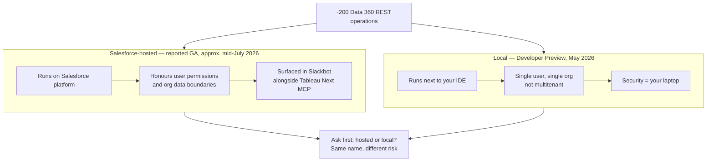

# Data Cloud / Data 360 — July 31, 2026

_Scan window: July 30–31, 2026 (24h), extended to July 28–31 (72h). **Both windows are empty of Data 360 product news.** No release-note change, no announcement, no blog post, and the one first-party repository commit in range is a compliance chore with no functional content. Rather than pad the file, this note records the scan honestly — and corrects one thing the [July 29 note](2026-07-29.md) implied about the Data 360 MCP Server that is no longer the whole picture._

## Table of Contents

**Corrections & Status Changes**

- [Correction: the Data 360 MCP Server is no longer only a local developer preview](#correction-the-data-360-mcp-server-is-no-longer-only-a-local-developer-preview)

**Scan coverage**

- [What this scan did not find](#what-this-scan-did-not-find)

---

## Correction: the Data 360 MCP Server is no longer only a local developer preview

**This item is outside the 72h window and is included as a correction, not as news.** The [July 29 note](2026-07-29.md) described the **Data 360 MCP Server** — the component that puts roughly 200 Data 360 REST operations behind a small set of tools an AI client can call — using its **Developer Preview** framing from May 2026: open-source, run locally next to your IDE, **not multitenant**, one running instance connecting one user to one org. That description is still accurate for the open-source local server. It is no longer the whole picture. Salesforce has since shipped **Salesforce-hosted MCP servers for Data 360 and Tableau Next**, and multiple secondary reports describe them as **generally available for Enterprise Edition organisations and above**, surfaced most visibly through Slackbot. The best available dating for that announcement is **roughly mid-July 2026** — search indexes place the coverage about three weeks before this scan — and **no first-party page could be fetched to confirm the exact date**, so treat the timing as approximate and the GA status as reported-by-secondary-sources rather than verified first-party.

**Why the distinction between local and hosted is the substance here, not a deployment detail.** *MCP*, the Model Context Protocol, is the open standard by which a model reaches external tools and data. A **locally-run** MCP server holds one user's credentials for one org and lives on one developer's machine — its security model is essentially "whatever that laptop's security model is," and it cannot be governed centrally. A **Salesforce-hosted** MCP server is a platform surface: it authenticates through the org, and the reports state it **respects each user's permissions and the org-wide data boundary configuration**. That is the difference between a developer convenience and something an enterprise can actually deploy, and it is why the same product name carries very different risk in the two forms.

**What it means practically for you.** Three things. First, **when someone asks whether "the Data 360 MCP Server" is production-ready, the answer depends entirely on which one they mean** — ask hosted or local before answering, because the July 29 note's "developer preview, local only" is a correct statement about the wrong artifact if they mean the hosted one. Second, the hosted server is the mechanism that makes **Slackbot an always-on data analyst over unified customer profiles** — a natural-language question in Slack becomes a permission-scoped query against Data 360, with no custom code. Third, the governance point from the July 29 Agentforce note applies directly here: **registration and permission scoping is where this gets decided**, not the tool list, because a hosted server that honours user permissions is only as safe as the permission model underneath it. That makes Data 360 sharing and data-space configuration the thing worth studying, not the MCP tool surface.

**Status:** Two distinct artifacts. **Open-source local server: Developer Preview** (announced May 2026, repository `forcedotcom/d360-mcp-server`, last commit July 2, 2026). **Salesforce-hosted Data 360 and Tableau Next MCP servers: reported generally available for Enterprise Edition and above**, approximately mid-July 2026 — **date and GA status not confirmed against a first-party page**, since every relevant Salesforce and analyst URL returned HTTP 403 to automated fetching. No release train is attached to either.

**Sources:** [Salesforce MCP Servers: AI, Data & Analytics for Tableau & Data 360 in Slack](https://www.salesforce.com/slack/new-mcp-servers-ai-data-in-slack/) · [Introducing the Data 360 MCP Server (Developer Preview)](https://developer.salesforce.com/blogs/2026/05/introducing-the-data-360-mcp-server-developer-preview) · [Introducing the Data 360 MCP Server — Your Unified Data, Ready for Any Agent](https://www.salesforce.com/blog/introducing-the-data-360-mcp-server-your-unified-data-ready-for-any-agent/) · [forcedotcom/d360-mcp-server](https://github.com/forcedotcom/d360-mcp-server) · [d360-mcp-server commit history](https://github.com/forcedotcom/d360-mcp-server/commits/main) · [Never Log Into Salesforce Again? Slackbot 'Now Does Anything CRM Can' — Salesforce Ben](https://www.salesforceben.com/never-log-into-salesforce-again-slackbot-now-does-anything-crm-can/) · [Salesforce Launches MCP-Powered Capabilities for Slackbot — destinationCRM](https://www.destinationcrm.com/Articles/CRM-News/CRM-Across-the-Wire/Salesforce-Launches-MCP-Powered-Capabilities-for-Slackbot-175643.aspx)

---

## What this scan did not find

**This is the substantive finding for today: the Data 360 window is empty.** No Data 360 release-note change, no Salesforce announcement, no Data 360 blog post and no developer-documentation update could be dated to **July 29, 30 or 31, 2026**. Data 360 features ship as often as monthly, and the Summer '26 changes were generally listed under **June 2026**, so a quiet late July is the expected shape of the calendar rather than a sign that something was missed.

**What was checked, repository by repository, so the emptiness is verifiable rather than asserted.** `forcedotcom/d360-mcp-server` — last commit **July 2, 2026**, no releases published. `forcedotcom/datacloud-customcode-python-sdk`, the SDK for writing custom Python that runs inside Data 360 — last commit **July 23, 2026** (a CODEOWNERS update); worth noting from its recent history that this SDK **moved out of beta to general availability**, visible in classifier changes that stripped beta labels from its documentation and PyPI listing, though that transition predates this window. `forcedotcom/datacloud-jdbc` — one commit in range, on **July 29 at 18:28 UTC**: `chore(codeowners): set valid GUSINFO for OSPO compliance (#194)`. That commit is **pure open-source-compliance metadata with no functional change**, and it is recorded here only because it is the single in-window Data 360 commit that exists. Its one point of incidental interest is that it names the owning team as **CDP Query Service** and the product tag as **D360 Query - Immutable** — a small confirmation that the JDBC driver sits under the Data 360 query service rather than the ingestion side. `forcedotcom/Salesforce-CDP-jdbc` returned HTTP 404 on its commit feed and could not be checked.

**Two adjacent items were considered and deliberately excluded.** The **Databricks Unity Catalog file-sharing** integration with Data 360 is real and significant, but it reached public preview in **June 2025** and GA in **October 2025** — long outside any window here, and already historical. The **Tableau July 2026** feature wave, which includes Tableau Semantics running on top of Data 360 sources and new Claude, ChatGPT and Codex integrations, is genuinely Data-360-adjacent, but no entry in it could be dated to July 29–31 and `tableau.com` returned HTTP 403, so nothing from it could be placed in the window with confidence.

**Method note and standing limitation.** `help.salesforce.com`, `salesforce.com`, `developer.salesforce.com/blogs`, `tableau.com`, `databricks.com`, `releasebot.io` and `salesforceben.com` all returned **HTTP 403** to automated fetching throughout this scan. The Data 360 monthly release-note page is therefore **not directly readable by this scan at all**, which is a real gap: a monthly Data 360 change published only in Salesforce Help would be invisible here and visible only if a search index happened to surface it. Everything above rests on GitHub, which fetches cleanly, plus search extracts. Read the empty finding with that caveat attached — it means "nothing was found through the reachable sources," not "nothing exists."

**Status:** Scan completed **2026-07-31**. 24h window (July 30–31): **empty**. 72h window (July 28–31): **empty of product news**; one non-functional compliance commit found. One out-of-window correction recorded above.

**Sources:** [forcedotcom/datacloud-jdbc commit history](https://github.com/forcedotcom/datacloud-jdbc/commits/main) · [datacloud-jdbc releases](https://github.com/forcedotcom/datacloud-jdbc/releases) · [forcedotcom/datacloud-customcode-python-sdk](https://github.com/forcedotcom/datacloud-customcode-python-sdk/commits/main) · [forcedotcom/d360-mcp-server commit history](https://github.com/forcedotcom/d360-mcp-server/commits/main) · [Data 360 Release Notes — Salesforce Help](https://help.salesforce.com/s/articleView?id=release-notes.rn_c360_truth.htm&language=en_US&release=262&type=5) · [Salesforce Summer '26 Release Notes](https://help.salesforce.com/s/articleView?language=en_US&id=release-notes.salesforce_release_notes.htm) · [Announcing Public Preview: Salesforce Data 360 File Sharing in Unity Catalog — Databricks](https://www.databricks.com/blog/announcing-public-preview-salesforce-data-360-file-sharing-unity-catalog) · [Tableau July 2026 New Features](https://www.tableau.com/products/new-features)
