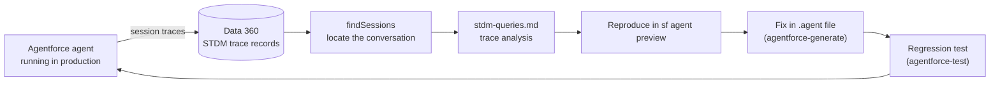

# Data Cloud / Data 360 — August 01, 2026

_Scan window: July 31 – August 1, 2026 (24h), extended to July 29 – August 1 (72h). **No Data 360 product news in either window** — no release-note change, no announcement, no blog post, and no commit to any Data 360 repository. That is the third consecutive empty Data 360 scan. One thing genuinely relevant did move, and it moved inside an Agentforce repository rather than a Data 360 one: the **`agentforce-observe`** skill, which is the only public, executable description of how to query Data 360 for agent session traces, shipped an update on July 31. It is written up here rather than only in [today's Agentforce note](../01-agentforce/2026-08-01.md) because the substance is Data 360 querying._

## Table of Contents

**New Features**

- [The one Data 360 surface that moved is an agent observability skill, and it names the query path](#the-one-data-360-surface-that-moved-is-an-agent-observability-skill-and-it-names-the-query-path)

**Scan coverage**

- [What this scan did not find](#what-this-scan-did-not-find)

---

## The one Data 360 surface that moved is an agent observability skill, and it names the query path

On **July 31, 2026**, `forcedotcom/sf-skills` released **1.33.0**, and among its 16 updated skills was **`agentforce-observe` (version 0.8)**. Its stated job is to *"analyze production Agentforce agent behavior using session traces and Data Cloud,"* and its trigger conditions are the useful part: it fires when you *"query STDM session data or Data Cloud trace records,"* investigate *"production agent failures, regressions, or performance issues,"* or run *"findSessions or trace analysis queries."* **STDM** is Salesforce's Standard Data Model — the prebuilt schema Data 360 uses so that data landing from different sources arrives in a shape the platform already understands, rather than one you have to map by hand every time.

**Why an Agentforce skill is the most informative Data 360 artifact of the week.** When an Agentforce agent runs in production, what it did — which actions fired, what it retrieved, where it stalled — is written as **session trace records into Data 360**. That makes Data 360 the observability backend for the entire agent platform, not merely a customer-data store, and it means **the debugging loop for a misbehaving agent is a Data 360 query**. `agentforce-observe` is the closest thing to a public, executable statement of what that query looks like: it carries a `stdm-queries.md` reference file (added in the July 30 `agentforce-adlc` sync) and an `assets/apex/` tree, and it names `findSessions` as the entry point for locating a specific conversation before you analyse it. The skill also declares `sf >= 2.136.8` as its CLI floor, which is a concrete, checkable prerequisite for anyone trying this.

**Read the boundary the skill draws, because it is a good map of the tooling.** `agentforce-observe` explicitly does **not** trigger on authoring or debugging `.agent` files during development — that is `agentforce-generate` — nor on writing test specs, which is `agentforce-test`. The division is by **environment, not by activity**: local iteration and pre-deployment testing are one set of tools, and *production behaviour reconstructed from Data 360 traces* is a separate one. That is the same split you would draw in any mature system between a debugger and a log pipeline, and it is worth internalising because it tells you which tool to reach for when someone reports that an agent "did something weird yesterday" — the answer is Data 360, not preview.

**What it means practically for you.** Three things, and the first is the durable one. **Data 360 skills are increasingly shipped inside Agentforce tooling rather than under a Data 360 label** — so if you scan only Data-360-named sources, you will miss the parts of Data 360 that practitioners actually touch daily. Second, if you support agents in production, **read `agentforce-observe`'s `stdm-queries.md` and learn the STDM trace objects by name**; that is the schema your incident response runs on, and there is no equally concrete public description of it. Third, note what did **not** change: the library's dedicated Data 360 skills — `data360-connect`, `data360-activate` and `agentforce-d360-analyze` — were untouched in 1.33.0. **Those three are the ones to watch**, because a release that moves them will be the clearest available signal that ingestion, activation or analysis behaviour has shifted.

**Status:** Skill update **`agentforce-observe` 0.8**, shipped in `forcedotcom/sf-skills` **1.33.0 on July 31, 2026**. **Apache-2.0.** This is Salesforce-maintained open-source tooling, **not a Data 360 product release** — no GA/Beta designation applies and no release train carries it. The **skill version did not change** from the copy synced into `agentforce-adlc` on July 30; only the release it ships in is new, which is itself a reminder that skill version numbers are not a reliable change indicator here.

**Sources:** [agentforce-observe SKILL.md](https://github.com/forcedotcom/sf-skills/blob/main/skills/agentforce-observe/SKILL.md) · [forcedotcom/sf-skills](https://github.com/forcedotcom/sf-skills) · [sf-skills releases](https://github.com/forcedotcom/sf-skills/releases) · [sf-skills commit history](https://github.com/forcedotcom/sf-skills/commits/main) · [PR #47 — sync from sf skills, agentforce-adlc](https://github.com/SalesforceAIResearch/agentforce-adlc/pull/47) · [Data 360 Release Notes — Salesforce Help](https://help.salesforce.com/s/articleView?id=release-notes.rn_c360_truth.htm&language=en_US&release=262&type=5)

---

## What this scan did not find

**This is the substantive finding: Data 360 is now three scans empty.** No Data 360 release-note change, no Salesforce announcement, no Data 360 blog post and no developer-documentation update could be dated to **July 31 or August 1, 2026**, and extending to July 29 adds nothing beyond the single compliance commit already recorded in the [July 31 note](2026-07-31.md).

**Repository by repository, so the emptiness is verifiable.** `forcedotcom/datacloud-jdbc` — last commit **July 29 at 18:28 UTC**, the OSPO CODEOWNERS chore already covered; **nothing on July 30, 31 or August 1**, despite the organisation listing page showing a July 30 "updated" timestamp, which reflects non-default-branch activity rather than a commit to `main`. `forcedotcom/d360-mcp-server` — last commit **July 2, 2026**, no releases ever published. `forcedotcom/datacloud-customcode-python-sdk` — last commit **July 23, 2026**, a CODEOWNERS update. `forcedotcom/salesforce-cdp-connector` returned **HTTP 404 on its commit feed** and could not be checked, the same gap recorded in previous scans.

**The quiet is the expected shape of the calendar, and it is worth understanding why.** Data 360 features ship **as often as monthly**, but the Summer '26 changes were generally listed under **June 2026**, and Summer '26 itself runs May through August. So late July and early August sit in the trough between a shipped release wave and the next one, which will be framed at **Dreamforce 2026 on September 12–14** and land in **Winter '27**. Three empty scans in a row is therefore consistent with the release calendar rather than evidence of a coverage failure — but see the caveat below before treating it as proof of nothing happening.

**The standing limitation matters more here than in the other two folders.** The Data 360 monthly release notes live on `help.salesforce.com`, which returned **HTTP 403** to automated fetching throughout this scan, as did `salesforce.com`, `developer.salesforce.com/blogs`, `tableau.com` and `databricks.com`. **This scan cannot read the Data 360 release-note page directly at all.** A monthly Data 360 change published only in Salesforce Help would be invisible here unless a search index happened to surface it — and search extracts this window surfaced only Summer '26 material already covered. That is a real, structural gap in this folder specifically, and the empty finding should be read as **"nothing found through reachable sources,"** not "nothing shipped." If you want certainty on Data 360 for this window, the [Data 360 release notes](https://help.salesforce.com/s/articleView?id=release-notes.rn_c360_truth.htm&language=en_US&release=262&type=5) opened in a browser are the authority, and this note is not a substitute for it.

**Status:** Scan completed **2026-08-01**. 24h window (July 31 – August 1): **empty of Data 360 product news**; one Data-360-relevant skill update found inside Agentforce tooling. 72h window (July 29 – August 1): **empty**, with no items beyond those already recorded on July 31. Third consecutive empty Data 360 scan.

**Sources:** [forcedotcom/datacloud-jdbc commit history](https://github.com/forcedotcom/datacloud-jdbc/commits/main) · [forcedotcom/d360-mcp-server commit history](https://github.com/forcedotcom/d360-mcp-server/commits/main) · [forcedotcom/datacloud-customcode-python-sdk commit history](https://github.com/forcedotcom/datacloud-customcode-python-sdk/commits/main) · [Data 360 Release Notes — Salesforce Help](https://help.salesforce.com/s/articleView?id=release-notes.rn_c360_truth.htm&language=en_US&release=262&type=5) · [About Data 360 Releases — Salesforce Help](https://help.salesforce.com/s/articleView?id=data.c360_a_dc_releases.htm&language=en_US&type=5) · [Salesforce Summer '26 Release Notes](https://help.salesforce.com/s/articleView?language=en_US&id=release-notes.salesforce_release_notes.htm) · [Salesforce Winter '27 Release Date + Preview Information](https://www.salesforceben.com/salesforce-winter-27-release-date-preview-information/)
