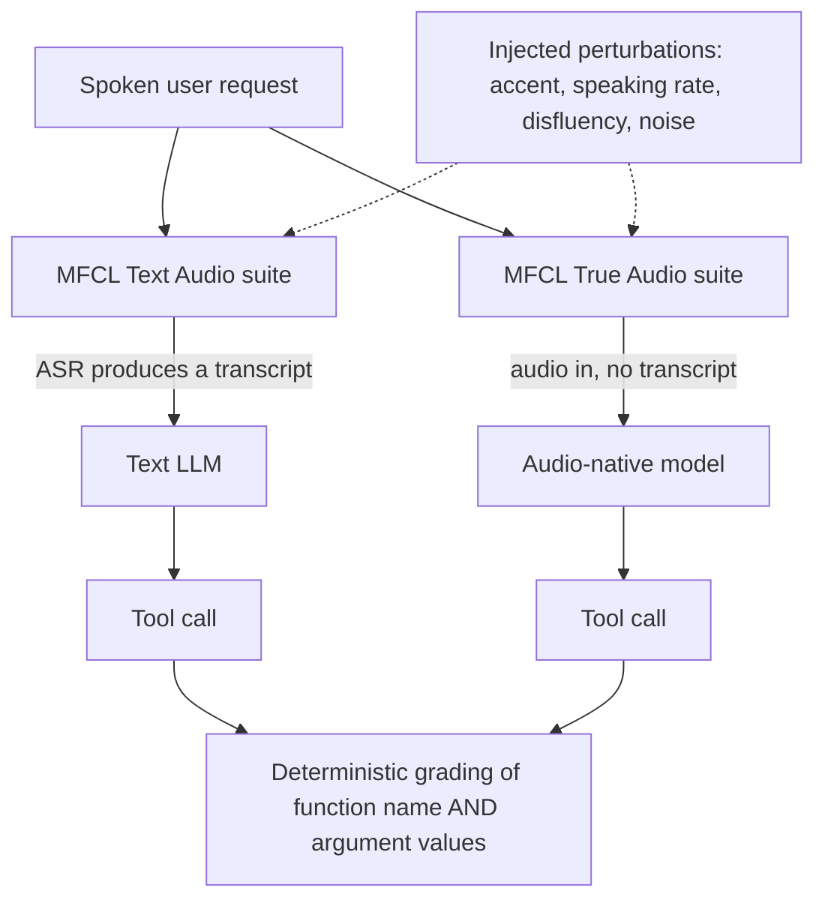

# Salesforce AI Research — July 28, 2026

_Scan window: July 27–28, 2026 (24h), extended to July 25–28 (72h) because the 24h window was empty. **Salesforce AI Research published no new model, paper or blog post in either window, and its most active repository committed no code.** This note therefore records **verified gap-fill** — two benchmarks the radar had never captured, both directly relevant to how Agentforce agents are evaluated — plus an honest account of the empty window and how the emptiness was confirmed._

## Table of Contents

**Research & Benchmarks**

- [MFCL Audio took voice function calling to ICML 2026](#mfcl-audio-took-voice-function-calling-to-icml-2026)
- [LoCoBench-Agent measures agents on long-context software engineering](#locobench-agent-measures-agents-on-long-context-software-engineering)
- [Enterprise Deep Research is the multi-agent research system behind the reports](#enterprise-deep-research-is-the-multi-agent-research-system-behind-the-reports)

**Scan coverage**

- [The window was genuinely empty and here is how that was verified](#the-window-was-genuinely-empty-and-here-is-how-that-was-verified)

---

## MFCL Audio took voice function calling to ICML 2026

**MFCL Audio** — a Salesforce AI Research benchmark built with UC Berkeley, first published as **BFCL Audio** in August 2025 — was **accepted to ICML 2026** and presented as a poster at the conference in **Seoul, July 6–11, 2026**. *Function calling* is the mechanism by which a language model stops talking and does something: it emits a structured call naming a tool and its arguments, which is exactly what an Agentforce agent does every time it invokes an action. Every mainstream function-calling benchmark evaluates this **from text**. MFCL Audio evaluates it **from speech**, across **6,200 expert-verified tasks** split into two suites that mirror the two ways voice agents are actually built: **MFCL Text Audio** (the pipelined design — speech recognition produces a transcript, the model reads the transcript, the model calls the tool) and **MFCL True Audio** (end-to-end — audio goes in, tool calls come out, with no transcript in between).

The reason to care is the failure mode the benchmark isolates. Voice adds a class of error that text agents simply do not have: **perception errors** — homophones, background noise, disfluencies, accent and speaking-rate variation — which corrupt the *arguments* of a tool call rather than the intent. An agent that correctly understands "cancel my order" but mis-hears the order number executes the right function on the wrong record, which is worse than failing outright. MFCL Audio injects these perturbations deliberately through a controllable audio synthesis pipeline, and grades **both the function name and the argument values** using AST-based matching for single-turn calls and response/state-based metrics for multi-turn ones — deterministic scoring, no LLM judge, so results are reproducible.

**What it means practically for you.** Agentforce Voice is where Salesforce is investing commercially, and this is the evaluation vocabulary for it. The transferable lesson is that **a voice agent needs argument-level, perturbation-aware testing** — testing it on clean studio audio tells you almost nothing about how it behaves on a real phone line. That maps directly onto the adversarial testing stage in the `agentforce-adlc` toolkit already in this radar.

**Status:** Published research, accepted and presented at ICML 2026 (July 6–11, 2026, Seoul). Peer-reviewed benchmark, not a Salesforce product — nothing here is a shipping commitment.

**Sources:** [ICML 2026 poster: MFCL Audio](https://icml.cc/virtual/2026/poster/61489) · [BFCL Audio: A Benchmark for Audio-Native Function Calling (Salesforce blog)](https://www.salesforce.com/blog/bfcl-audio-benchmark/) · [MFCL on OpenReview](https://openreview.net/forum?id=8yWECy22Zi) · [Salesforce AI Research on MFCL-Audio](https://x.com/SFResearch/status/2060039169217380745) · [ICML 2026 conference](https://icml.cc/)

---

## LoCoBench-Agent measures agents on long-context software engineering

**LoCoBench-Agent** (announced November 19, 2025; [arXiv 2511.13998](https://arxiv.org/abs/2511.13998)) is Salesforce AI Research's benchmark for LLM agents doing software engineering **over very long contexts**. It contains **8,000 interactive scenarios** across **10 programming languages and 36 domains**, supports **up to 50 conversation turns** per scenario, and spans context lengths from **10K to 1M tokens**. Agents get **8 tools** — file operations, search, code analysis — and are scored across **8 task categories** including architectural understanding, cross-file refactoring, multi-session development, bug investigation and security analysis, using **9 bias-free metrics** split between comprehension and efficiency.

Two findings are worth carrying around. First, agents showed **more long-context robustness than expected** — performance did not collapse as context grew, which contradicts the common assumption that everything degrades past a certain window size. Second, there is a **comprehension–efficiency trade-off**: thorough exploration raises comprehension but lowers efficiency, and the two are negatively correlated. The models that came out ahead were distinguished less by raw capability than by **strategic tool usage** — knowing when to stop looking.

**What it means practically for you.** This is the closest thing to a rigorous answer to "how good is this agent at working in a large codebase", which is the question behind both Agentforce Vibes and your own Claude Code work. The comprehension–efficiency finding is the actionable one: when you build an agent, you are implicitly choosing a point on that curve, and **an agent that explores exhaustively is not simply "better"** — under Flex Credits, where you pay per action, it is also measurably more expensive.

**Status:** Published research with a public benchmark and open repository. Not a product.

**Sources:** [LoCoBench-Agent (arXiv 2511.13998)](https://arxiv.org/abs/2511.13998) · [SalesforceAIResearch/LoCoBench-Agent on GitHub](https://github.com/SalesforceAIResearch/LoCoBench-Agent) · [Paper page on Hugging Face](https://huggingface.co/papers/2511.13998) · [Salesforce AI Research announcement](https://x.com/SFResearch/status/1991170384838693168)

---

## Enterprise Deep Research is the multi-agent research system behind the reports

**Enterprise Deep Research (EDR)**, announced **October 24, 2025**, is a **steerable multi-agent system** that turns a complex enterprise research question into a structured, actionable report. Architecturally it is a **Master Planning Agent** that decomposes a query adaptively, plus **four specialised search agents** working underneath it. *Steerable* is the load-bearing word: a human can redirect the research mid-run rather than only judging the output at the end, which is the difference between a research assistant and a one-shot summariser.

**What it means practically for you.** EDR is a first-party reference architecture for the pattern you will keep meeting — **a planner that decomposes, specialists that gather, a synthesiser that reconciles** — and it is the same decomposition Agentforce's Multi-Agent Orchestration expresses in product form, where the Atlas Reasoning Engine routes to subagents based on their descriptions. Studying EDR is a way to understand *why* orchestration is designed the way it is. It is also, worth noting, the shape of this radar's own scanning process.

**Status:** Published research from Salesforce AI Research, announced October 24, 2025. Research system, not a supported product.

**Sources:** [Salesforce AI Research introduces Enterprise Deep Research](https://x.com/SFResearch/status/1981831647277297799) · [Salesforce AI Research](https://www.salesforceairesearch.com/)

---

## The window was genuinely empty and here is how that was verified

No new Salesforce AI Research output appeared between **July 25 and July 28, 2026** — no model, no paper, no blog post, no benchmark. The verification is worth recording because one signal was misleading. The **`agentforce-adlc` repository listed a "last updated" date of July 28, 2026**, which reads as fresh activity. It is not. Fetching the underlying feeds directly showed the newest commit on `main` is still **July 24, 2026** (`Merge pull request #43`, "Improve AgentScript authoring guidance and validation") and the **releases feed contains no releases at all**. The July 28 timestamp is repository metadata, not code. Other repositories in the organisation were also outside the window: `gift-eval` last updated July 23, `oss-template` and `CRMArena` July 22.

This is the **third consecutive scan** to find the 24-hour window empty. That is a signal in itself rather than a failure of the scan: Salesforce AI Research publishes in bursts around conference cycles, and having just come through **ICLR 2026 in April** and **ICML 2026 in early July**, a quiet late July is exactly what the pattern predicts. The next likely burst is the **NeurIPS 2026 cycle**, alongside the **Winter '27 release notes** expected in the coming weeks.

**Status:** Scan completed 2026-07-28. 24h window: empty. 72h window: empty. All three entries above are dated gap-fill, not new announcements.

**Sources:** [SalesforceAIResearch on GitHub](https://github.com/SalesforceAIResearch) · [agentforce-adlc commit history](https://github.com/SalesforceAIResearch/agentforce-adlc/commits/main) · [Salesforce AI Research](https://www.salesforceairesearch.com/) · [Salesforce AI Research at ICLR 2026](https://www.salesforce.com/blog/salesforce-iclr-2026/)
