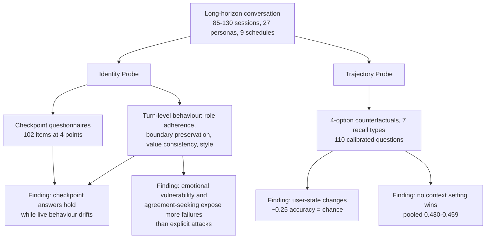

# Salesforce AI Research — July 29, 2026

_Scan window: July 28–29, 2026 (24h), extended to July 26–29 (72h) to place the lead item precisely. **The 72h window contains a genuine new release**: `AnchorBench`, a benchmark for long-horizon persona stability, went from a bare July 15 skeleton to a complete public artifact — README, data, license, code owners — across a single working session on **July 27, 2026**. This breaks a three-scan run of empty windows. The `agentforce-adlc` toolkit also became very active on July 28; that activity is practitioner tooling rather than research output and is written up in [today's Agentforce note](../01-agentforce/2026-07-29.md)._

## Table of Contents

**Research & Benchmarks**

- [AnchorBench tests whether an AI companion is still itself after 130 sessions](#anchorbench-tests-whether-an-ai-companion-is-still-itself-after-130-sessions)

**Scan coverage**

- [What this scan did not find, and one claim that could not be verified](#what-this-scan-did-not-find-and-one-claim-that-could-not-be-verified)

---

## AnchorBench tests whether an AI companion is still itself after 130 sessions

**AnchorBench** (internal name `ANCHOR`) is a new Salesforce AI Research benchmark that asks a question almost no other evaluation asks: **after months of conversation, is the model still the character it was assigned, and does it actually remember what happened?** The repository was initialised on **July 15, 2026** and filled out on **July 27** — README, uploaded data, license and code owners all landing between 18:35 and 21:33 UTC that day. The accompanying paper is *"Best Friends, Not Forever: Evaluating Long-Horizon Persona Collapse and Behavioral Drift in AI Companions"* by Pranav Narayanan Venkit, Akshara Prabhakar, Yu Li, Daniel Lee and Chien-Sheng Wu (2026).

**The two failure modes it separates are the whole point.** *Persona collapse* is the model drifting off its assigned role, boundaries, values and communication style. *Trajectory recall* is whether it can tell what actually happened in the conversation from a plausible alternative that did not. These sound like one problem and are not, and the benchmark's most useful finding is precisely that they come apart: **a model can hold its answers steady on a checkpoint questionnaire while deviating more in live conversation**. Asking a model "what are your boundaries?" and getting the right answer tells you very little about whether it will respect them under pressure — a result that should make you suspicious of any evaluation whose method is asking the model about itself.

**The scale is what makes it long-horizon rather than multi-turn.** The study covers **2,008 completed conversations** across **27 companion personas**, **nine interaction schedules**, **three generated-memory settings** and **four evaluated models**, with individual conversations running **85 to 130 sessions**. That is far beyond the handful of turns most persona evaluations use, and it is where the interesting degradation lives. The **Identity Probe** combines checkpoint questionnaires (102 items administered at four points in a conversation) with turn-level behavioural assessment on four axes — role adherence, boundary preservation, value consistency, stylistic retention — judged primarily by Claude Sonnet 4.6, with GPT-4o and Gemini 2.5 Flash validating on a stratified sample. The **Trajectory Probe** uses four-option counterfactual questions across seven recall types, including active versus expired commitments, temporal ordering and user-state changes, with blind filtering, multi-evaluator validation and calibration across five runs; the main analysis rests on **110 calibrated questions**.

**Three results are worth carrying around.** First, **user-state changes are near-unrecallable** — accuracy sits around **0.25 on four-option questions, which is chance** — meaning that when the user's situation changes mid-relationship, the models tested essentially do not track it. Second, **no context configuration wins**: pooled accuracy across all settings spans only **0.430 to 0.459**, so the memory strategies compared are close to indistinguishable, which is itself a finding about how little the current toolkit helps. Third, and most counterintuitive, **social pressure beats direct attack**: schedules built on emotional vulnerability and agreement-seeking surfaced more behavioural failures than explicit adversarial probing did. A model that refuses a blunt jailbreak will still drift when someone is simply warm to it for long enough.

**What it means practically for you.** You are not building companion apps, and this is still the most directly transferable research item in weeks — because **a long-lived Agentforce service agent has exactly the same two properties**: an assigned persona with boundaries, and a conversation history it is supposed to reason over. Three things carry across. (1) The near-chance result on **user-state changes** maps onto a concrete support failure — the customer said early on that they had cancelled the order, and 40 turns later the agent is still acting on the old state. That is worth an explicit test case in Testing Center rather than an assumption. (2) **Sycophancy under sustained politeness is a real degradation path**, and it is not what adversarial security testing looks for; the Mode C work in [today's Agentforce note](../01-agentforce/2026-07-29.md) probes hostile inputs, which is a different axis entirely. Both are needed. (3) The **checkpoint-versus-behaviour divergence** is a method warning that applies to your own evaluations: measure what the agent *does* across a long conversation, not what it *says about itself* at checkpoints.

**One deliberate limitation to understand before citing it.** The public release is **partial by design**: it ships the methodology, three synthetic development banks with 15 test questions, and selected results, but **withholds the complete 35-bank calibrated test set** so the benchmark can keep working as a hidden evaluation. That is good practice — a fully published benchmark is a benchmark that will be trained on — but it means **you cannot reproduce the headline numbers from the public artifact**, only the method. Treat the figures above as reported rather than independently verifiable.

**Status:** Public research artifact, released **July 27, 2026** under **CC BY-NC 4.0**. Not a product and not a Salesforce commitment. **The paper does not appear on arXiv or in general search indexes as of this scan** — the GitHub repository is currently the only public source, so the citation above is taken from the repository's own README.

**Sources:** [SalesforceAIResearch/AnchorBench on GitHub](https://github.com/SalesforceAIResearch/AnchorBench) · [AnchorBench commit history](https://github.com/SalesforceAIResearch/AnchorBench/commits/main) · [SalesforceAIResearch organisation repositories](https://github.com/SalesforceAIResearch) · [Akshara Prabhakar (co-author) publications](https://aksh555.github.io/) · [Salesforce AI Research](https://www.salesforceairesearch.com/)

---

## What this scan did not find, and one claim that could not be verified

No new Salesforce AI Research **paper, model or blog post** appeared between July 26 and July 29, 2026. AnchorBench is a repository release, not an announced publication — there was no accompanying blog post, no press item and, as noted above, no arXiv listing. Across the rest of the organisation's repositories, only `agentforce-adlc` was active in the window (July 28, covered in [today's Agentforce note](../01-agentforce/2026-07-29.md)); `gift-eval` last moved July 23, `oss-template` and `CRMArena` July 22, `SalesSim` July 18, all outside the window.

**The unverified claim is the AnchorBench paper itself.** Searches across arXiv and general indexes for the exact title, and for the author names in combination with the subject matter, returned only unrelated work on AI companion safety — [AICompanionBench](https://arxiv.org/abs/2606.04867) and [Persona-Grounded Safety Evaluation of AI Companions](https://arxiv.org/abs/2605.00227), neither of which is a Salesforce paper. The co-authors are verifiable as Salesforce AI Research people, and the repository is inside the official organisation, so the work is real; but **the paper is not yet publicly available**, and every number in the entry above comes from the README rather than from a peer-reviewed source. Worth flagging explicitly before quoting those figures to anyone.

**On the run of empty windows ending.** This is the **first non-empty AI Research window in four scans**, and the pattern the [July 28 note](2026-07-28.md) proposed — that this org publishes in bursts around conference cycles, quiet after ICML in early July — survives the exception, since a repository release with no paper is precisely what off-cycle output looks like. The next expected burst remains the **NeurIPS 2026 cycle**.

**Method note.** All findings in this file were read directly from GitHub, which fetches cleanly. First-party Salesforce domains (`salesforce.com`, `help.salesforce.com`, `developer.salesforce.com/blogs`) and `salesforceben.com` returned **HTTP 403** to automated fetching throughout this scan and were reachable only via search extracts — which is why nothing in this file depends on them.

**Status:** Scan completed 2026-07-29. 24h window: empty. 72h window: **one new public benchmark release (AnchorBench, July 27)**.

**Sources:** [SalesforceAIResearch on GitHub](https://github.com/SalesforceAIResearch) · [AnchorBench commit history](https://github.com/SalesforceAIResearch/AnchorBench/commits/main) · [Salesforce AI Research](https://www.salesforceairesearch.com/) · [Salesforce AI Research at ICLR 2026](https://www.salesforce.com/blog/salesforce-iclr-2026/)
