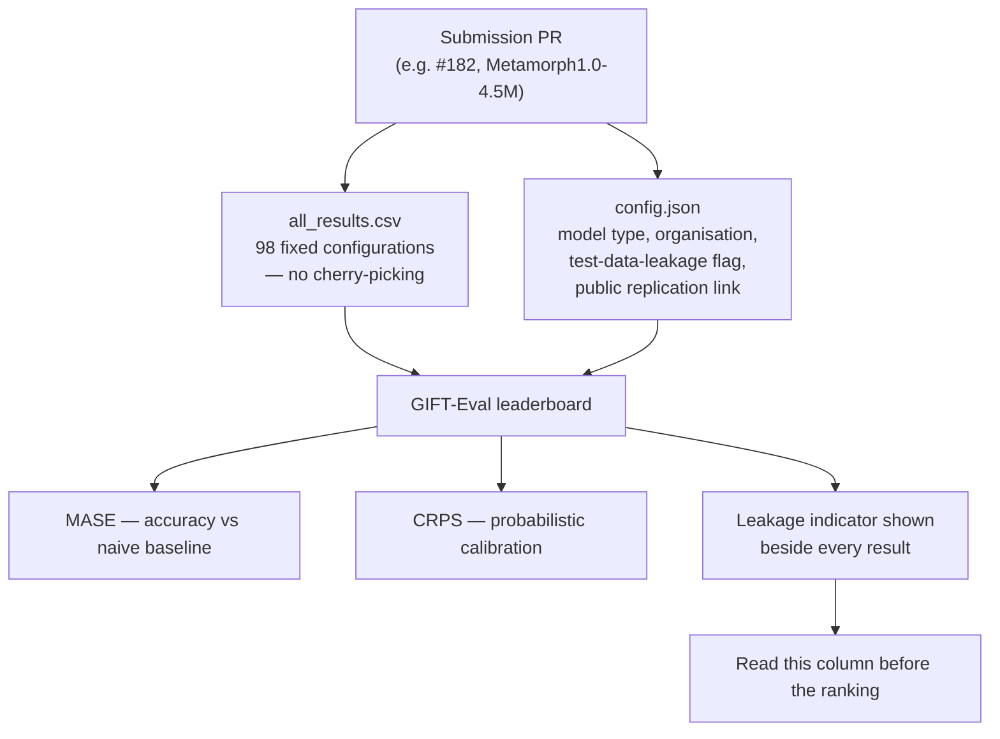

# Salesforce AI Research — July 30, 2026

_Scan window: July 29–30, 2026 (24h), extended to July 27–30 (72h). **No new paper, model, benchmark or repository was released by Salesforce AI Research in this window.** What the window contains is **two open pull requests** — one adding a third-party model's results to the **GIFT-Eval** forecasting leaderboard, one proposing an **Agent Script "doctor"** in the ADLC toolkit. Both are unmerged, and this note says so up front rather than dressing proposals as releases. All timestamps UTC, read from the repositories directly._

**Why an "empty" research week is still worth reading.** The most useful thing in this note is not a result — it is **GIFT-Eval's submission protocol**, which is a small masterclass in how to run an evaluation leaderboard that resists gaming. That transfers directly to how you should structure your own agent evaluations, and it is visible only because someone submitted to it this week.

## Table of Contents

**Research & Benchmarks**

- [A new model was submitted to the GIFT-Eval forecasting leaderboard — and the submission rules are the lesson](#a-new-model-was-submitted-to-the-gift-eval-forecasting-leaderboard--and-the-submission-rules-are-the-lesson)

**Agent Lifecycle Tooling**

- [AI Research is proposing a diagnose-and-repair loop for Agent Script](#ai-research-is-proposing-a-diagnose-and-repair-loop-for-agent-script)

**Scan coverage**

- [What this scan did not find, and one lead to verify](#what-this-scan-did-not-find-and-one-lead-to-verify)

---

## A new model was submitted to the GIFT-Eval forecasting leaderboard — and the submission rules are the lesson

[PR #182](https://github.com/SalesforceAIResearch/gift-eval/pull/182) — *"Add Metamorph1.0-4.5M GIFT-Eval results"*, **opened July 29, 2026 by `srityrrell`, still open and unreviewed, with no PR description** — adds a new entry to Salesforce AI Research's **GIFT-Eval** leaderboard. Being precise about what is and is not known: the PR body is empty, no metrics are stated on the page, and the name is the only clue to the model. **"4.5M" most plausibly denotes 4.5 million parameters**, which would make it a strikingly small time-series model — but that reading is inference, not a sourced fact, and the submitting account is not a Salesforce one. Treat the *submission* as the news, not the result.

**What GIFT-Eval is, because it is the Salesforce benchmark least likely to be on your radar and quietly one of the most useful.** It is described as *"a comprehensive benchmark designed to evaluate general time series forecasting models across diverse datasets, promoting the advancement of zero-shot forecasting capabilities in foundation models."* Unpacking the jargon: a **time series foundation model** is pretrained on many series and then asked to forecast a series it has never seen — **zero-shot forecasting**, no per-dataset training. GIFT-Eval spans **seven domains**, frequencies from **secondly to yearly**, both **univariate and multivariate** series, and **short and long prediction horizons**. It scores accuracy with **MASE** (Mean Absolute Scaled Error — error relative to a naive seasonal baseline, so 1.0 means "no better than naive") and probabilistic quality with **CRPS** (Continuous Ranked Probability Score, which rewards a well-calibrated distribution rather than a single point guess). It also ships **GiftEvalPretrain**, a pretraining corpus deliberately constructed **not to overlap** the evaluation sets.

**The submission protocol is the part to steal.** To appear on the leaderboard you contribute a folder containing **`all_results.csv` covering 98 configurations** and a **`config.json`** that declares the model type (statistical, deep learning, agentic, pretrained, fine-tuned, zero-shot), the submitting organisation, **whether the model's training data leaks into the test sets**, and **a public link to replication code**. The leaderboard then displays a **test-data-leakage indicator** next to results. Sit with that design for a moment: the benchmark assumes in advance that its most likely corruption is **contamination** — a model that has seen the test data reporting a spectacular score — and rather than trying to detect it, it **makes disclosure a required field and prints it beside the number**. That is a far more robust mechanism than trusting good behaviour, and the 98-configuration requirement forecloses the other common trick, cherry-picking the datasets where you win.

**What it means practically for a Salesforce AI practitioner.** Two things, one direct and one methodological. **Directly**: forecasting is a real Salesforce AI workload, not an academic sideline — pipeline and revenue prediction, demand and inventory signals, churn timing, and the sort of "what will this account look like next quarter" question that agents get asked once they are grounded in Data 360. When someone proposes a forecasting model for that, GIFT-Eval is the neutral scoreboard to check first, and **the leakage column is the first thing to look at**, before the ranking. **Methodologically**: apply the same three rules to your own agent evaluations — **fix the configuration set in advance** so results cannot be cherry-picked, **require a replication path**, and **treat contamination as a declared property rather than a hope**. Most internal "our agent scores 90%" claims fail all three.

**Status:** **Open pull request**, submitted July 29, 2026 — unreviewed, no reported metrics, contributor outside Salesforce. **Not a Salesforce research release and not a leaderboard result yet.** GIFT-Eval itself is an established open-source Salesforce AI Research benchmark; its repository's newest commit is **July 23, 2026**.

**Sources:** [PR #182 — Add Metamorph1.0-4.5M GIFT-Eval results](https://github.com/SalesforceAIResearch/gift-eval/pull/182) · [GIFT-Eval README](https://github.com/SalesforceAIResearch/gift-eval/blob/main/README.md) · [`SalesforceAIResearch/gift-eval` repository](https://github.com/SalesforceAIResearch/gift-eval)

---

## AI Research is proposing a diagnose-and-repair loop for Agent Script

[PR #46](https://github.com/SalesforceAIResearch/agentforce-adlc/pull/46) to [`agentforce-adlc`](https://github.com/SalesforceAIResearch/agentforce-adlc) — **opened July 29, 2026, open and unreviewed** — adds an **AgentScript Doctor** workflow plus documentation of six Agent Script anti-patterns. It is recorded here because `agentforce-adlc` is a **Salesforce AI Research** repository, and this radar files that repository's practitioner-facing detail under Agentforce: **the full write-up, including all six anti-patterns and what to check in your own `.agent` files today, is in [today's Agentforce note](../01-agentforce/2026-07-30.md).**

**The research-shaped observation worth keeping here** is the workflow's structure, which is a small statement about how this group thinks agents should be maintained. The doctor **reconstructs the agent's intended behaviour** — from user requirements, approved specs, existing tests and reachable behaviour — before it looks for problems, then applies **minimal repairs in bounded batches with parser checks between them**, and finally **compares baseline against candidate**. Two of those steps are the ones most tooling omits. Deriving intent from artifacts rather than asking the model to guess is what makes a finding *actionable* instead of stylistic; comparing baseline to candidate is what makes a repair *demonstrable* instead of merely applied. Together they describe an evaluation-first posture that runs consistently through this group's public work — the same instinct visible in **CRMArena-Pro**, **SCUBA**, **GIFT-Eval** and **AnchorBench**: build the measurement before you claim the improvement.

**What it means practically for you.** Take the pattern, and wait on the code. The pattern — **reconstruct intent → find → repair minimally → prove the delta** — is the right skeleton for any agent-remediation work you do by hand, and it is directly reusable in a Testing Center workflow. The code is an unreviewed PR in a fast-moving repository; the [July 29 note](2026-07-29.md) is a recent reminder of how quickly things there merge, change or disappear.

**Status:** **Open pull request** (July 29, 2026, unreviewed). Open-source research tooling under **CC BY-NC 4.0** — **not a Salesforce product** and not on a release train. Reported as **116 tests passing** by its author; not independently verified.

**Sources:** [PR #46 — Add AgentScript doctor and common-pitfall guidance](https://github.com/SalesforceAIResearch/agentforce-adlc/pull/46) · [Agentforce note, July 30, 2026](../01-agentforce/2026-07-30.md) · [`agentforce-adlc` repository](https://github.com/SalesforceAIResearch/agentforce-adlc)

---

## What this scan did not find, and one lead to verify

Checked and genuinely empty for **July 29–30, 2026**, extending back to **July 27**: **no new paper, no new model, no new benchmark, no new dataset, no new repository and no blog post** from Salesforce AI Research. Specifically verified:

- **No new repositories in the organisation.** The newest push across [`SalesforceAIResearch`](https://github.com/SalesforceAIResearch) is `agentforce-adlc` on **July 28**; then **AnchorBench** on July 27, `gift-eval` on July 23, `oss-template` and `CRMArena` on July 22, `SalesSim` on July 18. Nothing created or pushed in the 24h window.
- **`agentforce-adlc` merged nothing.** Newest commit on `main` is still **July 28 at 22:50 UTC**, the tail of the five-PR burst in the [July 29 note](2026-07-29.md). Across the whole organisation, only **two pull requests** were updated after July 28 — the two covered above.
- **AnchorBench's paper is still not on arXiv.** Searched again in this window for *"Best Friends, Not Forever: Evaluating Long-Horizon Persona Collapse and Behavioral Drift in AI Companions"* and for the benchmark by name; **no arXiv listing**. The [repository README](https://github.com/SalesforceAIResearch/AnchorBench) remains the only source, and its own newest commit is **July 27 at 21:33 UTC**. The findings summarised in the [July 29 note](2026-07-29.md) — near-chance recall of user-state changes, no winning memory setting, emotional vulnerability surfacing more failures than adversarial probing — therefore still rest on a single unrefereed source. Worth re-checking weekly; an arXiv posting would be the point at which those numbers can be cited outside a study note.

**One lead to verify next scan, flagged because it is unconfirmed.** A search surfaced **arXiv:2607.07985**, *"A Reliability Assessment of LALM Audio Judges for Full-Duplex Voice Agents"*, attributed to **Salesforce Applied AI Research** — evaluating Gemini models (2.5 Flash, 3.5 Flash, 3.1 Pro) as **audio judges** that score full-duplex agent conversations directly from the raw stereo waveform. If accurate, it is squarely relevant: it is the measurement counterpart to the voice work recorded across this radar, and *"can a model reliably grade a voice conversation from audio alone?"* is the question standing between voice agents and automated regression testing. **But the submission date could not be verified — `arxiv.org` returned HTTP 403 to every fetch attempt** — and the identifier suggests a submission earlier in July 2026, which would put it **outside this window**. Recorded as a lead, not a finding. Confirm the date and authorship before citing it anywhere.

Access limitations shaped this note more than usual. `arxiv.org` (abstract and listing pages), `huggingface.co`, `salesforce.com/blog` and `help.salesforce.com` all returned **HTTP 403** to automated fetching, so **new model or dataset publications on Hugging Face and new arXiv preprints could not be enumerated directly** — only reached through search extracts, which lag by days and cannot establish a submission date. GitHub and `raw.githubusercontent.com` fetched cleanly. **The practical consequence: "no new paper" above is well-supported for GitHub-visible artifacts and weaker for arXiv and Hugging Face.** A quiet week is the most likely explanation, but it is not the only one.

**Status:** Scan completed **2026-07-30**. 24h window: **no Salesforce AI Research release**; two open pull requests found, both unmerged. 72h extension added nothing beyond the AnchorBench release already recorded on July 29.

**Sources:** [`SalesforceAIResearch` organisation repositories](https://github.com/orgs/SalesforceAIResearch/repositories?q=&sort=updated) · [`agentforce-adlc` commit history](https://github.com/SalesforceAIResearch/agentforce-adlc/commits/main) · [`AnchorBench` repository](https://github.com/SalesforceAIResearch/AnchorBench) · [`gift-eval` repository](https://github.com/SalesforceAIResearch/gift-eval) · [Salesforce AI Research at ICLR 2026](https://www.salesforce.com/blog/salesforce-iclr-2026/) · [arXiv:2607.07985 (unverified — fetch blocked)](https://arxiv.org/abs/2607.07985)
