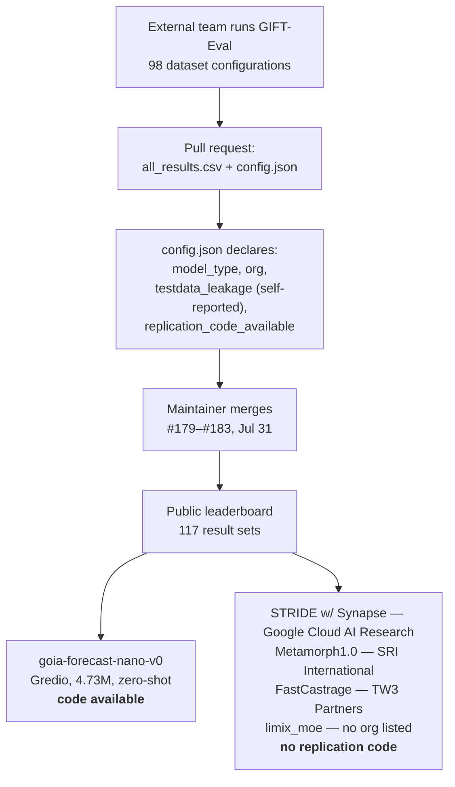

# Salesforce AI Research — August 1, 2026

**Window:** 2026-07-31 12:00 → 2026-08-01 12:30 UTC (24h), extended to 2026-07-29 (72h) · **Checked:** github.com, web search · **Passes:** 03:19 and 12:18 UTC

_Scan window: July 31 – August 1, 2026 (24h), extended to July 29 – August 1 (72h). **No new paper, model release or research blog post appeared.** One thing moved, and it is more interesting than its commit titles suggest: **five external teams pushed results onto Salesforce's GIFT-Eval time-series leaderboard inside a four-minute window on July 31**, one of them from **Google Cloud AI Research**. That is a benchmark being used as neutral industry ground by a direct competitor, which is a different kind of research output than a paper — and the submissions' own metadata exposes a reproducibility problem worth learning from. Everything below was read from the repository's merged pull requests and the submitted `config.json` files._

> **Contract deviation, recorded deliberately (2026-08-01, 12:18 UTC pass).** The [writing contract](../README.md#writing-contract) caps a dated note at ~25 lines because substance belongs in a topic file. **This area has seven dated notes and no topic file** — none of the five fits research — so enforcing the cap here would delete knowledge rather than relocate it. This note stays long until that is resolved: see [README → Open questions](../README.md#open-questions-to-chase).

---

## Five models land on the GIFT-Eval leaderboard in one batch, including one from Google Cloud AI Research

Between **03:37 and 03:41 UTC on July 31, 2026**, maintainer `cuthalionn` merged five pull requests — **#179 through #183** — into `SalesforceAIResearch/gift-eval`, each adding a new model's scores to the public leaderboard. **GIFT-Eval** is Salesforce AI Research's benchmark for **general time-series forecasting**: predicting future values of a sequence that moves over time, such as demand, load or traffic. Its stated purpose is *"promoting the advancement of zero-shot forecasting capabilities in foundation models"* — *zero-shot* meaning the model forecasts a series it was never trained on, the way a language model answers a question it never saw. The benchmark spans **seven frequency ranges** (secondly through yearly) and **seven domains**, covering univariate and multivariate series at short and long horizons, and every submission must report the same **98 dataset configurations**. After this batch the leaderboard holds **117 result sets**.

**The submissions, and what their metadata says.** **STRIDE w/ Synapse** (#183) came from **Google Cloud AI Research**, evaluating STRIDE paired with Chronos2 and Timer-S1 plus a fine-tuned Toto-2.5B, and is classed `agentic`. **Metamorph1.0** and **Metamorph1.0-4.5M** (#182) came from **SRI International**, classed `pretrained`, in bfloat16. **FastCastrage** (#181) came from **TW3 Partners**, described as *"an ensemble of five publicly available pretrained models,"* classed `agentic`. **limix_moe** (#180) is classed `agentic` and **lists no organisation at all**. **goia-forecast-nano-v0** (#179) came from **Gredio**, classed `zero-shot`, a **4.73M-parameter** model — tiny, by foundation-model standards — with both a Hugging Face model link and a public code repository.

**The competitor submission is the headline, and it is worth understanding why it matters.** A benchmark only has authority if the people it ranks agree to be ranked by it. **Google Cloud AI Research submitting to a Salesforce-owned leaderboard is that agreement made visible** — it treats GIFT-Eval as neutral infrastructure rather than as a vendor's marketing surface. For a Salesforce practitioner this is the useful reframe: Salesforce AI Research's output is not only papers and models, it is also **evaluation infrastructure the rest of the industry consents to be measured on**, which is a slower and more durable form of influence. Note also that **three of the five submissions are classed `agentic`** rather than `pretrained` or `zero-shot` — meaning a system that orchestrates models and tools rather than a single trained model. Agentic systems arriving in force on a *forecasting* leaderboard is a genuine shift in what the field considers a forecasting method.

**Now the part that should make you cautious, because it is visible in the data.** Each submission ships a `config.json` declaring, among other fields, `testdata_leakage` and `replication_code_available`. All five declare **no test-data leakage** — leakage being the failure where evaluation data leaked into training, which inflates scores while teaching you nothing. But on reproducibility: **only one of the five, `goia-forecast-nano-v0`, declares `replication_code_available: "Yes"`.** The other four say **"No"** — including the Google Cloud entry. Two of them ship **no model link and no code link at all**, and one names no organisation. So four of five new leaderboard positions are, in practice, **unverifiable claims scored by a shared harness**. Worth noting too that the leakage field is **self-declared by the submitter**, not independently audited.

**What it means practically for you.** Three takeaways, and none of them require you to forecast anything. First, **treat a leaderboard position as a claim, not a result, until you check `replication_code_available`** — GIFT-Eval deserves credit for surfacing that field at all, since most leaderboards do not, and the honest thing to do is use it. Second, when you evaluate any vendor's AI claim, **copy this metadata schema**: model type, organisation, leakage status, reproducibility. Those four fields are close to the minimum honest disclosure for a benchmark number, and asking for them is a fast way to separate substance from marketing. Third, the tiny-model result is the one to watch — **a 4.73M-parameter zero-shot forecaster competing at all** points at the same direction Agentforce economics point: for well-scoped, repetitive tasks, small specialised models are often the right answer, and the reflex to reach for the largest available model is frequently wrong.

**Status:** Five merged pull requests, **#179–#183, July 31, 2026** — community leaderboard submissions, **not Salesforce research output**. GIFT-Eval itself is **Apache-2.0** and stated to be *"intended for research purposes only."* No paper, model or blog post from Salesforce AI Research accompanied them, and no release train applies.

**Sources:** [SalesforceAIResearch/gift-eval](https://github.com/SalesforceAIResearch/gift-eval) · [gift-eval merged pull requests](https://github.com/SalesforceAIResearch/gift-eval/pulls?q=is%3Apr+is%3Amerged) · [PR #183 — STRIDE with Synapse](https://github.com/SalesforceAIResearch/gift-eval/pull/183) · [PR #182 — Metamorph1.0-4.5M](https://github.com/SalesforceAIResearch/gift-eval/pull/182) · [PR #181 — FastCastrage](https://github.com/SalesforceAIResearch/gift-eval/pull/181) · [PR #180 — limix_moe](https://github.com/SalesforceAIResearch/gift-eval/pull/180) · [PR #179 — goia-forecast-nano-v0](https://github.com/SalesforceAIResearch/gift-eval/pull/179) · [gift-eval commit history](https://github.com/SalesforceAIResearch/gift-eval/commits/main) · [goia-forecast-nano-v0 on Hugging Face](https://huggingface.co/gredio/goia-forecast-nano-v0) · [STRIDE paper (arXiv)](https://arxiv.org/pdf/2605.08625)

---

## Second pass, 12:18 UTC — three more submissions, all still open

Re-checking `gift-eval` nine hours after the first pass found **three further pull requests, none merged**: **#184 EXAONE-Forecast** and **#185 EXAONE-Forecast-Agent**, both from **LG AI Research** (submitted by `istarjun`), and **#186**, a v5 update to **FastCastrage** using *"online per-config blending."* The repository now shows **3 open, 146 closed**. Checked 12:25 UTC.

**Why the open/merged distinction is the lesson.** The first pass recorded five *merged* submissions and a leaderboard of 117 result sets. Nine hours later three more were queued but unmerged — so **"on the leaderboard" and "submitted to the leaderboard" are different states**, and a vendor citing a GIFT-Eval position may be citing either. Check the PR state, not the claim. Note also that #186 is a *resubmission of an already-ranked model at v5*: leaderboard entries are revised in place, so a number you quoted last month may no longer be the number that model reports.

**A second LG AI Research entry classed as an agent** continues the pattern the first pass flagged — agentic systems, not single trained models, are now a substantial share of forecasting submissions.

**Sources:** [PR #186](https://github.com/SalesforceAIResearch/gift-eval/pull/186) · [PR #185](https://github.com/SalesforceAIResearch/gift-eval/pull/185) · [PR #184](https://github.com/SalesforceAIResearch/gift-eval/pull/184) · [gift-eval pull requests](https://github.com/SalesforceAIResearch/gift-eval/pulls?q=is%3Apr+sort%3Aupdated-desc)

---

## Verified negatives

**No Salesforce AI Research output of any kind appeared between July 31 and August 1, 2026** — no paper, no model release, no benchmark, no research blog post, no press item. Extending to July 29 adds nothing beyond the AnchorBench licence commit already covered in the [July 31 note](2026-07-31.md).

**Across the organisation's repositories, only `gift-eval` moved**, and what moved was external contributions rather than Salesforce work. `AnchorBench` — last touched **July 30**, the licence rewrite. `agentforce-adlc` — last touched **July 30**, PR #47, practitioner tooling rather than research, and its licensing is the subject of a significant correction in [today's Agentforce note](../01-agentforce/2026-08-01.md). Everything else sits well outside the window: `oss-template` and `CRMArena` last updated **July 22**, `SalesSim` **July 18**, `EVQA` **June 27**, `DreamHouse` **June 25**, `MCP-Universe` **June 23**.

**The publish-in-bursts pattern still holds, and this scan sharpens it.** Six consecutive scans are now consistent with the reading first proposed on July 28: this organisation publishes around conference cycles and goes quiet between them. Since ICML in early July there has been one off-cycle repository release with no paper (AnchorBench, July 27), a licence tidy-up on it (July 30), and now a batch of **third-party** leaderboard submissions. **Note the distinction that makes today different**: the repository was active, but *Salesforce* was not — the only Salesforce action in the window was a maintainer clicking merge. The next expected burst remains the **NeurIPS 2026** cycle, with **Dreamforce on September 12–14** the more likely near-term source of research-adjacent announcements.

**One claim carried forward, still unverified.** The **AnchorBench** paper — *"Best Friends, Not Forever: Evaluating Long-Horizon Persona Collapse and Behavioral Drift in AI Companions"* — remains absent from arXiv and every public index, unchanged from the July 29 and July 31 findings. The repository is inside the official Salesforce AI Research organisation and its co-authors are verifiable Salesforce researchers, so the work is real; but **every headline number attributed to AnchorBench in this radar still comes from a README rather than a reviewed source**, and that caveat should travel with those figures anywhere they are quoted.

**Method note and standing limitation.** `salesforce.com/blog`, `salesforceben.com` and `huggingface.co/Salesforce/activity` all returned **HTTP 403** to automated fetching this scan, as did `api.github.com` through the available network path. The Hugging Face block is the one that matters here: **Salesforce publishes models to Hugging Face, and this scan cannot read that organisation's activity feed directly** — a model published there without a GitHub commit or a blog post would be invisible to this radar. Findings above rest on `github.com`, `raw.githubusercontent.com`, a local clone of `gift-eval` used to read the submitted `config.json` files directly, and search extracts. Read the empty finding as **"nothing found through reachable sources."**

**Status:** Scan completed **2026-08-01**. 24h window (July 31 – August 1): **five external leaderboard submissions merged; zero Salesforce research outputs**. 72h window (July 29 – August 1): **no additional items beyond those already recorded on July 31**.

**Sources:** [SalesforceAIResearch organisation repositories](https://github.com/orgs/SalesforceAIResearch/repositories?q=&sort=updated) · [SalesforceAIResearch/AnchorBench commit history](https://github.com/SalesforceAIResearch/AnchorBench/commits/main) · [SalesforceAIResearch/agentforce-adlc](https://github.com/SalesforceAIResearch/agentforce-adlc) · [gift-eval commit history](https://github.com/SalesforceAIResearch/gift-eval/commits/main) · [Salesforce AI Research at ICLR 2026](https://www.salesforce.com/blog/salesforce-iclr-2026/) · [Salesforce on Hugging Face](https://huggingface.co/Salesforce) · [Salesforce Winter '27 Release Date + Preview Information](https://www.salesforceben.com/salesforce-winter-27-release-date-preview-information/)
