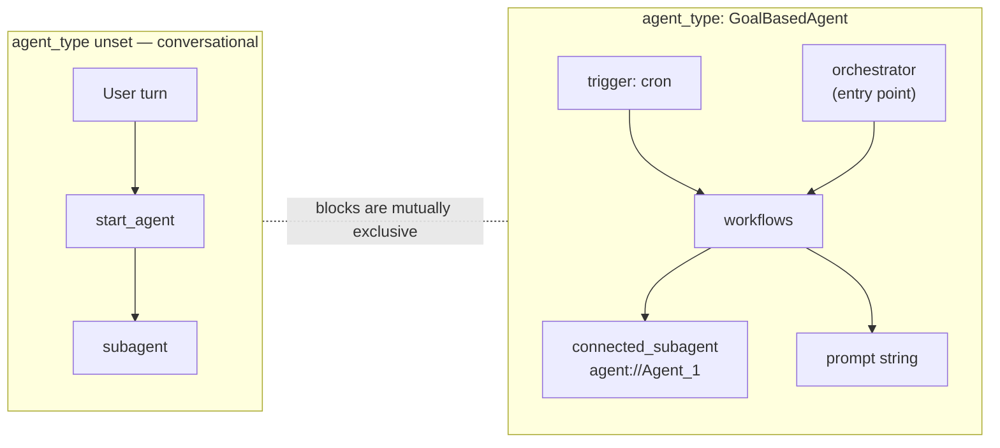
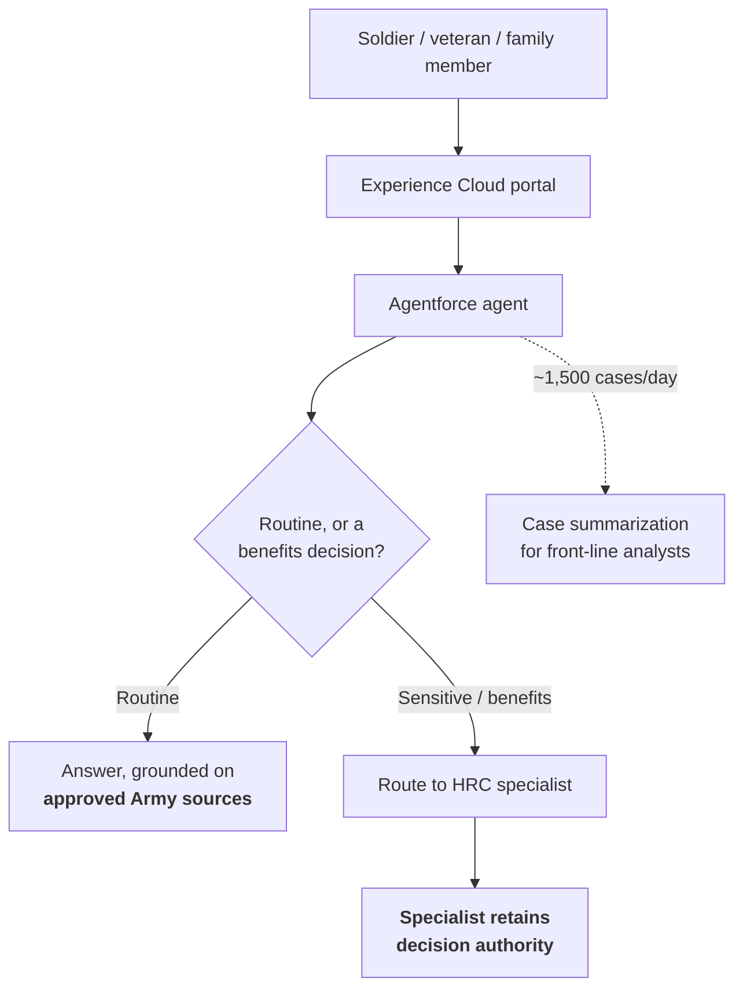

# Agentforce platform

Builder, Agent Script, orchestration, channels, observability. Newest entries at the top.

---

## 2026-08-21 · The prebuilt IT Service family gets three more tracks — Teams, Swarming and a Unified Employee License user (cross-link)

Agentforce **IT Service** now has a four-track setup program in `sf-skills` 1.41.0 — Incident Management, Agentforce for ITSM (Studio, Fulfiller Agent, Employee Agent), CMDB, and Microsoft Teams. Three facts for a buy-vs-build conversation:

- The Teams tracks turn on an org preference **no API can write** — `ITSMTeamsEnabled`; enable the Go feature `service-cloud-itsm-teams-integration` instead.
- Teams extension registration hits `403 FUNCTIONALITY_NOT_ENABLED [MsTeamsAppApiFamily]` with **no self-service unlock found**.
- Employee-side users are provisioned under the **Unified Employee License** as a four-record chain (`User` + Person `Account` + `PersonContact` + `Employee2`) carrying exactly one permission set.

Full entry: [developer-tooling-and-apis.md](developer-tooling-and-apis.md#2026-08-21--salesforce-itsm-becomes-a-four-track-setup-program--and-its-microsoft-teams-toggle-is-a-preference-no-api-can-write).

---

## 2026-08-19 · Agent Script 3.x adds a second agent topology — `GoalBasedAgent` agents run on a schedule, not on a conversation

**What changed.** Two internal→open-source syncs landed in `salesforce/agentscript` on 2026-08-19 (commits `5901dbe` 00:57 UTC and `5e6404e` 02:14 UTC, 358 files, +36,856 / −11,734). The second cut three majors at once and introduces `config.agent_type: "GoalBasedAgent"`, which switches the grammar to a different agent shape.

- **Three majors in one sync.** `@agentscript/agentscript` **2.23.0 → 3.4.0**, `@agentscript/compiler` **2.42.1 → 3.8.1**, `@agentscript/language` **2.20.0 → 3.2.3**. The `agentforce` dialect went 2.37.0 → **2.53.0** across both syncs.
- **The new topology is autonomous, not conversational.** A `trigger:` block fires a `workflows:` entry on a **cron schedule** — `schedule: "*/5 * * * *"`, `target: @workflows.engineering` — with no user turn involved.
- **`orchestrator` replaces `start_agent` as the entry point.** A workflow dispatches either to a `connected_subagent` (`agent: @connected_subagent.agent_1`, itself `target: "agent://Agent_1"`) or to a bare `prompt:` string.
- **The internal name is AgentIQ.** The lint pass `agentiq-validation` "validates AgentIQ workflow, trigger, and orchestrator semantics"; `schema.ts` describes the type as *"goal-based agents (AgentIQ)"*.
- **Separately, `additional_parameter__` config fields are now governed.** Six are deprecated in favour of `config.runtime.*` fields, and one is a hard error.

**Why it matters.** Agentforce has spent 2026 with one authoring topology: a conversation enters at `start_agent`, and subagents route it. This is a second one, and the difference is not syntax — a goal-based agent has **no inbound turn to authorise against**. Whatever identity the scheduled run adopts decides its sharing, FLS and record ownership, and nothing in the script says which. Decide that before writing a `trigger:` block.

**Gotchas:**
- **The two topologies are mutually exclusive, and the linter enforces it both ways.** Outside a `GoalBasedAgent`, the top-level blocks `bundles`, `workflows`, `trigger`, `actions` and `orchestrator` each raise error code **`gba-only-<block>`**. Inside one, `subagent` and `start_agent` raise **`gba-forbidden-<block>`**.
- **`agent_type` is matched case-insensitively but suggested as one string.** The check is `agentType.trim().toLowerCase() === 'goalbasedagent'`; `.suggest(['GoalBasedAgent'])` is the only completion offered, and the schema accepts "any valid backend agent type" — so a typo yields a *conversational* agent that then fails on every GBA block, not an unknown-type error.
- **Six `additional_parameter__` fields are deprecated to `config.runtime.*`**, code `deprecated-additional-parameter`, Warning severity, struck through in editors: `reset_to_initial_node` → `reset_to_initial_node`, `disable_groundedness` and `enable_groundedness` → `groundedness`, `disable_streaming` → `streaming`, `disable_citation` → `citation`, `enable_thought_chunks` → `thought_chunks`.
- **`additional_parameter__disable_graph_runtime` is a hard Error**, code `disabled-additional-parameter` — *"Disabling the graph runtime is not permitted. Please reach out to support if you need that."* There is no runtime replacement.
- **The plugin dialects are exempt.** `gba-only-blocks` returns early when the schema context has no `config` namespace, so a plugin-dialect script may carry `workflows:` and `actions:` with no diagnostic — do not read a clean lint there as proof the blocks are allowed in an agent script.

**Relevant to:** **Architect** — a second agent topology with no inbound user turn, so the run-as identity, sharing and FLS story has to be designed rather than inherited from the conversation; **Developer** — new top-level blocks (`orchestrator`, `workflows`, `trigger`, `actions`, `bundles`), five `gba-only-*` / two `gba-forbidden-*` error codes, and six `additional_parameter__` fields that now warn; **Admin** — a cron-scheduled agent is a new thing running in the org on its own clock, with nothing in the conversation log to notice it by.

**Study action:** clone `salesforce/agentscript` at `5e6404e`, copy the `AUTONOMOUS_AE` fixture out of `dialect/agentscript/src/tests/agentiq-complete-example.test.ts` into a `.agent` file, then delete the `agent_type` line and re-lint. The five `gba-only-*` errors you get back are the exact boundary between the two topologies.

**Status:** Open source (Apache-2.0), `salesforce/agentscript` `main` at 2026-08-19. No Salesforce announcement, release note or doc page names `GoalBasedAgent` or AgentIQ as of 2026-08-20 03:42 UTC — this is a language surface published ahead of the product.

**Sources:** [`salesforce/agentscript` commit `5e6404e`](https://github.com/salesforce/agentscript/commit/5e6404e9a662f049af236c2886f910d47e392905) · [`gba-only-blocks.ts`](https://github.com/salesforce/agentscript/blob/main/dialect/agentscript/src/lint/passes/gba-only-blocks.ts) · [`governed-additional-parameters.ts`](https://github.com/salesforce/agentscript/blob/main/dialect/agentforce/src/lint/passes/governed-additional-parameters.ts) · [`agentiq-complete-example.test.ts`](https://github.com/salesforce/agentscript/blob/main/dialect/agentscript/src/tests/agentiq-complete-example.test.ts)

---

## 2026-08-19 · Agent Script voice gets a v2 schema — inbound/outbound blocks, per-locale overrides, and a compile error if you mix versions

**What changed.** Sync `5901dbe` (2026-08-19 00:57 UTC) added a second `modality voice:` schema to the `agentforce` dialect, with seven new compiler fixtures (`voice_v1_all`, `voice_v2_all`, `voice_v2_inbound`, `voice_v2_outbound`, `voice_v2_languages`, and two minimums). V1's flat keys survive alongside it.

- **Direction becomes structure.** V1's flat `inbound_keywords` / `outbound_speed` / `outbound_filler_sentences` become nested `inbound:` and `outbound:` blocks.
- **Per-locale overrides.** `language_settings:` maps a BCP 47 tag to its own `inbound:` / `outbound:` pair; the agent-level block is the default.
- **`session_language_switching:`** takes `Monolingual` (default, one language per session) or `Multilingual` (any language on any turn).
- **Speech models are addressable.** `inbound.model` and `outbound.model` each take an `id` plus free-form `parameters` — the schema says this exists so "version X and X+1 are simultaneously supported (GA, Beta)".
- **Pronunciation dictionaries.** `outbound.pronunciations` entries carry `grapheme`, `phoneme` and `type`, with both **`IPA`** and **`CMU`** accepted.

**Why it matters.** Voice has been the Agentforce channel with the fewest authoring knobs — this radar has carried "US/Canada only" and a 3× billing swing as its defining facts. A per-locale, per-direction schema with pinnable ASR/TTS model ids moves the design question from *can we do voice* to *which locale gets which model* — and it lands in the open-source dialect before any release note mentions it.

**Gotchas:**
- **Mixing v1 and v2 keys is a compile error, not a merge.** `compile-modality.ts` raises *"Invalid modality voice configuration. Both Voice schema versions were detected, use only one at a time."* and returns `null`. Adding one nested `outbound:` block to a working v1 script breaks the whole compile.
- **V2 output lands under a different key.** When no v1 field is present the compiler writes `voiceConfig.voice2_config`, and moves the shared `additional_configs` into it. Anything reading the compiled `voice` config by its v1 shape sees an empty object.
- **`outbound_stability` and `outbound_similarity` are marked Deprecated** in the v1 half of `voice-schema.ts`. The file's own comment says v1 deprecation is *"TBD"* — the linter only catches mixing, so v1 is not yet on a clock.
- **`language_settings` accepts any string as a key** (`allowTypelessEntries: true`) — a mistyped locale tag parses cleanly and is caught later by the linter/compiler, not by the schema.

**Relevant to:** **Architect** — per-locale voice settings change what a multi-language voice deployment costs to design, and pinnable ASR/TTS model ids mean a model choice is now a versioned decision; **Developer** — `modality voice:` has a second, incompatible schema, and mixing the two fails the compile outright.

**Study action:** compile `packages/compiler/test/fixtures/scripts/voice_v2_all.agent` and diff the emitted `voice_v2_all.snake.json` against `voice_v1_all` — the `voice2_config` key and the per-language nesting are the whole migration in one diff. Then paste an `inbound_keywords:` line into the v2 fixture and confirm the version-mixing error.

**Status:** Open source (Apache-2.0), `agentforce` dialect **2.38.1** at `5901dbe`, **2.53.0** on `main` at 2026-08-19. No release note or doc page located; v1 remains valid with no announced deprecation date.

**Sources:** [`salesforce/agentscript` commit `5901dbe`](https://github.com/salesforce/agentscript/commit/5901dbe26de0bb59b18b4b251b648d79ebfef08b) · [`voice-schema.ts`](https://github.com/salesforce/agentscript/blob/main/dialect/agentforce/src/voice-schema.ts) · [`compile-modality.ts`](https://github.com/salesforce/agentscript/blob/main/packages/compiler/src/modality/compile-modality.ts)

---

## 2026-08-14 · The prebuilt IT Service surface gets a real enablement path — and it is licence-gated at Layer 0 (cross-link)

Agentforce **IT Service** is one of the five prebuilt agent families in the buy-vs-build framework, and its **CMDB** (Configuration Management Database) foundation now has a six-skill setup path in `sf-skills` 1.38.0. The architectural fact worth carrying into a buy-vs-build conversation: CMDB sits behind org perm **`ITSrvcsCnfgMgmnt`**, which comes from the edition or licence and which **no API can grant** — so "we'll turn it on later" is not available. Above it sit five more ordered layers (ITOM tenant → feature → four permission sets → content bundle → Asset Discovery), all failing with the single code `403 FUNCTIONALITY_NOT_ENABLED`. Full entry: [developer-tooling-and-apis.md](developer-tooling-and-apis.md#2026-08-14--service-cloud-itsm-cmdb-gets-a-six-skill-setup-path--and-it-publishes-the-five-layer-gate-behind-one-error-code).

---

## 2026-08-14 · `sf agent preview --api-name` silently drops context variables (cross-link)

`@salesforce/agents` **2.0.2** fixes the second defect in five days in the same preview path: `--api-name` now sends **context variables** when previewing a published agent (2.0.1 fixed `bypassUser` for employee agents). Both are the same class of bug — **`--api-name` initialises a preview session differently from `--authoring-bundle`** — and both fail silently, so the agent reasons without the values instead of erroring. If a preview from an api-name and a preview from a bundle ever disagreed for you, that was the tooling. Full entry: [developer-tooling-and-apis.md](developer-tooling-and-apis.md#2026-08-14--salesforceagents-202--the---api-name-preview-path-drops-context-variables).

---

## 2026-08-13 · The React Native Agentforce bridge's npm `latest` is a release candidate — 0.5.0 is `262.1.3-RC4`

> **Correction (2026-08-21):** this said the bridge's default install is a release candidate with no stable dist-tag to fall back to. **Resolved.** `@salesforce/react-native-agentforce` **0.6.0** published to npm **2026-08-20 20:23 UTC**; GitHub release [`v0.6.0`](https://github.com/salesforce/AgentforceMobileSDK-ReactNative/releases/tag/v0.6.0) — titled **262.1.3**, no RC suffix — carries **Latest**, not **Pre-release**. The RC-on-`latest` window ran **seven days**.
>
> - **Native pins came off RC with it** (`4cb1bd7`): iOS **AgentforceSDK 18.26.9-rc4 → 18.26.17**, **AgentforceService 6.11.3-rc1 → 6.11.4**; Android **`agentforce-sdk` / `agentforce-sdk-voice` 15.130.3-rc1 → 15.130.4**.
> - **AgentforceVoice stays pinned at 2.8.2**, so the Voice conflict noted below survives the upgrade.
> - **The exposure is unchanged.** Still exactly one dist-tag — no `rc`, no `next`, no way to opt out of whatever `latest` happens to be.

**What changed.** `@salesforce/react-native-agentforce` **0.5.0** published to npm on **2026-08-13 13:27 UTC** and holds the package's **only** dist-tag, `latest`. The matching GitHub release [`v0.5.0`](https://github.com/salesforce/AgentforceMobileSDK-ReactNative/releases/tag/v0.5.0) is titled **262.1.3-RC4** and is **marked Pre-release**; GitHub's "Latest" badge still sits on **v0.4.0**.

- **New JS surface.** Direct launch into **Voice mode**, a **per-agent splash screen**, appearance customization, exposed voice **caption defaults and close behavior**, user silence timeout flags, and a fix to initial Agentforce context timing.
- **Native pins.** iOS Agentforce SDK bumped to **262.1.3 RC4**; iOS Agentforce **Voice pinned to 2.8.2**.
- **npm is not the release history.** The registry holds exactly four versions — `0.0.0`, `0.3.0`, `0.4.0`, `0.5.0`. GitHub's `0.1.0` (260.4, April) and `0.2.0` (260.5, June) never reached npm at all.

**Relevant to:** **Developer** — the default install of a shipping mobile dependency is an RC, and the new Voice-mode launch, splash-screen and caption APIs only exist in it; **Architect** — a package with a single dist-tag carries no stability signal, so "pin explicitly" becomes a policy decision rather than a preference for this dependency.

**Why it matters.** `npm install @salesforce/react-native-agentforce` resolves to a build the vendor's own repository labels a release candidate, and there is no second dist-tag to opt out with — no `next`, no `rc`, no `stable`. A team that pinned `0.4.0` is fine. A team taking the default is shipping an RC into a mobile app.

This is the mobile-SDK naming trap running one layer up. On 07-31 the lesson was *read the git tag, not the release title*, because "262.1.2" hid a Swift 6 major. Here the release **title** is the honest artifact and the **npm tag** is the misleading one. Neither channel is reliably authoritative — check both before upgrading.

**Gotchas:**
- Three names, one artifact: npm `@salesforce/react-native-agentforce`, repo `salesforce/AgentforceMobileSDK-ReactNative`, package directory `AgentforceSDK-ReactNative-Bridge`.
- The package is **pre-1.0**, so `^0.5.0` behaves exactly like `~0.5.0` — both resolve only `0.5.x`. A caret gives you no protection here because it grants no latitude either.
- Marketing version and npm version have fully diverged: npm `0.5.0` = release title `262.1.3-RC4`. Neither number predicts the other, and the RC suffix appears in **neither** the npm version nor the dist-tag.
- Voice arrives with a hard native pin — **iOS Agentforce Voice 2.8.2** — so a host app already resolving a different Voice version has a conflict to settle before it can take 0.5.0 or 0.6.0.
- **A version bump in the repo is not a publish.** `da04dcc` set the package to `0.6.0` on **2026-08-14 18:59 UTC**; npm got it **six days later**, on 08-20. The publish tracks the GitHub *release*, not `main` — so reading the repo tells you what is coming, never what `npm install` resolves.
- At 0.5.0's publish time the bridge's own `docs/voice-and-feature-flags-config.md` claimed **AgentforceVoice 2.9.3-rc3** while the Podfile pinned **2.8.2**. `4cb1bd7` corrected the doc. The pin file is the authority, not the doc.

**Study action:** in any React Native app depending on the bridge, run `npm view @salesforce/react-native-agentforce dist-tags` and `npm ls @salesforce/react-native-agentforce`, then open the [releases page](https://github.com/salesforce/AgentforceMobileSDK-ReactNative/releases) and check whether the version you actually resolved carries the **Pre-release** badge. Then diff `ios/Podfile.common.rb` and `AgentforceSDK-ReactNative-Bridge/android/build.gradle` between the two tags to see the native pins you are really taking.

**Status:** **Superseded 2026-08-20** by **0.6.0** (*262.1.3*), which is **Latest** on GitHub and `latest` on npm (published 2026-08-20 20:23 UTC). The RC state described here was true for `v0.5.0` / *262.1.3-RC4* between 2026-08-13 and 2026-08-20. Apache-2.0, still pre-1.0, one dist-tag. Covers Service Agent and Employee Agent.

**Sources:** [`v0.5.0` release](https://github.com/salesforce/AgentforceMobileSDK-ReactNative/releases/tag/v0.5.0) · [`v0.6.0` release](https://github.com/salesforce/AgentforceMobileSDK-ReactNative/releases/tag/v0.6.0) · [AgentforceMobileSDK-ReactNative releases](https://github.com/salesforce/AgentforceMobileSDK-ReactNative/releases) · [`@salesforce/react-native-agentforce` on npm](https://www.npmjs.com/package/@salesforce/react-native-agentforce)

---

## 2026-08-12 · Retrieving a *whole* agent becomes one flag — `--root-type-with-dependencies` (cross-link)

`sf project retrieve start` gains **`--root-type-with-dependencies`**, whose only legal values are **`Bot`** and **`AiAgentDefinitionVersion`**. Naming a `Bot` as the root also retrieves its dependent `GenAiPlannerBundle`, `GenAiPlugin` and `GenAiFunction` components, replacing the hand-maintained manifest that agent source control has needed until now. It maps to `rootTypesWithDependencies` on the Metadata API `RetrieveRequest`, so it is available to any API caller — but on the CLI it is **`nightly`-only** as of 2026-08-14. Full entry: [developer-tooling-and-apis.md](developer-tooling-and-apis.md#2026-08-12--sf-project-retrieve-start---root-type-with-dependencies--the-cli-half-of-the-v68-agent-metadata-story-and-it-takes-exactly-two-values).

---

## 2026-08-12 · An agent's *runtime* metadata gets a name — `AiAgentDefinition` / `AiAgentDefinitionVersion` (cross-link)

Agentforce now has three metadata layers: **authoring** (`AiAuthoringBundle` — the XML plus the `.agent` Agent Script file you version-control), **runtime** (the new v68 pair, generated on activation and now retrievable), and **reasoning** (`GenAiPlannerBundle`, `GenAiPlugin`, `GenAiFunction`). `AiAgentDefinitionVersion` is registered as a **peer of `Bot`** — both are legal values for `rootTypesWithDependencies`, i.e. roots of an agent's dependency graph. `AiAgentDefinitionPlanner` is named in v68 but **not supported by DX**. Full entry: [developer-tooling-and-apis.md](developer-tooling-and-apis.md#2026-08-12--winter-27-is-api-680-confirmed--and-it-brings-a-new-agent-runtime-metadata-pair-aiagentdefinition--aiagentdefinitionversion).

---

## 2026-08-11 · The ADLC now ships as four subagents and a `.agent` validator hook (cross-link)

Salesforce's `salesforce-development` Claude Code plugin bundles the Agent Development Life Cycle as **agents, not just skills**: `adlc-orchestrator` (plan-mode coordinator) delegating to `adlc-author` (writes `.agent` files), `adlc-engineer` (scaffolds Flow/Apex, deploys bundles) and `adlc-qa` (tests, optimizes, security-assesses). An **Agent Script syntax validator** runs after every `Write`/`Edit` and reports non-blocking findings. Full entry: [developer-tooling-and-apis.md](developer-tooling-and-apis.md#2026-08-11--salesforce-ships-a-claude-code-plugin--salesforce-development-1100-41-skills-five-agents-and-a-deploy-gate).

---

## 2026-08-11 · Employee agents run *as* a user — and `sf agent preview` had forgotten (cross-link)

`bypassUser` is the flag that separates the two agent identities: **customer-facing agents run with no Salesforce user**, **employee agents (`AgentforceEmployeeAgent`) run as the authenticated one** — which decides sharing, FLS, `UserInfo` and record ownership. `sf agent preview start --api-name` hard-coded `bypassUser: true` for both and returned **`400 Invalid user ID`** on every employee agent; fixed in `@salesforce/agents` **2.0.1**. Full entry: [developer-tooling-and-apis.md](developer-tooling-and-apis.md#2026-08-11--salesforceagents-201--employee-agents-can-be-previewed-again-and-not-from-stable-sf).

---

## 2026-08-05 · Army HRC is the first IL5 Agentforce deployment — 55M conversations a month, and a human holding the decision

**What changed.** **U.S. Army Human Resources Command (HRC)** selected **Missionforce National Security** to run autonomous agents for HR support, and is the **first Department of War organization** to deploy the newly IL5-authorized Agentforce on CUI workloads. The compliance side is in [trust-security-and-governance.md](trust-security-and-governance.md#2026-08-05--agentforce-360-is-il5-authorized--agents-on-cui-inside-a-govcloud-boundary).

- **Population served:** 9.2 million soldiers, veterans, civilian staff and military families.
- **Delivery surface is Experience Cloud with Agentforce** — a portal, not a bespoke app.
- **Projected 55M+ agent conversations per month** at full scale.
- **Projected 1,500+ cases per day** of automated case summarization, replacing manual review of long case histories.
- **Projected $6M annual savings.**
- **Agent behaviours named:** answer routine inquiries, summarize case histories, surface policy and career information **from approved Army sources**.

**Why it matters.** This is the clearest public reference architecture yet for an agent at genuine population scale, and the design choice worth stealing is the boundary: the agent **retrieves and summarizes, the human decides**.

Benefits determinations never leave the specialist. That is how you get an autonomous agent past a risk review — not by making it more accurate, but by scoping what it is allowed to conclude.

The second lesson is grounding provenance. "Approved Army sources" is a curated corpus, not the whole intranet, and that curation is what makes the answers defensible.

**Gotchas:**
- **Every number here is a projection, not a measurement.** "55M conversations per month **at full scale**" and "$6M annual savings" are pre-deployment figures. 55M across 9.2M people is ~6 conversations per person per month — plausible as a ceiling, not an observed rate. Do not cite these as results.
- **Experience Cloud is the constraint people forget.** Agent-in-a-portal inherits Experience Cloud's guest/authenticated user model, its sharing sets and its licence counts. Sizing the agent is not the same as sizing the community.
- **"First DOW organization" is a deployment claim, not an availability claim.** IL5 availability is the [separate announcement](trust-security-and-governance.md#2026-08-05--agentforce-360-is-il5-authorized--agents-on-cui-inside-a-govcloud-boundary) on the same day.
- Case summarization is described as reducing analyst reading time, not as closing cases. The agent is a **read-and-summarize** role in that path.

**Study action:** build the escalation half of this in a dev org. Give an agent one action that answers from a Data Library, and a second path that creates a Case and hands off — rather than answering — when the request touches an entitlement decision. Then in `sf agent preview`, assert it never states a decision on the escalation branch. That assertion is the design.

**Status:** Announced **2026-08-05**. Deployment in progress; the release describes selection and rollout, not completion. Powered by Agentforce inside Salesforce's IL5-authorized environment.

**Sources:** [U.S. Army HRC press release](https://www.salesforce.com/news/press-releases/2026/08/05/us-army-hrc-agentforce-ai-powered-support/) · [Business Wire release](https://www.businesswire.com/news/home/20260805744958/en/U.S.-Army-Human-Resources-Command-Deploys-Agentforce-to-Deliver-247-AI-Powered-Support-to-9.2-Million-Soldiers-Veterans-and-Military-Families) · [Futurum analysis](https://futurumgroup.com/insights/salesforces-agentforce-deployment-a-major-shift-for-military-hr-operations/)

---

## 2026-08-03 · React Native Agentforce 0.4.0 — `onAgentResponse` was a no-op on iOS

**What changed.** [`salesforce/AgentforceMobileSDK-ReactNative`](https://github.com/salesforce/AgentforceMobileSDK-ReactNative) released **v0.4.0**, titled **262.1.2**; `@salesforce/react-native-agentforce` **0.4.0** reached npm on 2026-08-03 at 16:49 UTC under Apache-2.0. It is the React Native bridge picking up [the iOS major recorded below](#2026-07-31--agentforce-mobile-sdk-26212--a-patch-that-is-a-major-and-five-new-gen-ui-components).

- **Native floors move underneath it.** iOS `AgentforceSDK` → **18.26.8**, `AgentforceVoice` → **2.8.2**; Android → **15.130.1**.
- **`onAgentResponse` no longer no-ops on iOS.** The callback previously did nothing on iOS while working on Android; the two platforms now behave the same.
- **Tabular UI rendering** arrives on iOS, matching the `Table` Gen UI component from the native release.
- **Android** fixes absolute-URL handling in chat panels.

**Why it matters.** A callback that silently does nothing is the worst failure shape available: no error, no log, no crash — just an event that never arrives.

Teams hitting it would have papered over it by polling state or scraping the rendered UI, and that workaround is now the bug. Audit for it before upgrading, not after.

The bridge is also how the **Swift 6 strict-concurrency major** reaches a React Native app. The JS bump reads as a minor; the transitive native change does not.

**Gotchas:**
- **`peerDependencies` are `react: "*"` and `react-native: "*"`** — no floor at all. npm will happily pair 0.4.0 with an RN version the native SDKs were never tested against.
- **`engines.node` is `>=18`** on the JS package. That is unrelated to the `sf` CLI's move to Node 22 — do not treat one as evidence about the other.
- **The package bundles no Mobile SDK.** `dependencies` is empty; its own description says the host app adds the Mobile SDK. Installing it is not installing Agentforce.
- **Three version lines per release**: npm `0.4.0`, release title `262.1.2`, native tags `18.26.8` (iOS) and `15.130.1` (Android). Only the native tags carry severity.
- npm name `@salesforce/react-native-agentforce`, repo `salesforce/AgentforceMobileSDK-ReactNative`, package directory `AgentforceSDK-ReactNative-Bridge` — three different names for one artifact. Search on all three.
- [`AgentforceMobileSDK-Android`](https://github.com/salesforce/AgentforceMobileSDK-Android) shows **no August 2026 release of its own** (newest is 262.1.2 / `v15.130.1`, 2026-07-31, checked 2026-08-05 03:06 UTC). The Android floor moved inside the bridge, not on the Android line.

**Study action:** in a scratch React Native app, pin `@salesforce/react-native-agentforce` to **0.3.0**, register an `onAgentResponse` handler that logs, and run it on an iOS simulator and an Android emulator — watch iOS stay silent. Bump to **0.4.0** and run both again.

**Status:** Released **2026-08-03**. npm `@salesforce/react-native-agentforce` **0.4.0**, Apache-2.0, still **pre-1.0**. Covers Service Agent and Employee Agent.

**Sources:** [AgentforceMobileSDK-ReactNative releases](https://github.com/salesforce/AgentforceMobileSDK-ReactNative/releases) · [`@salesforce/react-native-agentforce` on npm](https://www.npmjs.com/package/@salesforce/react-native-agentforce)

---

## 2026-07-31 · Agentforce Mobile SDK 262.1.2 — a "patch" that is a major, and five new Gen UI components

**What changed.** [`salesforce/AgentforceMobileSDK-iOS`](https://github.com/salesforce/AgentforceMobileSDK-iOS) published **Agentforce Mobile SDK 262.1.2** on 2026-07-31 at 20:34 UTC under git tag **`18.26.8`**. It adds a customizable **splash screen** and moves the whole SDK to **Swift 6 strict concurrency** — declared in the notes as *"a major release, 18.0.0"*.

**Five new customizable components** join the Gen UI set, all of them shapes an agent action can now render natively rather than as prose:

- `Table`
- `Schedule`
- `DataGroup`
- `QueryOption`
- `VerticalCard`

**Fixes worth knowing by name**, because each is a symptom you would otherwise misdiagnose as your own bug:

- Record selector showed **raw IDs instead of names**
- **Lightning Out 2.0** inline scrolling and WebView reuse
- **Gen UI LWC** rendering on mobile
- Voice panel not dismissing on **session auto-end**
- **Memory leak in the pre-chat submit button**
- `INQUIRE` input values lost on re-render
- SPM/XCFramework resource lookups failing for images and HTML entities

**Why it matters.** The five components extend the *design agent output as typed structures* argument one concrete step — `Table` and `Schedule` are exactly the returns that used to be flattened into a sentence.

But the release is more useful as a versioning lesson. **262.1.2 reads like a patch and is a Swift-language major.** An app on 262.1.0 (tag `17.31.6`) that bumps to it inherits strict-concurrency compilation across the whole dependency: a sprint, not an afternoon.

**Gotchas:**
- **Two version lines on one release, and they disagree about severity.** The marketing name went `262.1.0 → 262.1.2` (patch-shaped); the git tag went `17.31.6 → 18.26.8` (major-shaped). **Read the tag, not the title.**
- The SDK declares a dependency on **`AgentforceService` 6.10.0**, while [`forcedotcom/AgentforceMobileService-iOS`](https://github.com/forcedotcom/AgentforceMobileService-iOS) is already at **6.11.2** (2026-07-31 19:51 UTC). The SDK's floor lags the service's head — do not assume the newest service build is the tested one.
- The release notes publish **no minimum iOS or Xcode version**, and Swift 6 strict concurrency implies a modern toolchain. Confirm in a branch before committing to the bump.

**Study action:** in a throwaway iOS app, pin `AgentforceMobileSDK-iOS` to tag `17.31.6`, build, then move the pin to `18.26.8` and build again — count the strict-concurrency errors. That number is the real cost of the "patch". Then render an action output through the new `Table` component and compare it against the same data returned as text.

**Status:** Released **2026-07-31**, tag `18.26.8`, marketed as Agentforce Mobile SDK **262.1.2**. iOS only; the Android and React Native lines move separately.

**Sources:** [Release 18.26.8](https://github.com/salesforce/AgentforceMobileSDK-iOS/releases/tag/18.26.8) · [AgentforceMobileSDK-iOS releases](https://github.com/salesforce/AgentforceMobileSDK-iOS/releases) · scan note [01-agentforce/2026-08-02](01-agentforce/2026-08-02.md)

---

## 2026-07-27 · Multi-Agent Orchestration is GA — status corrected

> **Correction (2026-07-27):** this entry previously recorded Multi-Agent Orchestration as **Beta**. Secondary sources date **GA to June 15, 2026** as part of Summer '26. Salesforce Help still labels the in-builder *Connect Agent as Subagent* step **(Beta)**, so product page and setup docs disagree — verify in your own org before quoting a status. See [01-agentforce/2026-07-27.md](01-agentforce/2026-07-27.md).

[Multi-Agent Orchestration](https://help.salesforce.com/s/articleView?id=ai.agent_multi_orch.htm&type=5) lets an **orchestrator agent** connect to other specialized agents in the org and present a single point of contact, so a user handles a cross-domain task without switching sessions, with shared context across channels.

**How you wire it.** In Agentforce Builder, open a draft agent as the orchestrator, then in the Explorer panel: **+ → Connect Agent as Subagent (Beta)**. Give each connected subagent a description — that description governs routing behaviour. With Agent Router, add each subagent under *Actions Available for Reasoning* and reference it with `@`.

**Why it matters.** The realistic enterprise pattern is many narrow, well-tested agents rather than one omniscient one. Orchestration is what makes that pattern usable, and the subagent *description* becomes a first-class design artifact — it's effectively the routing contract. Write it like an API doc, not a label. **Atlas Reasoning Engine 3.0 routes by reading each subagent's description rather than following a fixed decision tree**, which makes that field executable configuration, not documentation: a vague description produces intermittent mis-routing that looks like a model failure but is a specification failure.

---

## 2026-07-26 · Agentforce Builder and Agent Script are GA

**What changed.** Both the new [Agentforce Builder](https://help.salesforce.com/s/articleView?id=ai.agent_builder_tour.htm&type=5) and [Agent Script](https://developer.salesforce.com/docs/ai/agentforce/guide/agent-script.html) went generally available in the Summer '26 monthly cadence, per the Salesforce developer release guide. *(Exact GA date is not stated in a first-party announcement I could find — some secondary sources say February 2026, others still showed Beta docs as late as April 2026. The July 13 cutoff below is confirmed.)*

- **The new builder is now the default.** Starting the **week of July 13, 2026**, the *New Agent* button in Setup no longer opens the legacy builder. New agents are created only in Agentforce Builder. Note this removes agent *creation* only — existing legacy agents can still be edited, activated, versioned and managed.
- **One-click upgrade path.** [Upgrading a legacy agent](https://help.salesforce.com/s/articleView?id=ai.agent_setup_create_upgrade.htm&type=5) converts all subagents, actions, system messages, data and connections into Agent Script, then optionally optimizes the result for reliability.
- **Model choice moved into the script.** You can now [pin the model for an agent directly in Agent Script](https://developer.salesforce.com/docs/ai/agentforce/guide/ascript-model.html) instead of relying only on the org-wide model setting.

**What Agent Script actually is.** A human-readable expression language that compiles to portable JSON. It blends deterministic rules (conditionals, if/then, explicit hand-offs, precise tool use) with agentic LLM reasoning — the point being predictability. This is the mechanism behind "Hybrid Reasoning" in the Atlas Reasoning Engine: you dial how much is structured business logic vs. how much is left to the model.

**Why it matters.** Topic-and-instruction configuration was the Agentforce skill of 2025. Agent Script is the Agentforce skill of 2026 — it's the artifact that gets versioned, reviewed, diffed and deployed. Because agents compile to JSON, agent definitions finally behave like source code in a CI/CD pipeline.

**Study action:** rebuild one existing topic-based agent in Agent Script and diff the two behaviours in preview.

---

## 2026-07-26 · Agent Script is open source (Apache 2.0)

Salesforce open-sourced the whole Agent Script toolchain at [github.com/salesforce/agentscript](https://github.com/salesforce/agentscript): parser, linter, compiler, Language Server Protocol implementation and editor integrations.

**Why it matters.** An open parser/compiler means agent definitions can be linted and tested *outside* an org — in a plain CI job, with no Salesforce connection. It also means third-party harnesses (the community is already running compiled Agent Script under Pydantic AI) can execute the same logic. For an architect, this is the strongest signal yet that Salesforce wants agent logic to be portable rather than org-locked.

---

## 2026-07-26 · Observability: Refined Agent Analytics + Custom Scorers (Beta)

- **[Refined Agent Analytics](https://help.salesforce.com/s/articleView?id=release-notes.rn_einstein_analytics_new_experience.htm&release=262&type=5)** unifies Service Agent and Employee Agent analytics into one view with 40+ metrics.
- **[Custom Scorers (Beta)](https://help.salesforce.com/s/articleView?id=ai.generative_ai_optimize_scorers.htm&type=5)** lets you grade live sessions against your own KPIs — Sentiment, Tone of Voice, Product Interest, Escalation Trigger, Politeness — alongside Salesforce's standard quality metrics.

**The developer workflow is the interesting part.** Build scorers with [Next Gen Testing](https://help.salesforce.com/s/articleView?id=ai.agent_studio_testing_center_setup_tests.htm&type=5) in Agentforce Studio, *or* deploy them via Metadata API using the `aiAgentScorerDefinitions` type so they live in source control, then activate them from the **Scorer Hub** to run against live sessions. Requires the *Agentforce Scorer Beta* permission set.

**Why it matters.** "Is the agent good?" becomes a versioned, testable definition rather than a vibe. Metadata API support is the tell — evaluation is being treated as deployable infrastructure.

---

## 2026-07-26 · Agentforce Mobile SDK

> **Correction (2026-08-02):** the version table below left `salesforce/AgentforceMobileSDK-iOS` blank with "independent · —". It is filled in: tag `18.26.8` = marketing version 262.1.2. The version line is not merely independent, it is **differently scaled** — see the [2026-07-31 entry](#2026-07-31--agentforce-mobile-sdk-26212--a-patch-that-is-a-major-and-five-new-gen-ui-components).

The [Agentforce Mobile SDK](https://github.com/salesforce/AgentforceMobileSDK-iOS) embeds agents in native **iOS**, **Android** and **React Native** apps, either as a pre-built chat UI or headless (you own the UI).

- **React Native support:** one TypeScript codebase for both platforms, via a single `AgentforceService` object. Integration is three calls: **configure → (optional) add context → launch**.
- **Two agent types to choose between:** a **Service Agent** is customer-facing and *anonymous* (no login, good for public apps); an **Employee Agent** is internal and *authenticated* (the SDK obtains OAuth tokens through the Salesforce Mobile SDK).
- **Session context** is optional typed variables passed at launch so the agent can personalize replies.
- On iOS you supply the logged-in user's access token plus the published agent's 18-character **Bot Id**, and the SDK returns a complete native chat view.

**[Custom Lightning Types](https://developer.salesforce.com/blogs/2026/05/use-custom-lightning-types-in-agent-script-for-rich-agent-ui)** are the companion feature and are *not* mobile-specific: when an agent action returns structured data, a custom Lightning type attaches a purpose-built UI to it. Define once against the action output and it renders idiomatically everywhere — an LWC on desktop/web, the matching native UI in the mobile app.

**Why it matters.** Cross-surface rendering from a single definition is a genuine architecture win. Design agent action outputs as *typed structures*, not prose, and the UI follows for free.

**Gotchas — the mobile artifacts do not share a version line.** Three separately versioned packages, and assuming a single "Agentforce mobile version" is an easy way to pin the wrong thing:

| Artifact | Version line | Latest seen |
|---|---|---|
| `salesforce/AgentforceMobileSDK-ReactNative` (npm `@salesforce/react-native-agentforce`) | 0.x | **0.5.0**, 2026-08-13 13:27 UTC — GitHub **Pre-release** *262.1.3-RC4*, yet npm `latest`; last non-RC is **0.4.0** ([entry](#2026-08-13--the-react-native-agentforce-bridges-npm-latest-is-a-release-candidate--050-is-26213-rc4)) |
| `forcedotcom/AgentforceMobileService-iOS` | 6.11.x | **6.11.2**, 2026-07-31 19:51 UTC (commit `f86eb61`) |
| `salesforce/AgentforceMobileSDK-iOS` | independent (tag ≠ marketing name) | **tag `18.26.8`** = "262.1.2", 2026-07-31 20:34 UTC — [entry above](#2026-07-31--agentforce-mobile-sdk-26212--a-patch-that-is-a-major-and-five-new-gen-ui-components) |

`AgentforceMobileService-iOS` ships as an **SPM binary distribution** — `Package.swift` points at a precompiled `.xcframework`, so a commit there is a **pointer bump with no changelog in the repository**. The 6.11.2 bump published no release and no notes; the substance is in a binary elsewhere. Track each dependency separately.

**Study action:** in any app embedding Agentforce, list the three package versions in one place in your README, and record which Agentforce SDK build (`262.x`) each resolves to — that mapping is not published anywhere.

---

## 2026-07-26 · Agentforce Data Library Connect API (Beta)

Agentforce Data Libraries (ADL) ground an agent in trusted content — they index Knowledge articles or uploaded files into a vector index and expose a retriever for RAG. Creating one used to be a manual Setup step; the new **ADL Connect API (Beta)** makes the whole lifecycle scriptable and CI/CD-ready.

Base resource: `/services/data/v67.0/einstein/data-libraries`

The five-step provisioning flow for a file-based library:

1. **Create the library** — a single `POST`. Note that `sourceType` is *nested* under `groundingSource` (`SFDRIVE` for files, or `KNOWLEDGE` / `RETRIEVER`). The response returns the `libraryId` every later step needs.
2. **Wait for upload readiness** — poll `GET …/{libraryId}/upload-readiness`. Data 360 is provisioning the objects that hold file metadata behind the scenes.
3. **Upload the file** — request a pre-signed S3 URL from `POST …/{libraryId}/file-upload-urls`, then `PUT` the file to that URL. Forward the returned headers verbatim or S3 rejects it with a 403.
4. **Index it** — `POST …/{libraryId}/indexing` chunks, embeds and builds the retriever.
5. **Ground the agent** — wire the library into the `.agent` file's `knowledge:` block and invoke `AnswerQuestionsWithKnowledge` from a subagent.

**Two gotchas worth memorizing:**

- Treat the library as ready when **`retrieverId` goes non-null**, *not* when the top-level `status` flips — status leads the retriever by 10–30 minutes.
- `rag_feature_config_id` is `"ARFPC_" + libraryId`, **not** the raw ID.

**Why it matters.** This is the "grounding as code" half of Headless 360. RAG configuration stops being click-ops and becomes a pipeline step.

---

## 2026-07-26 · Agentforce Help Agent + Customer Service Portal (GA July '26)

A prepackaged, self-service support agent with guided setup Salesforce describes as **deployable in minutes**, with **voice, web, portal and messaging** channels all turned on from a single screen. GA in **July 2026**, with **pay-per-resolution pricing** ($2 per autonomous end-to-end resolution) the same month.

**Salesforce's own benchmark:** Agentforce on `help.salesforce.com` handled **4.3 million inquiries and resolved 70%** of them. That's a first-party number and the strongest reference point available for a business case.

**Why it matters.** Two signals here. First, Salesforce is shipping *finished* agents, not just the tooling to build them — the differentiation moves from "can you build an agent" to "how well is yours grounded." Second, pay-per-resolution ties revenue to outcomes rather than conversations, which changes how you'd model ROI. See [pricing-and-certification.md](pricing-and-certification.md).

---

## 2026-07-26 · Agentforce Voice, Intelligent Context and model choice (Agentforce 360 baseline)

Context for anything built on the current platform:

- **Agentforce Voice** — low-latency, brand-tuned voice agents with live transcription into Salesforce Voice so a human can take over mid-call. First-class CCaaS support for **Amazon Connect, Five9, Genesys, NiCE and Vonage**. Full auditability runs through Data 360.
- **Intelligent Context** — automatically extracts and structures unstructured content (PDFs, tables, images, flowcharts) into grounding data, configured through a low-code pipeline. Notably, you can configure context so the *same* document is interpreted from multiple business perspectives.
- **Model choice** — the Atlas Reasoning Engine now supports **Google Gemini** alongside OpenAI and Anthropic on Amazon Bedrock.

**Why it matters.** Model choice at the reasoning-engine level plus model pinning in Agent Script means "which model runs this agent" is now an architecture decision you own, with cost and latency consequences per agent.

---

## 2026-05-21 · Agentforce Coworker (Beta) — the search bar becomes the agent

> **Backfill (recorded 2026-07-28).** This radar had no Coworker entry despite the announcement being two months old. Added as verified gap-fill, dated to the announcement, not to the scan.

**What changed.** Marc Benioff announced [Agentforce Coworker](https://www.salesforce.com/agentforce/coworker/) on **May 21, 2026**, calling it the biggest thing Salesforce shipped that quarter and describing it as effectively *replacing* Salesforce Search. It is **Beta today for all Agentforce customers**, in the Salesforce global search bar and in Slack, with web, **Microsoft Teams, ChatGPT, Claude** and a desktop app slated for "later this year."

- **You author nothing.** No Agent Script, no topics, no actions. Setup → Quick Find *Agentforce Coworker* → Turn On → Turn on End User Experience → assign users. Requires the **Agentforce Coworker Admin** permission set; **Enterprise, Unlimited and Agentforce 1** editions; **not supported on Government Cloud Plus**. Enabling it **automatically enables Einstein**.
- **Grounded on Data 360**, and the [data-source model](https://developer.salesforce.com/docs/data/agentforce-coworker/guide/agentforce-coworker-limits-and-guidelines.html) is the interesting part: **Slack is federated, not ingested** (queried live via Slack Authentication), while **Google Drive and SharePoint are ingested** on a 1 hr incremental crawl. Any DMO in the data space can be added.
- **It routes to specialized agents** — Sales Coach Agent, Support Agent — so it's a front door onto the agent estate rather than a competitor to it.
- **[Billing has two modes that coexist](https://developer.salesforce.com/docs/data/agentforce-coworker/guide/agentforce-coworker-billing-considerations.html).** Seat-based (Agentforce 1, or Agentforce for Sales/Service/Industries): searching CRM or Slack costs **zero credits**. Usage-based: **Flex Credits** for prompts, **Data Services Credits** for data queries and processing. Guest, unauthenticated and portal users are always usage-based.

**The claim that doesn't survive checking.** Secondary coverage repeats a **"270+ external data sources"** figure. The first-party Beta limits page lists **three**: Salesforce CRM, Data 360 objects, and Slack — with **Google Drive, SharePoint and Jira pilot-only**, requiring an account executive. Don't scope client work on the marketing number.

**Why it matters.** Every other Agentforce advance in 2026 has been about *authoring* — Agent Script, orchestration, scorers. Coworker inverts it: nothing is authored and everything is inherited, so what it can answer is decided entirely by the org's sharing model and field-level security. Enabling it is, in practice, an instant org-wide sharing audit performed by every licensed user through a conversational interface. That's the risk and the sales pitch in the same sentence. The ChatGPT/Claude surfaces add a second governance question — what leaves the org, under whose identity, logged where.

**Study action:** turn it on in a dev org, then log in as a restricted user and ask for something they shouldn't see. Confirm sharing holds before a client tests it for you.

**Status:** Beta, available to all Agentforce customers. Announced 2026-05-21. **No GA date announced** as of 2026-07-28. Beta Services Terms apply — consumption under Non-GA services carries no refund or credit rights.

**Sources:** [Agentforce Coworker developer guide (Beta)](https://developer.salesforce.com/docs/data/agentforce-coworker/guide/agentforce-coworker-a-home.html) · [Turn On Agentforce Coworker](https://developer.salesforce.com/docs/data/agentforce-coworker/guide/agentforce-coworker-turn-on-infrastructure.html) · [Limits and Guidelines](https://developer.salesforce.com/docs/data/agentforce-coworker/guide/agentforce-coworker-limits-and-guidelines.html) · [Billing Considerations](https://developer.salesforce.com/docs/data/agentforce-coworker/guide/agentforce-coworker-billing-considerations.html) · [Salesforce Announces Agentforce Coworker: AI 'In Every Search Bar' (Salesforce Ben)](https://www.salesforceben.com/salesforce-announces-agentforce-coworker-ai-in-every-search-bar/) · [Meet Your Users' New AI Teammate (Salesforce Admins)](https://admin.salesforce.com/blog/2026/meet-your-users-new-ai-teammate-introducing-agentforce-coworker)

**Study folder:** [02-salesforce-ai/10-agentforce-coworker](../02-salesforce-ai/10-agentforce-coworker/notes.md)

---

## 2026-04-29 · Agentforce Operations — the fifth prebuilt agent family, GA for 102 days and never recorded here

> **Backfill (recorded 2026-08-09).** Found by a gap check, not a news window. **"Agentforce Operations" had zero mentions anywhere in this study base** — including the buy-vs-build framework whose entire job is to enumerate the prebuilt agent families. Dated to its GA, not to the scan.

**What changed.** Salesforce made **Agentforce Operations** generally available on **2026-04-29**: a suite of specialized agents that execute **back-office** work — supply chain, procurement, finance and IT — rather than front-office conversation.

- **The authoring surface is a "digital blueprint."** Unstructured documents and diagrams are converted into executable workflows; the process is then updated in **plain language** rather than re-drawn.
- **The agents do coordination work**, not chat: process coordination, data verification, compliance clearance, approval management.
- **Named worked examples:** manufacturing fulfillment (inventory checks, approvals, supplier sync), bank underwriting (extract, validate, chase missing inputs), insurance claims intake and validation.
- **Every agent action is recorded** for an audit-ready trail.
- **Staged, not complete at GA.** Ecosystem integration — auto-sync data and **trigger actions with Salesforce Flows** — entered **Beta in May 2026**; **Slack and Microsoft Teams** surfaces followed in **June 2026**.
- **Vendor claims:** 50–70% reduction in process cycle time, 80% reduction in manual data entry.

**Relevant to:** **Architect** — a fifth prebuilt family the buy-vs-build decision has to account for, and its Flow integration decides whether it composes with the automation an org already owns or duplicates it; **Admin** — blueprint authoring and plain-language process updates are a new configuration surface someone has to own.

**Why it matters.** Every Agentforce family this radar has recorded — Help Agent, Commerce, IT Service, Missionforce — puts an agent in front of a *person*. Operations puts one in front of a *process*, and that changes the design question from "what can it say?" to "what is it allowed to commit?"

It also inverts the authoring story the rest of 2026 has been telling. Agent Script made authoring **more** explicit and version-controlled; a digital blueprint generated from a diagram and edited in prose is the opposite trade. Both ship in the same year, aimed at different owners — which is the thing to notice before a client assumes one governance model covers both.

**Gotchas:**
- **No first-party detail was obtainable.** `salesforce.com` and every secondary source located were unreachable to automated fetching this run. GA date, the staged Beta dates and the percentage claims all come from **search-result snippets**. Verify against the product page before any of it reaches a proposal.
- **"Triggers actions with Salesforce Flows" was Beta in May 2026, not GA at launch.** A blueprint that composes with your existing automation was a promise on 2026-04-29, not a shipped surface.
- **The percentages are vendor claims with no published methodology.** Quote them as claims or not at all.
- **Pricing and licensing are unknown.** No Flex Credits mapping, SKU or entitlement was located — so the buy-vs-build comparison cannot be completed on cost yet.
- **The name collides with the "operations" of AgentOps/observability.** In a design review, say *Agentforce Operations, the back-office product* the first time.

**Study action:** add Agentforce Operations as a fifth row to the prebuilt-agent comparison in [02-salesforce-ai/14-prebuilt-agents-and-buy-vs-build](../02-salesforce-ai/14-prebuilt-agents-and-buy-vs-build/notes.md), leaving the pricing cell explicitly **unknown**. Then, in a dev org, open **Setup → Agentforce** and write down which prebuilt families your edition actually exposes — the gap between the marketing list and that list is the real buy-vs-build shortlist.

**Status:** **GA 2026-04-29.** Flow ecosystem integration **Beta from May 2026**; Slack and Microsoft Teams surfaces **from June 2026**. Pricing not established.

**Sources:** [Salesforce Launches Agentforce Operations to End Back-Office Bottlenecks](https://www.salesforce.com/news/stories/agentforce-operations-announcement/) · [Agentforce Operations product page](https://www.salesforce.com/agentforce/operations/) · [Salesforce launches Agentforce Operations to automate back-office work (MarTech)](https://martech.org/salesforce-launches-agentforce-operations-to-automate-back-office-work/) · [Demand Gen Report](https://www.demandgenreport.com/industry-news/news-brief/salesforce-launches-agentforce-operations-to-eliminate-back-office-bottlenecks/52762/)

**Study folder:** [02-salesforce-ai/14-prebuilt-agents-and-buy-vs-build](../02-salesforce-ai/14-prebuilt-agents-and-buy-vs-build/notes.md)

---

## 2026-02-23 · Agentforce Contact Center is GA — and Voice is a product line, not a channel

> **Backfill (recorded 2026-07-28).** Voice had exactly one line in this radar (a bullet in the Agentforce 360 baseline entry) and **"Contact Center" appeared nowhere** — despite Contact Center being GA since February. Dated to the GA, not the scan.

**What changed.** [Agentforce Contact Center](https://www.uctoday.com/unified-communications/salesforce-agentforce-contact-center/) went **GA February 23, 2026**, launched at Enterprise Connect 2026 — Salesforce's own native CCaaS, pitched as "the only contact center solution that unifies voice, digital channels, CRM data, and AI agents natively in a single system."

Separate the two things it's built on:

- **Agentforce Voice** — the capability. Autonomous **inbound and outbound** calls over **PSTN or SIP trunking**, explicitly positioned as replacing the IVR. **Barge-in** (the customer interrupting mid-sentence), automatic conversation logging, and context transfer with live transcription into Salesforce Voice on escalation. Amazon Connect is **native** (Salesforce manages provisioning); Five9, Genesys, NiCE and Vonage connect via **Partner Telephony**.
- **Agentforce Contact Center** — the product you buy instead of a partner.

**Summer '26 added SIP routing and the Mobile SDK** as GA; **Voice for Digital Channels** reached GA in Q2 2026 (web chat, mobile apps, WhatsApp, messaging). Global languages remain **Beta** per the [July 27 scan](01-agentforce/2026-07-27.md).

**Three things that decide whether a voice project happens.**

1. **Region.** Voice was **US and Canada only** as of early 2026, global languages Beta. From a European practice this is the first question, not a footnote — and the most likely reason a project doesn't proceed.
2. **Billing model.** A voice action is **30 Flex Credits** vs 20 standard — but there is also a **per-minute model at ~60 credits/min**. A five-minute call with three actions is ~90 credits one way and ~300 the other. See [pricing-and-certification.md](pricing-and-certification.md).
3. **Escalation prerequisites.** Handing a call to a human needs **Partner Telephony Setup** configured, **Service Cloud Voice** enabled *and* **Contact Center setup** completed — all outside Agentforce. A voice agent that answers calls correctly can still fail its first escalation.

**One date to hold loosely.** Most sources put Voice GA at **October 21, 2025** (Winter '26 cycle); others describe it moving "from pilot to GA" in **Spring '26** with Atlas-powered autonomous reasoning. Progressive GA is the likely reconciliation — channel first, fully reasoning agent later — but that's inference. Don't quote either date to a client without checking.

**Why it matters beyond the feature list.** Voice fails in ways text doesn't: latency is a design constraint because every grounding hop is dead air, barge-in means long planned answers rarely land, and handoff is a protocol problem rather than a prompt problem. None of it is fixed by Agent Script tuning. Also worth holding in mind commercially — Salesforce **partners** with Genesys, Five9 and NiCE at the Voice layer and **competes** with them at the Contact Center layer.

**Status:** Contact Center **GA 2026-02-23**. Voice **GA** (date disputed — see above). SIP routing and Mobile SDK **GA** Summer '26. Voice for Digital Channels **GA** Q2 2026. Global languages **Beta**. Region-limited to US/Canada as of early 2026. Now written up at [02-salesforce-ai/12-voice-and-contact-center](../02-salesforce-ai/12-voice-and-contact-center/notes.md).

**Sources:** [Agentforce Voice overview (developer guide)](https://developer.salesforce.com/docs/ai/agentforce-partner/guide/agentforce-voice-overview.html) · [Enterprise Connect 2026: Salesforce Launches Agentforce Contact Center (UC Today)](https://www.uctoday.com/unified-communications/salesforce-agentforce-contact-center/) · [Agentforce Contact Center brings native CCaaS to Salesforce (TechTarget)](https://www.techtarget.com/searchCustomerExperience/news/366639947/Agentforce-Contact-Center-brings-native-CCaaS-to-Salesforce) · [Agentforce Voice Agent Setup: From Prerequisites to Talking with the Agent (ABSYZ)](https://www.absyz.com/agentforce-voice-agent-setup-in-salesforce-from-prerequisites-to-talking-with-the-agent/) · [Meet Agentforce Voice (Trailhead)](https://trailhead.salesforce.com/content/learn/modules/agentforce-voice-quick-look/meet-agentforce-voice)

---

## Field notes

- **TTEC Digital** completed the first customer go-live of **Agentforce Contact Center** (client: Compass Working Capital), announced 2026-07-23.
- **Oviva**, a European digital health company, uses Agentforce to autonomously handle **300,000+ inbound messages/month**, deflecting half of all inquiries and resolving 40% of operational support requests without a human. Useful as a real deflection benchmark when sizing a business case.
- Salesforce committed **$1B to Switzerland over five years** (announced 2026-07-07) for Agentforce deployments, partner network growth and AI skills programs.

---

## Sources

- [The Salesforce Developer's Guide to the Summer '26 Release](https://developer.salesforce.com/blogs/2026/06/the-salesforce-developers-guide-to-the-summer-26-release)
- [Agentforce 360 Announcements](https://www.salesforce.com/agentforce/what-is-new/)
- [Salesforce Announces Prepackaged Agentforce Help Agent](https://www.salesforce.com/news/stories/agentforce-help-agent-announcement/)
- [Salesforce Summer 2026 Product Release Announcement](https://www.salesforce.com/news/stories/summer-2026-product-release-announcement/)
- [TTEC Digital deploys first live Salesforce customer on Agentforce Contact Center](https://www.globenewswire.com/news-release/2026/07/23/3332068/0/en/TTEC-Digital-Deploys-First-Live-Salesforce-Customer-on-Agentforce-Contact-Center.html)
- [agentscript on GitHub](https://github.com/salesforce/agentscript)
