# AI research and benchmarks

Salesforce AI Research: benchmarks, evaluation method, open models, and the licences attached to them. Newest entries at the top.

> **Why this file exists.** Created **2026-08-02** to close the gap the README recorded on 2026-08-01: this area had seven dated scan notes and no durable home, so every finding expired with its scan. Entries below were **relocated into contract shape** from those notes — nothing here is new to the radar, and each entry links the scan that first recorded it.

---

## The house style — read this before any entry below

Across CRMArena, SCUBA, GIFT-Eval, MFCL Audio, LoCoBench-Agent and AnchorBench, one instinct repeats: **build the measurement before you claim the improvement.** This organisation's default question about an agent is *how do we prove it is wrong?*

That matters to a practitioner for a reason beyond taste. The benchmarks are a **12–24 month preview of product**, and their failure modes are the failure modes you will hit in delivery. The publishing rhythm is **bursts around conference cycles** — ICLR in April, ICML in early July, NeurIPS next — with quiet stretches between that are the pattern, not a missed scan.

---

## 2026-08-03 · The GIFT-Eval backlog cleared — and the leading submissions are routers, not models

**What changed.** The three pull requests that sat open for two days all **merged on 2026-08-03**, and two more opened behind them.

- **#184** EXAONE-Forecast (`junhyeokkang`, LG AI Research) — merged, commit `1ad2a44`.
- **#185** EXAONE-Forecast-Agent (`istarjun`, LG AI Research) — merged, commit `ff006d0`.
- **#186** FastCastrage v5 + an `org` field correction (`matisdsp`, TW3 Partners) — merged, commit `1404c62`.
- **#187** — opened and **closed the same day** as a duplicate of #186's one-line `org` fix.
- **#188** Recursive Moirai 2 (`ecntu`) and **#189** an EXAONE-Forecast-Agent update (`junhyeokkang`) — **open** as of 2026-08-05 03:05 UTC.

**"Agent" here does not mean an LLM.** EXAONE-Forecast-Agent is a **learned per-window router**: gradient-boosted trees (**XGBoost**) choose among Chronos-2, TimesFM-2.5, FlowState, Toto-2.0-2.5B, TiRex-2, Timer and LG's in-house EXAONE-Forecast. The submission states explicitly that no LLM is involved in routing.

**The contrast is #188.** Recursive Moirai 2 is a from-scratch **9.1M-parameter** JAX/Flax model that rolls the transformer's latent state forward instead of autoregressing decoded quantiles. It declares no leakage, replication code available — and classifies itself **`pretrained`, not `zero-shot`**, because its training mixture touched GIFT-Eval histories with test regions excluded.

**Why it matters.** Two entries can sit adjacent on one leaderboard and not be comparable objects at all. A router is **N foundation-model calls per window**; a 9.1M-parameter model is one small forward pass. Rank says nothing about either cost.

The second lesson is about metadata. #186 and #187 exist because FastCastrage's `org` field was **wrong on the public leaderboard** — self-declared free text, fixed by pull request. Attribution on a leaderboard is a claim, like everything else on it.

Worth copying: #188's `pretrained` self-classification is the honest move. Claiming the weaker category when your training data brushed the benchmark is what a trustworthy submission looks like.

**Gotchas:**
- `model_type` values seen so far are `zero-shot`, `pretrained` and `agentic`. Nothing enforces the choice — #188 declaring `pretrained` is voluntary.
- The `org` field lives in `results/<model>/config.json`, and the repo is **not the only copy**: the submitter of #187 had to open a **separate fix against the Hugging Face leaderboard Space**. The two can drift.
- **#189 changes only `all_results.csv` and leaves `config.json` untouched** — an entry's declarations can go stale relative to its numbers.
- #187 shows the duplicate-PR pattern: two PRs carrying the same one-line fix, one closed in favour of the other. Read the **merged** commit, not the first PR you find.

**Study action:** open `results/FastCastrage/config.json` on `main` and the same file in the Hugging Face leaderboard Space and diff them. Then read #185's description and write down how many model calls its router makes per forecast window — that number, not the MASE, is what an `agentic` entry would cost you in production.

**Status:** Community leaderboard submissions, **not Salesforce research output**. #184–#186 merged 2026-08-03; #187 closed the same day; #188 (2026-08-03) and #189 (2026-08-04) open as of 2026-08-05 03:05 UTC. No paper or model release accompanied any of them.

**Sources:** [PR #185](https://github.com/SalesforceAIResearch/gift-eval/pull/185) · [PR #187](https://github.com/SalesforceAIResearch/gift-eval/pull/187) · [PR #188](https://github.com/SalesforceAIResearch/gift-eval/pull/188) · [PR #189](https://github.com/SalesforceAIResearch/gift-eval/pull/189) · [gift-eval commits](https://github.com/SalesforceAIResearch/gift-eval/commits/main) · scan note [2026-08-05](03-salesforce-ai-research/2026-08-05.md)

---

## 2026-07-31 · GIFT-Eval becomes neutral ground — and a leaderboard position is a claim, not a result

> **Correction (2026-08-05):** this entry said #184–#186 "remain open." All three **merged on 2026-08-03** — see [the 08-03 entry above](#2026-08-03--the-gift-eval-backlog-cleared--and-the-leading-submissions-are-routers-not-models). The point they were cited for still holds: they sat open for roughly two days, so *submitted* and *on the leaderboard* were genuinely different states for that window.

**What changed.** Between **03:37 and 03:41 UTC on 2026-07-31**, five pull requests (**#179–#183**) merged into [`SalesforceAIResearch/gift-eval`](https://github.com/SalesforceAIResearch/gift-eval), taking the public leaderboard to **117 result sets**. Three more (**#184–#186**) were submitted the same day and remained **open** as of 2026-08-02 02:48 UTC.

**GIFT-Eval** is Salesforce AI Research's benchmark for **general time-series forecasting** — predicting future values of a sequence such as demand, load or traffic. Its target is **zero-shot** forecasting: the model forecasts a series it was never trained on.

- **Scope.** Seven frequency ranges (secondly → yearly), seven domains, univariate and multivariate, short and long horizons.
- **Protocol.** Every submission must report the same **98 dataset configurations**, so numbers are comparable by construction.
- **Disclosure.** Each submission ships a `config.json` declaring `model_type`, organisation, `testdata_leakage` and `replication_code_available`.

**Who submitted, and it is the interesting part:**

| Submission | Organisation | Class |
|---|---|---|
| STRIDE w/ Synapse (#183) | **Google Cloud AI Research** | `agentic` |
| Metamorph1.0 / -4.5M (#182) | SRI International | `pretrained` |
| FastCastrage (#181, #186) | TW3 Partners | `agentic` |
| `limix_moe` (#180) | **none listed** | `agentic` |
| goia-forecast-nano-v0 (#179) | Gredio, 4.73M params | `zero-shot` |

**Why it matters.** A benchmark has authority only when the people it ranks agree to be ranked by it. A **direct competitor submitting to a Salesforce-owned leaderboard is that agreement made visible**.

The practitioner reframe: Salesforce AI Research's output is not only papers and models but **evaluation infrastructure the industry consents to be measured on** — a slower, more durable form of influence than a product launch.

Note too that three of five entries are `agentic` rather than a single trained model. That is a real shift in what counts as a forecasting method.

**Gotchas:**
- **Only `goia-forecast-nano-v0` declares `replication_code_available: "Yes"`.** The other four say `"No"`, including the Google Cloud entry; two ship neither a model link nor a code link. Four of five new positions are **unverifiable claims scored by a shared harness**.
- **`testdata_leakage` is self-declared**, not audited. All five declare none.
- **"On the leaderboard" and "submitted to the leaderboard" are different states.** #184–#186 were open nine hours after the merge batch, and stayed open until 2026-08-03.
- **Entries are revised in place** — #186 is FastCastrage at **v5**. A GIFT-Eval number you quoted last month may not be the number that model reports today.
- GIFT-Eval is **Apache-2.0** and stated to be *"intended for research purposes only."*

**Study action:** open the `config.json` in [PR #183](https://github.com/SalesforceAIResearch/gift-eval/pull/183) and [PR #179](https://github.com/SalesforceAIResearch/gift-eval/pull/179) side by side, then write those four fields — model type, organisation, leakage, replication code — into your own vendor-evaluation checklist. Next time a vendor quotes a benchmark number, ask for all four.

**Status:** Community leaderboard submissions, **not Salesforce research output**. #179–#183 merged 2026-07-31; #184–#186 merged 2026-08-03 (see the correction above). No paper, model or blog post accompanied them.

**Sources:** [gift-eval](https://github.com/SalesforceAIResearch/gift-eval) · [pull requests](https://github.com/SalesforceAIResearch/gift-eval/pulls?q=is%3Apr+sort%3Aupdated-desc) · scan notes [2026-07-30](03-salesforce-ai-research/2026-07-30.md), [2026-08-01](03-salesforce-ai-research/2026-08-01.md)

---

## 2026-07-30 · AnchorBench's licence swallowed the code — and bars use against three named competitors

**What changed.** One commit to `SalesforceAIResearch/AnchorBench` replaced three README lines with one: *"The entire repository, including code, documentation, data, and results, is released under … CC BY-NC 4.0. … This dataset should not be used to compete with Anthropic, Google, or OpenAI."*

- **What went out.** An explanatory note that **CC BY-NC 4.0 is a content licence and not an OSI-approved open-source licence** — a correct caveat, now deleted.
- **What went in.** Scope over **code included**, plus the competitor clause.

**Why it matters.** The earlier wording left room to read the scorer and validation scripts as more permissively licensed. That reading is closed: you **cannot lift AnchorBench's scorer into a client engagement, a paid deliverable, or an internal harness at a company that sells software**.

Reading the methodology and re-implementing it yourself is unaffected. The durable lesson generalises well past this repo — **an artifact produced by running other vendors' models can carry those vendors' restrictions forward into its own licence.**

**Gotchas:**
- The competitor clause names **Anthropic, Google and OpenAI** — none of them Salesforce. Most likely it is **inherited from the judge models' terms of service** (Claude Sonnet 4.6 judges, GPT-4o and Gemini 2.5 Flash validate) and passed downstream. That is inference; the commit gives no rationale.
- Read the drafting: *"should not"*, and *"this dataset"* rather than *"this repository"* — softer and narrower than the licence sentence beside it.
- **Licence text moved with no version number changing.** Check the licence at the commit you actually use.

**Study action:** pick one benchmark or eval harness already in your toolchain, open its LICENSE **and** its README at the exact commit you vendored, and record whether they agree. Where an eval pipeline uses third-party judge models, note whose terms travel with the output.

**Status:** README licence change, **2026-07-30**. Repository is **CC BY-NC 4.0 across code, documentation, data and results** — explicitly not OSI open source.

**Sources:** [SalesforceAIResearch/AnchorBench](https://github.com/SalesforceAIResearch/AnchorBench) · [CC BY-NC 4.0](https://creativecommons.org/licenses/by-nc/4.0/) · scan note [2026-07-31](03-salesforce-ai-research/2026-07-31.md)

---

## 2026-07-27 · AnchorBench — is the agent still itself after 130 sessions?

**What changed.** `SalesforceAIResearch/AnchorBench` (internal name `ANCHOR`) went from a July 15 skeleton to a complete public artifact on **2026-07-27**. Paper: *"Best Friends, Not Forever: Evaluating Long-Horizon Persona Collapse and Behavioral Drift in AI Companions"* — Venkit, Prabhakar, Li, Lee and Wu (2026).

**It separates two failure modes that sound like one:**

- **Persona collapse** — the model drifting off its assigned role, boundaries, values and style.
- **Trajectory recall** — whether it can tell what actually happened from a plausible alternative that did not.

**Scale is what makes it long-horizon rather than multi-turn:** 2,008 completed conversations, 27 personas, nine interaction schedules, three memory settings, four models, **85–130 sessions per conversation**.

**Three results worth carrying:**

1. **User-state changes are recalled at chance** — ~**0.25** on four-option questions. When the user's situation changes mid-relationship, the models tested do not track it.
2. **No memory configuration wins** — pooled accuracy spans only **0.430–0.459**.
3. **Social pressure beats direct attack** — emotional vulnerability and agreement-seeking surfaced more behavioural failures than explicit adversarial probing.

**Why it matters.** A long-lived Agentforce service agent has exactly these two properties: an assigned persona with boundaries, and a history it is meant to reason over.

The chance-level user-state result maps onto a concrete support failure — the customer said at turn 3 that they cancelled, and at turn 40 the agent is still acting on the old state.

And sycophancy under sustained politeness is a degradation path that adversarial security testing does not look for.

**Gotchas:**
- **The checkpoint-versus-behaviour divergence is a method warning about your own evals.** A model can hold steady on a questionnaire while drifting in live conversation. Measure what the agent *does*, not what it *says about itself*.
- The public release is **partial by design** — methodology, three synthetic development banks, 15 test questions and selected results; the **35-bank calibrated test set is withheld** so it stays a hidden eval. You can reproduce the method, **not the numbers**.
- **The paper is not on arXiv or in any public index** (re-checked 2026-08-02). Every figure above comes from a README. Say so before quoting them.

**Study action:** write one Testing Center case in which the user changes state mid-conversation — "actually, I already returned it" at turn 3 — and assert the agent's behaviour 30 turns later. Then write a second that is relentlessly warm and agreement-seeking, and check whether the agent's boundaries hold.

**Status:** Public research artifact, released **2026-07-27**, **CC BY-NC 4.0**. Not a product.

**Sources:** [SalesforceAIResearch/AnchorBench](https://github.com/SalesforceAIResearch/AnchorBench) · scan note [2026-07-29](03-salesforce-ai-research/2026-07-29.md)

---

## 2026-07-06 · MFCL Audio — function calling graded from speech, not from a transcript

**What changed.** **MFCL Audio** (published as BFCL Audio in August 2025) was **accepted to ICML 2026** and presented as a poster in **Seoul, July 6–11, 2026**. It evaluates function calling **from speech** across **6,200 expert-verified tasks**, where every mainstream function-calling benchmark evaluates it from text.

**Two suites mirroring the two ways voice agents are actually built:**

- **MFCL Text Audio** — pipelined: speech recognition produces a transcript, the model reads it, the model calls the tool.
- **MFCL True Audio** — end-to-end: audio in, tool calls out, no transcript in between.

**The failure mode it isolates is the reason to care.** Voice adds **perception errors** — homophones, noise, disfluencies, accent and rate variation — which corrupt the **arguments** of a tool call rather than the intent. An agent that correctly understands *"cancel my order"* but mis-hears the order number executes the right function on the wrong record. That is worse than failing outright.

```mermaid
flowchart TB
    S[Spoken user request] --> A[MFCL Text Audio]
    S --> B[MFCL True Audio]
    A -->|ASR transcript| L1[Text LLM] --> T1[Tool call]
    B -->|audio in, no transcript| L2[Audio-native model] --> T2[Tool call]
    T1 --> G["Deterministic grading of<br/>function name AND argument values"]
    T2 --> G
    P["Injected perturbations:<br/>accent, rate, disfluency, noise"] -.-> A
    P -.-> B
```

**Why it matters.** Agentforce Voice is where Salesforce is investing commercially, and this is the evaluation vocabulary for it. The transferable rule: **a voice agent needs argument-level, perturbation-aware testing.** Clean studio audio tells you almost nothing about behaviour on a real phone line.

**Gotchas:**
- Grading is **AST-based** for single-turn calls and response/state-based for multi-turn — **deterministic, no LLM judge**, so results reproduce. Copy that choice; an LLM-judged voice eval will drift.
- It grades **both the function name and the argument values**. An eval that only checks intent will pass an agent that cancels the wrong order.

**Study action:** take one Agentforce Voice action, record five variants of the same request with different accents and a number spoken quickly, and assert on the **argument values** the agent extracts — not on whether it picked the right action.

**Status:** Peer-reviewed benchmark, presented at **ICML 2026**. Not a product and not a shipping commitment.

**Sources:** [ICML 2026 poster](https://icml.cc/virtual/2026/poster/61489) · [BFCL Audio (Salesforce blog)](https://www.salesforce.com/blog/bfcl-audio-benchmark/) · [MFCL on OpenReview](https://openreview.net/forum?id=8yWECy22Zi) · scan note [2026-07-28](03-salesforce-ai-research/2026-07-28.md)

---

## 2026-07 · CRMArena-Pro accepted to TMLR — 83% on the easy half, near-zero confidentiality awareness

**What changed.** **CRMArena-Pro**, the benchmark for LLM agents doing realistic CRM work, was **accepted by TMLR** (*Transactions on Machine Learning Research*). It runs agents **inside real Salesforce org environments** built on Salesforce schemas, in **B2B and B2C** variants, with multiple personas and interactive multi-turn scenarios. Datasets are on Hugging Face; the repo ships evaluation scripts.

**The headline is uncomfortable, and that is the point:**

- **~83%** on structured, single-turn workflow tasks.
- **Sharp degradation** on tasks needing sustained multi-turn context or judgement.
- **Confidentiality awareness close to absent** unless the agent is explicitly prompted for it.

**Why it matters.** This is the closest thing to a rigorous answer to *"how good is an agent at my actual CRM job"*, measured on your own schema shape.

The confidentiality result is the one to act on: an agent discloses what it can reach unless you tell it not to, so **data governance is a prompt-and-permission problem before it is a model problem**. Together with the multi-turn degradation, it argues for narrow, well-scoped agents over one omniscient one.

**Gotchas:**
- **Salesforce's actual agent-evaluation line is CRMArena / CRMArena-Pro, SCUBA and GIFT-Eval.** Benchmark attribution is exactly the detail that gets repeated unchecked and then quoted in a design review — memorise the list.
- `CRMArena` was last touched **2026-07-22**; the acceptance is the news, not new code.

**Study action:** run one CRMArena-Pro confidentiality scenario against an agent you have already built, with no confidentiality instruction in the prompt, and record what it discloses. Then add the instruction and re-run.

**Status:** Peer-reviewed, accepted to **TMLR**. Public benchmark and datasets. Not a product.

**Sources:** [SalesforceAIResearch/CRMArena](https://github.com/SalesforceAIResearch/CRMArena) · [CRMArena-Pro (arXiv 2505.18878)](https://arxiv.org/abs/2505.18878) · [Generative AI Benchmark for CRM](https://www.salesforceairesearch.com/crm-benchmark) · scan note [2026-07-26](03-salesforce-ai-research/2026-07-26.md)

---

## 2025-11-19 · LoCoBench-Agent — long context held up better than expected, and thoroughness has a price

**What changed.** **LoCoBench-Agent** ([arXiv 2511.13998](https://arxiv.org/abs/2511.13998)) benchmarks LLM agents doing software engineering over very long contexts: **8,000 interactive scenarios**, 10 languages, 36 domains, up to **50 turns**, context from **10K to 1M tokens**, 8 tools, 8 task categories, 9 bias-free metrics.

**Two findings worth carrying:**

1. **Long-context robustness exceeded expectations** — performance did not collapse as context grew, contradicting the assumption that everything degrades past a window size.
2. **Comprehension and efficiency trade off** — thorough exploration raises comprehension and lowers efficiency; the two are negatively correlated. Winning models were distinguished by **strategic tool usage**, not raw capability.

**Why it matters.** This is the rigorous version of *"how good is this agent in a large codebase"* — the question behind both Agentforce Vibes and your own Claude Code work. The trade-off is the actionable half: when you build an agent you are implicitly picking a point on that curve, and **an agent that explores exhaustively is not simply better**. Under Flex Credits, where you pay per action, it is measurably more expensive.

**Gotchas:**
- Scenarios run to **50 turns and 1M tokens** — running this yourself is a real spend, not a smoke test. Budget before you start.
- "Bias-free metrics" means the scoring avoids LLM-judge bias, not that the tasks are unbiased. Read the category list before generalising a score.

**Study action:** instrument one agent run in a large repo and count **tool calls per resolved task**, then tighten the prompt to stop exploring earlier and count again. The delta is your position on the comprehension–efficiency curve, priced in credits.

**Status:** Published research with a public benchmark and open repository, announced **2025-11-19**. Not a product.

**Sources:** [arXiv 2511.13998](https://arxiv.org/abs/2511.13998) · [SalesforceAIResearch/LoCoBench-Agent](https://github.com/SalesforceAIResearch/LoCoBench-Agent) · scan note [2026-07-28](03-salesforce-ai-research/2026-07-28.md)

---

## 2025-10-24 · Enterprise Deep Research — the planner/specialist/synthesiser reference architecture

**What changed.** **Enterprise Deep Research (EDR)** is a **steerable multi-agent system** that turns a complex enterprise research question into a structured report. Architecture: a **Master Planning Agent** that decomposes the query adaptively, plus **four specialised search agents** beneath it.

*Steerable* is the load-bearing word — a human can **redirect the research mid-run**, not merely judge the output at the end. That is the difference between a research assistant and a one-shot summariser.

**Why it matters.** EDR is a first-party reference architecture for the pattern you will keep meeting: **a planner that decomposes, specialists that gather, a synthesiser that reconciles.** It is the same decomposition Agentforce expresses in product form through Multi-Agent Orchestration, where the Atlas Reasoning Engine routes to subagents by reading their descriptions. Studying EDR is how you understand *why* orchestration is shaped the way it is — see [agentforce-platform.md](agentforce-platform.md#2026-07-27--multi-agent-orchestration-is-ga--status-corrected).

**Study action:** sketch one of your own agents as EDR's three roles and find the missing one. Most builds have specialists and no synthesiser, so contradictory findings reach the user unreconciled.

**Status:** Research system announced **2025-10-24**. Not a supported product.

**Sources:** [Salesforce AI Research](https://www.salesforceairesearch.com/) · scan note [2026-07-28](03-salesforce-ai-research/2026-07-28.md)

---

## Standing limitation on this file

`arxiv.org`, `huggingface.co` and `salesforce.com` return **HTTP 403** to automated fetching, so a model published to Hugging Face without a GitHub commit or a blog post is **invisible to this radar**. Read every negative here as *"nothing found through reachable sources"* — GitHub-backed negatives are strong, the rest are weaker.
