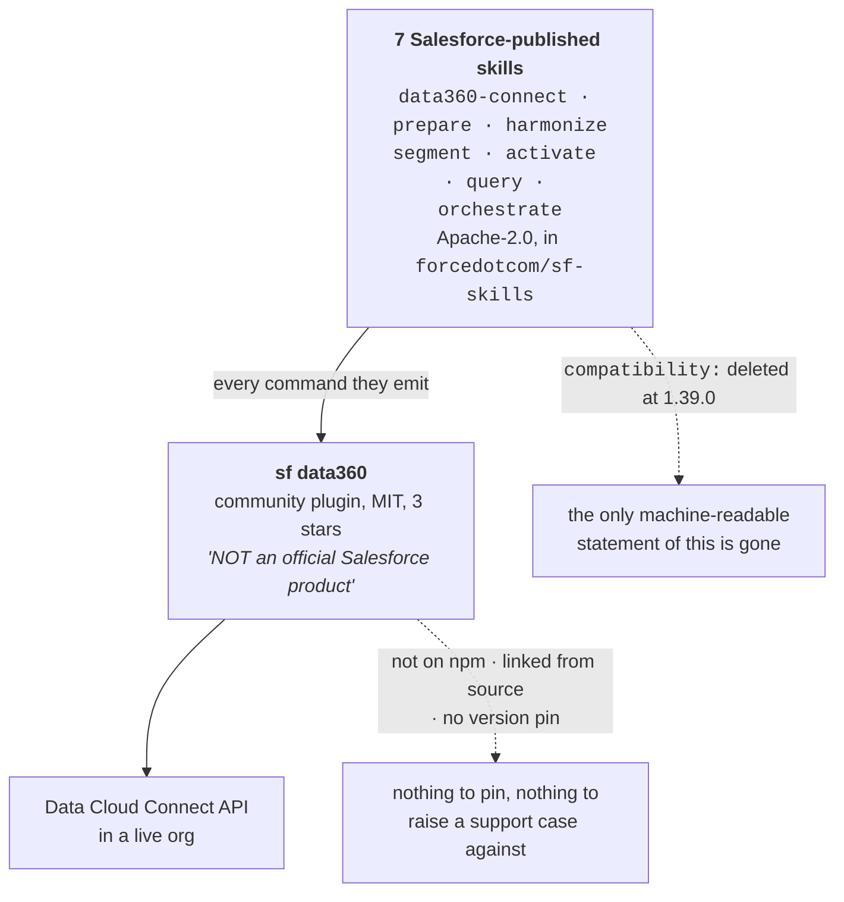
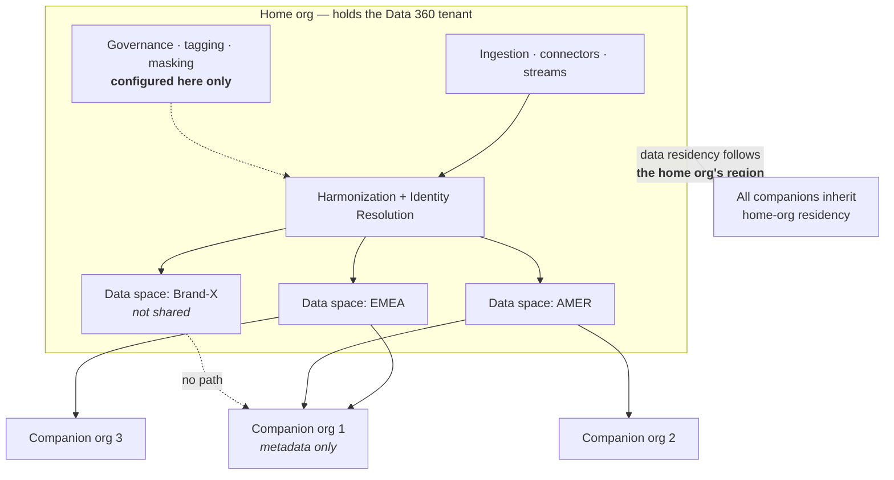
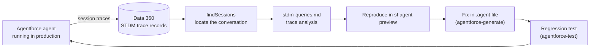
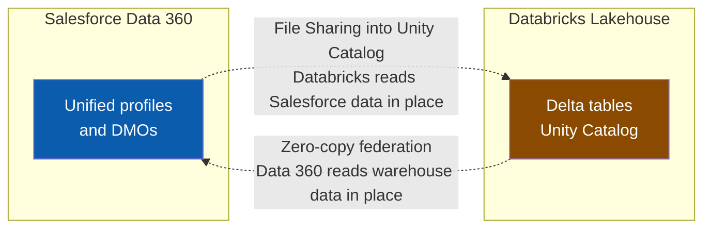

# Data 360 (formerly Data Cloud)

Newest entries at the top. Data 360 ships **monthly**, not per-seasonal-release — check the [monthly section of the release notes](https://help.salesforce.com/s/articleView?id=release-notes.rn_c360_truth.htm&release=262&type=5) regularly.

---

## 2026-08-21 · The promised "prebuilt Data 360 Skills" still have no artifact — a verified negative (cross-link)

The 08-19 announcement put **prebuilt Data 360 Skills at GA "targeted August 2026"**. Checked at **2026-08-22 03:00 UTC** against `sf-skills` **1.41.0** — the release that added 26 skills the previous afternoon:

- The `data360-*` family is unchanged at **nine skills**, seven of which still shell out to the community `sf data360` plugin.
- **No `mcpTools` block in any of the 164 skills names a Data 360 MCP server.**
- `forcedotcom/d360-mcp-server` has not moved since **2026-07-02** — 51 days.

Nine days of August remain. Context: [developer-tooling-and-apis.md](developer-tooling-and-apis.md#2026-08-21--sf-skills-1410--the-hosted-headless-360-dispatcher-goes-from-4-skills-to-14-and-one-skill-now-forbids-the-cli).

---

## 2026-08-19 · The official Code Extension plugin finishes moving off the Python binary — and `run` quietly changes how it authenticates

**What changed.** `@salesforce/plugin-data-code-extension` **1.4.0** (2026-08-18 15:43 UTC) and **1.4.1** (2026-08-19 15:11 UTC) port `deploy` and `run` off the `datacustomcode` Python console-script, completing the SDK CLI migration. `DatacodeBinaryExecutor` is deleted.

- **`deploy` is now native TypeScript** — Data Cloud REST plus a native zip and a **presigned-URL upload**, polling `deploymentStatus` with a terminal-failure fast-fail instead of shelling out.
- **`run` still needs Python**, but reaches it as `python -c` into `datacustomcode.run.run_entrypoint`, streaming output live.
- **`--dependencies` is comma-split**, overriding the package's `requirements.txt` for that run.
- **1.4.1 is a permissions fix, twice.** Zip dependency staging lost the executable bit; the fix switches to `fs.copyFile`.

**Why it matters.** This is the surface a Data 360 developer actually touches, and both halves changed underneath in two days. The consequential half is not the language port but the **auth model**: `run` now takes `--target-org`, and the commit states that **credential profiles and the `configure` / `auth` commands are intentionally not ported**. A pipeline built on a `datacustomcode` credential profile has no successor command here.

**Gotchas:**
- **`--target-org` replaces the credential profile, and nothing migrates it.** The commit message says the omission is deliberate (`@W-21769933@` / `@W-21770245@`), not pending.
- **1.4.0 shipped a packaging regression that only bites at runtime.** Anything relying on an executable file inside a staged dependency — a shell shim, a compiled helper — silently lost `+x` between 1.4.0 and 1.4.1. Pin **1.4.1**.
- **Python 3.11 remains a hard prerequisite for `run`.** The new `error.runProcessStartFailed` action text names it exactly: *"Verify Python 3.11 is installed and on your PATH"* and *"Reinstall the SDK with `pip install salesforce-data-customcode`"*.
- **A 403-shaped failure is not auth.** `error.runAuthenticationFailed` is a distinct message from `runExecutionFailed`; its remedy list ends with *"Verify the org has Data Cloud enabled and your user has the required permissions"*.
- **The package name has one hyphen more than the skills say.** `@salesforce/plugin-data-code-extension` — `@salesforce/plugin-data-codeextension`, printed four times in the `data360-code-extension-generate` references, does not exist. See the [2026-08-17 entry](#2026-08-17--the-seven-data360--skills-run-on-an-unofficial-community-cli-plugin--and-1390-deleted-the-line-that-said-so).

**Relevant to:** **Developer** — `deploy` and `run` both changed implementation in two days, `--target-org` replaces credential profiles, and 1.4.0 loses the executable bit on staged dependencies; **Architect** — a Data 360 Code Extension pipeline built on `datacustomcode` credential profiles has no ported successor, so the auth design has to move to org-based auth.

**Study action:** `sf plugins install @salesforce/plugin-data-code-extension@1.4.1`, then `sf data-code-extension script init` and `sf data-code-extension script run --entrypoint ./payload/entrypoint.py --target-org <alias>`. Confirm it never asks for a credential profile — that absence is the change.

**Status:** Shipped. **1.4.0** 2026-08-18, **1.4.1** 2026-08-19, npm `latest` **1.4.1** verified 2026-08-20 03:37 UTC. Not bundled in `sf` — install it explicitly.

**Sources:** [`plugin-data-code-extension` CHANGELOG](https://github.com/salesforcecli/plugin-data-code-extension/blob/main/CHANGELOG.md) · [commit `30184e6` — native TS port](https://github.com/salesforcecli/plugin-data-code-extension/commit/30184e69dca5f887cb8c68729553265198885f0e) · [PR #51 — preserve permissions](https://github.com/salesforcecli/plugin-data-code-extension/pull/51) · [npm `@salesforce/plugin-data-code-extension`](https://www.npmjs.com/package/@salesforce/plugin-data-code-extension)

---

## 2026-08-19 · Headless 360 expansion names Data 360 Skills for August GA (cross-link)

Salesforce's 2026-08-19 announcement puts a hosted **Data 360 MCP Server** (~200 APIs) and **prebuilt Data 360 Skills** at **GA targeted August 2026** — while `forcedotcom/d360-mcp-server` is untouched since 2026-07-02 and still says Developer Preview, and the `data360-*` skills you can install today run on the unofficial plugin described in the entry below. Full entry: [developer-tooling-and-apis.md](developer-tooling-and-apis.md#2026-08-19--salesforce-expands-headless-360--and-the-data-360-skills-it-says-go-ga-this-month-are-the-ones-running-on-a-3-star-personal-repo).

---

## 2026-08-17 · The seven `data360-*` skills run on an unofficial community CLI plugin — and 1.39.0 deleted the line that said so

**What changed.** At `sf-skills` **1.38.0**, all seven `data360-*` skills carried a top-level `compatibility:` string naming their prerequisite. **1.39.0** (2026-08-17) removed it from all seven; `compatibility` now appears **zero** times repo-wide. The dependency did not go away — `data360-query` alone still issues `sf data360 …` twelve times.

The deleted line, verbatim from `skills/data360-query/SKILL.md` at tag 1.38.0:

```yaml
compatibility: "Requires an external community sf data360 CLI plugin and a Data Cloud-enabled org"
```

- **The runtime is `github.com/Jaganpro/sf-cli-plugin-data360`** — MIT, 3 stars, 23 commits, **159 commands across 23 topics**. Its own README says it is *"NOT an official Salesforce product… unsupported, experimental… created for internal exploration and demo purposes."*
- **It is not on npm.** `sf plugins install` does not reach it. The documented path is `git clone` → `yarn install` → `npx tsc` → `sf plugins link .`, into `~/.sf-community-tools/datacloud/sf-cli-plugin-data360`.
- **There is no version to pin.** `references/plugin-setup.md` tells you to *"update the community runtime to the latest upstream commit"* for newer command families such as `sf data360 query hybrid`.
- **`sf-skills` states the arrangement deliberately:** *"sf-skills does not vendor or fork that plugin"* — it keeps the catalogue to "skills, prompts, docs, and templates" and lets the runtime evolve independently.



**Why it matters.** A capability that reads as first-party — Apache-2.0 skills in a `forcedotcom` repo, now shipped inside an official Claude Code plugin — bottoms out in one person's experimental side project. That is a supportability and supply-chain fact, not a detail. Deleting `compatibility:` removed the one place a reader or a tool could learn it without opening a reference file.

**Gotchas:**
- **The plugin has three different names.** Repo `Jaganpro/sf-cli-plugin-data360`; oclif package `@gthoppae/sf-cli-plugin-data360` (which is what the linked-ESM warning prints, and which is **not published to npm**); and an older clone path `gthoppae/sf-cli-plugin-data360` that a stale installer still tries.
- **The documented repair is a curl-pipe-to-python from a personal account** — `curl -sSL https://raw.githubusercontent.com/Jaganpro/sf-skills/main/tools/install.py | python3 - --with-datacloud-runtime`. Note `Jaganpro/sf-skills`, not `forcedotcom/sf-skills`.
- **`cliTools` cannot express this.** All seven skills declare only `node >=18.0.0` and `sf >=2.0.0`, so the fast-fail contract never covered the one prerequisite that actually blocks them.
- **`sf data360 doctor` is advisory, not a gate.** On partially provisioned orgs it fails while read-only Data Cloud commands still work; the skills fall back to `verify-plugin.sh` and `diagnose-org.mjs -o <org> --phase <phase> --json`.
- **A globally `sudo`-installed `sf` breaks the link** — the data directory ends up root-owned. Set `SF_DATA_DIR="${HOME}/.local/share/sf"` before `sf plugins link .`.
- **Separately, a real Salesforce plugin is misnamed in the docs.** `data360-code-extension-generate` uses the correct `@salesforce/plugin-data-code-extension` (npm, **1.4.0**) in `SKILL.md`, but `references/README.md` and `references/quick-reference.md` say `@salesforce/plugin-data-codeextension` **four times** — including in both "Plugin not found" troubleshooting tables. That package does not exist.

**Relevant to:** **Architect** — the automated Data 360 path depends on an unversioned, unsupported third-party plugin, which changes build-vs-buy and supportability assumptions for any delivery that leans on it; **Developer** — the exact repo, install path, package-name aliases and the four wrong `sf plugins install` lines you will otherwise hit.

**Study action:** run `sf plugins install @salesforce/plugin-data-codeextension` and watch it fail, then run it with the correct `@salesforce/plugin-data-code-extension` — you will have proved the doc bug in under a minute. Then open `skills/data360-orchestrate/references/plugin-setup.md` and decide, before a client does, whether `sf plugins link` from a 3-star repo belongs in your delivery.

**Status:** Shipped — the removal is `forcedotcom/sf-skills` **1.39.0**, 2026-08-17 09:37:27 UTC (commit `b12ff20`, "Release 25 skills updated"), unchanged through **1.40.0**. Verified against tag 1.38.0 and a clone of `main` at 2026-08-19 03:26 UTC. The community plugin is **unsupported and experimental by its own README**; `@salesforce/plugin-data-code-extension` is a genuine Salesforce package at **1.4.0**.

**Sources:** [`plugin-setup.md`](https://github.com/forcedotcom/sf-skills/blob/main/skills/data360-orchestrate/references/plugin-setup.md) · [`data360-query/SKILL.md` at 1.38.0](https://github.com/forcedotcom/sf-skills/blob/1.38.0/skills/data360-query/SKILL.md) · [`Jaganpro/sf-cli-plugin-data360`](https://github.com/Jaganpro/sf-cli-plugin-data360) · [npm `@salesforce/plugin-data-code-extension`](https://www.npmjs.com/package/@salesforce/plugin-data-code-extension) · [sf-skills CHANGELOG](https://github.com/forcedotcom/sf-skills/blob/main/CHANGELOG.md)

---

## Naming: "Data Cloud" vs "Data 360" — get this straight

Salesforce began calling Data Cloud **"Data 360"** at Dreamforce 2025 (Oct 14, 2025), positioning it inside the **Agentforce 360** platform umbrella. Underlying product, licence, integrations and data model are unchanged. Salesforce's own developer documentation now consistently writes "Data 360."

**The rename is real, not just marketing.** Salesforce's own pricing calculator is branded **"Data 360 (Formerly Data Cloud)"**, there is a **Data 360 Starter** SKU (~$60k/yr) plus a $0 Provisioning (Everywhere) SKU, the Summer '26 release-notes section is titled **Data 360**, and the certification is now the **Salesforce Certified Data 360 Consultant**. A minority of analysts still call it positioning-only — safe to disregard, but check a current price book before writing a specific SKU into a contract.

**Lineage, for context** — this is the sixth name: Customer 360 Audiences → Salesforce CDP → Marketing Cloud CDP → Salesforce Genie → Salesforce Data Cloud → Data 360.

**The real shift isn't the name.** It's the repositioning from *passive customer data store* to *active context engine that grounds AI agents*. Every 2026 feature below follows from that.

---

## 2026-08-11 · The `data360_*` tools are a dispatcher over a generated action registry (cross-link)

The eleven `data360_*` tools in `sf-pi`'s `sf-data360` extension are **not eleven endpoints** — they are family tools over one shared action registry, called with an action string (`stream.create_ingest_api`, `sql.verify_rows`) plus `params`, `target_org`, `dry_run` and `allow_confirmed`.

- **Action names live in a generated-but-committed map**, `extensions/sf-data360/registry/v2/actions.json`, with exactly one owner per operation.
- **Headless destructive execution needs both `SF_PI_D360_V2_SWEEP_MUTATION_TARGET_ORG` and `D360_V2_SWEEP_ALLOW_DESTRUCTIVE`**, plus a non-production target and a run-ID-scoped resource name.

Full entry: [developer-tooling-and-apis.md](developer-tooling-and-apis.md#2026-08-11--the-eleven-data360_-tools-are-one-dispatcher-over-a-generated-action-registry--and-the-legacy-facade-loses-its-live-proof-claim).

---

## 2026-08-11 · `sf-data360` raw REST calls must drop the version segment (cross-link)

`sf-pi` **v0.263.0** rejects caller-owned `/services/data/vNN.N/…` resource paths from the `data360_api` escape hatch and its siblings — pass a **versionless** path and let `lib/common/sf-conn/path.ts` version it against whatever the org advertises. Same release stops `sf-data360` falling back to JSforce's `50.0` and fails the call instead. Full entry: [developer-tooling-and-apis.md](developer-tooling-and-apis.md#2026-08-11--sf-pi-deletes-the-500-fallback--one-connection-module-and-the-orgs-advertised-api-version-outranks-your-config).

---

## 2026-08-09 · `sfsqlquery` — Data 360 SQL from Apex finally has a namespace, five classes and three shapes

**What changed.** The **Winter '27** release notes add the **`sfsqlquery`** Apex namespace for executing **Data 360 SQL** queries. This study base has recorded *"SQL from Apex (Summer '26)"* in five places with **no named class anywhere** — this is the surface behind that sentence, and the docs call it the **recommended** way to query Data 360 from Apex.

**Five classes:**

- **`SqlStatement`** — executes a new query.
- **`SqlRowIterator`** — iterates the result set.
- **`Row`** — one row, with typed accessors (`getString`, `getInteger`, …).
- **`QueryHandle`** — fetches the results of a query executed earlier.
- **`SqlQueueable`** — runs the query asynchronously for large datasets.

**Three workflows, and picking the wrong one is the whole design decision:**

| Shape | Chain | Use when |
|---|---|---|
| Synchronous | `SqlStatement` → `SqlRowIterator` → `Row` | The query is small and the caller is waiting |
| Re-fetch | `QueryHandle` → `SqlRowIterator` → `Row` | The query already ran; you want its results again |
| Asynchronous | `SqlQueueable` → `SqlRowIterator` → `Row` | Large result sets, or anything that could outlive a transaction |

**Relevant to:** **Developer** — a new first-party namespace replaces HTTP callouts to the Direct API as the Apex path into Data 360; **Architect** — the async shape and its queueable stack ceiling decide whether an agent action can compute live aggregates at all, or must fall back to a scheduled insight.

**Why it matters.** SOQL cannot express the joins, aggregations and window functions lakehouse work needs, so the honest previous answer was *"call the Direct API over HTTP from Apex"* — with the callout limits, retry code and mock-in-tests burden that implies. A typed namespace with an iterator removes that whole layer.

The consequence for agents is the interesting one. An Apex-backed agent action can now compute a rolling aggregate **at the moment the agent asks**, rather than reading an insight refreshed on someone else's schedule. That moves grounding from *recently true* to *true now* — which is precisely the failure mode Accelerated Data Ingest addressed on the ingestion side.

**Gotchas:**
- **`SqlQueueable` inherits the queueable chain ceiling — stack depth caps at 50 in production.** A poll-until-complete loop *is* a chain. Budget it, or the fiftieth poll throws.
- **A synchronous `SqlStatement` is not a promise of results.** Long-running queries need polling, an explicit status check for failure, and retry logic. Validate with a `LIMIT` clause before running the real thing.
- **The dataspace trap carries straight over.** Omit the dataspace on a DLO query and you get **zero rows, silently, with no error** — the same trap as `SET OPTIONS` in SOQL. See [`SET OPTIONS`](#2026-07-26--set-options-clause-in-soql).
- **`Row` accessors are typed.** `getString` on an integer column fails at runtime, not at compile time — there is no schema to check against.
- **Two different things are both called "SQL from Apex."** The Summer '26 capability and this Winter '27 namespace are the feature and its API. Search on `sfsqlquery`, not on the phrase.

**Study action:** in a Data 360-enabled dev org, write one Apex class that runs the *same* aggregate query three ways — `SqlStatement` synchronously, then re-fetch it via `QueryHandle`, then `SqlQueueable` — and log `Limits.getCpuTime()`, `Limits.getHeapSize()` and the row count for each. Then re-run the DLO query with the dataspace omitted and confirm it returns zero rows rather than an error.

**Status:** Announced in the **Winter '27** release notes (live as of **2026-08-09**); documented in the Data 360 Query Guide as the recommended Apex query path. Verify availability against your org's release before building on it.

**Sources:** [Query Data 360 Data with Apex](https://developer.salesforce.com/docs/data/data-cloud-query-guide/guide/dc-apex-query.html) · [Data 360 In Apex — Apex Developer Guide](https://developer.salesforce.com/docs/atlas.en-us.apexcode.meta/apexcode/DataCloudInApex.htm) · [Data 360 SQL Reference](https://developer.salesforce.com/docs/data/data-cloud-query-guide/references/dc-sql-reference/syntax.html) · [Salesforce Winter '27 Release Notes](https://help.salesforce.com/s/articleView?id=release-notes.salesforce_release_notes.htm&language=en_US) · study-base cross-ref: [SQL from Apex](../01-data-cloud/03-data-modeling-dso-dlo-dmo/notes.md)

---

## 2026-08-09 · `sf-pi` ships an `sf-data360` agent-tool extension (cross-link)

`salesforce/sf-pi` carries a **default-enabled** `sf-data360` extension exposing **eleven `data360_*` LLM tools** — discover, connect, prepare, harmonize, segment, activate, query, semantic, observe, orchestrate, plus a `data360_api` REST escape hatch — with **no MCP runtime involved**. It is a different artifact from the [Data 360 MCP Server](#2026-07-26--data-360-mcp-server-developer-preview--moved). Full entry: [developer-tooling-and-apis.md](developer-tooling-and-apis.md#2026-08-09--sf-pis-sf-data360-extension--eleven-data-360-tools-and-no-mcp-runtime-in-sight).

---

## 2026-08-08 · Gap check — Data Cloud One, the multi-org architecture this radar never recorded

**What changed.** Nothing shipped. This entry exists because Data 360 produced **no product news for the sixth consecutive scan**, so the run spent itself on a gap check — and found that **"Data Cloud One" has zero mentions anywhere in this study base**, despite being the recommended pattern for any customer with more than one Salesforce org.

- **One Data 360 instance, many orgs.** One org is the **home org** and holds the Data 360 tenant. Others attach as **companion orgs**.
- **All ingestion is central.** Data streams, connectors, identity resolution, harmonization, governance policies, tagging and masking are configured **only in the home org**.
- **Data spaces are the sharing unit.** A [dataspace](../GLOSSARY.md) is the logical partition holding DLOs, DMOs, identity-resolution rulesets, segments and activation targets. You choose which data spaces a companion org sees.
- **Companions get metadata, not data.** The records stay in the home org's tenant; companion orgs consume the model and the unified profile through it.
- **Three companion connections are included**; more require add-on licensing.



**Why it matters.** The instinct when a client has five orgs is to ask which one "owns" Data 360, or to propose five instances. Data Cloud One is the answer to both, and it reframes the question: you are not choosing an owner, you are **choosing a partition boundary**.

That choice is close to irreversible. Data spaces cannot share a customer graph across the boundary, so drawing the line by brand when the real requirement was by region means rebuilding identity resolution later.

And it turns a data-residency question into an architecture question: **companion data lives in the home org's region**, whatever the companion's own region is. For an EU subsidiary attached to a US home org, that is the whole conversation.

**Gotchas:**
- **Sandbox and production do not cross.** A sandbox home org can only pair with sandbox CRM orgs; a production home org only with production orgs. Plan the SDLC topology in both tiers or you cannot test the connection at all.
- **Residency follows the home org, not the companion.** This is the trap that disqualifies the pattern outright for some EU/UK-regulated subsidiaries — separate instances are then the correct answer, not the lazy one.
- **Three companion connections are included in the implementation**; the fourth is a commercial conversation, not a config change.
- **Companion users see a subset of Data 360 functionality** via the Data Cloud One app — do not promise a companion-org admin the full Setup surface.
- **A data space is not an access-control mechanism.** Use it only for boundaries that must never be crossed — distinct legal entities, incompatible residency regimes. For "different teams see different data", use permission sets and feature permissions and keep the unified profile intact.
- Recall the existing SOQL trap this compounds: **a query against a DLO must name its dataspace** (`SET OPTIONS`) or it silently returns zero rows. In a multi-space org that failure mode gets much easier to hit.

**Study action:** in a Developer Edition org with Data 360 provisioned, open **Setup → Data 360 Setup → Data Spaces**, create a second data space, then run the same DLO query with and without a `SET OPTIONS` dataspace clause and record which one returns zero rows. Then write down, for an org estate you actually know, whether the boundary you would draw is brand, region or legal entity — and what breaks if you pick wrong.

**Status:** GA. Data Cloud One has been generally available since 2024 and carries into Data 360 unchanged; the name has not been rebranded to "Data 360 One" in first-party docs as of 2026-08-08.

**Sources:** [Data 360 Provisioning decision guide](https://architect.salesforce.com/docs/architect/decision-guides/guide/data-360-provisioning) · [Connect Multiple Orgs with Data Cloud One (Trailhead)](https://trailhead.salesforce.com/content/learn/modules/data-cloud-one-quick-look/connect-multiple-orgs-with-data-cloud-one) · [Data Cloud One setup and architecture (Trailhead)](https://trailhead.salesforce.com/content/learn/modules/data-cloud-one-quick-look/get-started-with-data-cloud-one) · [Data Cloud One now generally available (Salesforce Ben)](https://www.salesforceben.com/data-cloud-one-now-generally-available-connect-multiple-orgs-with-clicks-not-code/)

---

---

## 2026-08-07 · The Summer '26 "semi-joins" feature is CRM Analytics, not Data 360 — one open question closed

_Data 360 gap check, run because the window was empty for a sixth consecutive scan. This removes an item from the radar rather than adding one._

**What changed.** Nothing shipped. The **08-01 open question** listed three Summer '26 features named in release notes and absent from this study base, one of them *"identify duplicate and non-matching rows without coding"* — a no-code **semi-join / anti-join** builder, suspected of belonging to **CRM Analytics** rather than Data 360. **The suspicion was correct.**

- The documentation page is **`analytics.bi_explorer_data_join.htm`** — the `analytics` namespace, not `data`.
- Its title is **"Optimize Data Operations with Semi and Anti Joins (Beta)"** — **Beta**, contradicting the "GA in Summer '26" the release-note summary implied.
- The UI path is a **CRM Analytics lens** → **Add** → **Join Data Source (BETA)**. Lenses are a CRM Analytics construct; Data 360 has no lens.

**Three distinct things share this vocabulary**, which is why search conflates them:

| Thing | Where it lives | What it is |
|---|---|---|
| **Semi/anti joins in a lens (Beta)** | CRM Analytics Data Explorer | No-code join builder — **this release-note item** |
| **`join semi` / `join anti`** | SAQL | CRM Analytics query language, long-standing |
| **`IN` / `NOT IN` subqueries** | SOQL, and GraphQL API filter joins | Platform semi/anti-join, years old |

**Why it matters.** A radar that records a feature under the wrong product is worse than one that records nothing — it plants a false capability in a design conversation, and Data 360 has been quiet enough this month that a plausible-looking item would not get challenged. Closing an open question as *"not ours, and Beta not GA"* is a real result.

It also names the trap: **Data 360 and CRM Analytics share both a vocabulary and a release-notes neighbourhood.** Joins, lenses, dashboards and query performance all appear under both. Check the **doc page ID namespace** — `data.` versus `analytics.` — before believing a product attribution.

**Gotchas:**
- **`analytics.` in a `help.salesforce.com` article ID means CRM Analytics.** Data 360 pages are `data.` or `release-notes.rn_c360_*`. This is the cheapest available attribution check.
- SOQL semi-joins have existed for years (`SELECT Id FROM Account WHERE Id IN (SELECT AccountId FROM Opportunity)`). Someone citing "new semi-join support" may mean any of the three rows above.
- **Still unresolved and still Data 360:** *Currency Reporting* and *Result Reuse for Data 360 Live*. Both remain title-only; `help.salesforce.com` returned **403** again on 2026-08-07 03:2x UTC, so no technical detail was obtainable. They stay open questions — **deliberately not written up**.

**Study action:** open the Summer '26 Data 360 release notes in a browser (not a fetcher) and, for each feature title, read the article ID in the URL. Write down how many sit in the `analytics.` namespace. That count is how much of "Data 360's release" is not Data 360.

**Status:** **Correction to this radar's own open questions, not a product change.** The lens-based semi/anti join builder is **Beta** in CRM Analytics Data Explorer. Sourced from search extracts of the help article — `help.salesforce.com` is 403 to automated fetching, so the Beta label is read from the article **title**, not the body.

**Sources:** [Optimize Data Operations with Semi and Anti Joins (Beta)](https://help.salesforce.com/s/articleView?id=analytics.bi_explorer_data_join.htm&language=en_US&type=5) · [SAQL `join semi` / `join anti`](https://developer.salesforce.com/docs/atlas.en-us.bi_dev_guide_saql.meta/bi_dev_guide_saql/bi_saql_statement_join_semi_anti.htm) · [GraphQL semi-join and anti-join filters](https://developer.salesforce.com/docs/platform/graphql/guide/filter-joins.html) · open question raised in [README](README.md#open-questions-to-chase)

---

## 2026-08-05 · Data 360 zero-copy is the IL5 grounding story (cross-link)

Salesforce's IL5 announcement names **Data 360 as the grounding layer**, connecting to sensitive records *where they live* so data is *"never copied, moved, or duplicated outside its secure boundary."* Zero-copy stops being a cost-and-freshness argument and becomes a **classification-boundary** argument. Full entry: [trust-security-and-governance.md](trust-security-and-governance.md#2026-08-05--agentforce-360-is-il5-authorized--agents-on-cui-inside-a-govcloud-boundary).

**No new Data 360 technical surface shipped with it** — no API, no connector, no release-note change. This is positioning, recorded because it is the strongest public statement yet of *why* zero-copy federation exists.

---

## 2026-08-01 · The Data 360 grounding reference app is renamed — NextGenWealth is now Agentic Advisor

**What changed.** [`salesforce/next-gen-wealth`](https://github.com/salesforce/next-gen-wealth) — Salesforce's Apache-2.0 Financial Services Cloud reference app, and the only public worked example of Data-360-grounded prompt templates this radar has found — **renamed itself from NextGenWealth to Agentic Advisor** on 2026-08-01 (commit `79d77b4`, PR #15, work item `@W-23668628`). README and skill text changed with it.

**Why it matters.** Nothing technical shipped, but the app is the one place you can read a *shipped* answer to the question the July 30 scan raised: **what does a grounded prompt template say when its grounding returns nothing?** Its Client Pulse templates answer that with an explicit fail-safe message. Knowing the app's current name is what keeps that example findable.

**Gotchas:**
- The **repository slug is still `next-gen-wealth`** — only the product name moved. Search for "Agentic Advisor" and you will not find the repo; search the old slug and you will not find the docs.
- The Client Pulse templates exist in **two variants**, household (`HH`) and `PersonAccount`. A change applied to one is not applied to the other — both PRs on July 29 had to be raised separately.

**Study action:** clone it and read the two Client Pulse prompt templates side by side, then open one prompt template of your own and write down what it emits when its Data 360 retriever returns zero rows. If the answer is "whatever the model invents", that is the gap.

**Status:** Open source, Apache-2.0. Reference app, **not a supported product** and not on a release train. Rename landed 2026-08-01.

**Sources:** [`salesforce/next-gen-wealth`](https://github.com/salesforce/next-gen-wealth) · [commit history](https://github.com/salesforce/next-gen-wealth/commits/main) · [PR #15](https://github.com/salesforce/next-gen-wealth/pull/15) · prior detail in scan note [02-data-cloud/2026-07-30](02-data-cloud/2026-07-30.md)

---

## 2026-07-31 · Data 360 is the observability backend for Agentforce — and `agentforce-observe` names the query path

**What changed.** The `agentforce-observe` skill (**0.8**, shipped in `forcedotcom/sf-skills` 1.33.0) exists to *"analyze production Agentforce agent behavior using session traces and Data Cloud."* Its trigger list is the informative part: it fires on querying **STDM** session data or Data 360 trace records, on investigating production agent failures or regressions, and on `findSessions` or trace-analysis queries.

**STDM** is Salesforce's **Standard Data Model** — the prebuilt schema Data 360 uses so data from different sources lands in a shape the platform already understands, instead of one you map by hand each time.

**Why it matters.** When an agent runs in production, what it did — which actions fired, what it retrieved, where it stalled — is written as **session trace records into Data 360**. That makes Data 360 the observability backend for the whole agent platform, not merely a customer-data store: **the debugging loop for a misbehaving agent is a Data 360 query.**

This skill is the closest thing to a public, executable statement of what that query looks like.

**The boundary the skill draws is a good map of the tooling**, and it splits by *environment*, not activity:

| Situation | Tool |
|---|---|
| Authoring or debugging `.agent` files during development | `agentforce-generate` |
| Writing test specs, pre-deployment | `agentforce-test` |
| Production behaviour reconstructed from Data 360 traces | `agentforce-observe` |



So when someone reports that an agent "did something weird yesterday," the answer is **Data 360, not preview**.

**Gotchas:**
- The skill declares **`sf >= 2.136.8`** as its CLI floor.
- Its reference file is **`stdm-queries.md`** (added in the 2026-07-30 `agentforce-adlc` sync) plus an `assets/apex/` tree; **`findSessions`** is the documented entry point for locating a conversation before analysing it.
- Take it from **`forcedotcom/sf-skills`** (Apache-2.0), not `agentforce-adlc` (CC BY-NC 4.0) — see [pricing-and-certification.md](pricing-and-certification.md#2026-08-01--the-same-agentforce-skills-ship-under-two-licences--only-one-permits-client-work).
- **Data 360 surfaces increasingly ship under Agentforce labels.** Scanning only Data-360-named sources misses the parts practitioners touch daily — this entry is the proof.
- **Untouched in 1.33.0:** `data360-connect`, `data360-activate`, `agentforce-d360-analyze`. Those three are the ones to watch; a release that moves them signals a real change in ingestion, activation or analysis behaviour.

**Study action:** open `skills/agentforce-observe/references/stdm-queries.md` and write down the STDM trace object names by hand — that schema is what your incident response runs on, and there is no equally concrete public description of it.

**Status:** Skill update **`agentforce-observe` 0.8**, in `forcedotcom/sf-skills` **1.33.0, 2026-07-31**, Apache-2.0. Salesforce-maintained open source, **not a Data 360 product release** — no GA/Beta designation, no release train. The **skill version did not change** from the copy synced into `agentforce-adlc` on 2026-07-30; only the release carrying it is new.

**Sources:** [`agentforce-observe` SKILL.md](https://github.com/forcedotcom/sf-skills/blob/main/skills/agentforce-observe/SKILL.md) · [forcedotcom/sf-skills](https://github.com/forcedotcom/sf-skills) · [releases](https://github.com/forcedotcom/sf-skills/releases) · [PR #47 — sync from sf-skills, agentforce-adlc](https://github.com/SalesforceAIResearch/agentforce-adlc/pull/47)

---

## 2026-07-30 · The Python Data 360 connector: v1 deprecated, v2 still beta

[`salesforce-cdp-connector`](https://github.com/forcedotcom/salesforce-cdp-connector) — the **read-only Python client** most people use to query Data 360 and pull results into **pandas** — states plainly: *"This package is deprecated and will be removed once `salesforce-datacloud-connector` reaches GA."* The replacement, **`salesforce-datacloud-connector` 2.0.0b1**, landed alongside it on **June 2, 2026** and is a **pre-release**: `pip install --pre salesforce-datacloud-connector`, because pip won't resolve a beta without the flag. **No GA date is published.** On **July 29, 2026** maintainers broadened v1 CI to run on all PRs — reassuring for the gap, not a promise.

Auth covers JWT, username/password, OAuth token and client credentials, and you can target a **non-default dataspace** at connection time — remember that one, because querying the wrong dataspace returns a confidently **empty result**, not an error.

**Why it matters.** This is the standard route for notebook analysis, feature engineering and anything putting Data 360 data next to a training loop. New work should take v2 with `--pre`; existing scripts should **pin v1 explicitly and budget a migration**. General rule for this ecosystem: **a package rename usually carries a support-status change** — `cdp` → `datacloud` tracks CDP → Data Cloud → Data 360, and the rename is the tell that a lifecycle boundary is close.

**Also, on deploys:** `@salesforce/source-deploy-retrieve` **13.0.0** (July 29, 2026) requires **Node ≥ 22** and drops Node 18/20. SDR is what `sf project deploy` runs, so **any pipeline deploying Data 360 metadata** — streams, DLOs/DMOs, mappings, transforms, identity resolution, data kits — inherits that floor. It installs on Node 20 with only an `EBADENGINE` warning, then fails later in ways that look like metadata errors.

Full write-up: [02-data-cloud/2026-07-30](02-data-cloud/2026-07-30.md).

---

## 2026-07-28 · Summer '26 ingest and federation status changes

Three status changes that decide what you can put in production versus only prototype:

| Capability | Status |
|---|---|
| **Accelerated Data Ingest** — real-time CRM data into Data 360, no pipeline delay | **GA** |
| **AWS Glue Data Catalog** federation | **GA** |
| **Microsoft Fabric OneLake** federation | **Beta** |
| **Databricks** file federation connector — identity-provider (IdP) authentication | Summer '26 |
| **Run SQL from Apex** against Data 360 | Summer '26 |

**Why Accelerated Data Ingest matters most.** Scheduled ingestion meant Data 360's copy of a Case or Opportunity always lagged the live CRM record. Tolerable for analytics; fatal for agents, which then answer confidently from stale state. This removes the most common cause of a "the agent was wrong" ticket that turns out not to be a model problem at all — and it removes the workaround of bypassing Data 360 to call CRM directly from an action, which cost you the unified profile and its governance.

**Read the Beta label literally.** Fabric OneLake federation is fine to prototype and demo; it carries no support commitment and must not become load-bearing in a delivery plan. AWS Glue at GA is proposal-safe. The Databricks IdP change is a **security-review unlock** — "can we govern this connection centrally?" is the question that stalls zero-copy projects.

**SQL from Apex** removes the impedance mismatch: SOQL can't express the joins, aggregations and window functions that lakehouse work needs, and the alternative was HTTP callouts to the Direct API. An Apex-backed Agentforce action can now compute a rolling aggregate or multi-table join in one query. Same trap applies as with `SET OPTIONS` below — **specify the dataspace for DLO queries or get zero records, silently.**

Sources: [Developer's Guide to Summer '26](https://developer.salesforce.com/blogs/2026/06/the-salesforce-developers-guide-to-the-summer-26-release) · [Data 360 in Summer '26: New Connectors, Document AI, and Real-Time Ingest](https://agentexchange.in/blog/data-360-summer-26) · [Zero Copy Connectivity](https://www.salesforce.com/data/connectivity/zero-copy/)

> **Unverified — do not rely on:** *Context Indexing* was reported in June 2026 as expected to reach GA "later in July 2026." No confirmation of that GA could be found as of 2026-07-28. Treat its status as open. Same for the precise status of *Document AI upgrades* and *secondary indexes*.

---

## 2026-07-26 · `SET OPTIONS` clause in SOQL

A new [`SET OPTIONS` clause](https://developer.salesforce.com/docs/atlas.en-us.soql_sosl.meta/soql_sosl/sforce_api_calls_soql_select_set_options.htm) lets SOQL queries specify a Data 360 **dataspace** and control `NULL` / empty-string handling. The clause goes at the **very end** of the query.

Two rules that will bite you:

- **Dataspace is required for DLO queries.** Omit it and the query silently returns **zero records** — not an error. This is the kind of failure that costs an afternoon.
- **`honorEmptyStrings = true`** makes Data 360 treat `NULL` and `''` as distinct values. The default (`false`) collapses them the way Salesforce Platform objects do.

**Why it matters.** Data lake objects don't share Platform object semantics. `SET OPTIONS` is the seam where that difference becomes explicit, and the empty-string default is a classic source of wrong-but-plausible query results.

---

## 2026-07-26 · Code Extension — run Python inside Data 360

[Code Extension](https://developer.salesforce.com/docs/data/data-cloud-code-ext/guide/use-custom-code.html) deploys custom **Python** scripts and functions that run in isolated containers on the platform. Current supported uses:

- Functions for complex **batch data transformations** — string manipulation, custom computations, data cleansing.
- Scripts implementing **custom chunking logic** on search index creation.

Salesforce says other Data 360 capabilities and languages will follow.

**Workflow.** Author and debug locally using the project scaffold from the [Data Custom Code Python SDK](https://pypi.org/project/salesforce-data-customcode/) plus the [Salesforce CLI Code Extension plugin](https://developer.salesforce.com/docs/data/data-cloud-code-ext/guide/set-up-sdk.html). Validate against a sandbox with the CLI, deploy, run, then monitor via the new **code extensions log DLO**. Developers author the code; users with the **Data Cloud Architect** permission set run and monitor it. Salesforce recommends the [code extension Agent Skill](https://github.com/forcedotcom/sf-skills/tree/main/skills/developing-datacloud-code-extension) and the Data 360 MCP server to automate the build/debug/deploy loop. [Demo video](https://www.youtube.com/watch?v=96PC1KSnmfk).

**Why it matters.** Custom chunking logic is the headline for anyone doing RAG. Chunking strategy is usually the single biggest lever on retrieval quality, and until now it was a black box. Also note the separation of duties baked into the permission model — author ≠ operator.

---

## 2026-07-26 · Deploy code extensions with data kits

A DevOps **data kit** can now move [code extensions](https://help.salesforce.com/s/articleView?id=release-notes.rn_cdp_2026_summer_code_extension_data_kit.htm&release=262&type=5) — or the data transforms built from them — from sandbox to production. Adding such a transform to a data kit automatically pulls in its associated code extension.

**Why it matters.** Data 360 logic can now be promoted through a CI/CD pipeline the same way Apex and LWC metadata are. This closes one of the more painful gaps in Data Cloud DevOps.

---

## 2026-07-26 · Data 360 MCP Server (Developer Preview) — moved

> **Correction (2026-08-01):** this item was written up **twice** — here and, more fully, in `developer-tooling-and-apis.md` dated 2026-07-29 — and the two copies disagreed on operation count and preview constraints. Per the routing table, MCP servers are canonically **developer tooling**. The full entry now lives there; nothing has been deleted, only reconciled.

Canonical entry: [developer-tooling-and-apis.md → Data 360 MCP Server](developer-tooling-and-apis.md#2026-07-29--data-360-mcp-server--200-rest-operations-behind-three-facade-tools). The separate **Data 360 standard hosted MCP server** (GA, queries and graph traversal) is in the same file.

---

## 2026-07-26 · Integration tests for Data 360 and Agentforce (Developer Preview)

The new `@IntegrationTest` Apex annotation allows **live callouts** and mid-transaction data commits via `IntegrationTest.commitTestOnly()`, with cleanup in a `@TearDown` method. Standard unit tests mock every callout and roll everything back, which makes asserting on real Agentforce or Data 360 behaviour impossible.

Constraints: **scratch orgs only**; add `ApexIntegrationTests` to the `features` array in the scratch org definition; tests run asynchronously, one at a time, via the Tooling API `runTestsAsynchronous` resource.

**Why it matters.** "You can't really test it" was a legitimate objection to grounding-heavy designs. This is the beginning of an answer — though scratch-org-only keeps it out of most real pipelines for now.

---

## 2025-10 · Databricks reads Data 360 in place — Unity Catalog file sharing

_Background gap-fill, routed here 2026-08-01: this had lived only in a dated scan note ([02-data-cloud/2026-07-27](02-data-cloud/2026-07-27.md)), which is the wrong home for a durable architectural distinction._

**What changed.** **Salesforce Data 360 File Sharing into Databricks Unity Catalog** lets Databricks query Data 360 objects **directly, in place**, on Databricks compute — no ingestion pipeline, no duplicated copy.

Two terms first. **Unity Catalog** is Databricks' governance layer for data and AI assets. **Lakehouse Federation** is the Databricks feature that queries external systems as if they were native tables. Salesforce exposes Data 360 objects as shared files; Unity Catalog registers them; Databricks SQL reads the underlying files rather than round-tripping an API per query.

**The distinction to hold — and the one people get backwards in design reviews:**

| Mechanism | Direction | Who reads whose data |
|---|---|---|
| **Zero-copy federation** (Data 360's own) | *Outward* | Data 360 queries Snowflake / BigQuery / Databricks / Redshift where that data lives, so **agents** can be grounded in warehouse data without importing it |
| **Unity Catalog file sharing** | *Inward* | The **data scientist's** Databricks notebook reads Salesforce-resident data without exporting it |



**Why it matters.** Same principle — do not move the data — in opposite directions of travel. Most real programmes need both, and the live design question is **which system owns which join**. Get the direction wrong and you will architect an ingestion pipeline that neither side needed.

**Gotchas:**
- Authentication is **IAM Workload Identity Federation** — secretless, so no long-lived API key is stored on either side. This is usually what gets the connection through security review.
- Databricks documents it separately for **AWS, Azure and Google Cloud**; the Azure page lives on Microsoft Learn, not on `databricks.com`.
- Databricks' own docs still use the **`salesforce-data-cloud-file-sharing`** path slug — the product rename to Data 360 has not reached the URLs.
- Do not confuse this with the **Databricks file-federation connector's IdP authentication**, a *separate* Summer '26 change on the outward path (see the 2026-07-28 entry above).

**Study action:** in a design doc for any Salesforce + lakehouse programme, draw the two arrows above and label each with the consumer — agent or notebook. If you can only justify one arrow, you have found either an unnecessary pipeline or a missing one.

**Status:** **GA since October 2025**; public preview **2025-06-05**. Documented for Databricks on AWS, Azure and Google Cloud. `databricks.com` returns HTTP 403 to automated fetching, so the announcement post was read via search extract, not first-party retrieval; the three Lakehouse Federation doc pages corroborate it.

**Sources:** [Announcing Public Preview: Salesforce Data 360 File Sharing in Unity Catalog (Databricks)](https://www.databricks.com/blog/announcing-public-preview-salesforce-data-360-file-sharing-unity-catalog) · [Lakehouse Federation for Salesforce Data 360 File Sharing — AWS](https://docs.databricks.com/aws/en/query-federation/salesforce-data-cloud-file-sharing) · [— Azure](https://learn.microsoft.com/en-us/azure/databricks/query-federation/salesforce-data-cloud-file-sharing) · [— Google Cloud](https://docs.databricks.com/gcp/en/query-federation/salesforce-data-cloud-file-sharing)

---

## Platform capabilities to know (current baseline)

**Intelligent Context** — automatically extracts and structures unstructured documents (PDFs, tables, images, flowcharts) into grounding data via a low-code pipeline. The distinctive bit: you can configure context so the same content is interpreted from **multiple business perspectives**. Create a search index with AI, then activate it everywhere.

**Tableau Semantics / semantic layer** — standardizes metric definitions and translates data into business language, so an agent asking "what was churn last quarter" gets the company's definition of churn rather than inventing one. Related: **OSI**, a vendor-neutral YAML-based open-source standard for interoperable semantic models, metrics and relationships; core spec finalized February 2026.

**Zero-Copy federation** — query data where it lives (Snowflake, BigQuery, Databricks, Amazon Redshift and others) with no physical movement, duplication or reconciliation jobs.

**Why these matter together.** They're the three legs of "grounding at enterprise scale": unstructured content (Intelligent Context), agreed meaning (semantic layer), and reach without copying (zero-copy). An agent answer is only as trustworthy as the weakest of the three.

---

## Sources

- [The Salesforce Developer's Guide to the Summer '26 Release](https://developer.salesforce.com/blogs/2026/06/the-salesforce-developers-guide-to-the-summer-26-release)
- [Salesforce Summer '26 Release Notes](https://help.salesforce.com/s/articleView?language=en_US&id=release-notes.salesforce_release_notes.htm)
- [Build Trusted Semantic Layers for AI Agents with Data 360](https://www.salesforce.com/blog/semantic-layer-ai-agents-data-360/)
- [Architectural Lessons: The Salesforce Customer Zero Implementation of Data 360](https://www.salesforce.com/blog/data-architecture-customer-zero-data-360/)
- [Data Cloud – Zero Copy Connectivity](https://www.salesforce.com/data/connectivity/zero-copy/)
- [Salesforce Data Cloud Renamed to 'Data 360' As Part of 'Agentforce 360' (Salesforce Ben)](https://www.salesforceben.com/salesforce-data-cloud-renamed-to-data-360-as-part-of-agentforce-360/)
