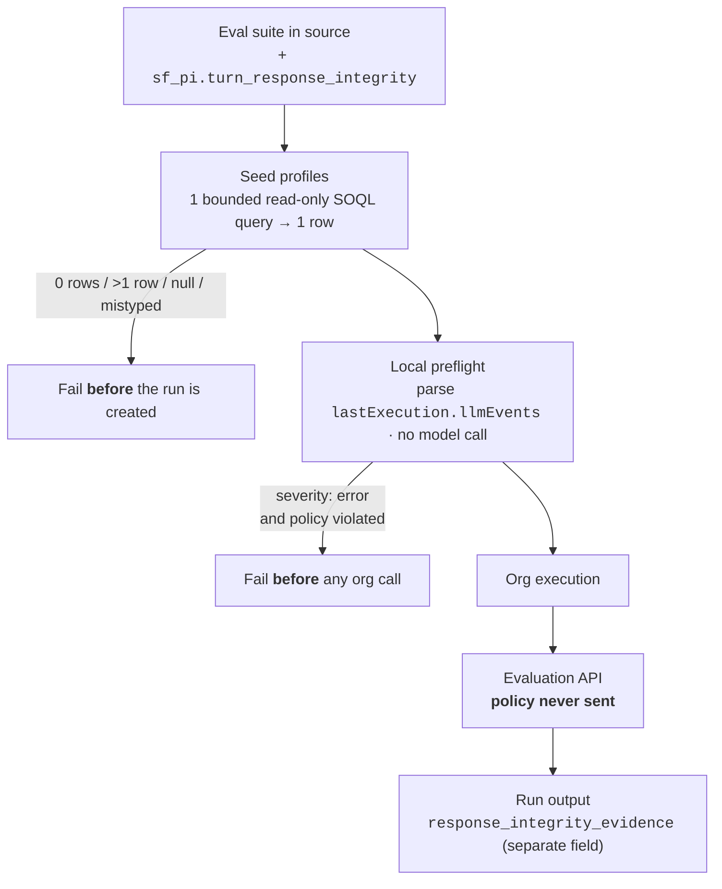
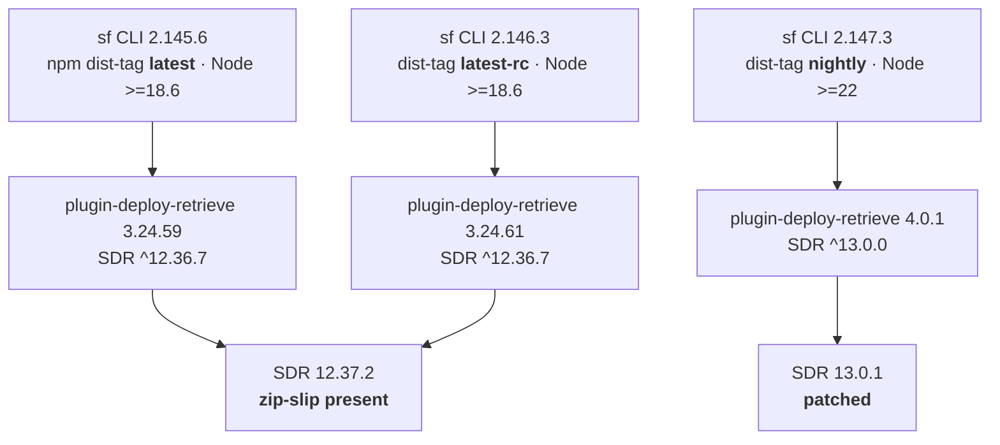

# Developer tooling and APIs

MCP, Headless 360, Apex, LWC, CLI, IDEs. Newest entries at the top.

---

## 2026-08-07 · `sf-skills` gives the catalogue a graph — `relatedSkills` lands on 79 skills, and 9 new ones ship the same day

**What changed.** [`forcedotcom/sf-skills`](https://github.com/forcedotcom/sf-skills) cut **two releases in one Friday**: **1.34.0** (05:05 UTC, commit `7d5916d`) and **1.35.0** (13:30 UTC, commit `f38d98d`).

- **1.34.0 — "Release 79 updated skills."** 108 files, **+753 / −222**. Almost all of it is one repeated edit: a `metadata.relatedSkills` list added to `SKILL.md` frontmatter, declared **bidirectionally** (`agentforce-observe` ↔ `agentforce-test`).
- **1.34.0 also carries two behaviour changes** hidden in the sweep: `automation-flow-generate` raises its **minimum API version from 51.0 to 60.0**, and `dx-code-analyzer-configure` adds **`git`** to its allowed tools.
- **1.35.0 — 9 new + 1 updated skills.** 66 files, **+15,417 / −1**.
  - DevOps: `dx-devops-pipeline-manage`, `dx-devops-promote`
  - Experience Cloud front end: `experience-lwc-base-components-integrate`, `experience-lwc-rtl-validate`, `experience-lwc-typescript-migrate`, `experience-ui-bundle-localize`
  - Platform: `platform-custom-lightning-type-generate`, `platform-mcp-tool-widget-coordinate`, `automation-sandbox-post-copy-config-generate`
  - Updated: `dx-apexguru-scan`

**Why it matters.** `relatedSkills` is the **third** structural metadata field in nine days — after `cliTools` (2026-07-30) and `accessCheck` (2026-07-31) — and the three together describe a shift in what a skill library is.

A flat catalogue makes an agent re-search descriptions every time it needs the next step. A graph lets it **traverse**: run `agentforce-test`, follow the edge, find `agentforce-observe`. The selection problem moves from retrieval to navigation, which is cheaper and far more predictable.

The practical read: **stop treating skills as independent files.** Editing one now means checking what points at it, exactly like a code dependency.

**Gotchas:**
- The field is `metadata.relatedSkills` in `SKILL.md` YAML frontmatter, a list of skill directory names. Edges are declared on **both** ends — add one and you owe the reverse edit, or the graph is directional by accident.
- **`automation-flow-generate` now refuses orgs below API 60.0.** This is a silent breaking change buried inside a "79 updated skills" release title. If a sandbox or a managed package pins an older API version, that skill stops working after the upgrade.
- Two releases landed **eight hours apart on the same Friday**. Pinning "the Friday release" is no longer unambiguous — pin the version.
- The repo's own warning still applies: skills "may be renamed, restructured, or removed between releases" and carry **no GA stability guarantee**. `relatedSkills` is not a versioned contract.
- `forcedotcom/afv-library` **redirects to this repository** — same repo under an older name, not a second library. Links and clones from either name resolve to the same place.
- The dual-licence standing note is unchanged: identical skills ship in `SalesforceAIResearch/agentforce-adlc` under **CC BY-NC 4.0**. Take the `sf-skills` copy for commercial work.

**Study action:** clone `forcedotcom/sf-skills` at **1.35.0** and run `grep -A5 'relatedSkills' */SKILL.md` to dump the edge list, then check whether any edge is one-way. Separately, open `automation-flow-generate/SKILL.md` and confirm the `51.0 → 60.0` bump against the API version of a sandbox you actually use.

**Status:** Open source, Apache-2.0. `forcedotcom/sf-skills` **1.35.0**, released 2026-08-07 13:30 UTC. Weekly Friday train.

**Sources:** [sf-skills CHANGELOG](https://github.com/forcedotcom/sf-skills/blob/main/CHANGELOG.md) · [commit `7d5916d` — 79 updated skills](https://github.com/forcedotcom/sf-skills/commit/7d5916d271809f7f375e3e40f0ffd3e4ec39f5e4) · [commit `f38d98d` — 9 new + 1 updated](https://github.com/forcedotcom/sf-skills/commit/f38d98dba5eea86b5313b93c5fb4616a0c3faf92) · builds on [the `sf-skills` 1.33.0 entry below](#2026-07-31--sf-skills-1330--a-help-agent-skill-and-skills-that-declare-their-own-preconditions)

---

## 2026-08-07 · `sf-pi` closes the Voice eval loophole — strict integrity is default for Voice, and repetition is caught without LLM evidence

**What changed.** [`salesforce/sf-pi`](https://github.com/salesforce/sf-pi) shipped **v0.258.0 → v0.260.1** between 2026-08-05 16:14 UTC and 2026-08-07 18:58 UTC. Two commits change how Agent Script evals behave; the rest is infrastructure.

- **v0.260.0 — Voice suites gate themselves** (commit `a0e169f`). Generated **Voice** eval suites now declare strict `sf_pi.turn_response_integrity` **automatically**, and an **exact-version Voice release contract refuses a designated Suite that omits it**.
- **v0.260.1 — exact repeated-surface detection** (commit `9325a4a`). The run now counts turns where the agent emits the **identical surface sentence** again, and this fires **even when `lastExecution.llmEvents` evidence is absent**. Under `severity: "error"`, repetition Fails alongside excess completions.
- **v0.260.0 — Conversation Replay** (`lib/render/conversation.ts`, `lib/eval/conversation-summary.ts`). Ending a multi-turn preview session, or completing an eval run, renders a bounded replay: every user/agent utterance, per-turn route path, latency and integrity proof. LLM-facing tool text stays compact.
- **v0.259.6 — `fix(security): patch dependency advisories and file race`** ([#583](https://github.com/salesforce/sf-pi/pull/583)) — sf-pi patching itself, not the platform.
- **v0.258.0 / v0.259.x** — `sf-llm-gateway` gets a **dynamic model catalog** and Pi 0.84 support; `sf-herdr` lane planning is normalised.

**Why it matters.** The [08-04 entry below](#2026-08-04--sf-pi-makes-agent-script-evals-deterministic--eval-studio-soql-seed-profiles-and-a-response-integrity-gate) recorded response integrity as **opt-in**, with missing evidence recorded as `unavailable` rather than a pass. That was honest, and it was also a hole: a looping agent whose `llmEvents` never arrived produced no verdict at all.

Repeated-surface detection closes it by reading the thing that is always present — **what the agent actually said** — instead of the instrumentation that sometimes isn't. It is the same lesson as the original gate, applied one level lower: check the cheapest evidence you already hold.

Making the policy automatic **for Voice specifically** is the right asymmetry. Double-texting a chat user is untidy; double-texting a caller is two voices talking over each other, and the caller cannot scroll back.

**Gotchas:**
- **Automatic only for *generated* Voice suites.** A hand-written suite, or one generated before v0.260.0, still has no policy — the release contract will refuse it at exact-version release rather than at authoring time, i.e. late.
- Repetition detection is **exact surface match**, not semantic. An agent that reworders the same non-answer each turn still passes.
- **`severity: "error"` now has two failure causes**: excess non-empty completions *and* exact surface repetition. A suite that was green on the first can go red on the second after upgrading.
- Conversation Replay is **bounded** — collapsed cards summarize, expansion shows all bounded turns. It is not a full transcript archive; `raw.json` remains authoritative.
- Policy shape is unchanged (`sf_pi.turn_response_integrity`, `max_nonempty_llm_contents` 1–100, `severity` `"warning"` | `"error"`, [ADR 0099](https://github.com/salesforce/sf-pi/blob/main/docs/adr/0099-agentscript-turn-response-integrity-policy.md)) and is still **never sent to the Evaluation API**.
- Ten releases in three days, four inside 90 minutes on Aug 7. **Pin the version.** `sf-pi` is an extension pack for the **pi** coding agent, not the `sf` CLI.

**Study action:** generate a Voice eval suite with `sf-pi` at **v0.260.1** and diff its JSON against one generated at v0.257.0 — the `sf_pi.turn_response_integrity` block should be present in the new one and absent in the old. Then write a scenario that makes an agent repeat one sentence across two turns and confirm the run reports a repeated-surface count with `llmEvents` unavailable.

**Status:** Open source, Apache-2.0. `salesforce/sf-pi` **v0.260.1**, released 2026-08-07 18:58 UTC. Pre-1.0.

**Sources:** [sf-pi releases](https://github.com/salesforce/sf-pi/releases) · [commit `9325a4a` — detect deterministic route loops](https://github.com/salesforce/sf-pi/commit/9325a4a) · [commit `a0e169f` — harden voice transition eval evidence](https://github.com/salesforce/sf-pi/commit/a0e169f) · [`sf-agentscript` README](https://github.com/salesforce/sf-pi/blob/main/extensions/sf-agentscript/README.md)

---

## 2026-08-04 · `sf-pi` makes Agent Script evals deterministic — Eval Studio, SOQL seed profiles, and a response-integrity gate

**What changed.** [`salesforce/sf-pi`](https://github.com/salesforce/sf-pi) shipped **v0.253.0 → v0.257.0** between 2026-08-03 21:14 UTC and 2026-08-04 16:05 UTC. Every feature commit lands on the `sf-agentscript` extension, and together they move Agent Script evaluation away from *ask a model* and toward *check the recorded evidence*.

- **v0.253.0 — Eval Studio** (commit `e590e4e`, ADR `0097`). A **local-first** review and execution workspace for source-controlled Agent Script Eval Suites, Agent Script Release Eval Contracts and locally persisted run evidence. It consults Salesforce only to resolve a version or to actually execute.
- **v0.253.0 — SOQL seed profiles** (ADR `0098`). A source-only declaration inside one eval suite that resolves **exactly one row** from **one bounded read-only SOQL query** against the Eval Run Target org, mapping scalar fields or constants into ordinary Scenario context variables.
- **v0.254.0 — the quality catalogue goes 18 → 20 rules** (commit `c1e956b`): `variable-description-max-length` (**High**) and `instruction-template-syntax` (**Moderate**).
- **v0.255.0 / v0.256.0** — the **full LLM response sequence** is preserved in run evidence and rendered in Eval Studio, rather than only the final message.
- **v0.257.0 — `turn_response_integrity`** (commit `ac290d5`): a source-controlled policy that fails an eval when one turn emits more than one non-empty LLM completion.

**Response integrity is the item to actually learn.** The check parses every `lastExecution.llmEvents` entry with **no model calls**, so it is deterministic and free. In strict mode it also requires **exactly one `agent.get_state` after each `agent.send_message`**.



**Why it matters.** Double-texting — an agent emitting two non-empty completions in one turn — is a real Agentforce failure that LLM-judge evals miss, because a judge reads the final message and the final message is usually fine.

Parsing the event log instead catches it deterministically, for no tokens, and **before** the run costs an org call. That is the general lesson: the cheapest agent test is the one that reads evidence you already have.

Seed profiles fix the other chronic eval problem. Hard-coded record IDs rot the moment the suite moves to another org; a bounded query that must return exactly one row moves with it.

**Gotchas:**
- The policy block is `sf_pi.turn_response_integrity`, with `max_nonempty_llm_contents` (integer **1–100**) and `severity` (`"warning"` | `"error"`). **A suite without the block keeps advisory-only behaviour** — the gate is opt-in, so an unmodified suite is not protected by the upgrade.
- `severity: "error"` also **fails on missing evidence**: unavailable `llmEvents` counts as incomplete, not as a pass.
- Findings land in a **separate `response_integrity_evidence` field** in run output. They are not folded into the ordinary verdict, so a green verdict is not the whole answer.
- The policy is preserved in source snapshots, executed snapshots and release digests but is **never sent to the Evaluation API**. The gate is yours, not the platform's — the same agent passing in another tool tells you nothing about it.
- `variable-description-max-length` fires **above 255 characters** (Salesforce's publication limit); exactly 255 is valid. `instruction-template-syntax` is **non-suppressible** — it is promoted from the compiler/LSP diagnostic, which would fire anyway.
- **A reused seed profile executes once per run**, not once per scenario. Two scenarios sharing a profile share the row.
- `sf-pi` is an extension pack for the **pi** coding agent, **not** the `sf` CLI. `sf-pi` v0.257.0 and `@salesforce/cli` 2.147.6 are unrelated number lines.
- Cadence is bursty — **ten releases in the ~19 hours** spanning Aug 3–4. Pin a version; do not track head.

**Study action:** take one existing Agent Script eval suite, add `"sf_pi": {"turn_response_integrity": {"max_nonempty_llm_contents": 1, "severity": "error"}}`, run it, and read `response_integrity_evidence` — not the verdict. Then replace one hard-coded record ID in a scenario with a seed profile and run the same suite against two different orgs.

**Status:** Open source, Apache-2.0. `salesforce/sf-pi` **v0.257.0**, released 2026-08-04 16:05 UTC. Pre-1.0 — the version line moves daily.

**Sources:** [sf-pi releases](https://github.com/salesforce/sf-pi/releases) · [commit `ac290d5` — gate evals on response integrity](https://github.com/salesforce/sf-pi/commit/ac290d5) · [commit `c1e956b` — expand quality checks](https://github.com/salesforce/sf-pi/commit/c1e956b) · [commit `e590e4e` — eval studio and dynamic seed profiles](https://github.com/salesforce/sf-pi/commit/e590e4e) · builds on [the 07-30 sf-pi entry below](#2026-07-30--sf-pi-ships-agent-script-quality-gates--and-a-better-way-to-expire-test-evidence)

---

## 2026-08-01 · A path-traversal fix in the retrieve path — and most `sf` installs cannot reach it yet

> **Correction (2026-08-08):** the dist-tag map below has moved, and this entry previously said the fix was reachable only on `nightly`. **It is now on `latest-rc`.** Checked 2026-08-08 03:15 UTC:
> - **`latest` 2.145.6 → 2.146.3.** The unpatched release candidate was promoted to stable. 2.146.3 pins `@salesforce/plugin-deploy-retrieve` **3.24.61** → SDR `^12.36.7` → **12.37.2, still vulnerable**. `engines.node` remains `>=18.6.0`. **Upgrading stable today does not get you the fix.**
> - **`latest-rc` 2.146.3 → 2.147.7** (published 2026-08-05 03:24 UTC). It pins plugin **4.0.1** → SDR `^13.0.0` → **13.0.1, patched**, and `engines.node` `>=22.0.0`. This is the first time the fix sits on a channel Salesforce ships to customers.
> - **`nightly` 2.147.6 → 2.148.1** (2026-08-07 03:19 UTC), same plugin 4.0.1.
> - **`@salesforce/plugin-deploy-retrieve` `latest` is now 4.0.2** (2026-08-07 22:43 UTC) — the 4.x major is the default plugin release, ahead of the CLI that bundles it.
> - Unchanged: SDR newest is still **13.0.1**, `13.0.2` is 404, `12.37.3` is 404 — **still no 12.x backport**, and still no CVE or GitHub security advisory.
>
> **What this corrects, precisely:** the 08-02 reading that "the release candidate queued to become stable cannot carry the fix" was right about *that* candidate — 2.146.3 shipped unpatched — but the RC slot has since been handed to the Node 22 line. The exposure window on stable is now **eight days**, and the remaining question is no longer *whether* the fix reaches stable but *when 2.147.x is promoted*, which will drag the Node 22 floor along with it.

> **Re-checked (2026-08-05 03:14 UTC):** nothing below has changed and that is the finding. `latest` is still **2.145.6** and `latest-rc` still **2.146.3** — both unmoved since 2026-07-29 — while `nightly` has rolled four times to **2.147.6**. There is still **no 12.x backport** (`@salesforce/source-deploy-retrieve@12.37.3` returns 404 on the registry) and **no SDR 13.0.2**. The exposure window is now five days old on the stable channel.

**What changed.** [`@salesforce/source-deploy-retrieve`](https://github.com/forcedotcom/source-deploy-retrieve) **13.0.1** (npm 2026-07-31 16:21 UTC) fixes a **zip-slip** in static-resource conversion — work item `W-23558165`, [PR #1812](https://github.com/forcedotcom/source-deploy-retrieve/pull/1812). A day later `@salesforce/cli` **nightly 2.147.3** (2026-08-01 03:24 UTC) became the first CLI to require **Node ≥ 22**. These are one story.

**Zip-slip**, first: an archive entry whose stored path escapes the target directory — `../../../.git/hooks/pre-commit` — so extracting it writes somewhere the extractor never intended.

- **Where it lived.** `src/convert/transformers/staticResourceMetadataTransformer.ts`, which unzips static resources whose `contentType` is `application/zip` or `application/jar` during **metadata → source conversion**. That runs on `sf project retrieve start` and `sf project convert mdapi`.
- **The fix.** Each entry's resolved absolute path is now compared against the extraction root, and an escape throws `error_static_resource_attempting_zip_slip` — *"Entry '%s' in static resource '%s' resolves to a location outside the extraction directory ('%s')."*
- **There is no 12.x backport.** The newest 12.x is **12.37.2**, published 2026-07-13. The patch exists only on the 13.x line.
- **So reachability is gated behind a major.** `@salesforce/plugin-deploy-retrieve` **3.24.61** pins SDR `^12.36.7` — a range that can never resolve to a patched build. **4.0.0/4.0.1** (2026-07-30) pin `^13.0.0` and raise `engines.node` to `>=22.0.0`.



**Why it matters.** Retrieve feels read-only, and it is not. It takes attacker-influenceable bytes out of an org and writes them onto a developer laptop or a CI runner.

Anyone who can create a static resource in an org you retrieve from — a packaging partner, a compromised sandbox, an agent with metadata write access — could write outside the project.

And the stable channel still resolves the unpatched line, so *"I upgraded the CLI"* is not the same sentence as *"I have the fix"*.

**Gotchas:**
- `npm dist-tags` for `@salesforce/cli` are **not** ordered by version: `latest` is **2.145.6**, `latest-rc` **2.146.3**, `nightly` **2.147.3** (checked 2026-08-02 02:55 UTC). `npm install -g @salesforce/cli` gets 2.145.6 and therefore SDR 12.37.2.
- The guard fires **only** for `contentType` `application/zip` and `application/jar`. A static resource stored as `application/octet-stream` never enters that code path.
- Taking the fix means taking **Node 22**, `@salesforce/core` 9.x and `@salesforce/plugin-agent` 2.0.0 in the same step — see [the Node 18/20 drop below](#2026-07-30--the-dx-node-library-stack-dropped-node-18-and-20--salesforceagents-is-200).
- `@salesforce/core` also moved to **9.1.0** (2026-07-31 19:01 UTC) inside the same window; a minor, but it lands on the 9.x line only.
- Installer/tarball `sf` bundles its own Node, so it is unaffected by the engine floor — but it still ships whatever plugin version was built into it. Check the plugin, not the Node.

**Study action:** run `npm view @salesforce/cli dist-tags`, then in a scratch project `npm ls @salesforce/source-deploy-retrieve` — read off the version your deploy path actually resolves to. Then build a static resource whose zip contains an entry named `../escaped.txt`, deploy it, retrieve it on both SDR 12.37.2 and 13.0.1, and watch one write outside the project and the other throw `error_static_resource_attempting_zip_slip`. Do it in a scratch org.

**Status:** Shipped. SDR **13.0.1**, 2026-07-31 (release commit `364ced7`), Apache-2.0. `@salesforce/cli` **2.147.3** on the `nightly` dist-tag, 2026-08-01. No CVE or security advisory was published — the only public identifier is `W-23558165`.

**Sources:** [SDR 13.0.1 release](https://github.com/forcedotcom/source-deploy-retrieve/releases/tag/13.0.1) · [PR #1812 — resolved zip-slip vulnerability](https://github.com/forcedotcom/source-deploy-retrieve/pull/1812) · [`@salesforce/source-deploy-retrieve` on npm](https://www.npmjs.com/package/@salesforce/source-deploy-retrieve) · [`@salesforce/cli` on npm](https://www.npmjs.com/package/@salesforce/cli) · [salesforcecli/cli releases](https://github.com/salesforcecli/cli/releases) · security cross-link: [trust-security-and-governance.md](trust-security-and-governance.md#2026-08-01--a-path-traversal-in-metadata-retrieve-cross-link)

---

## 2026-07-31 · `sf-skills` 1.33.0 — a Help Agent skill, and skills that declare their own preconditions

**What changed.** [`forcedotcom/sf-skills`](https://github.com/forcedotcom/sf-skills) tagged **1.33.0** on 2026-07-31 at 17:57 UTC (commit `40db639`, work item `@W-23641814@`): **10 new and 16 updated skills**, 26 directories, 2,393 files. An *Agent Skill* is a folder with a `SKILL.md` telling a coding agent **when** to take over and **how** — procedural knowledge it loads on a trigger match, not code you call.

**The cadence is the first thing to internalise: this library ships weekly, on Fridays** — 1.28/1.29 on July 3, then July 10, 17, 24 and 31. Plan around it rather than treating each release as an event.

**The headline skill is `service-helpagent-coordinate` (0.9)** — the first built around the **Help Agent**, the prepackaged Service Agent that reached GA in July '26 on pay-per-resolution pricing.

It drives a guided **four-checkpoint flow**: setup → channel configuration → grounding on Salesforce Knowledge → go-live. Its triggers map the product's real surface: Experience Cloud / LWR embed, web chat, voice, phone, Knowledge grounding.

Notably, it **hard-stops on channels that are announced but not shippable** rather than improvising — an honest design choice worth copying.

**The other nine new skills cluster in three groups:**

| Group | Skills |
|---|---|
| Digital engagement (the plumbing a Help Agent needs to reach a customer) | `service-digital-engagement-channel-configure`, `-deployment-configure`, `-messaging-site-integrate` |
| Experience Cloud front end | `experience-lwr-site-generate`, `experience-lds-data-requirements-generate`, `experience-ui-bundle-mfa-configure` |
| Platform utilities | `platform-report-generate`, `platform-data-and-tooling-api-context-get`, `platform-sandbox-configure` |

**The quiet story is declared preconditions.** `platform-sandbox-configure` ships at **1.0** — not 0.x like almost everything else — and carries a frontmatter field this radar had not seen:

```yaml
accessCheck:
  - type: "userPerm"
    value: "ManageSandboxes"
```

That declares the **org permission** the skill needs, the way `cliTools` (added July 30) declares the local CLI it needs. Together they let a skill fail fast with *"you lack ManageSandboxes"* instead of dying inside a REST call.

**Product news leaks through the updated `agentforce-*` trigger text:**

- **`agentforce-generate` 0.11** now names **`sf agent mcp`** — registering, listing and deleting MCP servers, whitelisting and approving MCP tools, configuring MCP auth. A command surface present in a shipped skill is a stronger signal than a roadmap slide.
- **`agentforce-test` 0.8** expands from functional testing to **security testing explicitly** — OWASP LLM Top 10, red-teaming, prompt-injection, a security grade.
- **`agentforce-observe` 0.8** is the Data 360 one — see [data-360.md](data-360.md#2026-07-31--data-360-is-the-observability-backend-for-agentforce--and-agentforce-observe-names-the-query-path).

**Why it matters.** Salesforce's implementation guidance is now shipped as **versioned, diffable artifacts on a weekly train**, ahead of the prose documentation. `service-helpagent-coordinate`'s four checkpoints are the closest thing to an official Help Agent implementation order that exists in public, and `agentforce-test` 0.8 is a ready-made agent security checklist you no longer have to invent.

**Gotchas:**
- `service-helpagent-coordinate` declares **`minApiVersion: "67.0"`** — a *higher* floor than `agentforce-generate`'s `66.0`. It needs a newer org than the core skill does.
- `agentforce-observe` declares **`sf >= 2.136.8`** as its CLI floor.
- Install with **`npx skills add forcedotcom/sf-skills`** (pre-packaged in Agentforce Vibes). Pin the release tag: the README warns skills *"may be renamed, restructured, or removed between releases"* with no API-stability guarantee.
- **Skill version numbers are not a reliable change indicator** — `agentforce-observe` shipped in 1.33.0 at the same `0.8` it carried in the July 30 `agentforce-adlc` sync.
- **Licence depends on which repo you clone from** — see [pricing-and-certification.md](pricing-and-certification.md#2026-08-01--the-same-agentforce-skills-ship-under-two-licences--only-one-permits-client-work).

**Study action:** `npx skills add forcedotcom/sf-skills`, then open `skills/platform-sandbox-configure/SKILL.md` and `skills/agentforce-generate/SKILL.md` side by side and diff their frontmatter — `accessCheck`, `cliTools`, `minApiVersion`, `relatedSkills`. Then add an `accessCheck` block to one skill of your own and confirm it fails fast in an org lacking the permission.

**Status:** Open-source release **1.33.0, 2026-07-31**, Apache-2.0. Salesforce-maintained, **not a supported Salesforce product** — no release train, no SLA, explicit stability disclaimer. Individual skills remain 0.x except `platform-sandbox-configure` at 1.0. The **Help Agent** it configures is separately GA as of July '26.

**Sources:** [forcedotcom/sf-skills](https://github.com/forcedotcom/sf-skills) · [releases](https://github.com/forcedotcom/sf-skills/releases) · [commit history](https://github.com/forcedotcom/sf-skills/commits/main) · [`service-helpagent-coordinate` SKILL.md](https://github.com/forcedotcom/sf-skills/blob/main/skills/service-helpagent-coordinate/SKILL.md) · [`platform-sandbox-configure` SKILL.md](https://github.com/forcedotcom/sf-skills/blob/main/skills/platform-sandbox-configure/SKILL.md) · [`agentforce-test` SKILL.md](https://github.com/forcedotcom/sf-skills/blob/main/skills/agentforce-test/SKILL.md) · scan note [01-agentforce/2026-08-01](01-agentforce/2026-08-01.md)

---

## 2026-07-30 · The DX Node library stack dropped Node 18 and 20 — `@salesforce/agents` is 2.0.0

Between **20:21 and 22:22 UTC on July 29, 2026**, three libraries cut majors carrying one breaking change each: **[`@salesforce/core` 9.0.0](https://github.com/forcedotcom/sfdx-core/commits/main)**, **[`@salesforce/source-deploy-retrieve` 13.0.0](https://github.com/forcedotcom/source-deploy-retrieve/commits/main)**, **[`@salesforce/agents` 2.0.0](https://github.com/forcedotcom/agents/releases)** — `engines.node` raised to **`>=22.0.0`**, **Node 18 and 20 dropped** (both past EOL: April 2025 and April 2026). `@salesforce/kit` went to 4.0.0 and `@salesforce/ts-types` to 3.0.0 alongside.

**Why it matters.** `@salesforce/agents` implements the **`sf agent` command family** — `agent generate`, `agent test create/run/results`, `agent preview` — so it sits under every automated way you exercise an Agentforce agent, ADLC test modes included. SDR is the engine behind `sf project deploy`, so it sits under every metadata deployment, **agent bundles and Data 360 metadata alike**. The failure is quiet, not loud: npm installs on Node 20 with an `EBADENGINE` warning and proceeds, so the break surfaces later as errors that look like metadata problems.

**What to do.** Check **CI images, not laptops** — installer/tarball `sf` **bundles its own Node** (v24 since February 2026) and is insulated; what's exposed is `npm install -g @salesforce/cli`, `actions/setup-node` pinned to 18/20, and your own scripts importing these libraries. `@salesforce/agents` **1.11.7** (July 28) is the last Node 18/20 line — pin for a week, not a quarter. Expect the CLI plugins to inherit the floor as they take core 9.

Full write-up: [01-agentforce/2026-07-30](01-agentforce/2026-07-30.md) · Data 360 deploy angle: [02-data-cloud/2026-07-30](02-data-cloud/2026-07-30.md).

---

## 2026-07-30 · sf-pi ships Agent Script quality gates — and a better way to expire test evidence

[`salesforce/sf-pi`](https://github.com/salesforce/sf-pi) (Apache 2.0, extensions for the **pi** coding agent) released **v0.250.0** on July 28 with `feat(sf-agentscript): add native quality analysis` and **v0.251.0** on July 29 with `gate agent activation`. Its `sf-agentscript` extension is a **full Agent Script lifecycle manager**, not a linter: authoring (compile, format, reference-safe renames) → preview (live-org sessions, compact traces) → eval (multi-turn regression specs, release contracts) → lifecycle (publish inactive, **gate activation**, manage Service Agent users).

Quality analysis is an **18-rule catalogue** graded High/Moderate/Low/Info, all v1 rules **On** by default, and **High findings block publication unless explicitly acknowledged** — linting as a gate, not advice.

**Why it matters.** The design detail worth copying: **release evidence has no time expiry**. It "remains valid while the exact org, `BotVersion`, baseline identity, and designated-suite digest remain unchanged." **Invalidate on identity, not on elapsed time** — an arbitrary "results expire in 7 days" rule is simultaneously too strict (nothing changed) and too loose (everything changed on day 2). Also note the templates use **subagents, not deprecated topic blocks**. Caveat: runs inside `pi`, not VS Code; Salesforce-published but **not a supported product**.

Full write-up: [01-agentforce/2026-07-30](01-agentforce/2026-07-30.md).

---

## 2026-07-29 · ADLC security testing is now generated from the agent, not from a catalogue

On **July 28, 2026** the [`agentforce-adlc`](https://github.com/SalesforceAIResearch/agentforce-adlc) toolkit merged five PRs. The one that changes how you work: **[`/agentforce-secure` is deleted](https://github.com/SalesforceAIResearch/agentforce-adlc/pull/44)**, folded into `/agentforce-test` as **Mode C**.

The old skill shipped **57 static OWASP LLM Top 10 cases hard-coded around Salesforce-the-vendor**. Aimed at an airline complaint agent, it asked about citing Salesforce security bulletins while never testing rebooking without passenger verification. Mode C derives cases from the agent instead: it profiles the **Agent Script** for actions, authorization gates, LLM-filled inputs (injection sinks) and subagent topology, infers the **business domain** from 12 weighted vocabularies, then emits only cases that fit the actual surface — no write actions, no bulk-mutation tests. Of the 59-entry payload catalogue, **50 neutral entries deploy by default** and 9 Salesforce-platform entries need `--include-platform`.

Three sub-modes, ordered by blast radius: **`C1-author`** writes test YAML and deploys nothing; **`C1-run`** deploys and executes but **refuses non-sandbox orgs** unless given `--allow-production`, after a gate that queries `Organization.IsSandbox`; **`C2`** probes live via `sf agent preview` and returns severity-weighted A–F grades. **Live actions now require `--live-actions`; the default simulates.**

Also merged: a hook that **blocks `DELETE` without `WHERE` in quoted SOQL** ([#27](https://github.com/SalesforceAIResearch/agentforce-adlc/pull/27)) — closing the gap where an LLM assembles a destructive query inside a string literal that static checks never see; **hooks gated to Salesforce projects only** ([#13](https://github.com/SalesforceAIResearch/agentforce-adlc/pull/13)), so a global plugin install stops firing in unrelated repos; an **MCP server registry management skill** ([#41](https://github.com/SalesforceAIResearch/agentforce-adlc/pull/41)); and **eight voice latency anti-patterns plus seven voice-safe action rules** ([#45](https://github.com/SalesforceAIResearch/agentforce-adlc/pull/45), docs only).

**Why it matters.** A security suite that doesn't know what your agent does is theatre — it returns green and means nothing. "Cases generated from the agent's own script and domain" is the answer that carries weight when a client asks how an agent was tested. Two patterns are worth copying regardless of this toolkit: **simulate by default, execute on an explicit flag**, and **validate generated queries at execution, not at authoring**. Caveat: CC BY-NC 4.0 research tooling, **not a supported Salesforce product**.

Full write-up: [01-agentforce/2026-07-29](01-agentforce/2026-07-29.md).

---

## 2026-07-29 · Data 360 MCP Server — ~200 REST operations behind three facade tools

[`forcedotcom/d360-mcp-server`](https://github.com/forcedotcom/d360-mcp-server) (announced **May 2026**, **Developer Preview**) exposes the Data 360 Connect API to MCP clients. **Distinct from Headless 360** below: that is the platform-wide Beta with ~100 skills; this is Data 360-specific and one maturity step behind.

The interesting move is architectural. Registering ~200 REST operations as ~200 MCP tools would consume the model's context before any work starts, so the server fronts everything with **three facade tools** — **`search`** (find operations by intent, keyword or family), **`payload_examples`** (fetch a working JSON payload), **`execute`** (run any operation by name). Behind them: **201 operations across 22 tool families** — DLOs, DMOs, streams, mappings, transforms, identity resolution, segments, queries, ML.

**Why it matters.** This is the canonical answer to context-window blowout in MCP design: a searchable facade over a large API surface instead of a flat tool list.

`payload_examples` is the specific pattern to steal — when a model must produce nested JSON for an unfamiliar API, **serve it a known-good example rather than a schema description.** Hallucinated shapes are the default failure otherwise. Transfers directly if you build your own MCP servers; see [03-claude-cca/](../03-claude-cca/INDEX.md).

**Gotchas:**
- Preview constraints rule it out of shared use: **STDIO only, single user/org per process, Java 17+ and Maven 3.9+ locally**.
- Semantic search runs on an **optional OpenAI API key** — enabling it sends search terms to a third party. Fine on a personal dev org; a conversation to have anywhere else.
- A **hosted GA version is planned for 2026**, no date confirmed.

**Study action:** clone [`forcedotcom/d360-mcp-server`](https://github.com/forcedotcom/d360-mcp-server), call `search` for "identity resolution", then `payload_examples` on the operation it returns — and compare that request body to what you would have guessed from the REST reference alone.

Full write-up: [02-data-cloud/2026-07-29](02-data-cloud/2026-07-29.md). Consolidated here on 2026-08-01 from a duplicate in [data-360.md](data-360.md).

---

## 2026-07-26 · Headless 360 — the organizing idea of Summer '26

[Headless 360](https://developer.salesforce.com/blogs/2026/05/headless-360-what-it-means-for-developers) makes every major Salesforce capability available as an **API, an MCP tool, or a CLI command**, accessible to any authenticated caller — an app, a human, or an autonomous AI agent.

**Why it matters.** Read this as Salesforce accepting that the primary consumer of its platform will increasingly be a machine rather than a browser. Every design choice below (hosted MCP, secrets redaction, user-mode defaults, scriptable grounding) follows from that premise. When you architect on Salesforce now, the question "can an agent do this without a UI?" has a real answer.

---

## 2026-07-26 · Salesforce Hosted MCP Servers (Standard servers GA)

Connect any MCP-compatible client — Claude, ChatGPT, Cursor, custom agents — to a Salesforce org through the open MCP standard. Every connection uses standard [OAuth](https://developer.salesforce.com/docs/platform/hosted-mcp-servers/guide/setup-overview.html). Salesforce hosts them, so there's no infrastructure to run.

### Standard servers (GA)

| Server | Capability |
|---|---|
| [SObject Servers](https://developer.salesforce.com/docs/platform/hosted-mcp-servers/guide/servers-reference.html#sobject-servers) | SObject CRUD, SOQL queries, search |
| [Data 360](https://developer.salesforce.com/docs/platform/hosted-mcp-servers/references/reference/data-cloud-sql.html) | Data 360 queries and graph traversal |
| [Tableau](https://developer.salesforce.com/docs/platform/hosted-mcp-servers/references/reference/tableau-next.html) | Analytics and visualization |

### Custom servers

When the standard servers aren't enough, [build custom MCP servers](https://developer.salesforce.com/docs/platform/hosted-mcp-servers/guide/custom-servers.html) with granular control over exposed tools and prompts. **Custom MCP servers respect the org's full sharing and security model** — this is the single most important sentence in the feature. Tools can be built from:

- **Apex Actions** — expose [`@InvocableMethod`](https://developer.salesforce.com/docs/platform/hosted-mcp-servers/guide/invocable-actions.html) methods
- **Lightning Flows** — expose autolaunched flows
- **Apex REST** — expose custom REST endpoints
- **`@AuraEnabled`** methods
- **[Named Query API](https://developer.salesforce.com/docs/atlas.en-us.api_rest.meta/api_rest/resources_named_query_intro.htm)** — parameterized SOQL as a tool
- **[Prompt Builder](https://developer.salesforce.com/docs/platform/hosted-mcp-servers/guide/prompt-builder.html)** — prompts exposed as MCP prompts
- **[Agentforce](https://developer.salesforce.com/docs/platform/hosted-mcp-servers/guide/agentforce.html)** — whole agents exposed as MCP tools
- **[API Catalog](https://developer.salesforce.com/docs/platform/hosted-mcp-servers/guide/api-catalog.html)** — curated REST endpoints mapped to tools

**Why it matters.** This is the most directly relevant Salesforce feature to the Claude/MCP track. It also inverts a familiar problem: instead of building an MCP server to *reach* Salesforce, you configure one and Salesforce enforces sharing and FLS for you. Walkthroughs: [Connect Claude with Salesforce Hosted MCP Servers](https://developer.salesforce.com/blogs/2026/05/connect-claude-with-salesforce-hosted-mcp-servers) and [Expose Custom Apex as a Hosted MCP Tool for Agents](https://developer.salesforce.com/blogs/2026/05/expose-custom-apex-as-a-hosted-mcp-tool-for-agents).

**Study action:** connect Claude Desktop or Claude Code to a Dev Edition org via a standard SObject server, then expose one `@InvocableMethod` as a custom tool. That single exercise covers both the CCA-F and Agentforce tracks.

---

## 2026-07-26 · MCP servers for developers and designers

| Server | Status | What it gives you |
|---|---|---|
| [Salesforce DX MCP](https://developer.salesforce.com/docs/atlas.en-us.sfdx_dev.meta/sfdx_dev/sfdx_dev_mcp.htm) | Beta | [SLDS Guideline tools](https://developer.salesforce.com/docs/platform/lwc/guide/mcp-slds.html) for styling-hook and component-blueprint guidance; [ApexGuru](https://developer.salesforce.com/blogs/2026/04/performance-first-apex-development-with-apexguru-in-salesforce-dx-mcp-server) for Apex review driven by your org's *runtime* metrics |
| [Metadata API Context MCP](https://developer.salesforce.com/docs/atlas.en-us.api_meta.meta/api_meta/meta_salesforce_api_mcp_intro.htm) | Beta | Now five granular tools instead of one — faster responses, more efficient token usage |
| [Data 360 MCP](https://developer.salesforce.com/blogs/2026/05/introducing-the-data-360-mcp-server-developer-preview) | Dev Preview | Three facade tools over ~200 REST ops (see [data-360.md](data-360.md)) |
| [Omnistudio MCP](https://developer.salesforce.com/blogs/2026/01/accelerate-flexcard-development-with-omnistudio-mcp) | Beta | Turn text, screenshots or UX mockups into FlexCard templates |
| [B2C DX MCP](https://salesforcecommercecloud.github.io/b2c-developer-tooling/mcp/) | — | Figma-to-Component for Storefront Next |
| [Marketing Cloud Engagement MCP](https://developer.salesforce.com/blogs/2026/06/the-mcp-server-for-marketing-cloud-engagement-is-now-ga) | GA | Data extensions and journeys as natural-language tools |

**ApexGuru is the standout.** It flags anti-patterns inline — SOQL/DML inside loops, redundant SOQL — using *actual runtime metrics from your org*, not static analysis. Its Test Case Insights surface inefficient tests that drag coverage down.

---

## 2026-07-26 · Agent Skills for coding agents (open source)

[Agent Skills](https://agentskills.io/home) is a lightweight open format for extending an AI agent with specialized knowledge and workflows. Salesforce open-sourced a library of Salesforce development skills at [github.com/forcedotcom/sf-skills](https://github.com/forcedotcom/sf-skills).

Install into any coding agent: `npx skills add forcedotcom/sf-skills` (pre-packaged with Agentforce Vibes; works with Claude Code, Codex, etc.)

Includes skills for [building](https://github.com/forcedotcom/sf-skills/tree/main/skills/developing-agentforce), [testing](https://github.com/forcedotcom/sf-skills/tree/main/skills/testing-agentforce) and [observing](https://github.com/forcedotcom/sf-skills/tree/main/skills/observing-agentforce) Agentforce, plus [Data 360 code extensions](https://github.com/forcedotcom/sf-skills/tree/main/skills/developing-datacloud-code-extension).

**Why it matters.** Same skill format Claude Code uses — these drop straight into your existing setup. This is the highest ratio of value to effort in the whole release.

---

## 2026-07-26 · Salesforce CLI — Agentforce DX and credential safety

**Build agents from a working start:**

- **Agent project scaffolding** — the `agent` template generates a runnable **Local Info Agent** demonstrating Apex, Prompt Template and Flow subagents.
- **One-command agent user** — automates service agent user setup, no manual provisioning.

**Test, preview, debug:**

- **Agent preview is GA** — script interactive test sessions end to end with `agent preview start`, `send`, `sessions`, `end`.
- **Trace files** — inspect traces from a preview session to see exactly how the agent routed and acted.
- **Richer evaluations (Beta)** — YAML- or JSON-defined evaluation tests for repeatable agent testing.

**Credential safety:**

- **Secrets redacted by default** — access tokens, SFDX auth URLs and passwords are stripped from `org display`, `org list --json` and similar, preventing leaks in CI logs.
- **Deliberate retrieval** — when you actually need a credential you must ask for it explicitly.

Details: [Salesforce CLI release notes](https://github.com/forcedotcom/cli/blob/main/releasenotes/README.md). The CLI ships weekly.

---

## 2026-07-26 · Platform API v67.0

- **GraphQL chaining** — [mutations](https://developer.salesforce.com/docs/platform/graphql/guide/mutations-intro.html) can now reference *any field* returned by an earlier operation in the same request, not just its record ID. Use `@{ref.Record.FieldName.value}` for a field value and `@{ref.Record.Id}` (shorthand `@{ref}`) for the ID. Linked records in one round trip.
- **JWT tokens for SOAP API** — SOAP now accepts [JWT-based access tokens](https://help.salesforce.com/s/articleView?id=release-notes.rn_api_soap_jwt.htm&release=262&type=5) in the `sessionId` header, reaching parity with REST auth.
- **Connect REST API limits relaxed** — orgs migrated off the restrictive per-user/per-app/per-hour limit onto the [per-org, per-24-hour Platform API limit](https://help.salesforce.com/s/articleView?id=release-notes.rn_connect_api.htm&release=262&type=5). Only Chatter-requiring requests keep the hourly throttle. Same change applies to Connect in Apex.
- **CSRF token for UI API** — new [`GET /ui-api/session/csrf`](https://developer.salesforce.com/docs/atlas.en-us.uiapi.meta/uiapi/ui_api_resources_session_csrf.htm) resource.

See [trust-security-and-governance.md](trust-security-and-governance.md) for the SOAP `login()` retirement, which is the most consequential API change.

---

## 2026-07-26 · Apex at API 67.0 — ergonomics

Security changes are in [trust-security-and-governance.md](trust-security-and-governance.md). The quality-of-life additions:

- **Multiline strings** — triple single-quotes (`'''`) give real [multiline literals](https://help.salesforce.com/s/articleView?id=release-notes.rn_apex_multiline_string.htm&release=262&type=5). No more `+ '\n' +` chains for JSON payloads, email bodies or SOQL. *The newline immediately after the opening `'''` is trimmed.*
- **[`String.template()`](https://developer.salesforce.com/docs/atlas.en-us.apexref.meta/apexref/apex_methods_system_string.htm#apex_System_String_template)** — named interpolation with `${variableName}`, replacing the index-juggling of `String.format()`. *Renders a `Datetime` in **GMT** as `yyyy-MM-dd HH:mm:ss`, not the user's local time the way `String.valueOf()` does — format it yourself if the zone matters.*
- **Elastic limits for async jobs (Beta)** — enqueue `Queueable` and `@future` jobs [up to twice your licensed daily limit](https://help.salesforce.com/s/articleView?id=release-notes.rn_apex_elastic_async_limit.htm&release=262&type=5); overflow is throttled, not rejected. Track via `DailyAsyncApexElasticExecutions` and `DailyAsyncApexProcessed` in `System.OrgLimits.getMap()`.
- **No-arg constructors required** — any custom Apex type used as an [invocable action input](https://help.salesforce.com/s/articleView?id=release-notes.rn_apex_constructor_visibility_invocable_custom_classes_v66.htm&release=262&type=5) must expose a visible no-argument constructor (public, or global for packaged classes). **The requirement starts at API 66.0** — note the `_v66` in that release-note ID — and Summer '26 is when the Release Update auto-activates, which is why it is so widely mis-dated to 67.0. **This one breaks existing Agentforce Apex actions**, because declaring any constructor with arguments removes the compiler-generated default one. Apex-side detail: [SF/02-apex · 22](../../SF/02-apex-and-triggers/22-invocable-apex-and-agentforce-actions.md).

---

## 2026-07-26 · LWC — a maturity release

Five features most likely to change how you build:

**1. State Managers (GA)** — the most consequential. [State Managers](https://developer.salesforce.com/docs/platform/lwc/guide/state-management.html) move data and the logic that mutates it *out* of components into a reusable, testable layer. Build one as a plain JS module with `defineState` from `@lwc/state`:

- `atom(value)` — reactive state, read through `.value`
- `computed([deps], fn)` — derived value, recomputes when a dependency changes
- `setAtom(atom, value)` — the **only** way to update an atom

`defineState` returns a **factory**; each call yields a fresh independent instance, which makes managers trivially unit-testable. Salesforce also ships [built-in Lightning state managers](https://developer.salesforce.com/docs/platform/lwc/guide/reference-state-managers.html) wrapping LDS access to common UI API data (`lightning/stateManagerRecord`, `lightning/stateManagerObjectInfo`, etc.) — they participate fully in LDS caching, normalization and subscriptions, so reach for those before rolling your own. Runnable examples in [lwc-recipes](https://github.com/trailheadapps/lwc-recipes/tree/main/force-app/main/default/lwc/opportunitiesStateManager).

**2. `lightning/accApi` — drive Agentforce from a component.** The [Agentforce Conversation Client API](https://developer.salesforce.com/docs/platform/accsdk/guide/acc-api.html) is a *headless* module that lets an LWC drive the native Agentforce side panel in Lightning Experience. Three async methods, all returning a `Promise` and **queued** to run in sequence:

| Method | Purpose |
|---|---|
| `open(botId?)` | Open the side panel, optionally to a specific agent |
| `close()` | Close the side panel |
| `execute(utterance, botId)` | Run a natural-language utterance on an agent |

**`execute` does *not* return the reply** — the conversation renders in the panel, not in your component. Expose `botId` as a design-time property (`<property name="botId" type="String">` in the bundle's `.js-meta.xml` `targetConfig`) so admins can wire the agent without code. Get `botId` from the URL in Agentforce Builder. Think "Summarize this record" buttons and context-aware console launchers.

**3. Dynamic lists (Developer Preview)** — [`lightning-dynamic-list-container`](https://developer.salesforce.com/docs/platform/lightning-component-reference/guide/lightning-dynamic-list-container.html?type=Example) and [`lightning-dynamic-list-item`](https://developer.salesforce.com/docs/platform/lightning-component-reference/guide/lightning-dynamic-list-item.html) use virtualization to render only viewport rows and stream the rest — 50 items to 5,000. Fires `renderlistitems` on scroll and `loadmore` near the end. Includes focus preservation and built-in accessibility. *Keep container and item adjacent, give every item a unique `item-id`, and don't set `overflow: scroll` on your own container — the component handles scrolling.*

**4. API 67.0 niceties** — faster, more memory-efficient hot module reloading, and you can group native `<details>` elements with the `name` attribute for a zero-JavaScript exclusive accordion (same `name` = only one open at a time). Set `<apiVersion>67.0</apiVersion>` in the bundle `.js-meta.xml`.

**5. Secure downloads — LWS now blocks `data:` URIs.** `HTMLAnchorElement.prototype.href` blocks the `data:` scheme. **If you trigger client-side downloads by setting an anchor's `href` to a `data:` URL, that breaks.** Fix: build a Blob and use a `blob:` object URL (origin-bound, revoke after use). Other new [distortions](https://help.salesforce.com/s/articleView?id=release-notes.rn_lc_lws_distortion_changes.htm&release=262&type=5) cover `Element.getAttribute`, `innerHTML`/`outerHTML` getters, `MutationObserver.observe`, the `IndexedDB` factory and `Promise.then/catch/finally`. Run the updated [ESLint package](https://developer.salesforce.com/docs/platform/lightning-components-security/guide/lws-tools-lint.html) and check the [LWS Distortion Viewer](https://developer.salesforce.com/tools/lws-distortion-viewer) before upgrading components.

---

## 2026-07-26 · IDEs and pro-code environments

- **[Agentforce Vibes 2.0 (Developer Preview)](https://marketplace.visualstudio.com/items?itemName=salesforce.salesforcedx-agentforce-vibes-2)** — agentic development environment that reasons through complex tasks, builds structured implementation plans and asks clarifying questions before acting. You keep control via approvals, permissions and native VS Code diff reviews. New: redesigned multi-tab chat, **Plan Mode**, deeper MCP integration, built-in Skills and Rules, live LWC previews, and the latest Claude and GPT models in one picker.
- **[Web Console (Beta)](https://developer.salesforce.com/docs/platform/webconsole/guide/get-started)** — a full IDE running inside your org in the browser. Write, debug and deploy Apex, LWC and other metadata without leaving Salesforce; run anonymous Apex, set trace flags and debug log levels in one place. vs. the Agentforce Vibes IDE: available on **every** org, loads faster, entirely browser-based — but supports only Salesforce-provided extensions. Enable under Setup → Development → Web Console (Beta).
- **[Live Preview VS Code extension](https://developer.salesforce.com/docs/platform/lwc/guide/get-started-test-components.html)** — the renamed Local Dev. Real-time single-component updates in the browser, VS Code, or the Agentforce Web IDE.
- **[Metadata Visualizer](https://marketplace.visualstudio.com/items?itemName=salesforce.salesforcedx-metadata-visualizer-vscode)** — turns raw metadata XML into interactive diagrams that update as you edit; plugs into Agentforce Vibes to visualize AI-generated metadata. Currently covers objects, permission sets and flexipages (Beta).

---

## 2026-06-24 · The ADLC has a first-party command sequence

> **Backfill (recorded 2026-07-28).** The [July 26 scan](01-agentforce/2026-07-26.md) captured the *research* toolkit (`agentforce-adlc`). It never captured Salesforce's own **supported** workflow, published two days before that scan's window opened.

**What it is.** [Master the Agentic Development Lifecycle for Agentforce](https://developer.salesforce.com/blogs/2026/06/master-the-agentic-development-lifecycle-for-agentforce) sets out a design-first workflow driven by three Agent Skills — `developing-agentforce`, `testing-agentforce`, `observing-agentforce` — installed with `npx skills add forcedotcom/sf-skills`.

| Phase | Commands |
|---|---|
| Design | plan mode (Shift+Tab in Claude Code); design interview; agent mapped as a graph — router node plus domain subagents |
| Build & deploy | `sf agent generate authoring-bundle` → validate Agent Script compiles locally → `sf project deploy start` for backing Flow/Apex → deploy the bundle. Failures drive automated fix-and-retry loops |
| Test | `sf agent preview start` / `send` / `end`; `sf agent test create` / `run` against YAML specs |
| Publish | `sf agent publish authoring-bundle` → `sf agent activate` |
| Observe | local traces in `.sfdx/agents/[name]/sessions/…/traces/`; production via the **Session Trace Data Model**; **AgentLens** to walk the graph |

**Five rules from the guide:** one folder per project · **build only in scratch orgs or sandboxes, never production** · commit Agent Script to Git · `--json` on every command · scope deployments explicitly.

**Why it matters.** The architect-level framing — five phases, **inner loop** vs **outer loop** — now has an executable counterpart. And the licence distinction becomes commercially load-bearing: `sf-skills` is Salesforce's supported library, while **`agentforce-adlc` is CC BY-NC 4.0 and therefore unusable on paid client work**. Three artifacts, three licences (Agent Script is Apache 2.0).

**Status:** `agent preview` **GA**; agent evaluations **Beta**; Agentforce Vibes 2.0 **Developer Preview**. Now written up at [02-salesforce-ai/13-adlc-and-agentforce-dx](../02-salesforce-ai/13-adlc-and-agentforce-dx/notes.md).

**Sources:** [Master the Agentic Development Lifecycle for Agentforce](https://developer.salesforce.com/blogs/2026/06/master-the-agentic-development-lifecycle-for-agentforce) · [The Agent Development Lifecycle: From Conception to Production](https://architect.salesforce.com/docs/architect/fundamentals/guide/agent-development-lifecycle.html) · [Agentforce DX](https://developer.salesforce.com/docs/ai/agentforce/guide/agent-dx.html) · [`forcedotcom/sf-skills`](https://github.com/forcedotcom/sf-skills)

---

## 2025-09 → 2026-04-15 · MuleSoft Agent Fabric — the gap this radar never had

> **Backfill (recorded 2026-07-28).** Agent Fabric launched in **September 2025** and had **zero mentions anywhere in this study base** — radar included — until this entry. It is the largest single gap the 2026-07-28 second pass found. Dated to the product's own timeline, not to the scan.

**What it is.** A **MuleSoft** control plane — "a single pane of glass to register, manage, govern and observe all of your agents and MCP endpoints." The framing is *agent sprawl*: what happened to APIs around 2015 is happening to agents, and MuleSoft already owns that playbook.

**Four pillars, four components:**

| Pillar | Component | Function |
|---|---|---|
| Discovery | **Agent Registry** | Catalog of every agentic asset — custom agents, SaaS-embedded agents, MCP servers, A2A endpoints. **Federated**: anyone can run a registry and registries reference each other |
| Governance | **Omni Gateway** + Governance Strategies | Runtime layer between agents and the systems they reach; policy on every A2A and MCP call |
| Orchestration | **Agent Broker** + Agent Networks | Graph-based routing across A2A agents; networks declared in **YAML**, deployed to CloudHub 2.0 |
| Observation | **Agent Visualizer** | Network structure, live request flows, latency, error rates |

**Timeline.** Launched September 2025. Registry, Visualizer GA October 2025; Governance available at launch. **Agent Scanners GA January 2026** for Agentforce, Amazon Bedrock, Google Vertex AI and Microsoft Copilot Studio, alongside curated third-party MCP servers in the Registry. **April 15, 2026**: automated cross-platform discovery, a drag-and-drop workflow canvas, **guided determinism**, and a centralised LLM governance layer for cost, compliance and model routing.

**Two vocabulary traps worth recording.** First, **Flex Gateway was renamed Omni Gateway** — same runtime, expanded to govern AI/MCP/A2A traffic alongside APIs, a non-breaking cosmetic change (1.13.0) that leaves CI/CD alone. Both names circulate, and Agent Fabric launch coverage still says Flex. Second, **"Agent Script" now names two products**: the Agentforce authoring language (Apache 2.0, see [agentforce-platform.md](agentforce-platform.md)) and "Agent Script for Agent Broker", the guided-determinism feature. Disambiguate before quoting either.

**Why it matters.** It reframes MCP and A2A from protocols into *governed traffic* — every call routed through the gateway, policy applied at the endpoint rather than per integration. It is also the answer to the question a large client asks first: "we already run agents in Copilot Studio and Bedrock, what happens to those?" And it draws the boundary around Agentforce's own orchestration in one sentence: **Agentforce orchestration coordinates agents inside one org; Agent Fabric coordinates agents across vendors.**

**Status:** Registry / Visualizer **GA** Oct 2025 · Scanners **GA** Jan 2026 · **Agent Broker status disputed** — GA per launch coverage, Beta per April 2026 coverage; unresolved, see the README open questions. **MuleSoft-licensed, not part of an Agentforce SKU; no public pricing found.** Now written up at [02-salesforce-ai/11-agent-fabric-and-interop](../02-salesforce-ai/11-agent-fabric-and-interop/notes.md).

**Sources:** [MuleSoft Agent Fabric Overview (docs — the authority)](https://docs.mulesoft.com/general/agent-fabric-overview) · [Omni Gateway release notes](https://docs.mulesoft.com/release-notes/flex-gateway/flex-gateway-release-notes) · [Salesforce Launches MuleSoft Agent Fabric](https://www.salesforce.com/news/stories/mulesoft-agent-fabric-announcement/) · [Salesforce Advances Agent Fabric: Guided Determinism and Governance Controls (2026-04-15)](https://www.salesforce.com/news/stories/agent-fabric-control-plane-announcement/) · [Complete Breakdown (Salesforce Ben)](https://www.salesforceben.com/salesforce-launches-mulesoft-agent-fabric-a-complete-breakdown/) · [MuleSoft Agent Fabric Deep Dive (architect.salesforce.com)](https://architect.salesforce.com/docs/architect/fundamentals/guide/mulesoft-agent-fabric-deep-dive.html)

---

## Release timing reference

Summer '26 sandbox preview **May 8, 2026**; production rollouts **May 15, June 5, June 12, June 13, 2026** depending on instance. API version **67.0**. Check the [maintenance calendar](https://status.salesforce.com/products/all/maintenances) for your org. Winter '27 release notes are not yet public; Release Update **enforcement** begins September 2026.

---

## Sources

- [The Salesforce Developer's Guide to the Summer '26 Release](https://developer.salesforce.com/blogs/2026/06/the-salesforce-developers-guide-to-the-summer-26-release)
- [Headless 360: What It Means for Developers](https://developer.salesforce.com/blogs/2026/05/headless-360-what-it-means-for-developers)
- [Salesforce Summer '26 Release Notes](https://help.salesforce.com/s/articleView?language=en_US&id=release-notes.salesforce_release_notes.htm)
- [Salesforce Winter '27 Release: What to Expect (Salesforce Ben)](https://www.salesforceben.com/salesforce-winter-27-release-what-to-expect-and-how-to-prepare/)
