# Developer tooling and APIs

MCP, Headless 360, Apex, LWC, CLI, IDEs. Newest entries at the top.

---

## 2026-08-27 · `@salesforce/agents` 2.1.0 retrieves agents as the v68 pair — and a v68 org with the flag off writes zero files without failing

**What changed.** `@salesforce/agents` **2.1.0** (npm **2026-08-27 03:28:55 UTC**, commit `049ed3f`, PR [#341](https://github.com/forcedotcom/agents/pull/341), `@W-23897701@`, subject *"Support new simplified metadata type for 264 orgs"*) switches the retrieve that follows `Agent.create` and `ScriptAgentPublisher.publish` to `AiAgentDefinition` / `AiAgentDefinitionVersion` on orgs at API **v68 or higher**.

- **The manifest collapses from N+3 entries to 2.**

  | | Metadata entries requested |
  |---|---|
  | Legacy (< v68) | `Bot:<name>`, one `GenAiPlugin:<node>` per Agent Script node, one `GenAiFunction:<tool>` per tool, `Agent:<name>_<botVersionDeveloperName>` |
  | **New (≥ v68)** | `AiAgentDefinition:<name>`, `AiAgentDefinitionVersion:<name>#<versionNumber>` |

- **Dependencies are spidered, not enumerated.** The new path passes `rootTypesWithDependencies: ['AiAgentDefinitionVersion']`, which brings Flow, ApexClass and PromptTemplate along *"so they do not need to be enumerated in the manifest"*.
- **The version suffix costs a SOQL round-trip.** `singleRecordQuery('SELECT VersionNumber FROM BotVersion WHERE Id=\'<botVersionId>\'')`, run before the retrieve is built.
- **The gate is one exported constant.** `AI_AGENT_DEFINITION_MIN_API_VERSION = 68` and `supportsAiAgentDefinition(connection)` in `src/utils.ts`, keyed off `connection.getApiVersion()`.

**Why it matters.** This changes what lands in your repo after you create or publish an agent. The same agent now retrieves into a different shape depending on which org you pointed at.

The library's own TODO makes the legacy fallback temporary: *"remove this version gate and the legacy retrieval fallback once the old metadata types are retired (v68/264)"* (`TD-0333078`). The `Bot` / `GenAiPlanner` / `GenAiPlugin` retrieval path has an expiry date.

**Gotchas:**
- **A v68 org with the server flag off produces a `success: true` retrieve that writes nothing.** The gate reads the **API version only**; the code comment is explicit that *"the server also gates the feature behind a flag; an org at/above the min API version with the flag still off would resolve the new types to nothing."* The library's response is `getLogger().warn(...)` — it does **not** throw and does not fail the command. Check `getFileResponses().length`, not the exit code.
- **The separator changed.** `AiAgentDefinitionVersion:MyAgent#1` uses `#` and the **numeric** `VersionNumber`. The legacy entry was `Agent:MyAgent_v1` — underscore, and the version's **developerName**. A script that builds manifests by string-concatenation breaks on exactly one character.
- **`BotVersion` must be queryable by the running user**, or create/publish now fails before the retrieve.
- **A create response without `agentId.botVersionId` now throws `agentRetrievalError`** rather than dereferencing a non-null assertion — a deliberate change of failure mode, not a silent fix.
- **It is in no `sf` channel yet.** `latest` 2.149.9 pins `@salesforce/agents` **2.0.4**; `latest-rc` and `nightly` 2.150.6 pin **2.0.6**. `plugin-agent` 2.0.5 ranges `^2.0.6`, so 2.1.0 satisfies it — but per the [frozen-shrinkwrap finding](#2026-08-26--the-latest-rc-release-notes-promise-two-sdr-fixes-that-its-own-shrinkwrap-cannot-deliver) a satisfied range is not a reachable version. Consume 2.1.0 directly from npm until a shrinkwrap says otherwise.

**Relevant to:** **Developer** — metadata entries, on-disk layout and the failure modes of `sf agent create` / `sf agent publish` all change on a v68 org, and the empty retrieve is invisible to `$?`; **Architect** — the legacy retrieval path is declared temporary in the source, which dates tooling built on it; **Admin** — the `AiAgentDefinition` feature flag is a per-org gate someone must enable first.

**Study action:** `npm i @salesforce/agents@2.1.0`, publish one Agent Script agent against a v68 org, and `git status` the `force-app` tree — then repeat against a pre-v68 org and diff the two file sets. If the v68 run produces no agent files, you have found the feature flag rather than a bug.

**Status:** Open source, Apache-2.0. npm `latest` **2.1.0**, published **2026-08-27 03:28:55 UTC** — nine minutes before this scan read it. Not carried by any `sf` channel as of 03:38 UTC.

**Sources:** [npm `@salesforce/agents`](https://www.npmjs.com/package/@salesforce/agents) · [PR #341](https://github.com/forcedotcom/agents/pull/341) · [`src/utils.ts`](https://github.com/forcedotcom/agents/blob/main/src/utils.ts) · [`src/agents/scriptAgentPublisher.ts`](https://github.com/forcedotcom/agents/blob/main/src/agents/scriptAgentPublisher.ts)

---

## 2026-08-26 · `sf` `latest` moves to 2.149.9 — the promotion question closes, the TOCTOU fix reaches stable, and the publish fix does not

**What changed.** `@salesforce/cli` promoted **2.149.9** to `latest` on **2026-08-26**, with **2.150.6** taking `latest-rc` (dated *"Sept 2, 2026"* in its own notes). Of the two candidate lines this radar had been tracking since 08-25, it took the **2.149.x** one.

- **What the stable tree now pins**, read from `2.149.9`'s `npm-shrinkwrap.json` at 2026-08-27 03:37 UTC:

  | Component | 2.148.3 (previous stable) | **2.149.9 (stable)** | 2.150.6 (`latest-rc`) |
  |---|---|---|---|
  | `@salesforce/source-deploy-retrieve` | 13.0.1 | **13.1.1** | 13.1.1 |
  | `@salesforce/agents` | 2.0.1 | **2.0.4** | 2.0.6 |
  | `@salesforce/plugin-agent` | 2.0.1 | **2.0.3** | 2.0.5 |
  | `@salesforce/plugin-deploy-retrieve` | 4.0.2 | **4.1.2** | 4.1.2 |
  | `@salesforce/source-tracking` | — | **8.1.0** | 8.1.0 |

- **The SDR TOCTOU symlink fix lands on stable**, 14 days after SDR 13.1.1 published — the wait recorded on [2026-08-25](#2026-08-25--sf-publishes-an-npm-shrinkwrapjson--the-clis-dependency-tree-is-pinned-exactly-and-three-of-this-radars-reachability-calls-were-wrong) ends here.
- **`--root-type-with-dependencies` leaves `nightly`.** `plugin-deploy-retrieve` 4.0.2 → 4.1.2 is what carries it; see the correction on the [2026-08-12 entry](#2026-08-12--sf-project-retrieve-start---root-type-with-dependencies--the-cli-half-of-the-v68-agent-metadata-story-and-it-takes-exactly-two-values).
- **`AiAgentDefinition` and `AiAgentDefinitionVersion` become DX-supported on stable**, via SDR 13.1.0's registry addition riding in on 13.1.1.
- **One genuinely new feature: `SF_SOURCE_TRACKING_ASSUME_SYNCED`.** Set it to `true` and source tracking skips the local filesystem scan, which the notes say saves *"60+ minutes for very large projects"*.

**Why it matters.** The three-week promotion question is settled, and the answer is the conservative line. Stable gains the symlink-escape patch and all four `--api-name` preview fixes.

It does **not** gain the `connected_subagent` publish crash fix — that needs `@salesforce/agents` 2.0.6, in `latest-rc`, stable on **2026-09-02**. Teams publishing multi-agent bundles stay on `latest-rc` another week.

**Gotchas:**
- **`SF_SOURCE_TRACKING_ASSUME_SYNCED` does not skip a scan — it asserts an empty diff.** In `@salesforce/source-tracking` 8.1.0, `localShadowRepo.js:147` makes `getStatus()` return `[]` and **ignores its own `noCache` argument**. Every local change becomes invisible to tracking: a tracking-based `sf project deploy start` deploys nothing, and `sf project retrieve start` overwrites local edits silently. It also emits a `sourceTrackingAssumeSynced` telemetry event.
- **The env var lives in `@salesforce/source-tracking`, not where the notes say.** The 2.149.9 note credits `plugin-deploy-retrieve` PR 1628; `plugin-deploy-retrieve` **4.1.2 contains no reference to the variable at all**. It shipped in `@salesforce/source-tracking` **8.1.0** on 2026-08-13 — so it has been live on `nightly` and `latest-rc` for 13 days undocumented.
- **The release note misnames the flag it introduces.** The prose calls it **`--root-with-dependencies`**; the flag in `plugin-deploy-retrieve` 4.1.2's `oclif.manifest.json` is **`--root-type-with-dependencies`**.
- **The documented example cannot run.** Both the release note and the plugin's own `messages/retrieve.start.md:44` write it with a **single dash** — `sf project retrieve start --source-dir force-app -root-type-with-dependencies Bot`. `-r` is already `--output-dir`, which is declared `exclusive: ['package-name', 'source-dir']`, so that line conflicts with the `--source-dir` in the same command.
- **`AiAgentDefinitionVersion` is never spidered automatically.** `hasRootTypesWithDependencies()` auto-injects only **`'Bot'`**, and only when a pseudotype is detected and API version > 63.0. For the v68 pair you must pass the flag explicitly.

**Relevant to:** **Developer** — a new flag, a new env var and two new DX-supported metadata types arrive on the channel most teams install from, and two of the four are documented under the wrong name or the wrong package; **Architect** — `SF_SOURCE_TRACKING_ASSUME_SYNCED` is a CI design decision with a silent-data-loss failure mode, and the `connected_subagent` fix slipping to 2026-09-02 is a delivery date.

**Study action:** `npm install @salesforce/cli@latest -g`, then run `sf project retrieve start --source-dir force-app --root-type-with-dependencies AiAgentDefinitionVersion` against a v68 org and confirm the flag is accepted off `nightly`. Then, in a scratch project with a tracked org, edit one Apex class, run `SF_SOURCE_TRACKING_ASSUME_SYNCED=true sf project deploy start` and confirm it deploys nothing.

**Status:** GA — `@salesforce/cli` **2.149.9** on `latest` from 2026-08-26; **2.150.6** on `latest-rc`, scheduled stable **2026-09-02**. Dist-tags and shrinkwraps read 2026-08-27 03:37 UTC.

**Sources:** [CLI release notes — 2.149.9](https://github.com/forcedotcom/cli/blob/main/releasenotes/README.md) · [npm `@salesforce/cli`](https://www.npmjs.com/package/@salesforce/cli) · [plugin-deploy-retrieve PR #1626](https://github.com/salesforcecli/plugin-deploy-retrieve/pull/1626) · [`localShadowRepo.ts`](https://github.com/forcedotcom/source-tracking/blob/main/src/shared/local/localShadowRepo.ts)

---

## 2026-08-26 · The `latest-rc` release notes promise two SDR fixes that its own shrinkwrap cannot deliver

**What changed.** Nothing shipped — this is a contradiction between two artifacts of the same build. The **2.150.6** release notes list the `ENOTDIR` bundle-directory crash fix (SDR PR [#1823](https://github.com/forcedotcom/source-deploy-retrieve/pull/1823)) and the decomposed-Permission-Set resolution fix (SDR PR [#1817](https://github.com/forcedotcom/source-deploy-retrieve/pull/1817)). **2.150.6's `npm-shrinkwrap.json` pins SDR 13.1.1**, which predates both.

- **Where each fix actually landed**, from `forcedotcom/source-deploy-retrieve` `main` at 2026-08-27 03:41 UTC:
  - PR #1817 → **13.2.1** (`e1efcbc`) — the release with a changelog entry and [no npm artifact](#2026-08-24--sdr-ships-three-releases-in-one-day--1321-never-reaches-npm-and-1322-carries-a-four-hour-crash).
  - PR #1823 → **13.2.3** (`e5b6a28`).
- **One SDR in the tree, not two.** Every `source-deploy-retrieve` key in both the 2.149.9 and 2.150.6 shrinkwraps resolves to **13.1.1**; the nested entries under it are `got`, `minimatch` and friends, not a second copy.
- **Eight days stuck.** `^13.1.1` has permitted 13.2.0, 13.2.2, 13.2.3 and 13.3.0 since 2026-08-19, and no `sf` build has re-resolved past 13.1.1.

**Why it matters.** The radar already knew the shrinkwrap overrides the ranges, and that a satisfied range is not a reachable version. This is the next layer down: **the release notes are written against the source repositories, not against the tree that ships.**

Someone reading the RC notes today would install `latest-rc` for the `ENOTDIR` fix — the crash recorded on 08-24 — and would not get it.

**Gotchas:**
- **The only reliable answer to *"is this fix in my CLI?"* is `npm-shrinkwrap.json` inside the published tarball.** `npm view @salesforce/cli dependencies` shows ranges, the release notes show intent, and neither is the tree.
- **Installer and TAR downloads do not carry the file.** CLI **2.40.7** (May 8, 2024) removed `npm-shrinkwrap`, `package-lock`, `oclif.lock` and `yarn.lock` from the OS installers and TAR files to shrink them. The pinned tree is still what those artifacts were built from — but there is **no lockfile inside them to audit**, so for an installer-based CLI you must read `node_modules/@salesforce/source-deploy-retrieve/package.json` directly.
- This is the closest thing to a first-party statement that the CLI pins its tree that this radar has located, and it is a **2024 note about deleting the file**, not documentation of the pinning.

**Relevant to:** **Developer** — the fix you are updating for may not be in the build you update to, and the check is a two-command tarball unpack; **Architect** — a supply-chain and patch-verification problem: release notes cannot be used as evidence of what a CLI version contains, on either install channel.

**Study action:** run `npm pack @salesforce/cli@latest-rc && tar -xzOf salesforce-cli-2.150.6.tgz package/npm-shrinkwrap.json | python3 -c "import json,sys; print(json.load(sys.stdin)['packages']['node_modules/@salesforce/source-deploy-retrieve']['version'])"` and compare the answer to what the 2.150.6 notes claim.

**Status:** Open discrepancy, unreported upstream as of 2026-08-27 03:42 UTC. `@salesforce/cli` 2.150.6 (`latest-rc`, stable 2026-09-02); SDR `latest` 13.3.0.

**Sources:** [CLI release notes — 2.150.6](https://github.com/forcedotcom/cli/blob/main/releasenotes/README.md) · [SDR commit history](https://github.com/forcedotcom/source-deploy-retrieve/commits/main) · [CLI release notes — 2.40.7](https://github.com/forcedotcom/cli/blob/main/releasenotes/README.md) · [npm `@salesforce/cli` 2.150.6](https://www.npmjs.com/package/@salesforce/cli/v/2.150.6)

---

## 2026-08-26 · Gap check — Salesforce's Claude Code plugin turned usage telemetry on by default, then shipped four fixes to it a week later

**What changed.** Nothing today — this is a miss. The `salesforce-development` plugin bundled in `forcedotcom/sf-skills` added **usage telemetry, on by default**, in **1.11.0** (2026-08-14) and shipped **four `### Security` fixes to it** in **1.12.0** (2026-08-21). This radar recorded 1.11.0 and 1.12.0 as version numbers only; the word *telemetry* appeared nowhere in it before this entry.

- **What 1.11.0 added.** Telemetry disclosed on first use, `on` by default, managed by `/salesforce-development:telemetry on|off|status`, `SF_DISABLE_TELEMETRY` or `DO_NOT_TRACK`.
- **What it captures.** A positive allowlist per event type, wired to **eight hook events** — `SessionStart`, `UserPromptSubmit`, `PreToolUse` (`Skill`, `Task|Agent`), `PostToolUse` (`mcp__.*`), `PostToolUseFailure`, `StopFailure`, `SessionEnd`.
- **The four 1.12.0 fixes.** Error categories clamped to a fixed set (anything else becomes `"unknown"`); on-disk state restricted to owner-only; `off` now **purges** already-buffered data; `telemetry on|off|status` now **reports failure** instead of silently succeeding when it cannot read or change state.

**Why it matters.** For a week, "I turned it off" was not verifiable: the command could report success without having changed anything, and data already buffered stayed on disk.

- **The identity is shared with the CLI on purpose.** `machine_id` reads `CLIID.txt` straight off oclif's cache dir — no `sf` invocation — *"so plugin usage can be correlated with CLI usage on the same machine."*
- **The changelog says org *names*, not org *IDs*.** 1.11.0 promises telemetry *"never collects source code, org contents, file paths, credentials, or org names."* The module's own docstring is narrower.

**Gotchas:**
- **The raw org ID does leave the machine, on one event shape.** Buffered records carry only a coarse `org_bucket` (`production` / `sandbox` / `scratch` / `none`), but the **UIP flexible format (O11y `sf_a4dInstrumentation` schema)** shape *"ALONE carries the raw org id (when live-resolved at transmit)"*. It is never persisted to the local cache — that stores the bucket plus a transmit-only username.
- **Consent is machine-wide; the buffer is project-local.** Consent, the first-run marker and the machine id live in **`~/.sf/telemetry/`** (`telemetry-config.json`, `telemetry-notified`, `telemetry-machine-id`, `telemetry-first-session`, `telemetry-consent.lock`, per `@W-23481895@`). The **event buffer, per-session org cache and debug log are cwd-relative under `.sf/`** — so `git status` in a project you ran a session in is where you find them, and an opt-out does not retroactively clean every project by itself.
- **`CLIID.txt` is read from a platform-specific path:** `~/Library/Caches/sf` (macOS), `%LOCALAPPDATA%\sf` (Windows), `$XDG_CACHE_HOME/sf` or `~/.cache/sf` (Linux). Deleting `~/.sf/telemetry/telemetry-machine-id` does **not** reset the identity while that file exists.
- **The hardening it was hardening against is local symlink redirection.** State files are opened `O_NOFOLLOW` and `fchmod`-ed on the fd, because *"a plain `os.chmod` follows a link, so a pre-planted symlink at a state path … could redirect the chmod and flip an arbitrary user-owned target to `0o600`."*
- **`SF_DEV_TELEMETRY_HOME` relocates machine-wide state**, and a relative value is anchored under `$HOME` deliberately — resolving it against the cwd would silently make the hard-off per-directory.
- **Telemetry is fail-silent by design.** *"Any error is swallowed — telemetry never blocks or breaks a hook."* Absence of an error is not evidence it is off.

**The `## Unreleased` section is the bigger architectural signal.** Two lines, no date:

- **Dynamic skill loading will be removed**, replaced by discovering, suggesting and installing *Salesforce plugins* with the user's permission.
- **The Codex agent** will be supported alongside Claude Code.

That retires the pinned-`releaseRef` install mechanism recorded on [2026-08-17](#2026-08-17--sf-skills-regenerates-a-capability-catalogue-frozen-six-releases-back--and-the-install-command-it-emits-was-pinned-to-the-stale-snapshot) — and today's [Data 360 withdrawal](data-360.md#2026-08-25--salesforce-deletes-all-seven-sf-data360-skills--the-catalogue-shrinks-for-the-first-time-and-the-pinned-install-ref-still-serves-them) is that mechanism failing a third time.

**Relevant to:** **Admin / Architect** — an on-by-default outbound telemetry channel in developer tooling, keyed to an identifier shared with the `sf` CLI and carrying a raw org ID on one event shape, is a data-flow to approve before rollout rather than after; **Developer** — the exact opt-out surface, the two state scopes and the `.sf/` buffer that lands inside project directories.

**Study action:** Install the plugin, run one session, then `ls -la ~/.sf/telemetry/ .sf/` and confirm `0600` on the state files. Run `/salesforce-development:telemetry status`, then `off`, and check the buffer is gone. Finally `diff <(cat ~/.sf/telemetry/telemetry-machine-id) <(cat ~/.cache/sf/CLIID.txt)` — if they match, plugin and CLI telemetry are correlatable.

**Status:** Shipped — plugin `salesforce-development` **1.11.0** (2026-08-14) and **1.12.0** (2026-08-21), Apache-2.0, bundled in `forcedotcom/sf-skills` (current release 1.42.0). `## Unreleased` is stated intent with no date. Read from a shallow clone at **2026-08-26 03:41 UTC**. Recorded as a gap check: the artifact dates are 08-14 and 08-21, outside this run's window.

**Sources:** [plugin CHANGELOG](https://github.com/forcedotcom/sf-skills/blob/main/plugins/builder/salesforce-development/CHANGELOG.md) · [`scripts/sf_telemetry.py`](https://github.com/forcedotcom/sf-skills/blob/main/plugins/builder/salesforce-development/scripts/sf_telemetry.py) · [`commands/telemetry.md`](https://github.com/forcedotcom/sf-skills/blob/main/plugins/builder/salesforce-development/commands/telemetry.md) · [`plugin.json`](https://github.com/forcedotcom/sf-skills/blob/main/plugins/builder/salesforce-development/.claude-plugin/plugin.json)

---

## 2026-08-25 · SDR 13.3.0 adds a deploy-level notification channel — and no `sf` channel has carried an SDR release for seven days

**What changed.** `@salesforce/source-deploy-retrieve` **13.3.0** (npm 2026-08-25 22:51:33 UTC, PR #1825, `@W-23939851@`) adds a **`notifications`** field to the Metadata API deploy status, plus a nightly coverage regeneration that grew the Winter '27 type roster.

- **The new shape**, in `src/client/types.ts`:
  ```ts
  export type DeployNotification = { messageCode: string; messageText: string };
  // on MetadataApiDeployStatus:
  notifications?: DeployNotification | DeployNotification[];
  ```
- **It sits beside `details`, not inside it.** `DeployDetails` still holds `componentFailures` / `componentSuccesses` / `runTestResult`. A notification is therefore about the **deploy**, not about a component.
- **The v68 roster grew 71 → 73** at 2026-08-25 22:08:37 UTC (commit `67121fe`, `METADATA_SUPPORT.md`): **`ApptBookingConfig`** and **`DsarPolicy`**, both marked ❌ *"Not supported, but support could be added."*

**Why it matters.** A deploy-level message channel is new information that no existing tooling reads. Anything parsing `checkDeployStatus` today drops it silently.

- **`DsarPolicy` is the one to notice.** DSAR — **Data Subject Access Request** — is the GDPR/CCPA right to see, transfer or delete personal data; `DsarPolicy` is the Privacy Center object behind it. Winter '27 gives it a Metadata API type that **source-format DX cannot move**, so privacy policy stays per-org clickops with no source of truth.

**Gotchas:**
- **`notifications` is singular-or-array**, exactly like `componentFailures`. A Salesforce XML→JSON response emits a bare object for one entry and an array for several — `result.notifications.length` is `undefined` in the one-notification case. Normalise with `[].concat(status.notifications ?? [])`.
- **No `sf` channel carries it, and none carries anything since 13.1.1.** Read from each build's published `npm-shrinkwrap.json` at **2026-08-26 03:38 UTC**: `latest` **2.148.3** → SDR **13.0.1**; `latest-rc` **2.149.9** → **13.1.1**; `nightly` **2.150.6** (built 02:48 UTC the same morning) → **13.1.1**.
- **The caret range permits the upgrade and the lockfile overrides it.** `@salesforce/plugin-deploy-retrieve` **4.1.2** declares `^13.1.1`, which 13.3.0 satisfies. Five consecutive nightlies — 2.150.1, .3, .5, .6 — all pin 13.1.1, every one of them built after 13.2.0 published on 08-19. **The shrinkwrap is carried forward, not re-resolved**, so a library release inside a permitted range still reaches no channel until a lock refresh forces it.
- **The roster file is regenerated nightly and its `git log` is misleading.** Cite a type name and a UTC timestamp, never a count.
- **`DsarPolicy` is a long-standing object, new only as metadata.** The object exists in the Object Reference from **API 50.0**; what is new is the v68 *metadata type*. Do not read its appearance as a new capability.

**Relevant to:** **Developer** — a new optional field on the `checkDeployStatus` response with a singular-or-array trap, and confirmation that SDR fixes are not reaching any CLI channel; **Architect** — `DsarPolicy` arrives without DX support, so a Winter '27 privacy configuration cannot be version-controlled or promoted between orgs.

**Study action:** `npm i @salesforce/source-deploy-retrieve@13.3.0`, then `grep -n "notifications" node_modules/@salesforce/source-deploy-retrieve/lib/client/types.d.ts`. Then run `sf project deploy start --json` on your current CLI and confirm the field is absent — that gap between the library and every `sf` channel is the finding.

**Status:** Shipped (library only) — SDR **13.3.0**, npm `latest`, 2026-08-25 22:51:33 UTC; commit `b7a2887`, release `ad8b33b`. Not present in any `sf` channel as of 2026-08-26 03:38 UTC. `DsarPolicy` / `ApptBookingConfig` are ❌ for source-format DX.

**Sources:** [PR #1825 — add DeployNotification type](https://github.com/forcedotcom/source-deploy-retrieve/pull/1825) · [commit `67121fe` — metadata coverage regen](https://github.com/forcedotcom/source-deploy-retrieve/commit/67121fec8ac3f5bb87d691a1eaa577f0e7d22bcd) · [`METADATA_SUPPORT.md`](https://github.com/forcedotcom/source-deploy-retrieve/blob/main/METADATA_SUPPORT.md) · [`DsarPolicy` object reference](https://developer.salesforce.com/docs/atlas.en-us.object_reference.meta/object_reference/sforce_api_objects_dsarpolicy.htm) · [npm `@salesforce/source-deploy-retrieve`](https://www.npmjs.com/package/@salesforce/source-deploy-retrieve)

---

## 2026-08-25 · Salesforce deletes all seven `sf data360` skills (cross-link)

`sf-skills` **1.42.0** removes the seven `data360-*` skills that ran on the unofficial community `sf data360` plugin — the first time the catalogue has shrunk (164 → 157). The tooling point: `catalog/discovery.json` was edited to 157 skills **but its `publicRelease.releaseRef` was left at `"1.41.0"`**, so the guarded add flow still installs from a tree containing all seven, and two surviving skills at that tag delegate to targets the catalogue will no longer add. Full entry → [data-360.md](data-360.md#2026-08-25--salesforce-deletes-all-seven-sf-data360-skills--the-catalogue-shrinks-for-the-first-time-and-the-pinned-install-ref-still-serves-them).

---

## 2026-08-25 · `sf` publishes an `npm-shrinkwrap.json` — the CLI's dependency tree is pinned exactly, and three of this radar's reachability calls were wrong

**What changed.** Nothing shipped. `@salesforce/cli` publishes an **`npm-shrinkwrap.json`** — 1,759 packages, `lockfileVersion` 3, exactly one version each — and npm honours a published shrinkwrap when installing that package. Every caret range this radar reasoned about is overridden at install time.

**What each channel actually carries** (read from the published tarballs, 2026-08-25 03:45 UTC):

| `sf` channel | version | SDR | `@salesforce/agents` |
|---|---|---|---|
| `latest` | 2.148.3 | **13.0.1** | **2.0.1** |
| `latest-rc` | 2.149.9 | 13.1.1 | 2.0.4 |
| `nightly` | 2.150.5 | 13.1.1 | 2.0.6 |
| (superseded) | 2.147.7 | **13.0.0** | **2.0.0** |

**Why it matters.** Since 08-12 this radar has said *"library fixes flow to stable by range resolution"*, and that a stale lockfile is what holds you back. For the CLI the opposite holds: the pin is upstream, in Salesforce's lockfile, and **no install is fresh enough to escape it**. Only the shrinkwrap answers *am I patched?*

Three consequences follow, and all three correct entries below.

- **`sf` 2.147.7 never carried the SDR zip-slip fix.** It pins SDR **13.0.0**; the fix is 13.0.1. Stable got it only when **2.148.3** was promoted on **2026-08-19** — seven days later than this radar reported.
- **The TOCTOU symlink fix (13.1.1) is still not on stable.** `latest` pins 13.0.1. It reaches stable no earlier than the **2026-08-26** Wednesday promotion.
- **Stable has one of the four `--api-name` preview fixes, not four.** `latest` pins `@salesforce/agents` **2.0.1**, so context variables (2.0.2), the `x-attributed-client` header (2.0.3) and reasoning traces (2.0.4) are all absent from `sf` `latest` today.

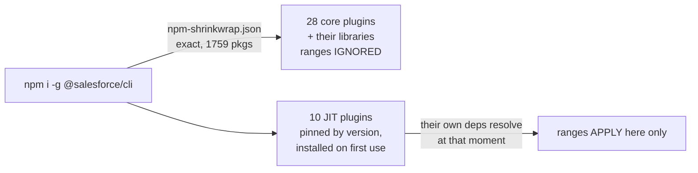

**Gotchas:**
- **`npm view … dependencies` is the wrong check** — it prints the caret ranges the shrinkwrap overrides. Use `npm ls @salesforce/source-deploy-retrieve` inside the installed CLI, or read `npm-shrinkwrap.json` in the tarball.
- **The pinning asymmetry recorded on 08-14 is retired for the CLI.** `sf` pins plugins *and* libraries. Plugin authors' caret ranges are advisory once Salesforce builds the lockfile.
- **JIT plugins are the one exception.** `oclif.jitPlugins` names 10 packages (`@salesforce/plugin-code-analyzer` 5.15.0, `plugin-lightning-dev` 6.2.18, `plugin-dev` 2.5.2 and seven more) at exact versions, installed on first use into the user plugins directory — their transitive dependencies resolve then, not at CLI install.
- **`sf plugins install` is also outside the shrinkwrap**, so a user-installed plugin can pull a newer library than the CLI core is running.
- The 12.x SDR line is still unpatched for both path escapes, and `plugin-deploy-retrieve` 3.x can never reach 13.x.

**Relevant to:** **Developer** — the version of SDR or `@salesforce/agents` you are running is decided by Salesforce's lockfile, not by your install date, so "I upgraded" answers nothing; **Architect** — CI images tracking `sf` `latest` inherit a security posture set by a lockfile, which makes "is this environment patched?" a per-CLI-version question with a fixed, readable answer; **Admin** — none.

**Study action:** run `npm pack @salesforce/cli@latest`, untar it, and `python3 -c "import json;d=json.load(open('package/npm-shrinkwrap.json'));print([ (k,v['version']) for k,v in d['packages'].items() if k.endswith('source-deploy-retrieve') ])"`. Repeat for `@latest-rc` and diff the two — that diff is your patch gap.

**Status:** Standing property of the published package, verified across `sf` 2.147.7 / 2.148.3 / 2.149.9 / 2.150.5, checked **2026-08-25 03:45 UTC**. Not an announcement; no Salesforce documentation of it located.

**Sources:** [npm registry metadata](https://registry.npmjs.org/@salesforce/cli) · [npm docs — npm-shrinkwrap.json](https://docs.npmjs.com/cli/v10/configuring-npm/npm-shrinkwrap-json) · [SDR CHANGELOG](https://github.com/forcedotcom/source-deploy-retrieve/blob/main/CHANGELOG.md)

---

## 2026-08-24 · `sf agent publish authoring-bundle` crashes on any Agent Script agent with a `connected_subagent` block

**What changed.** `@salesforce/agents` **2.0.6** (npm **2026-08-24 20:58:38 UTC**, PR [#350](https://github.com/forcedotcom/agents/pull/350)) guards `ScriptAgentPublisher` against nodes with no `tools` array. Before it, publishing any bundle containing a `connected_subagent` block threw `TypeError: Cannot read properties of undefined (reading 'map')`.

- **The mechanism.** `retrieveAgentMetadata` built its component list with `n.tools.map(...)` over every node. A `connected_subagent` block compiles to a **`related_agent`** node, which is a pure delegation stub and emits **no `tools` key at all**.
- **`tools` is now optional** in the `AgentJson` type; the node still yields its `GenAiPlugin:<developerName>` entry and simply contributes no `GenAiFunction:` entries.
- **The distinction that hid it.** The existing test covered `tools: []`. The crash needs the property *absent*, not empty.
- **It is not a `GoalBasedAgent`-only block.** The compiler's `delegate_escalation.agent` fixture uses `connected_subagent` under `agent_type: "AgentforceServiceAgent"` with `start_agent` — so conversational multi-agent scripts hit it too.

**Why it matters.** Agent Script 3.x (2026-08-19) made `connected_subagent` the way one agent dispatches to another, in both topologies. Five days later, the publish path for exactly that block did not work. The language surface and the deploy surface ship from different repositories on different cadences, and the gap is silent until you try to publish.

This is the **fifth** defect in `@salesforce/agents` 2.0.x in fifteen days, and the first outside `sf agent preview --api-name` — the pattern has moved from preview into publish.

**Gotchas:**
- **The failure is a `TypeError` from library code**, not a validation error, so it reads as a CLI bug rather than a script problem. Nothing names the offending block.
- **Reachability:** `@salesforce/plugin-agent` **2.0.5** (2026-08-24 21:52 UTC) ranges `@salesforce/agents` `^2.0.6`, and `sf` **`nightly` 2.150.5** pins 2.0.6 in its shrinkwrap. Because of the entry above, **stable `sf` cannot get this by range** — `latest` 2.148.3 pins 2.0.1.
- **Earliest stable landing is not 2026-08-26.** That Wednesday promotes the 2.149.x line, whose shrinkwrap pins `@salesforce/agents` **2.0.4**. The fix needs the 2.150.x line, so **2026-09-02** at the earliest.
- Workaround until then: publish from a `nightly` CLI, or from `sf agent publish` in a project whose `node_modules` you control.

**Relevant to:** **Developer** — every multi-agent Agent Script bundle is unpublishable from stable `sf` today, and the error names nothing useful; **Architect** — confirms that authoring-language capability and deployment capability are separately versioned, so "the language supports it" is not a delivery date.

**Study action:** write a two-block script — one `start_agent`, one `connected_subagent` with `target: "agent://Anything"` — and run `sf agent publish authoring-bundle` against a stable `sf` and against `npx @salesforce/cli@nightly`. Diff the two failures.

**Status:** Shipped — `@salesforce/agents` **2.0.6** and `@salesforce/plugin-agent` **2.0.5**, both 2026-08-24. On `sf` `nightly` **2.150.5** only; not on `latest` or `latest-rc` as of 2026-08-25 03:45 UTC.

**Sources:** [agents PR #350](https://github.com/forcedotcom/agents/pull/350) · [agents CHANGELOG](https://github.com/forcedotcom/agents/blob/main/CHANGELOG.md) · [agentscript `delegate_escalation.agent`](https://github.com/salesforce/agentscript/blob/main/packages/compiler/test/fixtures/scripts/delegate_escalation.agent)

---

## 2026-08-24 · SDR ships three releases in one day — 13.2.1 never reaches npm, and 13.2.2 carries a four-hour crash

**What changed.** `@salesforce/source-deploy-retrieve` cut **13.2.1**, **13.2.2** and **13.2.3** on 2026-08-24. Only two reached npm: `registry.npmjs.org/@salesforce/source-deploy-retrieve/13.2.1` returns **`version not found`** (checked 2026-08-25 03:39 UTC) despite release commit `f100ead` at 17:34 UTC.

- **13.2.1 — the real fix** ([#1817](https://github.com/forcedotcom/source-deploy-retrieve/pull/1817)): resolving a **decomposed Permission Set** directory returned a child file as the component. `BaseSourceAdapter` treated any `-meta.xml` whose folder name matched the `fullName` as the root; now the file's **suffix must match `type.suffix` or `type.legacySuffix`** first.
- **13.2.2 — `fix: linting post-fork-merge`** ([#1824](https://github.com/forcedotcom/source-deploy-retrieve/pull/1824)), npm 19:07 UTC. A lint-only commit, and the build that actually delivered #1817.
- **13.2.3 — the regression fix** ([#1823](https://github.com/forcedotcom/source-deploy-retrieve/pull/1823), `W-23924917`), npm 23:32 UTC. #1817 added a `readDirectory()` call on a computed component root; when that root is a *file*, `readdirSync` throws **`ENOTDIR`**.

**Why it matters.** For **4 hours 25 minutes**, `latest` on npm was a build where `sf project deploy` / `retrieve` crashed with `ENOTDIR` if a non-component file sat directly inside a bundle type directory — `force-app/main/default/lwc/README.md`, or a macOS `.DS_Store`. That is not an exotic project state.

Three guards went in, which is the useful part: `BundleSourceAdapter.populate` skips files whose `trimPathToContent` is not a directory, `MixedContentSourceAdapter.getRootMetadataXmlPath` returns `undefined` for a non-directory root, and `NodeFSTreeContainer.readDirectory` returns `[]` instead of throwing.

**Gotchas:**
- **No CLI was ever exposed.** Per the entry above, `sf` pins SDR in its shrinkwrap — `latest` 13.0.1, `latest-rc`/`nightly` 13.1.1. The bad window only reached direct consumers of the library and `@salesforce/plugin-deploy-retrieve` **4.1.2** (`^13.1.1`) installed standalone.
- **A version in the CHANGELOG is not a version on npm.** 13.2.1 has a `chore(release)` commit, a compare link and changelog prose, and no artifact. Check the registry, not the repo.
- **The Permission Set bug needs decomposition on.** It shows with the `decomposePermissionSetBeta2` preset, where `permissionsets/myPS/` holds both `myPS.permissionset-meta.xml` and children like `myPS.applicationVisibility-meta.xml`.
- Neither 13.2.x fix is in any `sf` channel yet.

**Relevant to:** **Developer** — resolving a decomposed Permission Set by directory now returns the parent, and a stray `README.md` in `lwc/` no longer kills the command; **Architect** — decomposed Permission Sets are safer to adopt as a source-format standard now that directory resolution is suffix-anchored.

**Study action:** in a project with `decomposePermissionSetBeta2` enabled, run `sf project deploy start -d force-app/main/default/permissionsets/<name>` on SDR 13.2.0 and 13.2.3 and compare which component each resolves. Then drop a `README.md` into `force-app/main/default/lwc/` and re-run on 13.2.2 to see the `ENOTDIR`.

**Status:** Shipped — `@salesforce/source-deploy-retrieve` **13.2.3** is npm `latest` (2026-08-24 23:32:24 UTC). **13.2.1 is unpublished.**

**Sources:** [SDR CHANGELOG](https://github.com/forcedotcom/source-deploy-retrieve/blob/main/CHANGELOG.md) · [PR #1817](https://github.com/forcedotcom/source-deploy-retrieve/pull/1817) · [PR #1823](https://github.com/forcedotcom/source-deploy-retrieve/pull/1823) · [npm registry metadata](https://registry.npmjs.org/@salesforce/source-deploy-retrieve)

---

## 2026-08-22 · `sf-pi` hides the managed Salesforce skill library from the model by default — 164 skills go `manual-only`

**What changed.** `sf-pi` **v0.272.0** (2026-08-22 17:21 UTC, [ADR 0108](https://github.com/salesforce/sf-pi/blob/main/docs/adr/0108-managed-skill-invocation-stamps.md), accepted 2026-08-21) stops wiring Pi to the `forcedotcom/sf-skills` git clone. Pi now loads a stamped copy at **`~/.pi/agent/sf-skills/effective/skills`**, and the default invocation mode for managed skills is **`manual-only`**.

- **The problem it names.** Every skill description is injected into `<available_skills>`, and at 164 skills that *"dominated first-turn context in measured sessions."*
- **The mechanism.** `disable-model-invocation: true` is stamped into the *effective* copy's `SKILL.md` frontmatter. A hidden skill still runs via `/skill:<name>`; it just leaves the system prompt.
- **Why a copy.** Stamping the clone would break `/sf-skills defaults update`, which is a `git pull --ff-only`. The clone stays pristine; the sidecar is restamped after every pull.
- **Where intent lives.** `sfPi.skillInvocation` in **global** settings, with three keys: `default`, `packs`, `skills`.

**Why it matters.** This is the first Salesforce tooling decision that treats its own skill catalogue as a **context cost** rather than a capability list. The catalogue grew 138 → 164 on 2026-08-21; the next release stopped showing it to the model. Growth in a skill library is not free, and Salesforce now says so in an ADR.

The precedence recorded on 08-11 — Skills → CLI → MCP — is untouched. What changed is **visibility**, not rank: a `manual-only` skill is not a demoted skill, it is an invisible one.

**Gotchas:**
- **Resolution order is fixed and short-circuits.** Author `disable-model-invocation: true` in the clone → always `manual-only`; then a per-skill override in `policy.skills`; then `origin === "community"` → **`agent-invocable`**; then a pack override; then `policy.default`.
- **Community skills stay visible, Salesforce's own do not.** The origin check sits *above* the pack and default checks, so third-party skills are agent-invocable while the managed library is hidden.
- **Fifteen packs, matched by name prefix** — `agentforce-`, `data360-`, `experience-`, `experience-ui-bundle` (checked first), `design-systems-`, `omnistudio-`, `automation-`, `integration-`, `commerce-`, `mobile-`, `service-`, `sales-`, `dx-`, `platform-`, and `other` as the empty-prefix fallback.
- **Wave 1 is global-only.** Stamps apply to every working directory; per-project effective trees are explicitly deferred.
- **The effective tree is deleted and re-copied** on each restamp (`rmSync` then `cpSync`) — do not edit anything under `effective/`.
- Only `agent-invocable` and `manual-only` are accepted; any other value in the settings map is silently dropped.

**Relevant to:** **Developer** — after upgrading, `agentforce-*` and `data360-*` skills stop being offered automatically and need `/skill:<name>` or a settings change; **Architect** — establishes context budget as a first-class constraint on skill-library design, which applies to any agent platform shipping a catalogue.

**Study action:** upgrade `sf-pi` past v0.272.0, run `/sf-skills toggle`, set `sfPi.skillInvocation.packs.agentforce` to `agent-invocable`, then `grep -c "disable-model-invocation" ~/.pi/agent/sf-skills/effective/skills/*/SKILL.md` and confirm the `agentforce-*` entries lost the stamp while the clone still has none.

**Status:** Shipped — `sf-pi` **v0.272.0**, 2026-08-22. ADR 0108 status `accepted`. Newest `main` commit `5e06c7a`, checked 2026-08-25 03:40 UTC.

**Sources:** [ADR 0108](https://github.com/salesforce/sf-pi/blob/main/docs/adr/0108-managed-skill-invocation-stamps.md) · [commit `fae2adb`](https://github.com/salesforce/sf-pi/commit/fae2adb36cd32688eda63968ea23a604ca681031) · [sf-pi CHANGELOG](https://github.com/salesforce/sf-pi/blob/main/CHANGELOG.md)

---

## 2026-08-21 · Salesforce ITSM becomes a four-track setup program — and its Microsoft Teams toggle is a preference no API can write

**What changed.** `forcedotcom/sf-skills` **1.41.0** (2026-08-21 14:48:27 UTC, commit `a9b698b`, *"Release 26 new + 11 updated skills"*) grows the six-skill CMDB set recorded on 08-14 into a full ITSM program — a top-level orchestrator over four tracks, and **18 new `service-itsm-*` skills**.

- **The tracks**, declared in `service-itsm-agentic-setup-configure`:
  1. **Incident Management** → `service-itsm-agentic-setup-incident-management` (SLA & Milestones)
  2. **Agentforce for ITSM** → `service-itsm-agentic-setup-agentforce-coordinate` (Studio enablement, Fulfiller Agent, Employee Agent)
  3. **CMDB** → `service-itsm-agentic-setup-cmdb-coordinate`
  4. **Microsoft Teams** → `service-itsm-teams-coordinate` (IT Desk, IT Service, Swarming)
- **Prerequisites sit in the sub-orchestrator, never at the top level** — deliberately, so the track menu still runs on a bare org where none of the gates exist yet.
- **A new identity chain arrives with it: the Unified Employee License (UEL).** `service-itsm-agentic-setup-uel-user-create` provisions four linked records — a `User` on the Unified Employee profile, a Person `Account`, its auto-generated `PersonContact`, and an `Employee2`.
- **Every ITSM track dispatches through the hosted `headless-360` MCP server**, not the CLI — see the [companion entry](#2026-08-21--sf-skills-1410--the-hosted-headless-360-dispatcher-goes-from-4-skills-to-14-and-one-skill-now-forbids-the-cli).

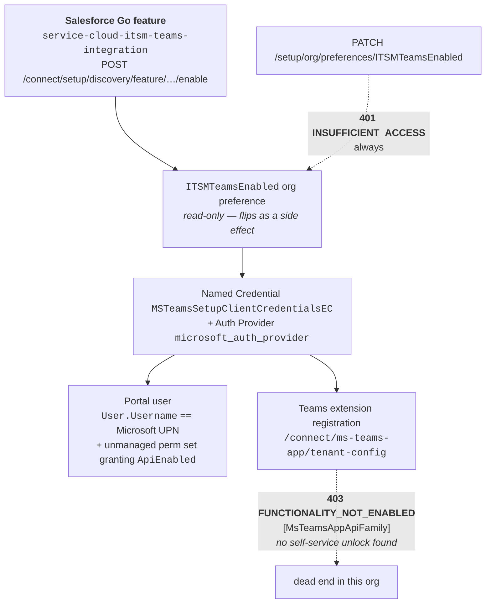

**Why it matters.** The CMDB entry established that a Go toggle flips as a side effect of a feature enable. Teams gives that pattern its mechanism and its failure mode: `ITSMTeamsEnabled` is unwritable by definition, and the API answers `401` — which reads like a credentials problem and is not one. Any runbook that PATCHes a Go page preference is wrong by construction.

**Gotchas:**
- **`PATCH /services/data/vXX.0/setup/org/preferences/ITSMTeamsEnabled` always returns `401 INSUFFICIENT_ACCESS`** (`"Cannot update preference value!"`; the GET says `"Cannot read data!"`). Its UDD definition `ServiceItsmTeams.settings.xml` declares `orgAccess="always"` with **no `editAccess` attribute** — unlike `Notifications` / `TeamsNotifications`, which set `editAccess="always"`. Do not retry with other API versions or bodies.
- **The working path is the feature, not the preference:** `POST /services/data/v67.0/connect/setup/discovery/feature/service-cloud-itsm-teams-integration/enable`, then re-read status via `POST /connect/setup/discovery/features/status`.
- **`/enable` can return `500 INTERNAL_ERROR` and still have succeeded.** Re-check `features/status` and the preference read before reporting failure.
- **`/connect/ms-teams-app/tenant-config` returns `403 FUNCTIONALITY_NOT_ENABLED [MsTeamsAppApiFamily]` with no self-service unlock.** Seven candidate Go feature names all answer `400 NOT_FOUND`, and none of the org's 112 `PermissionSetLicense`s grant it — `TeamsForEmployeePsl` and `TeamsForITSrvcsPsl` do not. This is the same blocker as the *"Unable to fetch tenant ID"* error.
- **Portal SSO matches `User.Username`, not `User.Email` and not `FederationIdentifier`.** The Apex handler **`MsTeamsItsmSSOHandler`** runs `SELECT Id FROM User WHERE Username = :data.email`, `canCreateUser` is false (no JIT), and both 0 and >1 matches deny login. **One handler serves both** the IT Desk (Fulfiller) and IT Service (Employee) apps.
- **Register the Azure redirect URI under the *Web* platform, not SPA.** `microsoft_auth_provider` is a confidential client; an SPA registration fails at `/services/authcallback/microsoft_auth_provider` with `OAUTH_APPROVAL_ERROR_GENERIC` *after* Salesforce has already written a successful `LoginHistory` row.
- **`AuthProvider.ConsumerSecret` is not `updateable`** — no Connect PATCH and no headless-360 route writes it. Deploy it as source-format metadata (`sf project deploy start --source-dir`), where `<consumerSecret>` round-trips.
- **`TeamsForEmployeeUser` and `EmployeeHubEmployeeUser` are managed, uneditable, and do not grant `ApiEnabled`** — without it the embedded portal's Connect calls return `API_DISABLED_FOR_ORG`. Add an unmanaged permission set with `ApiEnabled` only, and **do not add `ChatterInternalUser`**: the Unified Employee license rejects the assignment.
- **A UEL user carries exactly one permission set** — `Employee Hub Unified Employee User` (`EmployeeHubEmployeeUser`). Fulfiller and case-agent sets belong to Service Cloud fulfillers, not Employee Hub requesters.
- **Swarming is a separate Go feature**, `service-cloud-swarming`; `service-itsm-swarming-configure` enables it *and* writes `SWARM_COLLABORATION_TOOL = "Teams"`.
- **The Azure app registration and admin consent have no Salesforce API.** The Go page's consent link is Salesforce's own static multi-tenant app (`client_id=cd6bd63f-41ef-47cc-9465-86e986179a29`, scope `Organization.ReadWrite.All`) — not the app the customer registers, and not per-org.

**Relevant to:** **Admin** — Teams for Employee Service is enabled through a feature call, never the toggle, and the portal user needs a hand-built `ApiEnabled` permission set; **Architect** — `MsTeamsAppApiFamily` is an edition/licence gate with no found unlock, so Teams extension registration is a go/no-go question about the org before it is a design question; **Developer** — every endpoint, error code and handler class above is named exactly.

**Study action:** in a dev org, `PATCH /services/data/v67.0/setup/org/preferences/ITSMTeamsEnabled` with `{"desiredState": true}` and confirm the `401`; then `POST /connect/setup/discovery/features/status` for `service-cloud-itsm-teams-integration` and compare the two responses. That is the whole lesson in two calls.

**Status:** Shipped — `forcedotcom/sf-skills` **1.41.0** (2026-08-21), Apache-2.0 on GitHub. No Salesforce announcement accompanied it. The Teams gotchas are the skill authors' own verified session notes, not documentation — treat them as field reports.

**Sources:** [`service-itsm-teams-configure/references/gotchas.md`](https://github.com/forcedotcom/sf-skills/blob/1.41.0/skills/service-itsm-teams-configure/references/gotchas.md) · [`service-itsm-agentic-setup-configure/SKILL.md`](https://github.com/forcedotcom/sf-skills/blob/1.41.0/skills/service-itsm-agentic-setup-configure/SKILL.md) · [`service-itsm-agentic-setup-uel-user-create/SKILL.md`](https://github.com/forcedotcom/sf-skills/blob/1.41.0/skills/service-itsm-agentic-setup-uel-user-create/SKILL.md) · [commit `a9b698b`](https://github.com/forcedotcom/sf-skills/commit/a9b698b)

---

## 2026-08-21 · `sf-skills` 1.41.0 — the hosted `headless-360` dispatcher goes from 4 skills to 14, and one skill now forbids the CLI

**What changed.** The same release takes the catalogue **138 → 164 skills** (+26, none removed) — the largest single release this radar has read. Skills declaring `mcpTools` go **13 → 24**, and **14 of those 24 name `headless-360`**, up from 4 at 1.40.0.

- **`experience-portal-create` is the first non-ITSM `headless-360` skill** — and the first skill in the catalogue to rule the CLI out in writing: *"Do not use the Salesforce CLI (its `api request`, `data query`, or `org open` subcommands)… `dispatch`/`dispatch_readonly` is the only way this skill talks to the org."*
- **It creates Experience Cloud sites end to end** through the Connect API dispatcher — Aura or LWR, Network activation to `status: Live`, member profiles, page publish — and refuses to build a legacy Tabs+Visualforce site.
- **The stale catalogue is fixed, one release late.** 1.40.0 still shipped `publicRelease.releaseRef: "1.38.0"` / `counts.public: 138`; 1.41.0 ships **`1.41.0` / 164**, with `visibleUnion` 148 → 174 and the bundled plugin `salesforce-development` at **1.12.0** (was 1.11.0).
- **Three notable non-ITSM additions:** `platform-datamask-run`, `platform-trial-org-create`, `service-concierge-portal-generate`.

**Why it matters.** The 08-11 entry read the plugin's **Skills → CLI → MCP** precedence as Salesforce ranking its own CLI above its own hosted MCP. 1.41.0 says that ordering governs *instruction* sources, not execution. Where `headless-360` covers the surface, the newest skills dispatch through it and one forbids the CLI outright — the hosted server is becoming the default execution path for setup work.

**Gotchas:**
- **`platform-datamask-run` is sandbox-only** — the Data Mask run/abort REST endpoints return **`403` on production** via a runtime sandbox guard. Perms `PermissionsManageDataMaskPolicies` and `PermissionsAccessDataMaskAndSeed`; objects `DataMaskPolicy` and `DataMaskPolicyJobRun`.
- **There is no trial-org signup endpoint.** `platform-trial-org-create` inserts a **`SignupRequest`** sObject (key prefix `0SR`) against an authenticated, entitled host org; creation is asynchronous, so the org id appears on a second read. An unentitled org fails with `NOT_FOUND` or `INVALID_TYPE` — *"sObject type 'SignupRequest' is not supported"* — not a permission error, so do not diagnose it as one.
- **`dispatch` still resolves no API version** — pass the full `/services/data/vXX.0/…` prefix every time.
- **Still no `data360-*` MCP server anywhere.** Checked across all 164 `SKILL.md` files at 2026-08-22 03:00 UTC: zero `mcpTools` entries name a Data 360 server, and `forcedotcom/d360-mcp-server` has not moved since **2026-07-02**. The 08-19 announcement's *"prebuilt Data 360 Skills, GA targeted August 2026"* has no artifact here with nine days of August left.
- **The misnamed package survives a third release.** `data360-code-extension-generate` still emits `sf plugins install @salesforce/plugin-data-codeextension` **four times**; the real package is `@salesforce/plugin-data-code-extension` (**1.4.1**).
- **`compatibility:` has not returned** — zero occurrences repo-wide at 1.41.0, three releases after 1.39.0 deleted it.
- **The npm licence contradiction is unchanged** — `@salesforce/afv-skills` 1.41.0 declares `"license": "CC-BY-NC-4.0"` with an Apache-2.0 `LICENSE.txt` in the same tarball. **28 consecutive versions.** Take the skills from GitHub for anything billable.

**Relevant to:** **Architect** — the execution path for first-party setup automation is shifting from the CLI to a hosted MCP dispatcher, which changes what an agent needs (an OAuth session, not a CLI install) and where the org binding lives; **Developer** — the catalogue ref that pins `npx skills add` is current for the first time since 1.32.0, so a guarded install finally matches the tree.

**Study action:** clone `forcedotcom/sf-skills` at 1.41.0 and run `grep -l 'headless-360:' skills/*/SKILL.md | wc -l` against the same command at tag 1.40.0 — then open `experience-portal-create/references/mcp-invocation.md` and compare its call shapes with the `sf` commands the older `experience-lwr-site-generate` emits for the same job.

**Status:** Shipped — `forcedotcom/sf-skills` **1.41.0**, npm `@salesforce/afv-skills` 1.41.0 (2026-08-21 14:49:05 UTC). Repo Apache-2.0; npm manifest CC-BY-NC-4.0. One further commit, `2476476` (21:14 UTC), is unreleased.

**Sources:** [npm `@salesforce/afv-skills`](https://www.npmjs.com/package/@salesforce/afv-skills) · [`experience-portal-create/SKILL.md`](https://github.com/forcedotcom/sf-skills/blob/1.41.0/skills/experience-portal-create/SKILL.md) · [`platform-datamask-run/SKILL.md`](https://github.com/forcedotcom/sf-skills/blob/1.41.0/skills/platform-datamask-run/SKILL.md) · [`discovery.json` at 1.41.0](https://github.com/forcedotcom/sf-skills/blob/1.41.0/plugins/builder/salesforce-development/catalog/discovery.json)

---

## 2026-08-20 · Winter '27's v68 metadata roster keeps growing — 59 to 71 types, and five of them are a `TenantSecurity*` playbook family

**What changed.** `@salesforce/source-deploy-retrieve` regenerates `METADATA_SUPPORT.md` on a nightly bot schedule. Its **`## Next Release (v68)`** section — the source that confirmed Winter '27 is API 68.0 on 08-13 — has grown from **59 types to 71** since 13.1.1, in two auto-update commits after the release notes went live.

- **12 types added**, only one of them DX-supported:
  - **`TenantSecurityPlaybookDef`, `TenantSecurityPlaybookDefStep`, `TenantSecurityPlaybookDefVer`, `TenantSecurityStepDef`, `TenantSecurityStepDefVer`** — a five-type security-playbook family, added together in commit `eb6a715` (2026-08-20 22:09 UTC)
  - `MessagingMobileAppChannel`, `MessagingMobileAppChannelButton`, `MessagingMobileAppChannelButtonSet`, `MobileAppNewsflashTopic`, `ReplyEmailConfig`, `EngmtChannelTypeConfig` — all marked *"not for tracking"*
  - `DiscoSettings` — the only ✅
- **The support ratio got worse:** 21 supported of 59 on 08-13, **22 of 71** now.
- **`TenantSecurityPlaybook` has zero mentions** anywhere in this study base, in the Winter '27 release notes this radar has read, or in any located Salesforce source.

**Why it matters.** The v68 type list is not a release-time snapshot that stopped moving when the notes published — it is a generated file that changes overnight. A five-type playbook family appearing three weeks before the first production upgrade weekend is a governance surface arriving with no announcement, and the radar found it because the file is on the weekly list, not because anyone said anything.

**Gotchas:**
- **Timestamp every count you quote from this file.** It is rewritten by `chore: auto-update metadata coverage in METADATA_SUPPORT.md [no ci]` on a nightly schedule; "59 v68 types" was true on 08-13 and wrong by 08-20.
- **`git log` on the file overstates change.** Commit `ac2a8fe` (2026-08-21 22:07 UTC) is **915 insertions / 913 deletions and alters no type** — a Prettier table reflow of all 1,828 lines. Diff type names, not line counts.
- **❌ means no source-format support**, so `sf project retrieve start` / `deploy start` cannot handle those types at all — 11 of the 12 arrivals are in that state, including the whole `TenantSecurity*` family.
- **`13.2.0` (npm 2026-08-19 16:56:15 UTC) carries one feature**, unrelated to the roster: `stdValueSetRegistry.json` is now exported from the package's main `index.ts` so callers outside the repo can read the standard value sets.

**Relevant to:** **Architect** — a new security-playbook metadata family in the next release, with no documentation, is worth knowing about before someone designs around its absence; **Developer** — 11 of the 12 new types cannot be moved through source format, so any Winter '27 work touching them is Metadata API or Setup UI, not `sf project deploy`.

**Study action:** clone `forcedotcom/source-deploy-retrieve`, then `git diff 52a47b4 HEAD -- METADATA_SUPPORT.md` to see exactly which v68 types arrived and when; re-run it each week rather than trusting the count recorded here.

**Status:** Generated repository artifact, not an announcement — `METADATA_SUPPORT.md` on `main`, newest content change **2026-08-20 22:09 UTC** (`eb6a715`), checked 2026-08-22 03:10 UTC. Package `@salesforce/source-deploy-retrieve` `latest` **13.2.0**.

**Sources:** [`METADATA_SUPPORT.md`](https://github.com/forcedotcom/source-deploy-retrieve/blob/main/METADATA_SUPPORT.md) · [commit `eb6a715`](https://github.com/forcedotcom/source-deploy-retrieve/commit/eb6a715) · [npm `@salesforce/source-deploy-retrieve`](https://www.npmjs.com/package/@salesforce/source-deploy-retrieve)

---

## 2026-08-19 · Salesforce expands Headless 360 — and the Data 360 Skills it says go GA this month are the ones running on a 3-star personal repo

**What changed.** Salesforce published *"Expanding Headless 360: Enterprise Capabilities"* on 2026-08-19 — the **first Salesforce product announcement this radar has caught in sixteen scans**. It names a hosted **Data 360 MCP Server** (~200 APIs), **prebuilt Data 360 Skills with GA targeted August 2026**, a **Slackbot MCP Client** across 20+ partner apps, and an **Agentforce Experience Layer**.

- **The Data 360 MCP Server itself is not new here** — it is written up at [Data 360 MCP Server](#2026-07-29--data-360-mcp-server--200-rest-operations-behind-three-facade-tools). What is new is the **hosted** delivery and the Skills layer above it.
- **Slackbot MCP Client** now reaches **20+ partner applications**, Docusign, Notion and Zoom named, "retaining existing permissions and data boundaries".
- **Agentforce Experience Layer** separates what an agent does from how it renders — a component returned by an agent renders natively in Slack, Teams, ChatGPT, Claude, Gemini "or any MCP-compatible client". **Zero mentions study-base-wide** before today.

**Why it matters.** Read against yesterday's finding, the announcement is a warning rather than a feature. The seven `data360-*` skills shipping in `forcedotcom/sf-skills` today bottom out in `Jaganpro/sf-cli-plugin-data360` — MIT, 3 stars, unsupported by its own README. *"Prebuilt Data 360 Skills, GA this month"* and *"the Data 360 skills you can install today"* are **not the same artifact**, and neither source names the other.

**Gotchas:**
- **The public preview server has not moved.** `forcedotcom/d360-mcp-server` newest `main` commit is **`c02edab`, 2026-07-02 05:51 UTC**, checked 2026-08-20 03:39 UTC. Its README still says *Developer Preview*, STDIO-only, "single user/org context per process", with the GA version *"slated to be provided as a hosted and managed Salesforce Platform MCP server"*. The announcement did not ship into this repo.
- **The hosted `headless-360` server is still labelled Beta.** Its reference page is titled *"Headless 360 (Beta)"* as of 2026-08-20 — so the 08-16 finding that consumers declare `semver: ">=1.0.0"` still does not mean GA.
- **The README's numbers beat the press release's.** `d360-mcp-server` documents **201 operations in 22 tool families** behind the three facade tools — SDM 38, Query 16, Connection 11, Calculated Insights 10, Retriever 10, Activation 10 — against the announcement's round "~200 APIs". Size a design against the family table, not the headline.
- **"Targeted for August 2026" is a target.** No SKU, no permission-set name, no enablement step and no first-party doc page for the Skills layer was reachable; treat the date as unverified.

**Relevant to:** **Architect** — it decides whether "agents can reach Data 360" is a design you can commit to this quarter, and the answer is still Developer Preview plus an unsupported community plugin; **Developer** — the 22-family / 201-operation table is the real capability list behind the three facade tools; **Admin** — the Slackbot MCP Client's 20+ partner apps run under existing permissions, so the org's sharing model becomes the control surface for all of them.

**Study action:** clone `forcedotcom/d360-mcp-server`, read the 22-family table in its README, and mark which families the seven `sf-skills` `data360-*` skills actually cover. The gap is the honest answer to "can I hand Data 360 to an agent today?" — and it is a different answer from the announcement's.

**Status:** Announced 2026-08-19. Data 360 MCP Server: **Developer Preview** in the public repo, hosted GA claimed but unverified. Data 360 Skills: **GA targeted August 2026**, unshipped as of 2026-08-20 03:42 UTC. Headless 360 MCP Server: **Beta**. Agentforce Experience Layer: announced, no surface located.

**Sources:** [Expanding Headless 360: Enterprise Capabilities](https://www.salesforce.com/news/stories/expanding-headless-360-enterprise-capabilities/) · [`forcedotcom/d360-mcp-server`](https://github.com/forcedotcom/d360-mcp-server) · [Headless 360 (Beta) — Hosted MCP Servers reference](https://developer.salesforce.com/docs/platform/hosted-mcp-servers/guide/headless-360-mcp.html) · [Salesforce expands Headless Data 360 for MCP — SiliconANGLE](https://siliconangle.com/2026/08/19/salesforce-expands-headless-data-360-mcp-developers-can-bring-insights-agents/) · [Salesforce Latest Headless 360 Expansion — CX Today](https://www.cxtoday.com/crm/salesforce-headless-360-expansion-agentic-cx/)

_All first-party pages (`salesforce.com`, `developer.salesforce.com`) and `siliconangle.com` returned **EGRESS_BLOCKED** at 03:38–03:40 UTC. Everything above is from search-result snippets except the `d360-mcp-server` facts, which are from a clone._

---

## 2026-08-18 · Two more `--api-name` preview defects in `@salesforce/agents` — the published-agent path is a second client, and it keeps arriving incomplete

> **Correction (2026-08-25):** the 08-20 correction below said "a fresh stable install resolves **2.0.5** and still gets all four fixes by range, not by pin." **It does not.** `@salesforce/cli` publishes an `npm-shrinkwrap.json`, and `sf` `latest` **2.148.3** pins `@salesforce/agents` **2.0.1** exactly — so stable carries the `bypassUser` fix and **none of the other three**. `latest-rc` 2.149.9 pins 2.0.4 (all four) and lands on `latest` at the **2026-08-26** promotion. The count of user-facing `--api-name` defects stays at four; a **fifth**, in the *publish* path, is recorded at [2026-08-24](#2026-08-24--sf-agent-publish-authoring-bundle-crashes-on-any-agent-script-agent-with-a-connected_subagent-block).

**What changed.** `@salesforce/agents` **2.0.3** and **2.0.4** published 2026-08-18, six minutes apart (01:24:00 and 01:30:47 UTC). Both fix `sf agent preview --api-name`. That is **four defects in nine days** in one code path, plus one unrelated validation change.

- **2.0.4 — `--api-name` previews had no reasoning trace at all.** `ProductionAgent.getTrace()` returned `undefined` unconditionally. It now GETs `v1.1/preview/sessions/{sessionId}/plans/{planId}`, built by stripping the trailing `/v1` from the agent's `apiBase`, exactly as `ScriptAgent` already did. (PR [#340](https://github.com/forcedotcom/agents/pull/340))
- **2.0.3 — a missing header changed the response format.** `x-attributed-client: 'no-builder'` was not sent on session start (`POST /sessions`), alongside the existing `x-client-name: 'afdx'`. Its documented effect is that it **removes markdown from responses**. (PR [#338](https://github.com/forcedotcom/agents/pull/338))
- **2.0.3 — `createSpec` stops silently dropping input.** `groundingContext` passed without `promptTemplateName` was accepted and discarded; it now throws `GroundingContextRequiresPromptTemplateError`. (PR [#339](https://github.com/forcedotcom/agents/pull/339))

**The four defects, all in the same place:**

| Version | Date | `--api-name` was… | Symptom |
|---|---|---|---|
| 2.0.1 | 2026-08-10 | hard-coding `bypassUser: true` | employee-agent preview died on `400 Invalid user ID` |
| 2.0.2 | 2026-08-14 | dropping context variables | agent behaved as if the variables were unset |
| 2.0.3 | 2026-08-18 | omitting `x-attributed-client` | responses came back with markdown the builder path strips |
| 2.0.4 | 2026-08-18 | never fetching plans | no reasoning trace to debug a routing decision with |

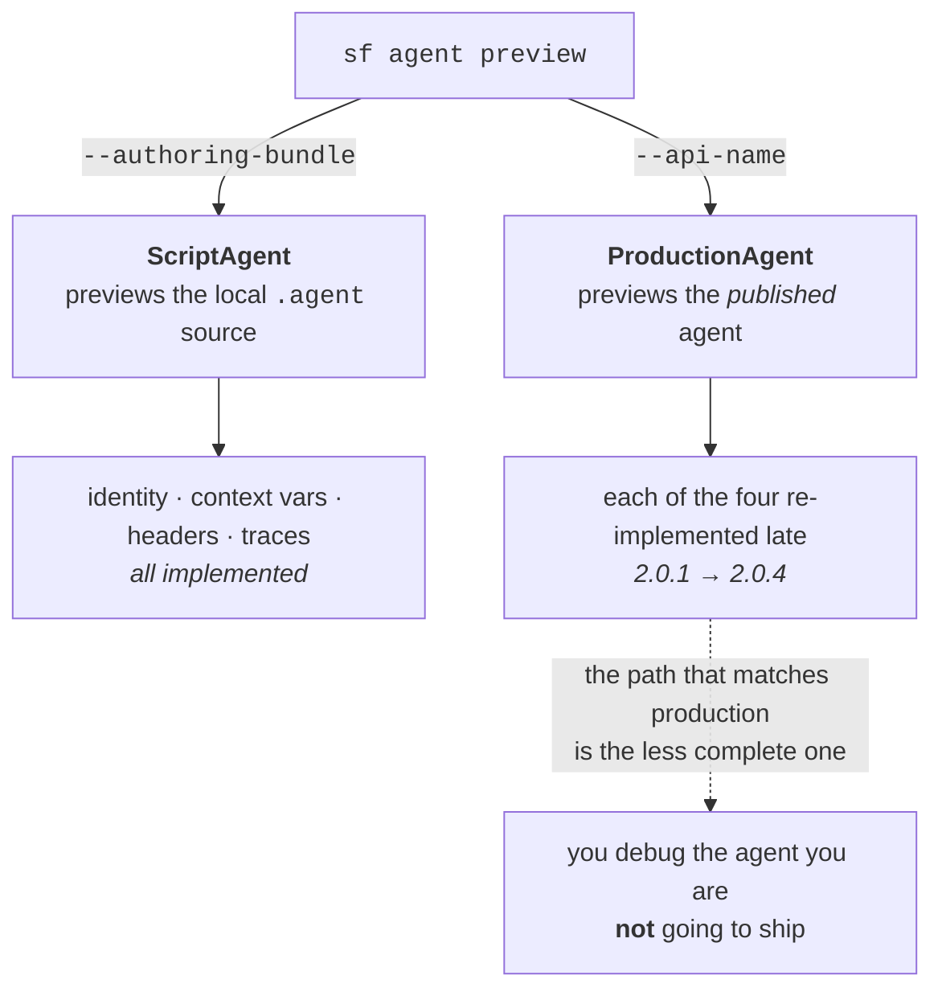

**Why it matters.** Previewing a published agent and previewing an authoring bundle are two different client classes, and the one that mirrors what users will actually hit is the one that has been under-implemented. Every defect here is silent: nothing errors, the preview just behaves unlike the real thing. Absent traces are the worst of the four — you conclude the agent has no reasoning rather than that the CLI never asked for it.

**Gotchas:**
- **Reachability runs on the range, not the pin.** Stable `sf` **2.147.7** pins `@salesforce/plugin-agent` **2.0.0**, which ranges `@salesforce/agents` **`^2.0.0`** — so a *fresh* install resolves **2.0.4** and gets all four fixes today. An existing `node_modules` or a lockfile does not.
- **`^2.0.0` permits the fix; `^2.0.4` compels it.** Only `plugin-agent` **2.0.3** carries the compelling floor, and it ships in `sf` **`nightly` 2.149.8+** only. `latest-rc` **2.148.3** pins `plugin-agent` 2.0.1 (`^2.0.1`).
- **`getTrace` failures are swallowed by design** — `await this.getTrace(planId).catch(() => undefined)`. A trace that does not appear may be a permission or endpoint problem, not an agent that did not reason.
- **The `createSpec` throw is a breaking change for callers**, not just a guard: a spec generator that has always passed `groundingContext` with no `promptTemplateName` worked (uselessly) until 2.0.3 and now fails.

**Relevant to:** **Developer** — `sf agent preview --api-name` is the command you debug published agents with, and four of its behaviours have differed from the authoring-bundle path over nine days; the fixes reach you only on a fresh dependency resolve.

**Study action:** in a dev org with one published agent, run `sf agent preview --api-name <ApiName>` on a freshly installed `sf`, confirm a reasoning trace is emitted, then run `npm ls @salesforce/agents` inside the CLI install and check the resolved version is ≥ 2.0.4. Repeat the same prompt through `--authoring-bundle` and diff the two transcripts for markdown.

**Status:** Shipped — npm `@salesforce/agents` **2.0.3** and **2.0.4**, both 2026-08-18; `@salesforce/plugin-agent` **2.0.3** (2026-08-18 17:24:25 UTC) ranges `^2.0.4`. No `sf` stable or release-candidate build pins that plugin version as of 2026-08-19 03:37 UTC.

> **Correction (2026-08-20):** the two Gotchas above are re-baselined by the dist-tag move. `latest` is now **2.148.3**, which pins `plugin-agent` **2.0.1** ranging `@salesforce/agents` **`^2.0.1`** — so a fresh stable install resolves **2.0.5** (2026-08-19 21:58 UTC) and still gets all four fixes by range, not by pin. `plugin-agent` **2.0.4** (2026-08-19 20:25 UTC) ranges `^2.0.4` and rides `latest-rc` **2.149.9** / `nightly` **2.150.0**, so the *compelling* floor reaches stable no earlier than **2026-08-26**. **2.0.5 is not a fifth defect** — it fixes the library's own NUTs (`getAllTraces` "history never created" and create-user, PR [#345](https://github.com/forcedotcom/agents/pull/345)); the count of user-facing `--api-name` defects stays at four.

**Sources:** [`forcedotcom/agents` CHANGELOG](https://github.com/forcedotcom/agents/blob/main/CHANGELOG.md) · [commit `0f1babb` — plans endpoint](https://github.com/forcedotcom/agents/commit/0f1babb5166e16e55f32cf90fd049af35b35fcda) · [commit `3701ca9` — `x-attributed-client`](https://github.com/forcedotcom/agents/commit/3701ca9b185aff4f534e527130379d338e6ba1c5) · [commit `bcea0e6` — `createSpec` validation](https://github.com/forcedotcom/agents/commit/bcea0e61e93c9d01895e16d43f3664d9316bce2d) · [npm `@salesforce/plugin-agent`](https://www.npmjs.com/package/@salesforce/plugin-agent)

---

## 2026-08-17 · `sf-skills` regenerates a capability catalogue frozen six releases back — and the install command it emits was pinned to the stale snapshot

> **Correction (2026-08-22):** this entry said 1.39.0 and 1.40.0 both declare `releaseRef: "1.38.0"` / 138 skills, which was accurate — but it read the 1.39.0 regeneration as a fix. It was not: at 1.40.0 the catalogue was **already one release stale again**. **1.41.0 is the first release to ship a catalogue describing itself** — `releaseRef: "1.41.0"`, `counts.public: 164`, `visibleUnion: 174`. The lag is a property of the generator's schedule, not a one-off, so the Gotcha below — *read `publicRelease.releaseRef` before trusting a count* — stands, and today it happens to read true. `metadata.domains` still appears **zero** times in `discovery.json`.

**What changed.** `sf-skills` **1.39.0** (2026-08-17 09:37:27 UTC) regenerated the plugin's discovery catalogue at `plugins/builder/salesforce-development/catalog/discovery.json`. `publicRelease.releaseRef` moved **1.32.0 → 1.38.0** and `counts.public` **102 → 138**. **1.40.0** (2026-08-18 17:18:08 UTC) then added a fifth frontmatter field, `metadata.domains`.

- **The catalogue is a snapshot, and it had stopped tracking the tree it ships in.** Fetched at each tag: **1.36.0, 1.37.0 and 1.38.0** all declare `releaseRef: "1.32.0"`, commit `7baeb07b`, **102** public skills. **1.39.0 and 1.40.0** declare `1.38.0`, commit `ba78d387`, **138**.
- **The stale ref reached the install command.** `platform-capability-search` will only install a skill whose catalogue-emitted `installInstruction` matches, exactly, `npx skills@1.5.20 add forcedotcom/sf-skills#1.38.0 --skill <name> --agent claude-code --yes` — where `#<ref>` *is* `publicRelease.releaseRef`.
- **`metadata.domains` lands on all 138 catalogue skills** — 109 single-valued, 27 with two, 2 with three; 14 distinct values.
- **It is a second taxonomy, not the one the search command uses.** `domains` appears **zero** times in `discovery.json`, which keeps its own singular, lowercase, name-prefix-derived `domain` (one per skill).

**The two taxonomies, side by side:**

| | `SKILL.md` → `metadata.domains` | `discovery.json` → `domain` |
|---|---|---|
| Cardinality | 1–3 per skill | exactly 1 |
| Form | Title Case, spaced — `"Data 360"`, `"Developer Experience"` | lowercase slug — `data360`, `dx` |
| Derivation | curated | the skill-name prefix (0 exceptions in 148) |
| Read by | nothing yet | `sf-context discovery domain <domain>` |

Values in use: `Platform` 66 · `Experience` 36 · `Developer Experience` 29 · `Agentforce` 19 · `Data 360` 15 · `Service` 10 · `OmniStudio` 8 · `Integration` 4 · `Design Systems` 4 · `Automation` 4 · `Mobile` 3 · `Commerce` 3 · `Sales` 1 · `External` 1.

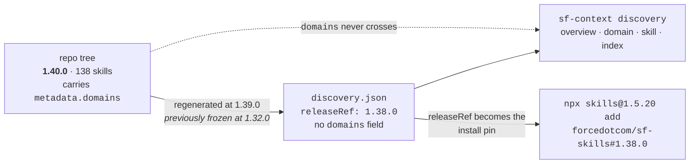

**Why it matters.** The plugin advertises "installed-versus-available capability discovery", and both halves of that answer come from one generated file that is refreshed on its own schedule. While it sat at 1.32.0, the guarded add flow was pinning every install to a fortnight-old release — a wrong-version install with no error and no warning. `releaseRef` is the only field that admits it.

**Gotchas:**
- **Read `publicRelease.releaseRef` before trusting a count.** `counts.public` describes the snapshot, not the release you installed. Today: catalogue `1.38.0`, tree `1.40.0`.
- **A skill missing from the catalogue is not installable through the plugin at all.** The flow continues only on `status: "available"`, `publicAvailable: true`, `foundationInstalled: false` — so the 36 skills added between 1.32.0 and 1.38.0 were unreachable that way until 08-17.
- **The installer is pinned too** — `npx skills@1.5.20`, fixed in the skill text, not resolved.
- **`domains` and `domain` are not interchangeable.** `sf-context discovery domain data360` resolves; `sf-context discovery domain "Data 360"` does not.
- **10 `SKILL.md` files carry no `domains`** — all of them foundation-only plugin skills, matching `counts.foundationOnly: 10` (`platform-capability-search`, `platform-quick-deploy`, `dx-project-create` and seven more).
- **`domains` never contradicts the prefix** — 0 of 138 omit their prefix-derived domain, so it only ever *adds*. Treat it as secondary labels, not a re-classification.
- **1.39.0 also deleted a prerequisite declaration**, not just refreshed the catalogue — see [data-360.md](data-360.md#2026-08-17--the-seven-data360--skills-run-on-an-unofficial-community-cli-plugin--and-1390-deleted-the-line-that-said-so) for the `compatibility:` removal across the seven `data360-*` skills.

**Relevant to:** **Developer** — the skill version the plugin installs comes from `releaseRef` rather than the release you cloned, and the new domain field is invisible to the only command that searches by domain.

**Study action:** install `salesforce-development@claude-plugins-official`, run `${CLAUDE_PLUGIN_ROOT}/scripts/sf-context discovery overview`, and compare the release ref it prints against the newest tag on `forcedotcom/sf-skills`. Then clone the repo and run `grep -h '^  domains:' skills/*/SKILL.md | sort | uniq -c` to build the taxonomy the catalogue does not carry.

**Status:** Shipped — `forcedotcom/sf-skills` **1.39.0** (2026-08-17) and **1.40.0** (2026-08-18); npm `@salesforce/afv-skills` at the same versions; bundled plugin `salesforce-development` now **1.11.0** (was 1.10.0 on 08-11). No Salesforce announcement accompanied either release. `metadata.domains` is the **fifth** field in the dependency contract tabled under [the `mcpTools` entry](#2026-08-14--headless-360-appears-in-skill-frontmatter--and-the-hosted-server-turns-out-to-be-four-meta-tools-not-a-tool-catalogue), and it is undocumented — no schema, README or validation script defines its allowed values.

**Sources:** [sf-skills CHANGELOG](https://github.com/forcedotcom/sf-skills/blob/main/CHANGELOG.md) · [commit `1db8f4e` — `metadata.domains`](https://github.com/forcedotcom/sf-skills/commit/1db8f4eff426ccadfb67a2a751c07a683901ab39) · [`platform-capability-search/SKILL.md`](https://github.com/forcedotcom/sf-skills/blob/main/plugins/builder/salesforce-development/skills/platform-capability-search/SKILL.md) · [`discovery.json` at 1.38.0](https://github.com/forcedotcom/sf-skills/blob/1.38.0/plugins/builder/salesforce-development/catalog/discovery.json) · [npm `@salesforce/afv-skills`](https://www.npmjs.com/package/@salesforce/afv-skills)

---

## 2026-08-14 · Service Cloud ITSM CMDB gets a six-skill setup path — and it publishes the five-layer gate behind one error code

**What changed.** `forcedotcom/sf-skills` **1.38.0** (2026-08-14, 17 new + 21 updated skills, 121 → **138** skills) adds six `service-itsm-*` skills. Five are a coordinated **CMDB** (Configuration Management Database) enablement set; the sixth configures the Incident Priority Matrix.

- **The orchestrator** `service-itsm-agentic-setup-cmdb-coordinate` delegates to four child skills, one per layer, and verifies each before advancing.
- **The gate every CMDB Connect API checks** is published verbatim: `orgHasCMDBEnabled = orgHasCMDBPermission (org perm ITSrvcsCnfgMgmnt) && OrgPreferences.CMDBEnabled`.
- **Failing it returns `403 FUNCTIONALITY_NOT_ENABLED`** — the same code at every layer, which is the whole problem the skills exist to solve.

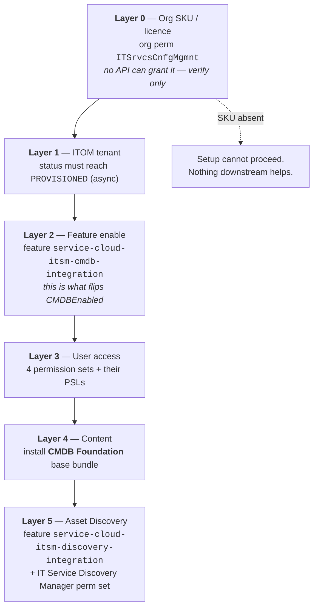

**The four user-level permission sets**, each license-backed and each needing its own permission-set licence:

| Role | Permission set (`Name`) | Backing PSL (`DeveloperName`) |
|---|---|---|
| Reader | `ItSrvcCnfgItmReadPermissionSet` | `ItSrvcCnfgItmReadPsl` |
| Owner | `ItSrvcCnfgItmOwnerPermissionSet` | `ItSrvcCnfgItmOwnerPsl` |
| Type Reader | `ItSrvcCnfgItmTypReadPermissionSet` | `ItSrvcCnfgItmTypReadPsl` |
| Type Manager | `ItSrvcCnfgItmTypManagerPermissionSet` | `ItSrvcCnfgItmTypMgrPsl` |

**Why it matters.** A licence-gated feature with six ordered prerequisites and **one undifferentiated error code** is the shape that burns days. The durable value is not the skills but the published gate expression: it tells you what to check, and in what order, whether or not you run one. It all runs through the **hosted Headless-360 MCP server**, so it works against production.

**Gotchas:**
- **`403 FUNCTIONALITY_NOT_ENABLED` has two distinct causes** — feature off at the org, *or* the running user holds no CMDB permission set. Disambiguate on the feature `status == ENABLED`, **never** on a CMDB data read such as `bundleListView`.
- **Layer 0 is unrecoverable in-flight.** `ITSrvcsCnfgMgmnt` comes from the edition, licence or org template; **no API can grant it**. If the org was not born with the CMDB SKU, stop.
- **`CMDBEnabled` is not directly settable.** It flips as a side effect of enabling `service-cloud-itsm-cmdb-integration` — don't hunt for a preference toggle.
- **Bundle management needs Type Manager specifically.** Reader / Owner / Type Reader all still get `403` on `GET /connect/cmdb/bundles/details` and other bundle operations.
- **Cheapest Layer 0 probe:** query for the PSL `ItSrvcCnfgItmReadPsl`. It exists only on orgs carrying the CMDB SKU, and it works on scratch and sandbox orgs where org-permission reads may not.
- **A `discover` miss is not absence.** The Setup/Connect routes these skills use are documented but not always indexed in the Headless-360 discovery corpus — dispatch the exact path, and only treat a route as unavailable on a real `404`.
- The sixth skill, `service-itsm-incident-priority-configure`, is the **`sf` CLI** path (≥ 2.60.0) and needs `CustomizeApplication` plus org pref `ITSMIncidentMgmtEnabled` — a different Impact × Urgency → Priority surface, not part of the CMDB stack.

**Relevant to:** **Architect** — Layer 0 is a licence decision that no amount of configuration can undo, so CMDB has to be settled at SKU-selection time; **Admin** — six ordered enablement steps, four permission sets and two feature toggles that must be clicked or dispatched in order; **Developer** — exact feature keys, permission-set and PSL API names, and the gate expression to test against.

**Study action:** in a dev org, dispatch a read for the PSL `ItSrvcCnfgItmReadPsl` (`SELECT Id, DeveloperName FROM PermissionSetLicense WHERE DeveloperName = 'ItSrvcCnfgItmReadPsl'`). Whichever way it answers, you have executed the Layer 0 check on a real org and learned what "the SKU is absent" looks like before a client asks.

**Status:** Shipped — `forcedotcom/sf-skills` 1.38.0 / npm `@salesforce/afv-skills` 1.38.0, published **2026-08-14 11:59:53 UTC**. Skills declare `minApiVersion: "67.0"`. The underlying CMDB feature is a Service Cloud ITSM capability; no Salesforce announcement accompanied the skills.

**Sources:** [sf-skills CHANGELOG 1.38.0](https://github.com/forcedotcom/sf-skills/blob/main/CHANGELOG.md) · [`service-itsm-agentic-setup-cmdb-coordinate`](https://github.com/forcedotcom/sf-skills/blob/main/skills/service-itsm-agentic-setup-cmdb-coordinate/SKILL.md) · [`…-cmdb-configure`](https://github.com/forcedotcom/sf-skills/blob/main/skills/service-itsm-agentic-setup-cmdb-configure/SKILL.md) · [`…-cmdb-access-assign`](https://github.com/forcedotcom/sf-skills/blob/main/skills/service-itsm-agentic-setup-cmdb-access-assign/SKILL.md) · [`…-cmdb-bundle-deploy`](https://github.com/forcedotcom/sf-skills/blob/main/skills/service-itsm-agentic-setup-cmdb-bundle-deploy/SKILL.md) · [npm `@salesforce/afv-skills`](https://www.npmjs.com/package/@salesforce/afv-skills)

---

## 2026-08-14 · `headless-360` appears in skill frontmatter — and the hosted server turns out to be four meta-tools, not a tool catalogue

**What changed.** The `mcpTools` frontmatter field added in 1.37.0 went from **7 skills / 3 servers** to **13 skills / 6 servers** in 1.38.0. Three server keys are new: **`headless-360`** (5 skills), **`media-management`**, **`content-readonly`**. `headless-360` had **zero** mentions anywhere in the 1.37.0 catalogue.

**The shape of the hosted server, as its consumers describe it:**

- **Four meta-tools, not ~100 skills** — `discover` (semantic search over an indexed operation catalog), `describe` (schema + canonical route for one operation), `dispatch_readonly` (GET), `dispatch` (POST/PATCH/DELETE).
- **`dispatch` takes raw HTTP**, not `{operation_id, arguments}`: `{url, method, body?, queryParams?}`.
- **The org comes from the OAuth JWT bound to the MCP session.** No org id, alias or credential ever passes through the skill — which is why these skills work identically against production and sandbox with **no per-user MCP install**.
- **Response envelope** is `{"status_code": 200, "body": {…}}` — read the field off `body`.
- **An org gate is named for the first time:** `api.agentic.access.enableHeadless360McpServer`.

**Why it matters.** This corrects a model this radar has carried since 2026-07-26, which recorded the server as a Beta "with ~100 admin-facing skills". Its consumers describe a **generic dispatcher over the whole Connect/Setup surface** — a much larger blast radius and a much smaller thing to learn. "Is this operation supported?" is answered by the REST route, not a tool list.

**Gotchas:**
- **`queryParams` is camelCase.** The tool rejects `query_params`.
- **`discover` returning nothing does not mean the route is absent.** Documented Setup and Connect routes are not all indexed. Dispatch the exact path; only a real `404` from the call proves absence.
- **`semver: ">=1.0.0"` is a declared floor, not evidence of GA.** It says the skill needs a 1.x server; it does not by itself retire the Beta status recorded on 2026-07-26.
- **Verify the session's org before any write.** With no alias in the call, the only thing standing between a sandbox change and a production change is which session you are in.
- `content-readonly` declares `semver: "^1.0.0"` while the other new servers declare `>=1.0.0` — the field carries real ranges, not a boilerplate string.
- **No `data360-*` MCP server appears in any `mcpTools` block** (checked across all 138 skills, 2026-08-16 03:39 UTC), closing the watch item raised on 08-14 negatively.

**Relevant to:** **Developer** — the actual call shape of the hosted server, its envelope, and the two traps (`queryParams` casing, discovery misses); **Architect** — a session-bound, alias-free dispatcher over Connect/Setup changes how you reason about blast radius and about which org an agent is pointed at.

**Study action:** grep the installed catalogue for the field — `grep -rl "mcpTools:" skills/*/SKILL.md` after `npx skills add forcedotcom/sf-skills` — then open one `references/mcp-invocation.md` and copy its `dispatch_readonly` call shape into your own MCP client against a dev org.

**Status:** Shipped in `forcedotcom/sf-skills` 1.38.0, **2026-08-14**. The `headless-360` server itself has no new announcement; these are first-party consumers documenting it. Hosted MCP standard servers are GA; the Headless 360 server's own Beta status is **unchanged and unconfirmed** by this release.

**Sources:** [`service-itsm-agentic-setup-cmdb-configure/references/mcp-invocation.md`](https://github.com/forcedotcom/sf-skills/blob/main/skills/service-itsm-agentic-setup-cmdb-configure/references/mcp-invocation.md) · [`service-itsm-incident-priority-configure`](https://github.com/forcedotcom/sf-skills/blob/main/skills/service-itsm-incident-priority-configure/SKILL.md) · [`experience-content-media-stock-image-search`](https://github.com/forcedotcom/sf-skills/blob/main/skills/experience-content-media-stock-image-search/SKILL.md) · [Headless 360: What It Means for Developers](https://developer.salesforce.com/blogs/2026/05/headless-360-what-it-means-for-developers)

---

## 2026-08-14 · `@salesforce/agents` 2.0.2 — the `--api-name` preview path drops context variables

**What changed.** `@salesforce/agents` **2.0.2** (npm **2026-08-14 18:29:41 UTC**, PR [#335](https://github.com/forcedotcom/agents/issues/335), `W-23842329`) makes `sf agent preview --api-name` **send context variables** when previewing a published agent. `@salesforce/plugin-agent` **2.0.2** (19:52:32 UTC) bumps to it; `sf` **2.149.4** (`nightly`) pins that plugin.

**Why it matters.** Second defect in five days in the same code path, both the same class: **`--api-name` builds a preview session the way `--authoring-bundle` does not.** 2.0.1 sent the wrong `bypassUser`; 2.0.2 sent no context variables. An agent branching on a context variable previews as if every variable were empty — it does not error, it behaves like a different agent.

**Gotchas:**
- **Silent, not loud.** No exception is raised; the agent simply reasons without the values, so a preview can "pass" against behaviour you will never see in production.
- **`--authoring-bundle` was never affected.** If you previewed from the bundle and shipped, then debugged from `--api-name`, the two paths genuinely disagreed — that is a tooling bug, not your agent.
- **Neither 2.0.1 nor 2.0.2 is on stable `sf` yet.** `latest` is **2.147.7**, whose `plugin-agent` **2.0.0** ranges `@salesforce/agents` `^2.0.0` — so a *fresh* install resolves 2.0.2 by range, but a lockfile or existing `node_modules` does not. Verify with `npm ls @salesforce/agents`.
- The pinning asymmetry from 08-13 holds: the library fix propagates to stable by range, the plugin bump does not until a new `sf` ships. Earliest `latest-rc` per the Wednesday cadence is **2026-08-19**.

**Relevant to:** **Developer** — `sf agent preview --api-name` is the everyday debug loop for a published agent, and until 2.0.2 resolves it silently under-reports what the agent does.

**Study action:** publish an agent whose instructions reference a context variable, preview it once with `--authoring-bundle` and once with `--api-name` on `@salesforce/agents` 2.0.1, and diff the two transcripts — then upgrade to 2.0.2 and confirm the difference disappears.

**Status:** Shipped — `@salesforce/agents` 2.0.2 and `@salesforce/plugin-agent` 2.0.2, both **2026-08-14**. On `nightly` `sf` 2.149.4 (2026-08-16 02:45 UTC); not yet on `latest` or `latest-rc`.

**Sources:** [forcedotcom/agents CHANGELOG](https://github.com/forcedotcom/agents/blob/main/CHANGELOG.md) · [plugin-agent CHANGELOG](https://github.com/salesforcecli/plugin-agent/blob/main/CHANGELOG.md) · [npm `@salesforce/agents`](https://www.npmjs.com/package/@salesforce/agents)

---

## 2026-08-13 · SDR 13.1.1 patches a *second* path escape in the same transformer — a TOCTOU symlink write

> **Correction (2026-08-25):** this entry said the TOCTOU fix "is on `latest` today", reaching `sf` 2.147.7 by the `^13.0.0` range. **It is not, and it still is not.** `@salesforce/cli` ships an `npm-shrinkwrap.json` that pins SDR exactly: `latest` **2.148.3** → **13.0.1**, `latest-rc` 2.149.9 and `nightly` 2.150.5 → 13.1.1. So `sf` `latest` is patched for the zip-slip and **unpatched for the TOCTOU symlink escape** as of 2026-08-25 03:45 UTC; the earliest it lands is the **2026-08-26** promotion. The mermaid diagram below and the "range resolution" reading under it are wrong for the CLI — they hold only for a standalone `npm i @salesforce/plugin-deploy-retrieve`. Detail at [the 08-25 entry](#2026-08-25--sf-publishes-an-npm-shrinkwrapjson--the-clis-dependency-tree-is-pinned-exactly-and-three-of-this-radars-reachability-calls-were-wrong).

**What changed.** `@salesforce/source-deploy-retrieve` **13.1.1** (npm **2026-08-13 16:01:37 UTC**, PR [#1820](https://github.com/forcedotcom/source-deploy-retrieve/pull/1820), `W-23808206`) fixes a **TOCTOU** symlink escape in `staticResourceMetadataTransformer.ts` — the same file, same class and same code path as the zip-slip patched 13 days earlier in 13.0.1.

- **TOCTOU** — *time-of-check-to-time-of-use*: a path is validated, then something changes underneath it before the write happens.
- **The escape.** The zip-slip fix validated the *resolved destination*. But a **symbolic link already on disk** — the project's own repo content, not the archive — could still redirect an in-bounds write outside the extraction directory.
- **The fix.** A new `findSymlinkOnPath(baseDestinationPath, fullDest)` walks **every path segment** between extraction root and destination and refuses the write if any segment is a symlink.
- **New error key** `error_static_resource_symlink` in `messages/sdr.md`: *"Entry '%s' in static resource '%s' would be written through a symbolic link ('%s')."*

**Why it matters.** The trigger is `sf project retrieve` unzipping a `StaticResource` of content type `application/zip` or `application/jar` — an everyday command, not an exotic one. And the attacker input is **your working tree**, not only the org: a symlink committed to a repo you cloned is enough. Metadata conversion is an inbound trust boundary in both directions.

**The reachability is the opposite of the zip-slip's, and the reason is a pinning asymmetry:**

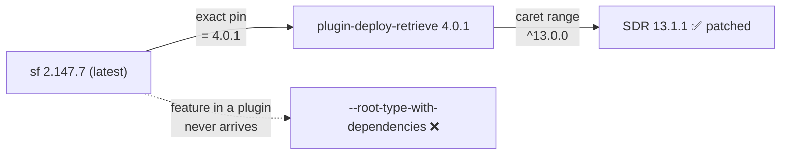

Library fixes **flow to stable by range resolution**; plugin features **do not**, because `sf` pins each plugin to an exact version. So the TOCTOU fix is on `latest` today, while the flag two entries below is not.

**Gotchas:**
- **A lockfile or an existing `node_modules` defeats the range.** Verify with `npm ls @salesforce/source-deploy-retrieve` — you want **13.1.1**, not 13.0.1 or 13.1.0.
- **The 12.x line has neither fix.** `12.37.3` is **HTTP 404** (checked 2026-08-14 03:52 UTC), and `@salesforce/plugin-deploy-retrieve` **3.x** ranges SDR `^12.36.7`, which can never reach 13.x. Anyone still on PDR 3.x is unpatched for *both*.
- **No 13.1.2, no CVE and no GitHub security advisory** located — the changelog line is the only public notice.
- The guard covers the **StaticResource unzip path only**. Other transformers were not in scope of this fix.

**Relevant to:** **Developer** — `sf project retrieve` is the affected command, and the version you need is a transitive dependency you have to check explicitly; **Architect** — confirms metadata conversion as a two-way trust boundary and makes SDR-version floors a CI-image requirement, not a preference.

**Study action:** In a scratch org project, retrieve a zipped `StaticResource`; before re-running, replace one intermediate directory under `staticresources/` with a symlink pointing outside the project, retrieve again, and confirm you get `error_static_resource_symlink` rather than a file written outside the tree.

**Status:** Shipped — `@salesforce/source-deploy-retrieve` 13.1.1, 2026-08-13. Reaches `sf` `latest` (2.147.7) on a fresh install via `^13.0.0`.

**Sources:** [SDR CHANGELOG 13.1.1](https://github.com/forcedotcom/source-deploy-retrieve/blob/main/CHANGELOG.md) · [PR #1820](https://github.com/forcedotcom/source-deploy-retrieve/pull/1820) · [npm registry metadata](https://registry.npmjs.org/@salesforce/source-deploy-retrieve)

---

## 2026-08-13 · `mcpTools` — Agent Skills can now declare which MCP servers and tools they need

**What changed.** `forcedotcom/sf-skills` **1.37.0** (**2026-08-13 04:05 UTC**, commit `933c8df`, `W-23536091`) reconciled **`mcpTools`** declarations across 15 files. The reformat is churn; the finding is that the field exists at all — this radar has covered `sf-skills` five times and never recorded it.

**The declaration, verbatim from `skills/platform-value-set-generate/SKILL.md`:**

```yaml
metadata:
  mcpTools:
    metadata-grounding:
      tools: ["query_metadata", "search_metadata"]
      semver: ">=1.0.0"
```

Keyed by **MCP server name**, each with a `tools` array and an optional `semver` range.

**It completes a four-field dependency contract** built over six weeks, all under the same work item family:

| Field | Declares | First seen |
|---|---|---|
| `cliTools` | local binaries + semver (`sf`, `jq`, `python3`) | 2026-07-30 |
| `accessCheck` | the **org permission** the skill needs | 2026-08-01 |
| `relatedSkills` | sibling skills, bidirectional — the traversal graph | 1.34.0, 2026-08-07 |
| **`mcpTools`** | **MCP servers + tool names + semver** | **1.37.0, 2026-08-13** |

**Why it matters.** A skill can now fail fast on a missing prerequisite instead of dying inside a tool call, and the four fields together are a portable pattern for any capability catalogue: declare what you need, in machine-readable form, beside the instructions. The declarations also **enumerate MCP servers Salesforce never announced** — `metadata-grounding`, `salesforce-api-context` and `metadata-experts` appear only here.

**Named MCP tools, exactly as declared:**
- `salesforce-lsp` — `apex.diagnostics`, `apex.documentSymbol`, `apex.hover`, `lsp.health`, `refresh_org_schema`, `check_soql_selectivity`, `complete_soql`, `extract_soql_from_apex`, `validate_soql`
- `metadata-grounding` — `query_metadata`, `search_metadata`
- `salesforce-api-context` — `get_metadata_type_context`, `get_metadata_type_fields`, `get_metadata_type_fields_properties`, `get_metadata_type_sections`, `get_metadata_type_shape`, `search_metadata_types`

**Gotchas:**
- **Underscores, not hyphens.** This release fixed a doc that wrote `query-metadata`; the tool is `query_metadata`.
- **Every skill exists twice** — `skills/<name>/SKILL.md` and `plugins/builder/salesforce-development/skills/<name>/SKILL.md`, reconciled by a `SKILL.overlay.patch`. The catalogue copy and the plugin copy are **not guaranteed identical**.
- **`catalog/discovery.json` carries per-skill `skillMdSha256` and `treeSha256`** — that is the mechanism behind the 1.10.0 "verified installed and unmodified" fix. Edit a `SKILL.md` locally and it drops out of capability discovery.
- **`discovery.json` records `publicRelease.releaseRef: "1.32.0"` while the repo is at 1.37.0** (checked 2026-08-14 03:48 UTC) — the catalogue's release pointer lags its own hashes.
- **The "weekly, on Fridays" cadence this radar recorded on 2026-08-01 is dead.** 1.34.0 and 1.35.0 shipped Friday 08-07, **1.36.0 Tuesday 08-11, 1.37.0 Thursday 08-13**. Poll the tags, don't wait for Friday.

**Relevant to:** **Developer** — a frontmatter field you must write when authoring a skill, plus the exact names of three MCP servers and their tools; **Architect** — the four-field contract is the governance model for declaring and verifying agent capability prerequisites.

**Study action:** Run `npx skills add` for `platform-value-set-generate`, open its `SKILL.md`, and check its `metadata.mcpTools` block against the MCP servers actually registered in your client — then add one character to the file and confirm it disappears from capability discovery.

**Status:** Shipped — `forcedotcom/sf-skills` 1.37.0, 2026-08-13, Apache-2.0.

**Sources:** [sf-skills CHANGELOG](https://github.com/forcedotcom/sf-skills/blob/main/CHANGELOG.md) · [commit 933c8df](https://github.com/forcedotcom/sf-skills/commit/933c8dfb04878d081715b9a107670332d913f629) · [platform-value-set-generate SKILL.md](https://github.com/forcedotcom/sf-skills/blob/main/skills/platform-value-set-generate/SKILL.md)

---

## 2026-08-12 · `sf org generate password` starts rejecting what it used to silently fix — and two smaller changes ride the same release

> **Correction (2026-08-20):** this entry said the break was *scheduled* for `latest` on 2026-08-19, and the 08-19 scan reported it had missed that date. **It landed.** `@salesforce/cli` `latest` is **2.148.3** as of 2026-08-20 03:36 UTC, pinning `@salesforce/plugin-user` **5.0.0** — so the `--length` ≥ 20 and `--complexity` ≥ 3 floors are now on the channel most teams install from, and the Gotcha below that names 2.147.7 as "today's `latest`" is spent. The Wednesday cadence held; the 08-19 scan checked at **03:47 UTC**, which is 20:47 PT on Tuesday the 18th — **before the promotion window on its own stated date had opened**. Dist-tags move on Pacific business hours, so a pre-dawn UTC check reads the previous day. `latest-rc` is now **2.149.9**, `nightly` **2.150.0** (published 2026-08-20 02:47 UTC).

**What changed.** `sf` **2.148.3** — `latest-rc` since 2026-08-12, promoted to `latest` on **2026-08-19** — carries three practitioner-facing changes that the 08-13 read of this same release-notes file did not enumerate. The lead is a **breaking change**: `sf org generate password` now **errors** on `--length` below 20 or `--complexity` below 3.

- **The old behaviour was silent correction, not rejection.** `@salesforce/plugin-user` **5.0.0** (npm **2026-08-10 22:34 UTC**) records both as `feat!` — commits [`17162b3`](https://github.com/salesforcecli/plugin-user/commit/17162b35ec2748b04f0bd70fab0a9a2d9e622ba7) (complexity) and [`30a97ff`](https://github.com/salesforcecli/plugin-user/commit/30a97ff3d5ff84fcce6aea3cfe7325858592ebd3) (length). Its `BREAKING CHANGES` block: values below the floor "now error instead of being silently raised".
- **Only half of it was ever deprecated.** The 2026-04-01 notice (`sf` **2.129.8**) warned about `--complexity` alone — *"Starting in Summer '26, the command will fail if you specify a complexity value less than 3"* — and never mentioned `--length`.
- **`--skip-assignment-rules`** arrives on `sf data create record` and `sf data update record`, stopping Account, Case and Lead assignment rules from firing on that call (plugin-data PR [#1492](https://github.com/salesforcecli/plugin-data/pull/1492)). The default is unchanged: omit it and rules still run.
- **`api request rest` and `api request graphql` are GA**, no longer beta (plugin-api PR [#194](https://github.com/salesforcecli/plugin-api/pull/194)).

**Relevant to:** **Developer** — a hard break in a command that sits in scratch-org setup and CI scripts, with a known date and two flags to grep for; **Admin** — org-setup runbooks that generate user passwords need both values raised before 08-19, and `--skip-assignment-rules` changes what a CLI data load does to Lead, Case and Account ownership; **Architect** — a silently-corrected input was never an auditable control, which is a pattern worth finding elsewhere.

**Why it matters.** A scratch-org setup script carrying `sf org generate password --length 12` has never produced a 12-character password — the CLI quietly raised it and moved on. On 2026-08-19 that script stops working, and it fails as a validation error rather than a weak credential. The change makes an old lie audible; it does not change what any org receives.

Reachability runs the *safe* way here, by the pinning rule recorded on 08-14: **`sf` pins `plugin-user` to an exact version**, so no lockfile, cache or fresh install pulls 5.0.0 early — and none dodges it once 2.148.3 is `latest`. There is no partial rollout to reason about, only a date.

**Gotchas:**
- The floors are **`--length` ≥ 20** and **`--complexity` ≥ 3**; below either is a hard validation error, not a warning. Complexity 3 means lower case, upper case and numbers only.
- **Grep for `--length`, not just `--complexity`.** Anyone who acted on the April 2026 deprecation notice fixed the half that was announced; the length floor exists only in the `plugin-user` `CHANGELOG` and the 2.148.3 notes.
- **`sf` 2.147.7 — today's `latest` — pins `plugin-user` 4.0.0** and still corrects silently. Testing on current stable tells you nothing about 08-19.
- The deprecation promised *"Starting in Summer '26"*; it actually reaches the CLI on **2026-08-19**, in Winter '27 preview season. Date the change by the CLI version, not by the release name in the notice.
- `--skip-assignment-rules` is opt-out only, and per-command — it changes nothing about Bulk API loads or about calls that omit it.

**Study action:** against a scratch org on today's stable `sf` (2.147.7), run `sf org generate password --length 15 --complexity 2` and note that it succeeds; then `npm i -g @salesforce/cli@latest-rc` and run the identical command — it should fail validation. Then grep CI and setup scripts for `org generate password` and fix both flags.

**Status:** Breaking change, shipped in `@salesforce/plugin-user` **5.0.0** (2026-08-10). Riding `sf` **2.148.3**, `latest-rc` since 2026-08-12, **scheduled for `latest` 2026-08-19** under the published Wednesday cadence. `api request rest` / `api request graphql`: **GA**.

**Sources:** [Salesforce CLI release notes — 2.148.3](https://github.com/forcedotcom/cli/blob/main/releasenotes/README.md) · [`plugin-user` CHANGELOG 5.0.0](https://github.com/salesforcecli/plugin-user/blob/main/CHANGELOG.md) · [`@salesforce/plugin-user` on npm](https://www.npmjs.com/package/@salesforce/plugin-user)

---

## 2026-08-12 · `sf project retrieve start --root-type-with-dependencies` — the CLI half of the v68 agent metadata story, and it takes exactly two values

> **Correction (2026-08-27):** this entry said the flag was `nightly`-only as of 2026-08-14. It **reached `latest` on 2026-08-26** with `sf` 2.149.9, which pins `plugin-deploy-retrieve` **4.1.2** (2.148.3 pinned 4.0.2). Two documentation defects surfaced with it and are recorded on the [promotion entry](#2026-08-26--sf-latest-moves-to-21499--the-promotion-question-closes-the-toctou-fix-reaches-stable-and-the-publish-fix-does-not): the release-note prose calls the flag **`--root-with-dependencies`**, and the example in both the release notes and `messages/retrieve.start.md:44` writes it with a **single dash**, where `-r` is already `--output-dir`.

**What changed.** `@salesforce/plugin-deploy-retrieve` **4.1.0** (npm **2026-08-12 22:15:34 UTC**, PR [#1626](https://github.com/salesforcecli/plugin-deploy-retrieve/pull/1626)) adds a flag that retrieves a root metadata type **together with its whole dependency graph**. Its work item, **`W-23818734`**, is the *same one* that added `AiAgentDefinition` / `AiAgentDefinitionVersion` in SDR 13.1.0 — this is that feature's command-line surface.

- **The flag is a closed enum.** `Flags.string({ multiple: true, options: ['Bot', 'AiAgentDefinitionVersion'] })` — two legal values, nothing else, repeatable.
- **What it pulls.** Retrieve `force-app`; if anything retrieved is a `Bot`, also retrieve its dependent `GenAiPlannerBundle`, `GenAiPlugin` and `GenAiFunction` components.
- **It is a platform API field, not a CLI convenience.** It maps to `rootTypesWithDependencies` on the SOAP Metadata API `RetrieveRequest` body (`src/client/metadataApiRetrieve.ts:268`), so **any Metadata API caller can send it** — Ant, a custom client, a CI script.

**Why it matters.** Getting a complete agent out of an org has meant hand-maintaining a manifest of planner bundles, plugins and functions, and a missed dependency produces an agent that deploys and then misbehaves. One flag replaces that manifest. Naming `AiAgentDefinitionVersion` alongside `Bot` also confirms the new v68 runtime pair is a **first-class graph root**, not a leaf.

**Gotchas:**
- **The changelog names the flag wrong.** It says `--root-with-dependencies`; the flag is **`--root-type-with-dependencies`**. Trust the source, not the release note.
- **The shipped help text has a single-dash typo** — `messages/retrieve.start.md` shows `-root-type-with-dependencies Bot`. Copy that example and it fails.
- **`nightly` only.** `sf` pins its plugins **exactly**: `latest` **2.147.7** → PDR 4.0.1, `latest-rc` **2.148.3** → PDR 4.0.2, `nightly` **2.149.1** → PDR 4.1.1. The flag needs **≥ 4.1.0**, so it first appears in `sf` **2.149.0**. Stable ships Wednesdays, so the earliest realistic stable landing is **2026-08-26** at best.
- Anything outside the two enum values is rejected by oclif before a request is sent — this is not a general "retrieve with dependencies" facility.

**Relevant to:** **Developer** — a new flag with an exact name the changelog gets wrong, unavailable on the CLI channel you probably run; **Architect** — agent dependency retrieval becomes a supported Metadata API operation, so agent source-control strategy no longer depends on a hand-written manifest.

**Study action:** Install `sf@nightly` in a throwaway container, run `sf project retrieve start --metadata Bot:<YourAgent> --root-type-with-dependencies Bot`, and diff the retrieved tree against what the same retrieve produces without the flag.

**Status:** Shipped in `@salesforce/plugin-deploy-retrieve` 4.1.0 (2026-08-12); reachable only via `sf` **`nightly`** as of 2026-08-14 03:41 UTC.

**Sources:** [plugin-deploy-retrieve CHANGELOG](https://github.com/salesforcecli/plugin-deploy-retrieve/blob/main/CHANGELOG.md) · [`retrieve/start.ts`](https://github.com/salesforcecli/plugin-deploy-retrieve/blob/main/src/commands/project/retrieve/start.ts) · [npm registry metadata](https://registry.npmjs.org/@salesforce/cli)

---

## 2026-08-12 · `sf` 2.147.7 is promoted to `latest` — Node 22 becomes the stable floor, and two waiting fixes ride in with it

> **Correction (2026-08-25):** this entry said 2.147.7 delivered the SDR zip-slip fix and employee-agent preview by range resolution. **Neither arrived.** `@salesforce/cli` publishes an `npm-shrinkwrap.json`, and 2.147.7's pins **SDR 13.0.0** (the fix is 13.0.1) and **`@salesforce/agents` 2.0.0** (the fix is 2.0.1) — so no install of 2.147.7, however fresh, resolved forward. The zip-slip fix reached stable on **2026-08-19** with 2.148.3, seven days later than reported here. The Node 22 floor, the cadence finding and the release-notes dating trap all stand. See [the 08-25 entry](#2026-08-25--sf-publishes-an-npm-shrinkwrapjson--the-clis-dependency-tree-is-pinned-exactly-and-three-of-this-radars-reachability-calls-were-wrong).

**What changed.** `@salesforce/cli` **`latest` moved 2.146.3 → 2.147.7** on 2026-08-12. Every dist-tag advanced one slot: `latest-rc` → **2.148.3**, `nightly` → **2.149.0**. Observed at 2.146.3 on 2026-08-12 03:37 UTC and at 2.147.7 on 2026-08-13 03:37 UTC.

**What arrives on stable, all at once:**

- **A hard Node floor.** `engines.node` goes `>=18.6.0` → **`>=22.0.0`**. Node 18 and 20 are dropped; the installer's bundled runtime is **Node 24**.
- **The SDR zip-slip fix.** 2.147.7 pins `@salesforce/plugin-deploy-retrieve` **4.0.1**, which ranges `@salesforce/source-deploy-retrieve` **`^13.0.0`** — a range that can only resolve at or above the patched **13.0.1**.
- **Employee-agent preview.** It pins `@salesforce/plugin-agent` **2.0.0**, which ranges `@salesforce/agents` **`^2.0.0`** — so a fresh install resolves **2.0.1** and `sf agent preview start --api-name` works for employee agents.
- **A scratch-org workaround**, new in this release: `SF_SCRATCH_SIGNUP_CONNECTED_APP` and `SF_SCRATCH_SIGNUP_CALLBACK_URL`, for Dev Hubs authenticated by JWT against an external client app.

**Relevant to:** **Developer** — `npm install -g @salesforce/cli` on a Node 18/20 image now fails, and the same command is what finally delivers two fixes you could not get on stable; **Architect** — the promotion drags a runtime-version floor into every CI image tracking `latest`, which is a platform decision, not a tooling one; **Admin** — nothing to click, but scratch-org creation against a JWT-authenticated Dev Hub needs two environment variables set.

**Why it matters.** This radar tracked the promotion as a *stall* for five consecutive scans — "unchanged for a sixth day" was the 08-12 reading. It was never a stall. The CLI release notes state the cadence plainly: **stable ships on Wednesdays**, with that week's release candidate published the same day. 2.147.7 was published to npm on **2026-08-05** and soaked as `latest-rc` for exactly one week.

So the question worth asking was never *"when will they promote it?"* but *"which Wednesday does this RC land on?"* — a schedule, readable in advance, that five scans treated as a decision.

The practical consequence is unchanged and now urgent: the version bump that was **actively misleading evidence** on 08-06 is now genuinely load-bearing, and it costs a Node upgrade to take.

**Gotchas:**
- **The release notes date a version by its planned *stable* date, not its npm publish date.** `## 2.148.3 (August 19, 2026) [stable-rc]` describes a build published to npm on **2026-08-12 03:13 UTC**. Reading that heading as a publish date puts every CLI fact a week into the future.
- **Range resolution is doing the work, not the pin.** 2.147.7 pins plugin-agent `2.0.0` exactly, and 2.0.0 predates the employee-agent fix. You get the fix because `^2.0.0` resolves *forward* to 2.0.1 at install time — so **an existing `node_modules` or a lockfile can hold you at the broken build** while a colleague's fresh install works.
- **Installer and tarball users are on a different clock.** `sf update stable` moves the bundled tree; it does not consult your system Node, so the Node 22 break is an `npm`-install problem specifically.
- **`EBADENGINE` is a warning, not a failure.** npm on Node 20 still installs, then breaks later in ways that read as metadata errors. Check CI images, not laptops.
- The queue behind `latest` is now `latest-rc` **2.148.3** (plugin-agent 2.0.1, plugin-deploy-retrieve 4.0.2) and `nightly` **2.149.0**.

**Study action:** run `npm view @salesforce/cli@latest dependencies` and `npm ls @salesforce/source-deploy-retrieve` inside a fresh global install, and confirm SDR resolves **≥ 13.0.1**. Then repeat the install on a Node 20 image and record exactly where it fails — the failure is not at install time.

**Status:** GA. `@salesforce/cli` **2.147.7** on `latest`, promoted 2026-08-12 (npm publish 2026-08-05 03:24 UTC). Supersedes the open question raised 2026-08-02.

**Sources:** [CLI release notes](https://github.com/forcedotcom/cli/blob/main/releasenotes/README.md) · [npm dist-tags](https://registry.npmjs.org/-/package/@salesforce/cli/dist-tags) · [cli PR #2851](https://github.com/salesforcecli/cli/pull/2851) · [GitHub issue #3515](https://github.com/forcedotcom/cli/issues/3515)

---

## 2026-08-12 · Winter '27 is API **68.0**, confirmed — and it brings a new agent runtime metadata pair, `AiAgentDefinition` / `AiAgentDefinitionVersion`

**What changed.** `@salesforce/source-deploy-retrieve` **13.1.0** (2026-08-12 19:49 UTC, PR [#1819](https://github.com/forcedotcom/source-deploy-retrieve/pull/1819), `W-23818734`) adds two metadata types to the DX registry. Its regenerated coverage report carries a **`## Next Release (v68)`** section — which settles the API version question this radar has held open since 2026-08-09.

**The two new types, exactly as registered:**

| Type | `directoryName` | `suffix` | Shape |
|---|---|---|---|
| `AiAgentDefinition` | `aiAgents` | `aiAgentDefinition` | single file, `strictDirectoryName: false` |
| `AiAgentDefinitionVersion` | `aiAgentDefinitionVersions` | **none** | **bundle** adapter, `strictDirectoryName: true` |

**And one line of TypeScript is the tell.** `RetrieveOptions.rootTypesWithDependencies` now documents its supported values as **`Bot`, `AiAgentDefinitionVersion`** — the new type is registered as a *peer of `Bot`*: a root from which a whole agent's dependency graph is pulled.

**Where it sits.** Agentforce now has three metadata layers, and only the middle one is new:

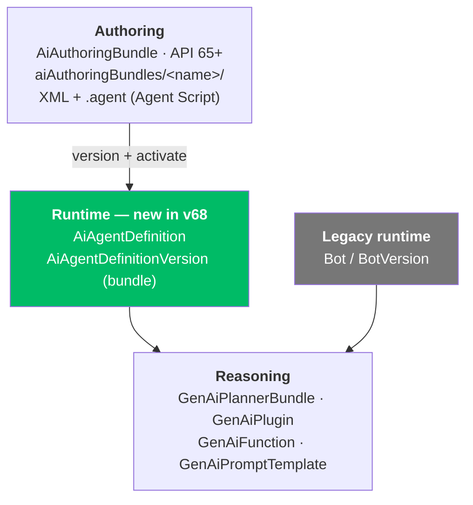

**The rest of the v68 list, since it is now readable:** **59 new metadata types** — **21** supported by the registry, **37** not, **1** partial. Agent-adjacent entries worth knowing:

- **`AgentforcePlatformTracingSettings`** ✅ — Agentforce tracing becomes an org setting you can deploy.
- **`MissionforceSettings`** ✅ — the IL5 / national-security product gets a settings type.
- **`AiAgentDefinitionPlanner`** ❌ and **`BotEmailDefinition`** ❌ — named in v68, not movable by DX.
- **Four telephony types all ❌** — `TelephonyProvider`, `SecondaryTelephonyProvider`, `TrustedTelephonyProvider`, `ScndTelephPrvdOtbdDtl`. Agentforce Voice provider config is not source-controllable yet.
- **Three security types ❌** — `SecurityCustomBaseline`, `ScopedAccess`, `SensitiveDataRuleElmntGrp`.

**Relevant to:** **Architect** — a new dependency root changes how an agent is packaged and promoted between orgs, and seven agent/voice/security types in v68 cannot cross an org boundary through DX at all; **Developer** — two new source directories, a bundle with no file suffix, and a new legal value for `rootTypesWithDependencies`; **Admin** — Winter '27 is confirmed as **68.0**, which is the version every enforcement date and Release Update in that release attaches to.

**Why it matters.** The version question was declared unobtainable from this environment twice — on 08-09 and again on 08-10, when even the unauthenticated `/services/data/` version list was blocked at the proxy. It was answerable the whole time, from a **generated markdown file in a repository this radar reads weekly**. That is the third scan running where the answer sat in a repo rather than an announcement.

The metadata finding is the more durable half. `AiAuthoringBundle` — the `.agent` file you version-control — has always been the *authoring* artifact, with the runtime metadata generated on activation and effectively opaque. v68 gives that runtime side a name, a directory and a retrieve path.

**Gotchas:**
- **`AiAgentDefinitionVersion` has no `suffix`.** It is a **bundle**: a directory whose name *is* the API name, with `strictDirectoryName: true`. Renaming the folder renames the component. Do not go looking for a `.aiAgentDefinitionVersion-meta.xml`.
- **`AiAgentDefinition` sets `strictDirectoryName: false`** while its version type sets `true` — the pair does not behave uniformly under source resolution.
- **`AiAgentScorerDefinition` is ⚠️, not ✅** — "Supports deploy/retrieve but not source tracking". A scorer edited in the org will not show up in `sf project retrieve start` change detection.
- **The coverage report's headline count is still v67**: 768/836. The v68 section is a forward-looking diff, not the current supported total.
- **You need SDR ≥ 13.1.0 to see any of this**, which means `sf` `latest` **2.147.7** or newer *and* a fresh install — plugin-deploy-retrieve 4.0.1 ranges `^13.0.0`, so a stale lockfile resolves 13.0.1 and the types simply do not exist.

**Study action:** in a Winter '27 preview org, run `sf project retrieve start --metadata AiAgentDefinition` and then retrieve the same agent with `rootTypesWithDependencies` set to `AiAgentDefinitionVersion`; diff the two trees against a `Bot`-rooted retrieve of a legacy agent and note which `GenAi*` components each pulls in.

**Status:** Open source, Apache-2.0. SDR **13.1.0**, 2026-08-12 19:49 UTC. The metadata types are **API 68.0 (Winter '27)** — registry support shipped; no first-party documentation for `AiAgentDefinition` was reachable (`developer.salesforce.com` is EGRESS_BLOCKED), so the layering above is **inference from the registry, the coverage report and `types.ts`**, not from a doc page.

**Sources:** [SDR CHANGELOG](https://github.com/forcedotcom/source-deploy-retrieve/blob/main/CHANGELOG.md) · [`metadataRegistry.json`](https://github.com/forcedotcom/source-deploy-retrieve/blob/main/src/registry/metadataRegistry.json) · [`METADATA_SUPPORT.md`](https://github.com/forcedotcom/source-deploy-retrieve/blob/main/METADATA_SUPPORT.md) · [`src/client/types.ts`](https://github.com/forcedotcom/source-deploy-retrieve/blob/main/src/client/types.ts) · [AiAuthoringBundle (Metadata API guide)](https://developer.salesforce.com/docs/atlas.en-us.api_meta.meta/api_meta/meta_aiauthoringbundle.htm)

---

## 2026-08-11 · Salesforce ships a Claude Code plugin — `salesforce-development` 1.10.0, 41 skills, five agents and a deploy gate

> **Correction (2026-08-13):** this said the plugin installs from a marketplace **in the `sf-skills` repository** (`/plugin marketplace add forcedotcom/sf-skills` → `/plugin install salesforce-development@salesforce`). The Salesforce CLI release notes for **2.148.3** now document it as shipping in the **official Claude Code plugin marketplace** — `/plugin install salesforce-development@claude-plugins-official`, listed at [claude.com/plugins/salesforce-development](https://claude.com/plugins/salesforce-development). The repo-hosted marketplace still exists; it is no longer the only channel, and the marketplace name in the install string differs between the two.

**What changed.** [`forcedotcom/sf-skills`](https://github.com/forcedotcom/sf-skills) **1.36.0** (2026-08-11 07:37 UTC, PR [#1138](https://github.com/forcedotcom/sf-skills/pull/1138)) publishes **`salesforce-development` 1.10.0** — a first-party **Claude Code plugin**, distributed from a **plugin marketplace in the same repository**.

The plugin is not new. It shipped at **1.9.0** in `sf-skills` **1.34.0** and **1.35.0**, both of which this radar wrote up without naming it.

```text
/plugin marketplace add forcedotcom/sf-skills
/plugin install salesforce-development@salesforce
```

**The plugin's routing rule is the design point** — capabilities resolve in a fixed order, and the CLI is the *second* choice:

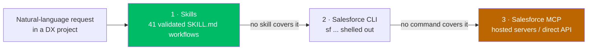

**What is in the box:**

- **41 skills** — Apex (generate, anonymous run, test generate/run, log debug), declarative metadata, deploy/retrieve, manifests, SOQL, security, Code Analyzer, reporting, and the three ADLC skills (`agentforce-generate`, `agentforce-test`, `agentforce-observe`).
- **Five agents** — `salesforce-dev` (auto-activates when `sfdx-project.json` is present), `architecture-review` (read-only Well-Architected grading on Trusted / Easy / Adaptable), and the ADLC set `adlc-orchestrator` → `adlc-author` / `adlc-engineer` / `adlc-qa`.
- **Three MCP servers** — `salesforce-api-context`, `salesforce-metadata-experts`, and **`salesforce-lsp`**, a local host that lazily spawns the **Apex and SOQL language servers** and re-exposes them as MCP tools.
- **Ten slash commands** — `/salesforce-development:discovery`, `:setup`, `:status`, `:org`, `:login`, `:logout`, `:set-default`, `:project`, `:reset-source-tracking`, `:welcome`.
- **Hooks on eight events** — org detection at `SessionStart`, a production deploy-safety gate and an Apex pre-deploy diagnostic on `sf project deploy`, a scaffold gate on `sf project generate*`, and an Agent Script (`.agent`) validator after every `Write`/`Edit`.

**What 1.10.0 itself changed** (CHANGELOG dated 2026-08-05, public 08-11):

- **Ambient UI modes** via a new `ui_mode` user config — `full` (default), `compact`, `plain`, `off` — plus an optional status line carrying project context.
- **Claude Code ≥ 2.1.222 is now required.**
- **The discovery journey stopped lying.** Connect → Project → Build → Test → Deploy → Observe now marks *Test* complete only after a **real, successful Apex test run**.
- **Security:** capability discovery no longer reveals descriptions of skills you have not installed — only skills **verified installed and unmodified** disclose theirs.

**Relevant to:** **Developer** — this is an installable, versioned surface that changes what happens when you type `sf project deploy` in an agent session, and it now demands a minimum Claude Code version; **Architect** — the fixed **Skills → CLI → MCP** precedence is a vendor's answer to "how should an agent reach Salesforce", and it puts hosted MCP *last*.

**Why it matters.** The radar has tracked `sf-skills` as a *catalogue* for six weeks — counting skills, reading frontmatter, noting `relatedSkills` edges. It is also a **runtime**: agents, hooks, slash commands and a bundled language-server MCP host, versioned separately from the catalogue that carries it.

That distinction decides what you install. Taking the skills (`npx skills add forcedotcom/sf-skills`) gets you instructions. Taking the plugin gets you the gates — and a hook that can auto-deploy on a file write.

The precedence order is the transferable idea. Salesforce ranks **deterministic instructions above its own CLI, and its own CLI above its own hosted MCP servers**. MCP is the fallback, not the front door.

**Gotchas:**
- **`dependencies: []` in `plugin.json` is not the prerequisite list.** The real ones are the Salesforce CLI, **Node LTS** (the language servers run under `node`) and **Python 3.8+** — the org-detection, deploy-safety and `hooks/scripts/agent-validator.py` hooks are Python.
- **A `PostToolUse` hook runs `sf-deploy-gate auto-deploy`** on `Edit`/`Write`/`MultiEdit` matching `force-app/**`. Know that before you let an agent edit metadata.
- **The plugin ships no `settings.json`.** Permission allow-rules for `sf`, `node`, `npm` and read-only `git` are yours to add in the project's `.claude/settings.json`, or every hook prompts.
- **Two names, and they are not the same name.** The marketplace is **`salesforce`**; the plugin is **`salesforce-development`**. Install is `salesforce-development@salesforce`; removing the plugin leaves the marketplace behind (`/plugin marketplace remove salesforce`).
- **Below Claude Code 2.1.222 the manifest is unsupported** — check `/plugin` before assuming a silent hook is a bug.
- **The bundled Apex language server is vendored third-party code**, attributed in the plugin's `NOTICE` — it is not Apache-2.0 by inheritance.
- **`platform-capability-search` counts are self-reported**: 102 released and 40 foundation capabilities, 29 overlapping, 113 visible. That is the plugin's view of the platform, not the platform.

**Study action:** install the marketplace and plugin into a DX project, run `/salesforce-development:discovery journey inspect` to see the Connect → … → Observe state, then run `sf project deploy start` against a scratch org and note which hooks fire in order — `sf-context verify-org`, `sf-deploy-gate prod-check`, `bin/lsp-precheck`. Then point it at a production alias and confirm the gate blocks.

**Status:** Open source, Apache-2.0. `salesforce-development` **1.10.0**, shipped in `forcedotcom/sf-skills` **1.36.0**, 2026-08-11 07:37 UTC. Requires **Claude Code ≥ 2.1.222**. Related study topic: [13-adlc-and-agentforce-dx](../02-salesforce-ai/13-adlc-and-agentforce-dx/notes.md).

**Sources:** [plugin README](https://github.com/forcedotcom/sf-skills/blob/main/plugins/builder/salesforce-development/README.md) · [`plugin.json`](https://github.com/forcedotcom/sf-skills/blob/main/plugins/builder/salesforce-development/.claude-plugin/plugin.json) · [plugin CHANGELOG](https://github.com/forcedotcom/sf-skills/blob/main/plugins/builder/salesforce-development/CHANGELOG.md) · [`marketplace.json`](https://github.com/forcedotcom/sf-skills/blob/main/.claude-plugin/marketplace.json) · [sf-skills 1.36.0](https://github.com/forcedotcom/sf-skills/releases/tag/1.36.0)

---

## 2026-08-11 · The eleven `data360_*` tools are one dispatcher over a generated action registry — and the legacy facade loses its live-proof claim

**What changed.** [`salesforce/sf-pi`](https://github.com/salesforce/sf-pi) **v0.266.0** (2026-08-11 21:59 UTC, commit [`c049b20`](https://github.com/salesforce/sf-pi/commit/c049b205f329eb8afb50bece71f7470acc83ddf8), **28 files, +1,281 / −4,857**) accepts **ADR 0106**, making the **v2 registry and dispatcher** the only Data 360 path with live proof. It supersedes **ADR 0010**.

Reading it surfaced **ADR 0027** (accepted **2026-06-01**), which this radar never recorded — and which reframes the eleven tools entirely.

**ADR 0027 — the surface is an envelope, not a tool list:**

- Each `data360_*` tool is a **family tool over one shared action registry and dispatcher**, called with an **action string**: `stream.create_ingest_api`, `sql.verify_rows`, `ingest_csv.plan`.
- The envelope carries `params`, `target_org`, `dry_run`, `allow_confirmed`, `output_mode` and timeout controls.
- Catalogues load **on demand** through meta actions — `actions.search`, `action.describe`, `examples.get` — so tool schemas stay small.
- The registry lives in `extensions/sf-data360/registry/v2/`: `action-rules.json`, `action-overrides.json`, **`actions.json`** (generated, committed, consumed at runtime) and `journeys.json`.
- **Legacy `d360`, `d360_metadata`, `d360_probe`, `d360_api` still exist** as migration adapters, hidden from the default public surface.

**ADR 0106 — one sweep, and a target-independent safety rule:**

- One authoritative sweep, `scripts/e2e/data360-v2-action-sweep.ts`, executing through **`runData360V2Action`** on the same contracts as an ordinary `data360_*` call.
- Confirmed live proof is **one fixture-owned DLO lifecycle** on `PiV2SweepDlo_<runId>__dll`: absence check → `data360_prepare dlo.create` (dry-run, then execute) → `dlo.get` → `dlo.delete` → absence check, with **bounded retries for Data 360 propagation**.
- The facade-first E2E script and its planner tests are **deleted**, along with `npm run e2e:d360-sweep`.

**Relevant to:** **Developer** — what you program against is a generated action map, so `actions.search` is how you find an operation and the eleven tool names tell you almost nothing; **Architect** — there are now **two different destructive-safety rules** on the same extension depending on which path a caller is on.

**Why it matters.** The 08-09 entry below described this as *"ten verb-shaped facades over ~one API, plus one escape hatch."* That was the shape of the **legacy** `d360` surface. The public one is a dispatcher: eleven families fronting **`actions.json`**, where every supported operation resolves to **exactly one** primary tool/action unless explicitly exempted and tested.

That single-owner rule is the useful constraint. There is no second route to an operation by design, so an action name is a stable address rather than one of several spellings.

The safety half is the part to copy. Headless destructive execution is not gated on a flag but on a **conjunction** — non-production target, explicit opt-in, and a run ID that scopes deletion to one resource the harness created itself.

**Gotchas:**
- **Headless destructive execution requires all four:** an authenticated **non-production** target, `--mutate`, an **8–32-character alphanumeric run ID**, and two exact env gates — **`SF_PI_D360_V2_SWEEP_MUTATION_TARGET_ORG`** and **`D360_V2_SWEEP_ALLOW_DESTRUCTIVE`**. Only the DLO name derived from that run ID may be deleted.
- **Two destructive rules coexist.** The legacy facade keeps its dedicated-target rule; **v2 interactive** destructive calls need a non-production authenticated target *plus* explicit acknowledgement *plus* human confirmation. Production, unresolved and mismatched targets stay blocked on both.
- **`actions.json` is generated but committed.** It is the runtime source of action names — read it, do not guess from the tool names.
- **`npm run e2e:d360-sweep` no longer exists.** Any local script or CI job invoking it fails at the npm layer, not the Data 360 layer.
- **Mutating journeys are plan-first.** `data360_orchestrate` resolves actions, endpoints, resources, safety decisions and verification steps *before* execution — an unreviewed plan is not an execution.
- **Retry exhaustion is a failed run, not a pass.** Delete-acceptance and final absence checks retry for propagation; exhaustion names the owned resource in a private artifact.

**Study action:** clone `sf-pi` at **v0.266.0**, open `extensions/sf-data360/registry/v2/actions.json` and count how many actions each of the eleven tools owns. The distribution is the real shape of the surface. Then call `data360_prepare` with `dry_run` on `dlo.create` in a Data 360 scratch org and compare the returned plan to the entry in the registry.

**Status:** Open source, Apache-2.0. `salesforce/sf-pi` **v0.266.0**, released 2026-08-11 21:59 UTC — newest release as of **2026-08-12, 03:40 UTC**. **ADR 0106** accepted 2026-08-11; **ADR 0027** accepted 2026-06-01. Pre-1.0. Cross-link: [data-360.md](data-360.md#2026-08-09--sf-pi-ships-an-sf-data360-agent-tool-extension-cross-link).

**Sources:** [ADR 0106](https://github.com/salesforce/sf-pi/blob/main/docs/adr/0106-data-360-live-proof-uses-the-v2-dispatcher.md) · [ADR 0027](https://github.com/salesforce/sf-pi/blob/main/docs/adr/0027-data-360-v2-family-tools.md) · [commit `c049b20`](https://github.com/salesforce/sf-pi/commit/c049b205f329eb8afb50bece71f7470acc83ddf8) · [`sf-pi` CHANGELOG](https://github.com/salesforce/sf-pi/blob/main/CHANGELOG.md)

---

## 2026-08-11 · `sf-pi` deletes the `50.0` fallback — one connection module, and the org's advertised API version outranks your config

**What changed.** [`salesforce/sf-pi`](https://github.com/salesforce/sf-pi) **v0.263.0** (released **2026-08-10**, PR [#593](https://github.com/salesforce/sf-pi/pull/593), commit [`7ee4e98`](https://github.com/salesforce/sf-pi/commit/7ee4e98ad38922fe0d87ca4e4ce0d63bc65e6c97), **139 files, +4,594 / −1,914**) routes every Salesforce connection through one new module, `lib/common/sf-conn`. It ships as a **breaking change**, and it reverses yesterday's entry: the JSforce `50.0` fallback is not labelled any more, it is gone.

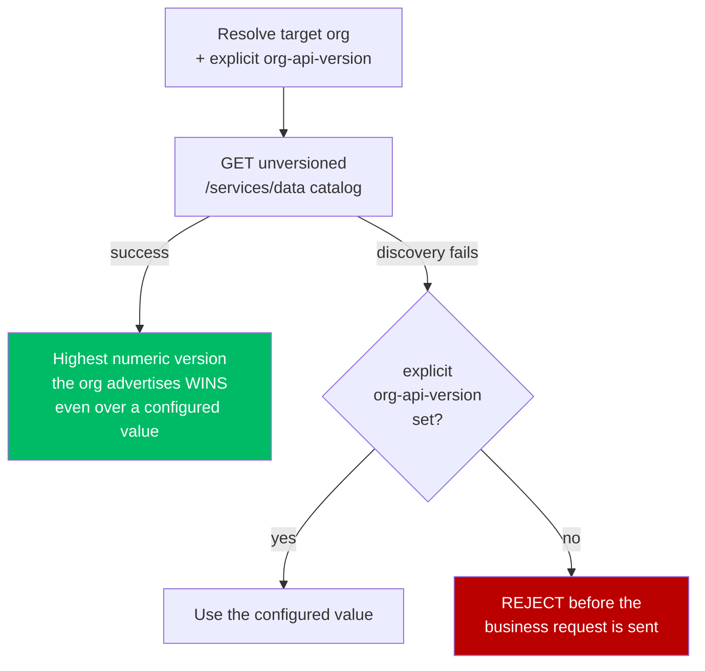

- **Extensions folded in.** `sf-apex`, `sf-soql`, `sf-agentscript`, `sf-data360`, `sf-data-explorer`, `sf-code-analyzer` (ApexGuru), `sf-browser` (route verification) and environment status — each previously carried its own connection helper.
- **Data 360 raw REST callers must now pass versionless paths.** A caller-owned `/services/data/vNN.N/…` path is **rejected**. `lib/common/sf-conn/path.ts` builds the versioned path and returns provenance beside the result.
- **One refresh per expired session.** Definite expired-session retries share a single authentication refresh (`auth-refresh.ts`); an ordinary permission **403 is not replayed**.
- **Status surfaces stay local and cache-first**; connection and discovery are lazy and run only on an explicit operation.
- **Decision record:** `docs/adr/0103-shared-salesforce-connection-module.md`.

**Relevant to:** **Developer** — a tool that yesterday displayed `50.0` now either reports the org's real version or refuses to run, and any Data 360 raw-REST call carrying a hard-coded `/services/data/v63.0/` stops working; **Architect** — "which API version is this org on" becomes a fact discovered from the org rather than a value held in config, which moves where that setting belongs.

**Why it matters.** Yesterday's release made the `50.0` fallback *honest*. This one makes it *absent*. Only the second changes behaviour: a missing version is now a hard failure before the request, not a silent 2021 default sent to a 2026 org.

The resolution rule also inverts the usual precedence. Most Salesforce tooling treats configuration as authoritative and discovery as the fallback. `sf-conn` treats **discovery as authoritative** and configuration as the fallback — so `org-api-version=67.0` no longer pins anything if the org advertises 68.0.

That is right for a tool whose job is reporting the truth about an org, and wrong if you were using config to hold a version deliberately. Know which you are doing before you upgrade.

**Gotchas:**
- **`org-api-version` no longer pins.** It is consulted *only* when `/services/data` discovery fails. There is no supported way to hold a lower version against an org that advertises a higher one.
- **Versioned Data 360 resource paths are rejected, not rewritten.** Strip `/services/data/vNN.N` from caller-owned paths and let `path.ts` version them.
- **A 403 is not retried.** Only a *definite expired session* triggers the shared refresh. A 403 means permissions — stop debugging auth.
- **Discovery and config both missing is now an error, not a degradation.** An unreachable or unauthenticated org fails before the operation instead of returning something wrong.
- **`sf-pi` is an extension pack for the `pi` coding agent, not the `sf` CLI**, and it is pre-1.0 — this is its second behavioural change to API-version handling in two days. **Pin the version.**

**Study action:** on `sf-pi` **v0.263.0**, set `sf config set org-api-version=60.0` against a scratch org and run `/sf-org refresh` — confirm the reported Connection API is the org's *highest advertised* version, not the 60.0 you set. Then repeat against a **Winter '27 preview instance**: that number settles which API version Winter '27 carries.

**Status:** Open source, Apache-2.0. `salesforce/sf-pi` **v0.263.0**, released 2026-08-10 — **breaking change**. Newest release **v0.265.1** as of **2026-08-11 03:50 UTC**. Pre-1.0.

**Sources:** [PR #593](https://github.com/salesforce/sf-pi/pull/593) · [commit `7ee4e98`](https://github.com/salesforce/sf-pi/commit/7ee4e98ad38922fe0d87ca4e4ce0d63bc65e6c97) · [ADR 0103](https://github.com/salesforce/sf-pi/blob/main/docs/adr/0103-shared-salesforce-connection-module.md) · [`sf-pi` CHANGELOG](https://github.com/salesforce/sf-pi/blob/main/CHANGELOG.md) · [releases](https://github.com/salesforce/sf-pi/releases)

---

## 2026-08-11 · `@salesforce/agents` 2.0.1 — employee agents can be previewed again, and not from stable `sf`

> **Correction (2026-08-12):** this entry said the fix "**cannot arrive on the channel most people install from**" and was reachable only through a caret on a *fresh* install. **`@salesforce/plugin-agent` 2.0.1 published 2026-08-11 15:32 UTC** pinning `@salesforce/agents` **`^2.0.1`**, and **`@salesforce/cli` 2.148.3** (2026-08-12 03:13 UTC) pins that plugin explicitly — so the fix now travels in a released CLI rather than resolving by luck. **The conclusion still holds for `latest`:** dist-tags are unchanged for a sixth day (`latest` **2.146.3**, `latest-rc` **2.147.7**), and 2.148.3 is **`nightly`**.

**What changed.** `@salesforce/agents` **2.0.1** published to npm **2026-08-10 21:36 UTC**, four days after the fix landed on `main`. One bug fix: [#329](https://github.com/forcedotcom/agents/issues/329), *send `bypassUser:false` for employee agents on `--api-name` preview*.

- **The bug.** The `--api-name` preview path hard-coded `bypassUser: true` for every agent type. An **employee agent** (`AgentforceEmployeeAgent`) is built to run **as the authenticated user**, so the Agent API rejected the session.
- **The symptom.** `sf agent preview start --api-name <employee agent>` failed with **`400 Invalid user ID`**.
- **The tell.** The `--authoring-bundle` path already branched on agent type, so the same agent previewed fine from a local bundle and failed against the org.
- **The fix.** `bypassUser: false` for employee agents, `true` for everything else — `--api-name` now matches `--authoring-bundle`.

**Relevant to:** **Developer** — a preview command that returned an auth-shaped error on a correctly-built agent now works, and the fix is only reachable on a CLI channel most teams are not on.

**Why it matters.** `bypassUser` encodes a real product distinction rather than a transport detail: **customer-facing agents run without a Salesforce user identity, employee agents run as one.** Sharing, FLS, `UserInfo` and the ownership of records the agent creates all follow from which side of that flag the agent sits on.

So a hard-coded `true` did not only break a command — it asked the platform to preview the wrong execution context. The 400 was the API refusing to do that, which is the good outcome.

The reachability is the second lesson, and it is the zip-slip pattern one package over: the fix exists, is published, and cannot arrive on the channel most people install from.

**Gotchas:**
- **Stable `sf` cannot receive this fix.** `latest` = **2.146.3** → `@salesforce/plugin-agent` **1.45.0** → `@salesforce/agents` **`^1.11.1`**, which caps at **1.11.7**. No 2.x build satisfies that range.
- **The fix rides a caret, not a plugin release.** `plugin-agent` **2.0.0** pins `@salesforce/agents` **`^2.0.0`**, so a *fresh* install of `sf` 2.147.7+ resolves 2.0.1 with nothing new published. An existing install with a lockfile does not move.
- **Taking it drags the Node floor.** `latest-rc` **2.147.7** and `nightly` **2.148.1** declare `engines.node >= 22.0.0`; `latest` 2.146.3 still declares `>= 18.6.0`.
- **`400 Invalid user ID` was never an auth problem.** Before this fix it meant the preview path sent the wrong `bypassUser` for the agent type. Do not go re-issuing tokens.
- **`@salesforce/agents` 2.x requires `@salesforce/source-deploy-retrieve` `^13.0.0`**, so it is on the zip-slip-patched line by construction — see the SDR entry below.

**Study action:** in a scratch org build one employee agent and one customer-facing agent, then run `sf agent preview start --api-name` against each on `sf` **2.147.7** (`npm install -g @salesforce/cli@latest-rc`). Repeat on `latest` **2.146.3** and watch only the employee agent fail with `400 Invalid user ID`. That diff is the entry.

**Status:** Released. `@salesforce/agents` **2.0.1**, npm **2026-08-10 21:36 UTC**. Reachable through `@salesforce/cli` **`latest-rc` 2.147.7** and **`nightly` 2.148.1** only — **not on `latest` 2.146.3**.

**Sources:** [issue #329](https://github.com/forcedotcom/agents/issues/329) · [forcedotcom/agents releases](https://github.com/forcedotcom/agents/releases) · [`@salesforce/agents` on npm](https://www.npmjs.com/package/@salesforce/agents)

---

## 2026-08-10 · `sf-pi` stops calling JSforce's `50.0` an org fact — API version status becomes provenance-aware

> **Correction (2026-08-11):** this entry concluded that the fix "changes **honesty, not behaviour** — the fallback is still `50.0`". That held for one day. **v0.263.0** (2026-08-10) **removes** the fallback: a missing API version now fails before the request is sent, and the org's highest advertised version outranks a configured `org-api-version`. The provenance labels below still stand; the "it does not remove it" gotcha does not. See [the 2026-08-11 entry](#2026-08-11--sf-pi-deletes-the-500-fallback--one-connection-module-and-the-orgs-advertised-api-version-outranks-your-config).

**What changed.** [`salesforce/sf-pi`](https://github.com/salesforce/sf-pi) shipped **v0.261.0 → v0.262.1** on **2026-08-09** between 15:37 and 21:47 UTC. One of the three matters: **v0.262.1** ([#591](https://github.com/salesforce/sf-pi/pull/591), commit `d8a8e81`, 17 files, **+587 / −86**), *`fix(sf-environment): expose API version fallback`*.

The org's API version is now reported with its **provenance**, in three states:

| Label | Where the number came from |
|---|---|
| `configured` | An explicit `org-api-version` override — intentional, preserved as-is |
| resolved (Project Source API) | `sourceApiVersion` in `sfdx-project.json` |
| **unverified SDK fallback** | **JSforce's built-in `50.0` default** — nothing was configured and nothing was read from the org |

- **Two numbers, now shown separately.** *Project Source API* (from `sfdx-project.json`) and *Connection API* (what the SDK selected) are distinct fields in `extensions/sf-devbar/README.md`; they can disagree.
- **New command `/sf-org refresh`**, and `/sf-devbar refresh` now performs an explicit deep refresh via a new `refreshSharedSfEnvironment()` (`lib/common/sf-environment/shared-runtime.ts`). Snapshots stay cache-first; the deep refresh is serialized and user-triggered.
- **`OrgFromAliasOptions` gains `fresh?: boolean`** (`lib/common/sf-conn/connection.ts`), evicting only that cache key — a superseded lookup can no longer delete a newer cached entry.
- **Devbar label renamed** "Org warning" → "Missing org warning": the footer accent for an SFDX project with no detected or default org.
- **The other two releases are display-only** — v0.261.0 folds LSP and `sf-herdr` startup rows into one line in `sf-welcome`; v0.262.0 compacts the `sf-slack` footer to `Slack ✓ Connected`.

**Relevant to:** **Developer** — a number you have been reading as an org fact may have been the SDK's 2021 default, and there is a new command to force the truth; **Architect** — the Summer '26 security defaults are keyed to API 67.0, so "which API version am I actually on" is not a cosmetic question.

**Why it matters.** `50.0` is **Spring '21**. A tool that displays it beside an org alias reads as *"this org is on 50.0"*, when it actually means *"nobody told me, so JSforce used its own default."* Those are opposite facts: one is a property of the org, the other is a property of your missing configuration.

That gap is load-bearing right now, because the platform's most consequential recent defaults are **version-gated**. At **API 67.0** Apex DML and SOQL run in **user mode** and classes default to **`with sharing`** — see [trust-security-and-governance.md](trust-security-and-governance.md). Believing you are on 67.0 while a tool quietly operates at 50.0 means reasoning about behaviour you do not have.

The fix worth copying is that it changes **honesty, not behaviour**. The fallback is still `50.0`; it is now labelled as unverified rather than reported as observed. A status line that cannot say where its number came from is not a status line.

**Gotchas:**
- **`unverified SDK fallback` is an action item, not a reading.** Nothing is configured. Set `sourceApiVersion` in `sfdx-project.json`, or `sf config set org-api-version=67.0`, then refresh.
- **Project Source API ≠ Connection API.** The first governs the shape of metadata deploy/retrieve; the second governs REST calls. A tool showing one is not showing the other, and a mismatch is legal.
- **Snapshots are cache-first by default.** What you see may be stale; only `/sf-org refresh` or `/sf-devbar refresh` forces the deep refresh.
- **This labels the fallback, it does not remove it.** Seeing the new label and doing nothing leaves you on `50.0`.
- **`sf-pi` is an extension pack for the `pi` coding agent, not the `sf` CLI**, and it is pre-1.0 at three releases in six hours. **Pin the version.**

**Study action:** update `sf-pi` to **v0.262.1** and run `/sf-org refresh` against a scratch org with no `org-api-version` set — read the API version label and confirm it says *unverified SDK fallback* at `50.0`. Then `sf config set org-api-version=67.0`, refresh again, and watch it flip to `configured`. Finally compare both against `sourceApiVersion` in `sfdx-project.json` and note whether the two numbers agree.

**Status:** Open source, Apache-2.0. `salesforce/sf-pi` **v0.262.1**, released 2026-08-09 21:47 UTC — newest release as of **2026-08-10, 03:40 UTC**. Pre-1.0.

**Sources:** [sf-pi releases](https://github.com/salesforce/sf-pi/releases) · [PR #591](https://github.com/salesforce/sf-pi/pull/591) · [commit `d8a8e81`](https://github.com/salesforce/sf-pi/commit/d8a8e813c1d4baef21d43003df995eabdd8b58fc) · [`sf-pi` CHANGELOG](https://github.com/salesforce/sf-pi/blob/main/CHANGELOG.md) · [`sf-devbar` README](https://github.com/salesforce/sf-pi/blob/main/extensions/sf-devbar/README.md)

---

## 2026-08-09 · `sf-pi`'s `sf-data360` extension — eleven Data 360 tools, and no MCP runtime in sight

> **Correction (2026-08-12):** this entry described the surface as *"ten verb-shaped facades over ~one API, plus one honest escape hatch"* and implied a flat tool list. **ADR 0027 (2026-06-01) says otherwise:** the eleven `data360_*` tools are **family tools over one shared action registry and dispatcher**, called with an action string and a compact envelope; the flat-facade shape is the **legacy** `d360` / `d360_metadata` / `d360_probe` / `d360_api` surface those tools replaced. The tool table, default-enablement, safety-gate and no-MCP-runtime facts below are unchanged. See [the 2026-08-11 entry](#2026-08-11--the-eleven-data360_-tools-are-one-dispatcher-over-a-generated-action-registry--and-the-legacy-facade-loses-its-live-proof-claim).

**What changed.** Nothing shipped today. This entry closes the open question raised on 2026-08-08: `salesforce/sf-pi` carries an **`sf-data360`** extension — **stable, enabled by default**, category *Agent Tool* — that this radar had never examined while reporting Data 360 as empty for seven consecutive scans.

**Eleven LLM tools**, ten compact facades plus one escape hatch:

| Tools | What they cover |
|---|---|
| `data360_discover` · `data360_connect` | Capability discovery and connection setup |
| `data360_prepare` · `data360_harmonize` | Ingestion prep and harmonization into the canonical model |
| `data360_segment` · `data360_activate` | Segmentation and activation targets |
| `data360_query` · `data360_semantic` | Querying and the semantic layer |
| `data360_observe` · `data360_orchestrate` | Observability and orchestration |
| `data360_api` | **Direct REST escape hatch** — the uncompacted path |

- **Panel:** `/sf-data360`. **Management:** `/sf-pi status sf-data360`, `/sf-pi enable sf-data360`, `/sf-pi disable sf-data360`.
- **Triggers:** `session_start`, `session_shutdown`, `resources_discover`.
- **No MCP runtime and no Java subprocess.** It routes through sf-pi's shared action registry and the existing safety gates.
- **Mutating calls are classified by method/path** and confirmed when required; the docs push **dry-runs and compact summaries** before broad or mutating calls.
- **It contributes reference docs, not Agent Skills** — so it will never appear in `sf-skills`.

**Relevant to:** **Developer** — a default-enabled Data 360 tool surface already present in any sf-pi session, with named tools you can call today; **Architect** — it is a *third* Data 360 agent-access pattern beside the Data 360 MCP Server and raw REST, and the one with no MCP runtime to stand up.

**Why it matters.** The radar has spent seven scans concluding "Data 360 is quiet" from press releases and release notes, while a Data 360 developer surface shipped inside a repository it already tracks weekly. The finding is as much about sourcing as about the tool: **product silence is not platform silence.**

The design point worth stealing is the shape — **ten verb-shaped facades over ~one API, plus one honest escape hatch.** An agent that must first learn ~200 REST operations will not use them; an agent given `data360_harmonize` will. `data360_api` exists so the facade set does not have to be complete, which is what makes shipping it possible at all.

**Gotchas:**
- **Default-enabled means it is already in your sessions.** If you have run sf-pi against a Data 360-connected org, these tools were available whether or not you knew. Check with `/sf-pi status sf-data360`.
- **`data360_api` bypasses the compact facades, not the gates.** Mutating calls are still classified by method/path, so a POST through the escape hatch still hits the confirm prompt.
- **Not the Data 360 MCP Server.** Same domain, different mechanism — that one is a Developer Preview MCP server with three facade tools over ~200 REST operations; this has **no MCP runtime**. Do not conflate them in a design doc. See [Data 360 MCP Server](#2026-07-29--data-360-mcp-server--200-rest-operations-behind-three-facade-tools).
- **Grepping `sf-skills` will never find it.** It ships plain reference docs; the skills catalogue does not know it exists.
- **Four sibling extensions remain unexamined** by this radar: `sf-soql`, `sf-data-explorer`, `sf-guardrail` (now partly covered — see below) and `sf-brain`.

**Study action:** run `/sf-pi status sf-data360`, then open `/sf-data360` against a Data 360-enabled scratch org and call `data360_discover`. Write the returned capability list beside the **three** facade tools of the Data 360 MCP Server — the diff is the answer to "which surface do I build against?"

**Status:** Stable, **enabled by default**, in `salesforce/sf-pi` (`docs/extensions/sf-data360.md`). Checked **2026-08-09, 03:45 UTC**.

**Sources:** [`sf-data360` extension docs](https://github.com/salesforce/sf-pi/blob/main/docs/extensions/sf-data360.md) · [`salesforce/sf-pi`](https://github.com/salesforce/sf-pi) · Data 360 cross-link: [data-360.md](data-360.md#2026-08-09--sf-pi-ships-an-sf-data360-agent-tool-extension-cross-link)

---

## 2026-08-08 · `sf-guardrail` mediates Pi credential output — `pi auth print-api-key` now needs a human

**What changed.** [`salesforce/sf-pi`](https://github.com/salesforce/sf-pi) released **v0.260.2** on **2026-08-08 at 18:04 UTC** ([#588](https://github.com/salesforce/sf-pi/pull/588), commit `93cc70d`), a single fix: **`fix(guardrail): mediate Pi credential output`**. A new bundled rule in the `sf-guardrail` extension gates model-issued commands that would print the developer's own credentials.

- **Rule ID `pi-credential-output`**, in the **`commandGate`** family, shipped in `extensions/sf-guardrail/SF_GUARDRAIL_DEFAULTS.json`.
- **Gated commands:** `pi auth check --credentials`, `pi auth print-api-key`, `pi auth print-bearer-token`. Plain `pi auth check` stays unrestricted.
- **Also blocked:** the `SF_TEMP_SHOW_SECRETS=true` environment-variable pattern.
- **Detection is structural, not string-matching** — direct invocation, environment-prefixed calls, shell wrappers (`bash -c`, `sudo`, `timeout`), and `npx` forms all resolve to the same rule (`lib/bash-ast.ts`, `lib/command-gate.ts`).
- **Shipped alongside:** `chore(runtime): audit Pi 0.84.1`.

**Relevant to:** **Developer** — a guardrail behaviour change that reaches your machine on the next sf-pi update, with a new confirm prompt in an existing workflow and a documented override path.

**Why it matters.** The guardrails this radar has recorded so far protect the **org** from the model — unqualified `DELETE`, ungated actions, destructive DML. This one protects the **developer's own credentials** from the model, and the attack it anticipates is mundane: an agent that has a shell, a plausible reason to "check auth," and an output stream someone else can read.

The design detail worth copying is that the rule is enforced on the **parsed command**, not on the literal string. A guardrail matched on text is defeated by `sudo`, a wrapper, or an `npx` prefix — which is to say, by accident, long before anyone attacks it.

**Gotchas:**
- **"Allow for this session" outlives the session you granted it in.** Approvals persist via `pi.appendEntry` and are **inherited by `/resume` and `/fork`**. A grant made once in a throwaway branch follows the fork. Clear with **`/sf-guardrail forget`**; inspect with **`/sf-guardrail audit`**.
- **Overrides live outside the repo**, in `~/.pi/agent/sf-guardrail/rules.json` — so one developer disabling a rule is invisible to everyone else. Disable by stable rule ID: `{"id": "pi-credential-output", "enabled": false}`.
- **Three behaviours, and only one has an approval path.** `off` disables, `confirm` prompts via `ctx.ui.select` (Allow once / Allow for session / Block), `block` is a hard stop with no override.
- **Bundled defaults are not the effective config.** `SF_GUARDRAIL_DEFAULTS.json` is what ships; `rules.json` is what runs. Read both before concluding a rule is active.
- **`pi auth check` and `pi auth check --credentials` are one flag apart** and land on opposite sides of the gate.

**Study action:** update sf-pi to **v0.260.2**, ask the agent to print your API key and watch the confirm prompt; choose **Allow for session**, then `/fork` and ask again — confirm the grant carried across. Then run `/sf-guardrail forget`, re-ask, and read `/sf-guardrail audit` to see all three decisions recorded.

**Status:** Released **2026-08-08**, `salesforce/sf-pi` **v0.260.2**. Newest release as of **2026-08-09, 03:40 UTC**.

**Sources:** [sf-pi v0.260.2](https://github.com/salesforce/sf-pi/releases/tag/v0.260.2) · [PR #588](https://github.com/salesforce/sf-pi/pull/588) · [commit `93cc70d`](https://github.com/salesforce/sf-pi/commit/93cc70d45d0a54a447c00661b98da94734121491) · [`sf-guardrail` README](https://github.com/salesforce/sf-pi/blob/main/extensions/sf-guardrail/README.md)

---

## 2026-08-07 · `sf-skills` gives the catalogue a graph — `relatedSkills` lands on 79 skills, and 9 new ones ship the same day

**What changed.** [`forcedotcom/sf-skills`](https://github.com/forcedotcom/sf-skills) cut **two releases in one Friday**: **1.34.0** (05:05 UTC, commit `7d5916d`) and **1.35.0** (13:30 UTC, commit `f38d98d`).

- **1.34.0 — "Release 79 updated skills."** 108 files, **+753 / −222**. Almost all of it is one repeated edit: a `metadata.relatedSkills` list added to `SKILL.md` frontmatter, declared **bidirectionally** (`agentforce-observe` ↔ `agentforce-test`).
- **1.34.0 also carries two behaviour changes** hidden in the sweep: `automation-flow-generate` raises its **minimum API version from 51.0 to 60.0**, and `dx-code-analyzer-configure` adds **`git`** to its allowed tools.
- **1.35.0 — 9 new + 1 updated skills.** 66 files, **+15,417 / −1**.
  - DevOps: `dx-devops-pipeline-manage`, `dx-devops-promote`
  - Experience Cloud front end: `experience-lwc-base-components-integrate`, `experience-lwc-rtl-validate`, `experience-lwc-typescript-migrate`, `experience-ui-bundle-localize`
  - Platform: `platform-custom-lightning-type-generate`, `platform-mcp-tool-widget-coordinate`, `automation-sandbox-post-copy-config-generate`
  - Updated: `dx-apexguru-scan`

**Why it matters.** `relatedSkills` is the **third** structural metadata field in nine days — after `cliTools` (2026-07-30) and `accessCheck` (2026-07-31) — and the three together describe a shift in what a skill library is.

A flat catalogue makes an agent re-search descriptions every time it needs the next step. A graph lets it **traverse**: run `agentforce-test`, follow the edge, find `agentforce-observe`. The selection problem moves from retrieval to navigation, which is cheaper and far more predictable.

The practical read: **stop treating skills as independent files.** Editing one now means checking what points at it, exactly like a code dependency.

**Gotchas:**
- The field is `metadata.relatedSkills` in `SKILL.md` YAML frontmatter, a list of skill directory names. Edges are declared on **both** ends — add one and you owe the reverse edit, or the graph is directional by accident.
- **`automation-flow-generate` now refuses orgs below API 60.0.** This is a silent breaking change buried inside a "79 updated skills" release title. If a sandbox or a managed package pins an older API version, that skill stops working after the upgrade.
- Two releases landed **eight hours apart on the same Friday**. Pinning "the Friday release" is no longer unambiguous — pin the version.
- The repo's own warning still applies: skills "may be renamed, restructured, or removed between releases" and carry **no GA stability guarantee**. `relatedSkills` is not a versioned contract.
- `forcedotcom/afv-library` **redirects to this repository** — same repo under an older name, not a second library. Links and clones from either name resolve to the same place.
- The dual-licence standing note is unchanged: identical skills ship in `SalesforceAIResearch/agentforce-adlc` under **CC BY-NC 4.0**. Take the `sf-skills` copy for commercial work.

**Study action:** clone `forcedotcom/sf-skills` at **1.35.0** and run `grep -A5 'relatedSkills' */SKILL.md` to dump the edge list, then check whether any edge is one-way. Separately, open `automation-flow-generate/SKILL.md` and confirm the `51.0 → 60.0` bump against the API version of a sandbox you actually use.

**Status:** Open source, Apache-2.0. `forcedotcom/sf-skills` **1.35.0**, released 2026-08-07 13:30 UTC. Weekly Friday train.

**Sources:** [sf-skills CHANGELOG](https://github.com/forcedotcom/sf-skills/blob/main/CHANGELOG.md) · [commit `7d5916d` — 79 updated skills](https://github.com/forcedotcom/sf-skills/commit/7d5916d271809f7f375e3e40f0ffd3e4ec39f5e4) · [commit `f38d98d` — 9 new + 1 updated](https://github.com/forcedotcom/sf-skills/commit/f38d98dba5eea86b5313b93c5fb4616a0c3faf92) · builds on [the `sf-skills` 1.33.0 entry below](#2026-07-31--sf-skills-1330--a-help-agent-skill-and-skills-that-declare-their-own-preconditions)

---

## 2026-08-07 · `sf-pi` closes the Voice eval loophole — strict integrity is default for Voice, and repetition is caught without LLM evidence

**What changed.** [`salesforce/sf-pi`](https://github.com/salesforce/sf-pi) shipped **v0.258.0 → v0.260.1** between 2026-08-05 16:14 UTC and 2026-08-07 18:58 UTC. Two commits change how Agent Script evals behave; the rest is infrastructure.

- **v0.260.0 — Voice suites gate themselves** (commit `a0e169f`). Generated **Voice** eval suites now declare strict `sf_pi.turn_response_integrity` **automatically**, and an **exact-version Voice release contract refuses a designated Suite that omits it**.
- **v0.260.1 — exact repeated-surface detection** (commit `9325a4a`). The run now counts turns where the agent emits the **identical surface sentence** again, and this fires **even when `lastExecution.llmEvents` evidence is absent**. Under `severity: "error"`, repetition Fails alongside excess completions.
- **v0.260.0 — Conversation Replay** (`lib/render/conversation.ts`, `lib/eval/conversation-summary.ts`). Ending a multi-turn preview session, or completing an eval run, renders a bounded replay: every user/agent utterance, per-turn route path, latency and integrity proof. LLM-facing tool text stays compact.
- **v0.259.6 — `fix(security): patch dependency advisories and file race`** ([#583](https://github.com/salesforce/sf-pi/pull/583)) — sf-pi patching itself, not the platform.
- **v0.258.0 / v0.259.x** — `sf-llm-gateway` gets a **dynamic model catalog** and Pi 0.84 support; `sf-herdr` lane planning is normalised.

**Why it matters.** The [08-04 entry below](#2026-08-04--sf-pi-makes-agent-script-evals-deterministic--eval-studio-soql-seed-profiles-and-a-response-integrity-gate) recorded response integrity as **opt-in**, with missing evidence recorded as `unavailable` rather than a pass. That was honest, and it was also a hole: a looping agent whose `llmEvents` never arrived produced no verdict at all.

Repeated-surface detection closes it by reading the thing that is always present — **what the agent actually said** — instead of the instrumentation that sometimes isn't. It is the same lesson as the original gate, applied one level lower: check the cheapest evidence you already hold.

Making the policy automatic **for Voice specifically** is the right asymmetry. Double-texting a chat user is untidy; double-texting a caller is two voices talking over each other, and the caller cannot scroll back.

**Gotchas:**
- **Automatic only for *generated* Voice suites.** A hand-written suite, or one generated before v0.260.0, still has no policy — the release contract will refuse it at exact-version release rather than at authoring time, i.e. late.
- Repetition detection is **exact surface match**, not semantic. An agent that reworders the same non-answer each turn still passes.
- **`severity: "error"` now has two failure causes**: excess non-empty completions *and* exact surface repetition. A suite that was green on the first can go red on the second after upgrading.
- Conversation Replay is **bounded** — collapsed cards summarize, expansion shows all bounded turns. It is not a full transcript archive; `raw.json` remains authoritative.
- Policy shape is unchanged (`sf_pi.turn_response_integrity`, `max_nonempty_llm_contents` 1–100, `severity` `"warning"` | `"error"`, [ADR 0099](https://github.com/salesforce/sf-pi/blob/main/docs/adr/0099-agentscript-turn-response-integrity-policy.md)) and is still **never sent to the Evaluation API**.
- Ten releases in three days, four inside 90 minutes on Aug 7. **Pin the version.** `sf-pi` is an extension pack for the **pi** coding agent, not the `sf` CLI.

**Study action:** generate a Voice eval suite with `sf-pi` at **v0.260.1** and diff its JSON against one generated at v0.257.0 — the `sf_pi.turn_response_integrity` block should be present in the new one and absent in the old. Then write a scenario that makes an agent repeat one sentence across two turns and confirm the run reports a repeated-surface count with `llmEvents` unavailable.

**Status:** Open source, Apache-2.0. `salesforce/sf-pi` **v0.260.1**, released 2026-08-07 18:58 UTC. Pre-1.0.

**Sources:** [sf-pi releases](https://github.com/salesforce/sf-pi/releases) · [commit `9325a4a` — detect deterministic route loops](https://github.com/salesforce/sf-pi/commit/9325a4a) · [commit `a0e169f` — harden voice transition eval evidence](https://github.com/salesforce/sf-pi/commit/a0e169f) · [`sf-agentscript` README](https://github.com/salesforce/sf-pi/blob/main/extensions/sf-agentscript/README.md)

---

## 2026-08-06 · `sf-pi` deletes its bundled model catalogue — gateway models now exist only after authenticated discovery

**What changed.** [`salesforce/sf-pi`](https://github.com/salesforce/sf-pi) shipped **v0.258.0 → v0.259.2** between 2026-08-05 16:23 UTC and 2026-08-06 19:53 UTC. Every feature commit lands on the **`sf-llm-gateway`** extension, and the four together replace a static model list with a discovery protocol.

- **v0.258.0 — dynamic model catalogue** (commit `30bb1ca`, **ADR `0077`**). The exact-ID preset catalogue module is **deleted**: 36 files, 405 additions, **1,071 deletions**.
- **v0.259.0 — hardened public gateway client** (commit `e41fd67`).
- **v0.259.1 — `sf-llm-gateway` setup hardening and Pi 0.84 support** (commit `12c5faf`).
- **v0.259.2 — stale gateway routing references removed** (commit `87f7f90`).

**The SF LLM Gateway** is Salesforce's internal model-serving endpoint. `sf-pi` calls it to run Agent Script evals, so *which models it can reach* decides what an eval can execute against.

**The rule ADR 0077 states, verbatim in effect:** `sf-pi` obtains gateway model IDs **only** from authenticated discovery and uses Pi's **provider-scoped cache** as the last-known catalogue — so **a fresh, uncached provider exposes no models at all until discovery succeeds.**

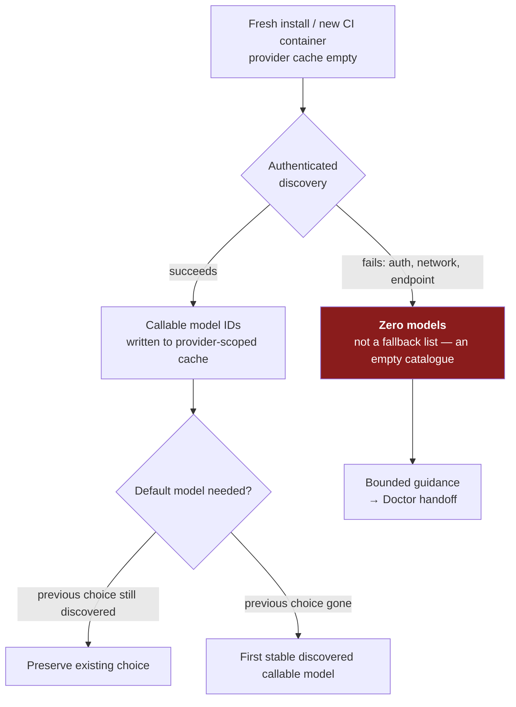

**Why it matters.** A bundled catalogue lets a tool *look* configured before it is authenticated — you see model names, pick one, and discover the credential problem later, at run time, as a confusing failure.

Deleting it makes the failure arrive at the right moment and with the right cause. The cost is that **an empty model list is now a legitimate, correct state**, and CI images that assumed a populated list will read as broken when they are merely unauthenticated.

The general lesson is worth more than the tool: **a hardcoded inventory of a remote system's capabilities is a cache with no invalidation.** It drifts silently, and it lies most convincingly when you are least authenticated.

**Gotchas:**
- **Empty ≠ broken.** On a fresh uncached provider, zero models is expected until discovery succeeds. Do not add a fallback list to "fix" it — that is the thing that was just removed.
- The cache is **provider-scoped**, not global. Two providers do not warm each other, so adding a provider in CI reintroduces the cold-start emptiness.
- **Default-model selection changed semantics:** `sf-pi` now *preserves* a still-discoverable prior choice and otherwise takes the **first stable discovered callable model**. A pipeline that relied on a bundled default now depends on discovery order.
- **Pi version window is enforced in CI:** the required audit range is **`>=0.82.0 <0.85.0`**, with **0.84.0** now the latest audited edge (previously 0.83). `sf-pi` is an extension pack for the **pi** coding agent, so the pi runtime version is a real dependency, not a detail.
- **0.82/0.83 still work** via a Gateway adapter that absorbs the argument-shape difference in Pi 0.84's cancellable model-registry refresh. That compatibility shim is the thing most likely to be dropped next.
- Setup now **persists configuration overrides without awaiting the network**, and status output **distinguishes a saved override from an active authenticated provider**. Reading "override saved" as "authenticated" is the new misread.
- Discovery failure produces bounded guidance with a **Doctor handoff** — run the doctor rather than re-reading config.

**Study action:** in a clean container with no `sf-pi` provider cache, run the gateway setup **without** valid credentials and record exactly what the model list shows; then authenticate and run it again. The difference between those two outputs is what your CI will report the first time a gateway credential expires.

**Status:** Open source, Apache-2.0. `salesforce/sf-pi` **v0.259.2**, released 2026-08-06 19:53 UTC. Pre-1.0 — nine releases in the four days to 08-06. Pin a version; do not track head.

**Sources:** [sf-pi releases](https://github.com/salesforce/sf-pi/releases) · [commit `30bb1ca` — make gateway model catalog dynamic](https://github.com/salesforce/sf-pi/commit/30bb1ca) · [commit `12c5faf` — harden setup and Pi 0.84 support](https://github.com/salesforce/sf-pi/commit/12c5faf) · [commit history](https://github.com/salesforce/sf-pi/commits/main) · builds on [the 08-04 sf-pi entry below](#2026-08-04--sf-pi-makes-agent-script-evals-deterministic--eval-studio-soql-seed-profiles-and-a-response-integrity-gate)

---

## 2026-08-04 · `sf-pi` makes Agent Script evals deterministic — Eval Studio, SOQL seed profiles, and a response-integrity gate

**What changed.** [`salesforce/sf-pi`](https://github.com/salesforce/sf-pi) shipped **v0.253.0 → v0.257.0** between 2026-08-03 21:14 UTC and 2026-08-04 16:05 UTC. Every feature commit lands on the `sf-agentscript` extension, and together they move Agent Script evaluation away from *ask a model* and toward *check the recorded evidence*.

- **v0.253.0 — Eval Studio** (commit `e590e4e`, ADR `0097`). A **local-first** review and execution workspace for source-controlled Agent Script Eval Suites, Agent Script Release Eval Contracts and locally persisted run evidence. It consults Salesforce only to resolve a version or to actually execute.
- **v0.253.0 — SOQL seed profiles** (ADR `0098`). A source-only declaration inside one eval suite that resolves **exactly one row** from **one bounded read-only SOQL query** against the Eval Run Target org, mapping scalar fields or constants into ordinary Scenario context variables.
- **v0.254.0 — the quality catalogue goes 18 → 20 rules** (commit `c1e956b`): `variable-description-max-length` (**High**) and `instruction-template-syntax` (**Moderate**).
- **v0.255.0 / v0.256.0** — the **full LLM response sequence** is preserved in run evidence and rendered in Eval Studio, rather than only the final message.
- **v0.257.0 — `turn_response_integrity`** (commit `ac290d5`): a source-controlled policy that fails an eval when one turn emits more than one non-empty LLM completion.

**Response integrity is the item to actually learn.** The check parses every `lastExecution.llmEvents` entry with **no model calls**, so it is deterministic and free. In strict mode it also requires **exactly one `agent.get_state` after each `agent.send_message`**.

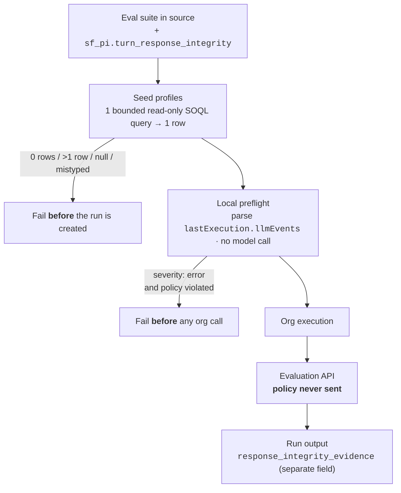

**Why it matters.** Double-texting — an agent emitting two non-empty completions in one turn — is a real Agentforce failure that LLM-judge evals miss, because a judge reads the final message and the final message is usually fine.

Parsing the event log instead catches it deterministically, for no tokens, and **before** the run costs an org call. That is the general lesson: the cheapest agent test is the one that reads evidence you already have.

Seed profiles fix the other chronic eval problem. Hard-coded record IDs rot the moment the suite moves to another org; a bounded query that must return exactly one row moves with it.

**Gotchas:**
- The policy block is `sf_pi.turn_response_integrity`, with `max_nonempty_llm_contents` (integer **1–100**) and `severity` (`"warning"` | `"error"`). **A suite without the block keeps advisory-only behaviour** — the gate is opt-in, so an unmodified suite is not protected by the upgrade.
- `severity: "error"` also **fails on missing evidence**: unavailable `llmEvents` counts as incomplete, not as a pass.
- Findings land in a **separate `response_integrity_evidence` field** in run output. They are not folded into the ordinary verdict, so a green verdict is not the whole answer.
- The policy is preserved in source snapshots, executed snapshots and release digests but is **never sent to the Evaluation API**. The gate is yours, not the platform's — the same agent passing in another tool tells you nothing about it.
- `variable-description-max-length` fires **above 255 characters** (Salesforce's publication limit); exactly 255 is valid. `instruction-template-syntax` is **non-suppressible** — it is promoted from the compiler/LSP diagnostic, which would fire anyway.
- **A reused seed profile executes once per run**, not once per scenario. Two scenarios sharing a profile share the row.
- `sf-pi` is an extension pack for the **pi** coding agent, **not** the `sf` CLI. `sf-pi` v0.257.0 and `@salesforce/cli` 2.147.6 are unrelated number lines.
- Cadence is bursty — **ten releases in the ~19 hours** spanning Aug 3–4. Pin a version; do not track head.

**Study action:** take one existing Agent Script eval suite, add `"sf_pi": {"turn_response_integrity": {"max_nonempty_llm_contents": 1, "severity": "error"}}`, run it, and read `response_integrity_evidence` — not the verdict. Then replace one hard-coded record ID in a scenario with a seed profile and run the same suite against two different orgs.

**Status:** Open source, Apache-2.0. `salesforce/sf-pi` **v0.257.0**, released 2026-08-04 16:05 UTC. Pre-1.0 — the version line moves daily.

**Sources:** [sf-pi releases](https://github.com/salesforce/sf-pi/releases) · [commit `ac290d5` — gate evals on response integrity](https://github.com/salesforce/sf-pi/commit/ac290d5) · [commit `c1e956b` — expand quality checks](https://github.com/salesforce/sf-pi/commit/c1e956b) · [commit `e590e4e` — eval studio and dynamic seed profiles](https://github.com/salesforce/sf-pi/commit/e590e4e) · builds on [the 07-30 sf-pi entry below](#2026-07-30--sf-pi-ships-agent-script-quality-gates--and-a-better-way-to-expire-test-evidence)

---

## 2026-08-01 · A path-traversal fix in the retrieve path — and most `sf` installs cannot reach it yet

> **Correction (2026-08-08):** the dist-tag map below has moved, and this entry previously said the fix was reachable only on `nightly`. **It is now on `latest-rc`.** Checked 2026-08-08 03:15 UTC:
> - **`latest` 2.145.6 → 2.146.3.** The unpatched release candidate was promoted to stable. 2.146.3 pins `@salesforce/plugin-deploy-retrieve` **3.24.61** → SDR `^12.36.7` → **12.37.2, still vulnerable**. `engines.node` remains `>=18.6.0`. **Upgrading stable today does not get you the fix.**
> - **`latest-rc` 2.146.3 → 2.147.7** (published 2026-08-05 03:24 UTC). It pins plugin **4.0.1** → SDR `^13.0.0` → **13.0.1, patched**, and `engines.node` `>=22.0.0`. This is the first time the fix sits on a channel Salesforce ships to customers.
> - **`nightly` 2.147.6 → 2.148.1** (2026-08-07 03:19 UTC), same plugin 4.0.1.
> - **`@salesforce/plugin-deploy-retrieve` `latest` is now 4.0.2** (2026-08-07 22:43 UTC) — the 4.x major is the default plugin release, ahead of the CLI that bundles it.
> - Unchanged: SDR newest is still **13.0.1**, `13.0.2` is 404, `12.37.3` is 404 — **still no 12.x backport**, and still no CVE or GitHub security advisory.
>
> **What this corrects, precisely:** the 08-02 reading that "the release candidate queued to become stable cannot carry the fix" was right about *that* candidate — 2.146.3 shipped unpatched — but the RC slot has since been handed to the Node 22 line. The exposure window on stable is now **eight days**, and the remaining question is no longer *whether* the fix reaches stable but *when 2.147.x is promoted*, which will drag the Node 22 floor along with it.

> **Correction (2026-08-06):** this entry said the stable channel was **2.145.6** and that the fix existed only on `nightly`. **Both dist-tags rolled on 2026-08-05** — package `modified` 18:41:04 UTC, with no version published after 2.147.7 at 03:24 UTC, so this was a tag move, not a release.
>
> - `latest` **2.145.6 → 2.146.3** — pins plugin **3.24.61** → SDR `^12.36.7` → **12.37.2**, `engines.node >=18.6.0`. **Still unpatched.**
> - `latest-rc` **2.146.3 → 2.147.7** — pins plugin **4.0.1** → SDR `^13.0.0` → **13.0.1**, `engines.node >=22.0.0`. **Patched**, and now equal to `nightly`.
>
> So the answer to *"when does this reach an ordinary install?"* moved from *"not queued"* to *"queued behind a Node 22 major."* Still no 12.x backport, no SDR 13.0.2, no CVE. Verified 2026-08-06 03:08 UTC.
>
> **The trap this creates is worse than the one before it.** Anyone running `npm install -g @salesforce/cli` this week gets a **newer** CLI than last week and is **still on the unpatched SDR line**. A version bump is now actively misleading evidence.
>
> **The practitioner reading:** stable `sf` moved for the first time since 2026-07-29 and the exposure survived the move. *"I am on the newest stable"* is now a **true statement that is also unpatched** — a worse position than being visibly behind.

> **Re-checked (2026-08-05 03:14 UTC):** nothing below has changed and that is the finding. `latest` is still **2.145.6** and `latest-rc` still **2.146.3** — both unmoved since 2026-07-29 — while `nightly` has rolled four times to **2.147.6**. There is still **no 12.x backport** (`@salesforce/source-deploy-retrieve@12.37.3` returns 404 on the registry) and **no SDR 13.0.2**. The exposure window is now five days old on the stable channel.

> **Correction (2026-08-03):** this entry calls `@salesforce/cli` **2.147.3** *"the first CLI to require Node ≥ 22."* **It was not — 2.147.0 was**, published to npm **2026-07-31 14:16 UTC**, already carrying `plugin-deploy-retrieve` 4.0.1 and therefore the fix. 2.147.3 was simply the version sitting on `nightly` when the 08-02 scan read the tag. **The lesson is the same one this entry is about:** a dist-tag tells you where a pointer is today, not when a version first existed. Read publish times, not tags.
> _(This scan also concluded "the release candidate does not carry the fix" — true of 2.146.3, and superseded by the 08-08 correction above, which records the RC slot moving to the patched 2.147.7 line.)_

**What changed.** [`@salesforce/source-deploy-retrieve`](https://github.com/forcedotcom/source-deploy-retrieve) **13.0.1** (npm 2026-07-31 16:21 UTC) fixes a **zip-slip** in static-resource conversion — work item `W-23558165`, [PR #1812](https://github.com/forcedotcom/source-deploy-retrieve/pull/1812). A day later `@salesforce/cli` **nightly 2.147.3** (2026-08-01 03:24 UTC) became the first CLI to require **Node ≥ 22**. These are one story.

**Zip-slip**, first: an archive entry whose stored path escapes the target directory — `../../../.git/hooks/pre-commit` — so extracting it writes somewhere the extractor never intended.

- **Where it lived.** `src/convert/transformers/staticResourceMetadataTransformer.ts`, which unzips static resources whose `contentType` is `application/zip` or `application/jar` during **metadata → source conversion**. That runs on `sf project retrieve start` and `sf project convert mdapi`.
- **The fix.** Each entry's resolved absolute path is now compared against the extraction root, and an escape throws `error_static_resource_attempting_zip_slip` — *"Entry '%s' in static resource '%s' resolves to a location outside the extraction directory ('%s')."*
- **There is no 12.x backport.** The newest 12.x is **12.37.2**, published 2026-07-13. The patch exists only on the 13.x line.
- **So reachability is gated behind a major.** `@salesforce/plugin-deploy-retrieve` **3.24.61** pins SDR `^12.36.7` — a range that can never resolve to a patched build. **4.0.0/4.0.1** (2026-07-30) pin `^13.0.0` and raise `engines.node` to `>=22.0.0`.

**Dist-tag → resolved SDR, as of 2026-08-06 03:08 UTC.** (For the 2026-08-01 assignment this replaces, read the correction above — the versions moved, the shape did not.)

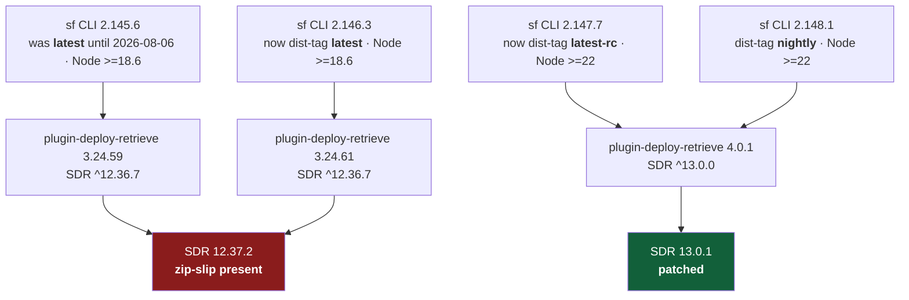

**Why it matters.** Retrieve feels read-only, and it is not. It takes attacker-influenceable bytes out of an org and writes them onto a developer laptop or a CI runner.

Anyone who can create a static resource in an org you retrieve from — a packaging partner, a compromised sandbox, an agent with metadata write access — could write outside the project.

And the stable channel still resolves the unpatched line, so *"I upgraded the CLI"* is not the same sentence as *"I have the fix"*.

**Gotchas:**
- `npm dist-tags` for `@salesforce/cli` are **not** ordered by version, and **they move without a publish**. Checked 2026-08-02 02:55 UTC: `latest` **2.145.6**, `latest-rc` **2.146.3**, `nightly` **2.147.3**. Checked 2026-08-06 03:08 UTC: `latest` **2.146.3**, `latest-rc` **2.147.7**, `nightly` **2.147.7**. Either way `npm install -g @salesforce/cli` resolves **SDR 12.37.2**.
- **A newer CLI version is not evidence of the fix.** The only reliable check is the resolved SDR version — `npm ls @salesforce/source-deploy-retrieve`, or read `engines.node`: `>=18.6.0` means the unpatched 12.x line, `>=22.0.0` means 13.x.
- **The release notes do not mention any of this.** [`forcedotcom/cli/releasenotes`](https://github.com/forcedotcom/cli/commits/main/releasenotes) has had **no commit since 2026-07-29** (checked 2026-08-03 02:59 UTC), and its newest entry describes **2.146.3** with a forward date of August 5. A whole major — the Node 22 floor, plugin 4.x, the SDR patch — shipped on `nightly` with **no release-note coverage at all**. Read npm, not the notes.
- The guard fires **only** for `contentType` `application/zip` and `application/jar`. A static resource stored as `application/octet-stream` never enters that code path.
- Taking the fix means taking **Node 22**, `@salesforce/core` 9.x and `@salesforce/plugin-agent` 2.0.0 in the same step — see [the Node 18/20 drop below](#2026-07-30--the-dx-node-library-stack-dropped-node-18-and-20--salesforceagents-is-200).
- `@salesforce/core` also moved to **9.1.0** (2026-07-31 19:01 UTC) inside the same window; a minor, but it lands on the 9.x line only.
- Installer/tarball `sf` bundles its own Node, so it is unaffected by the engine floor — but it still ships whatever plugin version was built into it. Check the plugin, not the Node.

**Study action:** run `npm view @salesforce/cli dist-tags`, then in a scratch project `npm ls @salesforce/source-deploy-retrieve` — read off the version your deploy path actually resolves to. Then build a static resource whose zip contains an entry named `../escaped.txt`, deploy it, retrieve it on both SDR 12.37.2 and 13.0.1, and watch one write outside the project and the other throw `error_static_resource_attempting_zip_slip`. Do it in a scratch org.

**Status:** Shipped, **not yet on stable**. SDR **13.0.1**, 2026-07-31 (release commit `364ced7`), Apache-2.0. As of **2026-08-06 03:08 UTC** the fix ships in `@salesforce/cli` **2.147.7** on `latest-rc` and `nightly`; `latest` is **2.146.3** and still resolves SDR **12.37.2**. No CVE or security advisory was published — the only public identifier is `W-23558165`.

**Sources:** [SDR 13.0.1 release](https://github.com/forcedotcom/source-deploy-retrieve/releases/tag/13.0.1) · [PR #1812 — resolved zip-slip vulnerability](https://github.com/forcedotcom/source-deploy-retrieve/pull/1812) · [`@salesforce/source-deploy-retrieve` on npm](https://www.npmjs.com/package/@salesforce/source-deploy-retrieve) · [`@salesforce/cli` on npm](https://www.npmjs.com/package/@salesforce/cli) · [salesforcecli/cli releases](https://github.com/salesforcecli/cli/releases) · security cross-link: [trust-security-and-governance.md](trust-security-and-governance.md#2026-08-01--a-path-traversal-in-metadata-retrieve-cross-link)

---

## 2026-07-31 · `sf-skills` 1.33.0 — a Help Agent skill, and skills that declare their own preconditions

**What changed.** [`forcedotcom/sf-skills`](https://github.com/forcedotcom/sf-skills) tagged **1.33.0** on 2026-07-31 at 17:57 UTC (commit `40db639`, work item `@W-23641814@`): **10 new and 16 updated skills**, 26 directories, 2,393 files. An *Agent Skill* is a folder with a `SKILL.md` telling a coding agent **when** to take over and **how** — procedural knowledge it loads on a trigger match, not code you call.

**The cadence is the first thing to internalise: this library ships weekly, on Fridays** — 1.28/1.29 on July 3, then July 10, 17, 24 and 31. Plan around it rather than treating each release as an event.

**The headline skill is `service-helpagent-coordinate` (0.9)** — the first built around the **Help Agent**, the prepackaged Service Agent that reached GA in July '26 on pay-per-resolution pricing.

It drives a guided **four-checkpoint flow**: setup → channel configuration → grounding on Salesforce Knowledge → go-live. Its triggers map the product's real surface: Experience Cloud / LWR embed, web chat, voice, phone, Knowledge grounding.

Notably, it **hard-stops on channels that are announced but not shippable** rather than improvising — an honest design choice worth copying.

**The other nine new skills cluster in three groups:**

| Group | Skills |
|---|---|
| Digital engagement (the plumbing a Help Agent needs to reach a customer) | `service-digital-engagement-channel-configure`, `-deployment-configure`, `-messaging-site-integrate` |
| Experience Cloud front end | `experience-lwr-site-generate`, `experience-lds-data-requirements-generate`, `experience-ui-bundle-mfa-configure` |
| Platform utilities | `platform-report-generate`, `platform-data-and-tooling-api-context-get`, `platform-sandbox-configure` |

**The quiet story is declared preconditions.** `platform-sandbox-configure` ships at **1.0** — not 0.x like almost everything else — and carries a frontmatter field this radar had not seen:

```yaml
accessCheck:
  - type: "userPerm"
    value: "ManageSandboxes"
```

That declares the **org permission** the skill needs, the way `cliTools` (added July 30) declares the local CLI it needs. Together they let a skill fail fast with *"you lack ManageSandboxes"* instead of dying inside a REST call.

**Product news leaks through the updated `agentforce-*` trigger text:**

- **`agentforce-generate` 0.11** now names **`sf agent mcp`** — registering, listing and deleting MCP servers, whitelisting and approving MCP tools, configuring MCP auth. A command surface present in a shipped skill is a stronger signal than a roadmap slide.
- **`agentforce-test` 0.8** expands from functional testing to **security testing explicitly** — OWASP LLM Top 10, red-teaming, prompt-injection, a security grade.
- **`agentforce-observe` 0.8** is the Data 360 one — see [data-360.md](data-360.md#2026-07-31--data-360-is-the-observability-backend-for-agentforce--and-agentforce-observe-names-the-query-path).

**Why it matters.** Salesforce's implementation guidance is now shipped as **versioned, diffable artifacts on a weekly train**, ahead of the prose documentation. `service-helpagent-coordinate`'s four checkpoints are the closest thing to an official Help Agent implementation order that exists in public, and `agentforce-test` 0.8 is a ready-made agent security checklist you no longer have to invent.

**Gotchas:**
- `service-helpagent-coordinate` declares **`minApiVersion: "67.0"`** — a *higher* floor than `agentforce-generate`'s `66.0`. It needs a newer org than the core skill does.
- `agentforce-observe` declares **`sf >= 2.136.8`** as its CLI floor.
- Install with **`npx skills add forcedotcom/sf-skills`** (pre-packaged in Agentforce Vibes). Pin the release tag: the README warns skills *"may be renamed, restructured, or removed between releases"* with no API-stability guarantee.
- **Skill version numbers are not a reliable change indicator** — `agentforce-observe` shipped in 1.33.0 at the same `0.8` it carried in the July 30 `agentforce-adlc` sync.
- **Licence depends on which repo you clone from** — see [pricing-and-certification.md](pricing-and-certification.md#2026-08-01--the-same-agentforce-skills-ship-under-two-licences--only-one-permits-client-work).

**Study action:** `npx skills add forcedotcom/sf-skills`, then open `skills/platform-sandbox-configure/SKILL.md` and `skills/agentforce-generate/SKILL.md` side by side and diff their frontmatter — `accessCheck`, `cliTools`, `minApiVersion`, `relatedSkills`. Then add an `accessCheck` block to one skill of your own and confirm it fails fast in an org lacking the permission.

**Status:** Open-source release **1.33.0, 2026-07-31**, Apache-2.0. Salesforce-maintained, **not a supported Salesforce product** — no release train, no SLA, explicit stability disclaimer. Individual skills remain 0.x except `platform-sandbox-configure` at 1.0. The **Help Agent** it configures is separately GA as of July '26.

**Sources:** [forcedotcom/sf-skills](https://github.com/forcedotcom/sf-skills) · [releases](https://github.com/forcedotcom/sf-skills/releases) · [commit history](https://github.com/forcedotcom/sf-skills/commits/main) · [`service-helpagent-coordinate` SKILL.md](https://github.com/forcedotcom/sf-skills/blob/main/skills/service-helpagent-coordinate/SKILL.md) · [`platform-sandbox-configure` SKILL.md](https://github.com/forcedotcom/sf-skills/blob/main/skills/platform-sandbox-configure/SKILL.md) · [`agentforce-test` SKILL.md](https://github.com/forcedotcom/sf-skills/blob/main/skills/agentforce-test/SKILL.md) · scan note [01-agentforce/2026-08-01](01-agentforce/2026-08-01.md)

---

## 2026-07-30 · The DX Node library stack dropped Node 18 and 20 — `@salesforce/agents` is 2.0.0

Between **20:21 and 22:22 UTC on July 29, 2026**, three libraries cut majors carrying one breaking change each: **[`@salesforce/core` 9.0.0](https://github.com/forcedotcom/sfdx-core/commits/main)**, **[`@salesforce/source-deploy-retrieve` 13.0.0](https://github.com/forcedotcom/source-deploy-retrieve/commits/main)**, **[`@salesforce/agents` 2.0.0](https://github.com/forcedotcom/agents/releases)** — `engines.node` raised to **`>=22.0.0`**, **Node 18 and 20 dropped** (both past EOL: April 2025 and April 2026). `@salesforce/kit` went to 4.0.0 and `@salesforce/ts-types` to 3.0.0 alongside.

**Why it matters.** `@salesforce/agents` implements the **`sf agent` command family** — `agent generate`, `agent test create/run/results`, `agent preview` — so it sits under every automated way you exercise an Agentforce agent, ADLC test modes included. SDR is the engine behind `sf project deploy`, so it sits under every metadata deployment, **agent bundles and Data 360 metadata alike**. The failure is quiet, not loud: npm installs on Node 20 with an `EBADENGINE` warning and proceeds, so the break surfaces later as errors that look like metadata problems.

**What to do.** Check **CI images, not laptops** — installer/tarball `sf` **bundles its own Node** (v24 since February 2026) and is insulated; what's exposed is `npm install -g @salesforce/cli`, `actions/setup-node` pinned to 18/20, and your own scripts importing these libraries. `@salesforce/agents` **1.11.7** (July 28) is the last Node 18/20 line — pin for a week, not a quarter. Expect the CLI plugins to inherit the floor as they take core 9.

Full write-up: [01-agentforce/2026-07-30](01-agentforce/2026-07-30.md) · Data 360 deploy angle: [02-data-cloud/2026-07-30](02-data-cloud/2026-07-30.md).

---

## 2026-07-30 · sf-pi ships Agent Script quality gates — and a better way to expire test evidence

[`salesforce/sf-pi`](https://github.com/salesforce/sf-pi) (Apache 2.0, extensions for the **pi** coding agent) released **v0.250.0** on July 28 with `feat(sf-agentscript): add native quality analysis` and **v0.251.0** on July 29 with `gate agent activation`. Its `sf-agentscript` extension is a **full Agent Script lifecycle manager**, not a linter: authoring (compile, format, reference-safe renames) → preview (live-org sessions, compact traces) → eval (multi-turn regression specs, release contracts) → lifecycle (publish inactive, **gate activation**, manage Service Agent users).

Quality analysis is an **18-rule catalogue** graded High/Moderate/Low/Info, all v1 rules **On** by default, and **High findings block publication unless explicitly acknowledged** — linting as a gate, not advice.

**Why it matters.** The design detail worth copying: **release evidence has no time expiry**. It "remains valid while the exact org, `BotVersion`, baseline identity, and designated-suite digest remain unchanged." **Invalidate on identity, not on elapsed time** — an arbitrary "results expire in 7 days" rule is simultaneously too strict (nothing changed) and too loose (everything changed on day 2). Also note the templates use **subagents, not deprecated topic blocks**. Caveat: runs inside `pi`, not VS Code; Salesforce-published but **not a supported product**.

Full write-up: [01-agentforce/2026-07-30](01-agentforce/2026-07-30.md).

---

## 2026-07-29 · ADLC security testing is now generated from the agent, not from a catalogue

On **July 28, 2026** the [`agentforce-adlc`](https://github.com/SalesforceAIResearch/agentforce-adlc) toolkit merged five PRs. The one that changes how you work: **[`/agentforce-secure` is deleted](https://github.com/SalesforceAIResearch/agentforce-adlc/pull/44)**, folded into `/agentforce-test` as **Mode C**.

The old skill shipped **57 static OWASP LLM Top 10 cases hard-coded around Salesforce-the-vendor**. Aimed at an airline complaint agent, it asked about citing Salesforce security bulletins while never testing rebooking without passenger verification. Mode C derives cases from the agent instead: it profiles the **Agent Script** for actions, authorization gates, LLM-filled inputs (injection sinks) and subagent topology, infers the **business domain** from 12 weighted vocabularies, then emits only cases that fit the actual surface — no write actions, no bulk-mutation tests. Of the 59-entry payload catalogue, **50 neutral entries deploy by default** and 9 Salesforce-platform entries need `--include-platform`.

Three sub-modes, ordered by blast radius: **`C1-author`** writes test YAML and deploys nothing; **`C1-run`** deploys and executes but **refuses non-sandbox orgs** unless given `--allow-production`, after a gate that queries `Organization.IsSandbox`; **`C2`** probes live via `sf agent preview` and returns severity-weighted A–F grades. **Live actions now require `--live-actions`; the default simulates.**

Also merged: a hook that **blocks `DELETE` without `WHERE` in quoted SOQL** ([#27](https://github.com/SalesforceAIResearch/agentforce-adlc/pull/27)) — closing the gap where an LLM assembles a destructive query inside a string literal that static checks never see; **hooks gated to Salesforce projects only** ([#13](https://github.com/SalesforceAIResearch/agentforce-adlc/pull/13)), so a global plugin install stops firing in unrelated repos; an **MCP server registry management skill** ([#41](https://github.com/SalesforceAIResearch/agentforce-adlc/pull/41)); and **eight voice latency anti-patterns plus seven voice-safe action rules** ([#45](https://github.com/SalesforceAIResearch/agentforce-adlc/pull/45), docs only).

**Why it matters.** A security suite that doesn't know what your agent does is theatre — it returns green and means nothing. "Cases generated from the agent's own script and domain" is the answer that carries weight when a client asks how an agent was tested. Two patterns are worth copying regardless of this toolkit: **simulate by default, execute on an explicit flag**, and **validate generated queries at execution, not at authoring**. Caveat: CC BY-NC 4.0 research tooling, **not a supported Salesforce product**.

Full write-up: [01-agentforce/2026-07-29](01-agentforce/2026-07-29.md).

---

## 2026-07-29 · Data 360 MCP Server — ~200 REST operations behind three facade tools

[`forcedotcom/d360-mcp-server`](https://github.com/forcedotcom/d360-mcp-server) (announced **May 2026**, **Developer Preview**) exposes the Data 360 Connect API to MCP clients. **Distinct from Headless 360** below: that is the platform-wide Beta with ~100 skills; this is Data 360-specific and one maturity step behind.

The interesting move is architectural. Registering ~200 REST operations as ~200 MCP tools would consume the model's context before any work starts, so the server fronts everything with **three facade tools** — **`search`** (find operations by intent, keyword or family), **`payload_examples`** (fetch a working JSON payload), **`execute`** (run any operation by name). Behind them: **201 operations across 22 tool families** — DLOs, DMOs, streams, mappings, transforms, identity resolution, segments, queries, ML.

**Why it matters.** This is the canonical answer to context-window blowout in MCP design: a searchable facade over a large API surface instead of a flat tool list.

`payload_examples` is the specific pattern to steal — when a model must produce nested JSON for an unfamiliar API, **serve it a known-good example rather than a schema description.** Hallucinated shapes are the default failure otherwise. Transfers directly if you build your own MCP servers; see [03-claude-cca/](../03-claude-cca/INDEX.md).

**Gotchas:**
- Preview constraints rule it out of shared use: **STDIO only, single user/org per process, Java 17+ and Maven 3.9+ locally**.
- Semantic search runs on an **optional OpenAI API key** — enabling it sends search terms to a third party. Fine on a personal dev org; a conversation to have anywhere else.
- A **hosted GA version is planned for 2026**, no date confirmed.

**Study action:** clone [`forcedotcom/d360-mcp-server`](https://github.com/forcedotcom/d360-mcp-server), call `search` for "identity resolution", then `payload_examples` on the operation it returns — and compare that request body to what you would have guessed from the REST reference alone.

Full write-up: [02-data-cloud/2026-07-29](02-data-cloud/2026-07-29.md). Consolidated here on 2026-08-01 from a duplicate in [data-360.md](data-360.md).

---

## 2026-07-26 · Headless 360 — the organizing idea of Summer '26

[Headless 360](https://developer.salesforce.com/blogs/2026/05/headless-360-what-it-means-for-developers) makes every major Salesforce capability available as an **API, an MCP tool, or a CLI command**, accessible to any authenticated caller — an app, a human, or an autonomous AI agent.

**Why it matters.** Read this as Salesforce accepting that the primary consumer of its platform will increasingly be a machine rather than a browser. Every design choice below (hosted MCP, secrets redaction, user-mode defaults, scriptable grounding) follows from that premise. When you architect on Salesforce now, the question "can an agent do this without a UI?" has a real answer.

---

## 2026-07-26 · Salesforce Hosted MCP Servers (Standard servers GA)

Connect any MCP-compatible client — Claude, ChatGPT, Cursor, custom agents — to a Salesforce org through the open MCP standard. Every connection uses standard [OAuth](https://developer.salesforce.com/docs/platform/hosted-mcp-servers/guide/setup-overview.html). Salesforce hosts them, so there's no infrastructure to run.

### Standard servers (GA)

| Server | Capability |
|---|---|
| [SObject Servers](https://developer.salesforce.com/docs/platform/hosted-mcp-servers/guide/servers-reference.html#sobject-servers) | SObject CRUD, SOQL queries, search |
| [Data 360](https://developer.salesforce.com/docs/platform/hosted-mcp-servers/references/reference/data-cloud-sql.html) | Data 360 queries and graph traversal |
| [Tableau](https://developer.salesforce.com/docs/platform/hosted-mcp-servers/references/reference/tableau-next.html) | Analytics and visualization |

### Custom servers

When the standard servers aren't enough, [build custom MCP servers](https://developer.salesforce.com/docs/platform/hosted-mcp-servers/guide/custom-servers.html) with granular control over exposed tools and prompts. **Custom MCP servers respect the org's full sharing and security model** — this is the single most important sentence in the feature. Tools can be built from:

- **Apex Actions** — expose [`@InvocableMethod`](https://developer.salesforce.com/docs/platform/hosted-mcp-servers/guide/invocable-actions.html) methods
- **Lightning Flows** — expose autolaunched flows
- **Apex REST** — expose custom REST endpoints
- **`@AuraEnabled`** methods
- **[Named Query API](https://developer.salesforce.com/docs/atlas.en-us.api_rest.meta/api_rest/resources_named_query_intro.htm)** — parameterized SOQL as a tool
- **[Prompt Builder](https://developer.salesforce.com/docs/platform/hosted-mcp-servers/guide/prompt-builder.html)** — prompts exposed as MCP prompts
- **[Agentforce](https://developer.salesforce.com/docs/platform/hosted-mcp-servers/guide/agentforce.html)** — whole agents exposed as MCP tools
- **[API Catalog](https://developer.salesforce.com/docs/platform/hosted-mcp-servers/guide/api-catalog.html)** — curated REST endpoints mapped to tools

**Why it matters.** This is the most directly relevant Salesforce feature to the Claude/MCP track. It also inverts a familiar problem: instead of building an MCP server to *reach* Salesforce, you configure one and Salesforce enforces sharing and FLS for you. Walkthroughs: [Connect Claude with Salesforce Hosted MCP Servers](https://developer.salesforce.com/blogs/2026/05/connect-claude-with-salesforce-hosted-mcp-servers) and [Expose Custom Apex as a Hosted MCP Tool for Agents](https://developer.salesforce.com/blogs/2026/05/expose-custom-apex-as-a-hosted-mcp-tool-for-agents).

**Study action:** connect Claude Desktop or Claude Code to a Dev Edition org via a standard SObject server, then expose one `@InvocableMethod` as a custom tool. That single exercise covers both the CCA-F and Agentforce tracks.

---

## 2026-07-26 · MCP servers for developers and designers

| Server | Status | What it gives you |
|---|---|---|
| [Salesforce DX MCP](https://developer.salesforce.com/docs/atlas.en-us.sfdx_dev.meta/sfdx_dev/sfdx_dev_mcp.htm) | Beta | [SLDS Guideline tools](https://developer.salesforce.com/docs/platform/lwc/guide/mcp-slds.html) for styling-hook and component-blueprint guidance; [ApexGuru](https://developer.salesforce.com/blogs/2026/04/performance-first-apex-development-with-apexguru-in-salesforce-dx-mcp-server) for Apex review driven by your org's *runtime* metrics |
| [Metadata API Context MCP](https://developer.salesforce.com/docs/atlas.en-us.api_meta.meta/api_meta/meta_salesforce_api_mcp_intro.htm) | Beta | Now five granular tools instead of one — faster responses, more efficient token usage |
| [Data 360 MCP](https://developer.salesforce.com/blogs/2026/05/introducing-the-data-360-mcp-server-developer-preview) | Dev Preview | Three facade tools over ~200 REST ops (see [data-360.md](data-360.md)) |
| [Omnistudio MCP](https://developer.salesforce.com/blogs/2026/01/accelerate-flexcard-development-with-omnistudio-mcp) | Beta | Turn text, screenshots or UX mockups into FlexCard templates |
| [B2C DX MCP](https://salesforcecommercecloud.github.io/b2c-developer-tooling/mcp/) | — | Figma-to-Component for Storefront Next |
| [Marketing Cloud Engagement MCP](https://developer.salesforce.com/blogs/2026/06/the-mcp-server-for-marketing-cloud-engagement-is-now-ga) | GA | Data extensions and journeys as natural-language tools |

**ApexGuru is the standout.** It flags anti-patterns inline — SOQL/DML inside loops, redundant SOQL — using *actual runtime metrics from your org*, not static analysis. Its Test Case Insights surface inefficient tests that drag coverage down.

---

## 2026-07-26 · Agent Skills for coding agents (open source)

[Agent Skills](https://agentskills.io/home) is a lightweight open format for extending an AI agent with specialized knowledge and workflows. Salesforce open-sourced a library of Salesforce development skills at [github.com/forcedotcom/sf-skills](https://github.com/forcedotcom/sf-skills).

Install into any coding agent: `npx skills add forcedotcom/sf-skills` (pre-packaged with Agentforce Vibes; works with Claude Code, Codex, etc.)

Includes skills for [building](https://github.com/forcedotcom/sf-skills/tree/main/skills/developing-agentforce), [testing](https://github.com/forcedotcom/sf-skills/tree/main/skills/testing-agentforce) and [observing](https://github.com/forcedotcom/sf-skills/tree/main/skills/observing-agentforce) Agentforce, plus [Data 360 code extensions](https://github.com/forcedotcom/sf-skills/tree/main/skills/developing-datacloud-code-extension).

**Why it matters.** Same skill format Claude Code uses — these drop straight into your existing setup. This is the highest ratio of value to effort in the whole release.

---

## 2026-07-26 · Salesforce CLI — Agentforce DX and credential safety

**Build agents from a working start:**

- **Agent project scaffolding** — the `agent` template generates a runnable **Local Info Agent** demonstrating Apex, Prompt Template and Flow subagents.
- **One-command agent user** — automates service agent user setup, no manual provisioning.

**Test, preview, debug:**

- **Agent preview is GA** — script interactive test sessions end to end with `agent preview start`, `send`, `sessions`, `end`.
- **Trace files** — inspect traces from a preview session to see exactly how the agent routed and acted.
- **Richer evaluations (Beta)** — YAML- or JSON-defined evaluation tests for repeatable agent testing.

**Credential safety:**

- **Secrets redacted by default** — access tokens, SFDX auth URLs and passwords are stripped from `org display`, `org list --json` and similar, preventing leaks in CI logs.
- **Deliberate retrieval** — when you actually need a credential you must ask for it explicitly.

Details: [Salesforce CLI release notes](https://github.com/forcedotcom/cli/blob/main/releasenotes/README.md). The CLI ships weekly.

---

## 2026-07-26 · Platform API v67.0

- **GraphQL chaining** — [mutations](https://developer.salesforce.com/docs/platform/graphql/guide/mutations-intro.html) can now reference *any field* returned by an earlier operation in the same request, not just its record ID. Use `@{ref.Record.FieldName.value}` for a field value and `@{ref.Record.Id}` (shorthand `@{ref}`) for the ID. Linked records in one round trip.
- **JWT tokens for SOAP API** — SOAP now accepts [JWT-based access tokens](https://help.salesforce.com/s/articleView?id=release-notes.rn_api_soap_jwt.htm&release=262&type=5) in the `sessionId` header, reaching parity with REST auth.
- **Connect REST API limits relaxed** — orgs migrated off the restrictive per-user/per-app/per-hour limit onto the [per-org, per-24-hour Platform API limit](https://help.salesforce.com/s/articleView?id=release-notes.rn_connect_api.htm&release=262&type=5). Only Chatter-requiring requests keep the hourly throttle. Same change applies to Connect in Apex.
- **CSRF token for UI API** — new [`GET /ui-api/session/csrf`](https://developer.salesforce.com/docs/atlas.en-us.uiapi.meta/uiapi/ui_api_resources_session_csrf.htm) resource.

See [trust-security-and-governance.md](trust-security-and-governance.md) for the SOAP `login()` retirement, which is the most consequential API change.

---

## 2026-07-26 · Apex at API 67.0 — ergonomics

Security changes are in [trust-security-and-governance.md](trust-security-and-governance.md). The quality-of-life additions:

- **Multiline strings** — triple single-quotes (`'''`) give real [multiline literals](https://help.salesforce.com/s/articleView?id=release-notes.rn_apex_multiline_string.htm&release=262&type=5). No more `+ '\n' +` chains for JSON payloads, email bodies or SOQL. *The newline immediately after the opening `'''` is trimmed.*
- **[`String.template()`](https://developer.salesforce.com/docs/atlas.en-us.apexref.meta/apexref/apex_methods_system_string.htm#apex_System_String_template)** — named interpolation with `${variableName}`, replacing the index-juggling of `String.format()`. *Renders a `Datetime` in **GMT** as `yyyy-MM-dd HH:mm:ss`, not the user's local time the way `String.valueOf()` does — format it yourself if the zone matters.*
- **Elastic limits for async jobs (Beta)** — enqueue `Queueable` and `@future` jobs [up to twice your licensed daily limit](https://help.salesforce.com/s/articleView?id=release-notes.rn_apex_elastic_async_limit.htm&release=262&type=5); overflow is throttled, not rejected. Track via `DailyAsyncApexElasticExecutions` and `DailyAsyncApexProcessed` in `System.OrgLimits.getMap()`.
- **No-arg constructors required** — any custom Apex type used as an [invocable action input](https://help.salesforce.com/s/articleView?id=release-notes.rn_apex_constructor_visibility_invocable_custom_classes_v66.htm&release=262&type=5) must expose a visible no-argument constructor (public, or global for packaged classes). **The requirement starts at API 66.0** — note the `_v66` in that release-note ID — and Summer '26 is when the Release Update auto-activates, which is why it is so widely mis-dated to 67.0. **This one breaks existing Agentforce Apex actions**, because declaring any constructor with arguments removes the compiler-generated default one. Apex-side detail: [SF_core/02-apex · 22](../../SF_core/02-apex-and-triggers/22-invocable-apex-and-agentforce-actions.md).

---

## 2026-07-26 · LWC — a maturity release

Five features most likely to change how you build:

**1. State Managers (GA)** — the most consequential. [State Managers](https://developer.salesforce.com/docs/platform/lwc/guide/state-management.html) move data and the logic that mutates it *out* of components into a reusable, testable layer. Build one as a plain JS module with `defineState` from `@lwc/state`:

- `atom(value)` — reactive state, read through `.value`
- `computed([deps], fn)` — derived value, recomputes when a dependency changes
- `setAtom(atom, value)` — the **only** way to update an atom

`defineState` returns a **factory**; each call yields a fresh independent instance, which makes managers trivially unit-testable. Salesforce also ships [built-in Lightning state managers](https://developer.salesforce.com/docs/platform/lwc/guide/reference-state-managers.html) wrapping LDS access to common UI API data (`lightning/stateManagerRecord`, `lightning/stateManagerObjectInfo`, etc.) — they participate fully in LDS caching, normalization and subscriptions, so reach for those before rolling your own. Runnable examples in [lwc-recipes](https://github.com/trailheadapps/lwc-recipes/tree/main/force-app/main/default/lwc/opportunitiesStateManager).

**2. `lightning/accApi` — drive Agentforce from a component.** The [Agentforce Conversation Client API](https://developer.salesforce.com/docs/platform/accsdk/guide/acc-api.html) is a *headless* module that lets an LWC drive the native Agentforce side panel in Lightning Experience. Three async methods, all returning a `Promise` and **queued** to run in sequence:

| Method | Purpose |
|---|---|
| `open(botId?)` | Open the side panel, optionally to a specific agent |
| `close()` | Close the side panel |
| `execute(utterance, botId)` | Run a natural-language utterance on an agent |

**`execute` does *not* return the reply** — the conversation renders in the panel, not in your component. Expose `botId` as a design-time property (`<property name="botId" type="String">` in the bundle's `.js-meta.xml` `targetConfig`) so admins can wire the agent without code. Get `botId` from the URL in Agentforce Builder. Think "Summarize this record" buttons and context-aware console launchers.

**3. Dynamic lists (Developer Preview)** — [`lightning-dynamic-list-container`](https://developer.salesforce.com/docs/platform/lightning-component-reference/guide/lightning-dynamic-list-container.html?type=Example) and [`lightning-dynamic-list-item`](https://developer.salesforce.com/docs/platform/lightning-component-reference/guide/lightning-dynamic-list-item.html) use virtualization to render only viewport rows and stream the rest — 50 items to 5,000. Fires `renderlistitems` on scroll and `loadmore` near the end. Includes focus preservation and built-in accessibility. *Keep container and item adjacent, give every item a unique `item-id`, and don't set `overflow: scroll` on your own container — the component handles scrolling.*

**4. API 67.0 niceties** — faster, more memory-efficient hot module reloading, and you can group native `<details>` elements with the `name` attribute for a zero-JavaScript exclusive accordion (same `name` = only one open at a time). Set `<apiVersion>67.0</apiVersion>` in the bundle `.js-meta.xml`.

**5. Secure downloads — LWS now blocks `data:` URIs.** `HTMLAnchorElement.prototype.href` blocks the `data:` scheme. **If you trigger client-side downloads by setting an anchor's `href` to a `data:` URL, that breaks.** Fix: build a Blob and use a `blob:` object URL (origin-bound, revoke after use). Other new [distortions](https://help.salesforce.com/s/articleView?id=release-notes.rn_lc_lws_distortion_changes.htm&release=262&type=5) cover `Element.getAttribute`, `innerHTML`/`outerHTML` getters, `MutationObserver.observe`, the `IndexedDB` factory and `Promise.then/catch/finally`. Run the updated [ESLint package](https://developer.salesforce.com/docs/platform/lightning-components-security/guide/lws-tools-lint.html) and check the [LWS Distortion Viewer](https://developer.salesforce.com/tools/lws-distortion-viewer) before upgrading components.

---

## 2026-07-26 · IDEs and pro-code environments

- **[Agentforce Vibes 2.0 (Developer Preview)](https://marketplace.visualstudio.com/items?itemName=salesforce.salesforcedx-agentforce-vibes-2)** — agentic development environment that reasons through complex tasks, builds structured implementation plans and asks clarifying questions before acting. You keep control via approvals, permissions and native VS Code diff reviews. New: redesigned multi-tab chat, **Plan Mode**, deeper MCP integration, built-in Skills and Rules, live LWC previews, and the latest Claude and GPT models in one picker.
- **[Web Console (Beta)](https://developer.salesforce.com/docs/platform/webconsole/guide/get-started)** — a full IDE running inside your org in the browser. Write, debug and deploy Apex, LWC and other metadata without leaving Salesforce; run anonymous Apex, set trace flags and debug log levels in one place. vs. the Agentforce Vibes IDE: available on **every** org, loads faster, entirely browser-based — but supports only Salesforce-provided extensions. Enable under Setup → Development → Web Console (Beta).
- **[Live Preview VS Code extension](https://developer.salesforce.com/docs/platform/lwc/guide/get-started-test-components.html)** — the renamed Local Dev. Real-time single-component updates in the browser, VS Code, or the Agentforce Web IDE.
- **[Metadata Visualizer](https://marketplace.visualstudio.com/items?itemName=salesforce.salesforcedx-metadata-visualizer-vscode)** — turns raw metadata XML into interactive diagrams that update as you edit; plugs into Agentforce Vibes to visualize AI-generated metadata. Currently covers objects, permission sets and flexipages (Beta).

---

## 2026-06-24 · The ADLC has a first-party command sequence

> **Backfill (recorded 2026-07-28).** The [July 26 scan](01-agentforce/2026-07-26.md) captured the *research* toolkit (`agentforce-adlc`). It never captured Salesforce's own **supported** workflow, published two days before that scan's window opened.

**What it is.** [Master the Agentic Development Lifecycle for Agentforce](https://developer.salesforce.com/blogs/2026/06/master-the-agentic-development-lifecycle-for-agentforce) sets out a design-first workflow driven by three Agent Skills — `developing-agentforce`, `testing-agentforce`, `observing-agentforce` — installed with `npx skills add forcedotcom/sf-skills`.

| Phase | Commands |
|---|---|
| Design | plan mode (Shift+Tab in Claude Code); design interview; agent mapped as a graph — router node plus domain subagents |
| Build & deploy | `sf agent generate authoring-bundle` → validate Agent Script compiles locally → `sf project deploy start` for backing Flow/Apex → deploy the bundle. Failures drive automated fix-and-retry loops |
| Test | `sf agent preview start` / `send` / `end`; `sf agent test create` / `run` against YAML specs |
| Publish | `sf agent publish authoring-bundle` → `sf agent activate` |
| Observe | local traces in `.sfdx/agents/[name]/sessions/…/traces/`; production via the **Session Trace Data Model**; **AgentLens** to walk the graph |

**Five rules from the guide:** one folder per project · **build only in scratch orgs or sandboxes, never production** · commit Agent Script to Git · `--json` on every command · scope deployments explicitly.

**Why it matters.** The architect-level framing — five phases, **inner loop** vs **outer loop** — now has an executable counterpart. And the licence distinction becomes commercially load-bearing: `sf-skills` is Salesforce's supported library, while **`agentforce-adlc` is CC BY-NC 4.0 and therefore unusable on paid client work**. Three artifacts, three licences (Agent Script is Apache 2.0).

**Status:** `agent preview` **GA**; agent evaluations **Beta**; Agentforce Vibes 2.0 **Developer Preview**. Now written up at [02-salesforce-ai/13-adlc-and-agentforce-dx](../02-salesforce-ai/13-adlc-and-agentforce-dx/notes.md).

**Sources:** [Master the Agentic Development Lifecycle for Agentforce](https://developer.salesforce.com/blogs/2026/06/master-the-agentic-development-lifecycle-for-agentforce) · [The Agent Development Lifecycle: From Conception to Production](https://architect.salesforce.com/docs/architect/fundamentals/guide/agent-development-lifecycle.html) · [Agentforce DX](https://developer.salesforce.com/docs/ai/agentforce/guide/agent-dx.html) · [`forcedotcom/sf-skills`](https://github.com/forcedotcom/sf-skills)

---

## 2025-09 → 2026-04-15 · MuleSoft Agent Fabric — the gap this radar never had

> **Backfill (recorded 2026-07-28).** Agent Fabric launched in **September 2025** and had **zero mentions anywhere in this study base** — radar included — until this entry. It is the largest single gap the 2026-07-28 second pass found. Dated to the product's own timeline, not to the scan.

**What it is.** A **MuleSoft** control plane — "a single pane of glass to register, manage, govern and observe all of your agents and MCP endpoints." The framing is *agent sprawl*: what happened to APIs around 2015 is happening to agents, and MuleSoft already owns that playbook.

**Four pillars, four components:**

| Pillar | Component | Function |
|---|---|---|
| Discovery | **Agent Registry** | Catalog of every agentic asset — custom agents, SaaS-embedded agents, MCP servers, A2A endpoints. **Federated**: anyone can run a registry and registries reference each other |
| Governance | **Omni Gateway** + Governance Strategies | Runtime layer between agents and the systems they reach; policy on every A2A and MCP call |
| Orchestration | **Agent Broker** + Agent Networks | Graph-based routing across A2A agents; networks declared in **YAML**, deployed to CloudHub 2.0 |
| Observation | **Agent Visualizer** | Network structure, live request flows, latency, error rates |

**Timeline.** Launched September 2025. Registry, Visualizer GA October 2025; Governance available at launch. **Agent Scanners GA January 2026** for Agentforce, Amazon Bedrock, Google Vertex AI and Microsoft Copilot Studio, alongside curated third-party MCP servers in the Registry. **April 15, 2026**: automated cross-platform discovery, a drag-and-drop workflow canvas, **guided determinism**, and a centralised LLM governance layer for cost, compliance and model routing.

**Two vocabulary traps worth recording.** First, **Flex Gateway was renamed Omni Gateway** — same runtime, expanded to govern AI/MCP/A2A traffic alongside APIs, a non-breaking cosmetic change (1.13.0) that leaves CI/CD alone. Both names circulate, and Agent Fabric launch coverage still says Flex. Second, **"Agent Script" now names two products**: the Agentforce authoring language (Apache 2.0, see [agentforce-platform.md](agentforce-platform.md)) and "Agent Script for Agent Broker", the guided-determinism feature. Disambiguate before quoting either.

**Why it matters.** It reframes MCP and A2A from protocols into *governed traffic* — every call routed through the gateway, policy applied at the endpoint rather than per integration. It is also the answer to the question a large client asks first: "we already run agents in Copilot Studio and Bedrock, what happens to those?" And it draws the boundary around Agentforce's own orchestration in one sentence: **Agentforce orchestration coordinates agents inside one org; Agent Fabric coordinates agents across vendors.**

**Status:** Registry / Visualizer **GA** Oct 2025 · Scanners **GA** Jan 2026 · **Agent Broker status disputed** — GA per launch coverage, Beta per April 2026 coverage; unresolved, see the README open questions. **MuleSoft-licensed, not part of an Agentforce SKU; no public pricing found.** Now written up at [02-salesforce-ai/11-agent-fabric-and-interop](../02-salesforce-ai/11-agent-fabric-and-interop/notes.md).

**Sources:** [MuleSoft Agent Fabric Overview (docs — the authority)](https://docs.mulesoft.com/general/agent-fabric-overview) · [Omni Gateway release notes](https://docs.mulesoft.com/release-notes/flex-gateway/flex-gateway-release-notes) · [Salesforce Launches MuleSoft Agent Fabric](https://www.salesforce.com/news/stories/mulesoft-agent-fabric-announcement/) · [Salesforce Advances Agent Fabric: Guided Determinism and Governance Controls (2026-04-15)](https://www.salesforce.com/news/stories/agent-fabric-control-plane-announcement/) · [Complete Breakdown (Salesforce Ben)](https://www.salesforceben.com/salesforce-launches-mulesoft-agent-fabric-a-complete-breakdown/) · [MuleSoft Agent Fabric Deep Dive (architect.salesforce.com)](https://architect.salesforce.com/docs/architect/fundamentals/guide/mulesoft-agent-fabric-deep-dive.html)

---

## Release timing reference

Summer '26 sandbox preview **May 8, 2026**; production rollouts **May 15, June 5, June 12, June 13, 2026** depending on instance. API version **67.0**. Check the [maintenance calendar](https://status.salesforce.com/products/all/maintenances) for your org. Winter '27 release notes are not yet public; Release Update **enforcement** begins September 2026.

---

## Sources

- [The Salesforce Developer's Guide to the Summer '26 Release](https://developer.salesforce.com/blogs/2026/06/the-salesforce-developers-guide-to-the-summer-26-release)
- [Headless 360: What It Means for Developers](https://developer.salesforce.com/blogs/2026/05/headless-360-what-it-means-for-developers)
- [Salesforce Summer '26 Release Notes](https://help.salesforce.com/s/articleView?language=en_US&id=release-notes.salesforce_release_notes.htm)
- [Salesforce Winter '27 Release: What to Expect (Salesforce Ben)](https://www.salesforceben.com/salesforce-winter-27-release-what-to-expect-and-how-to-prepare/)
