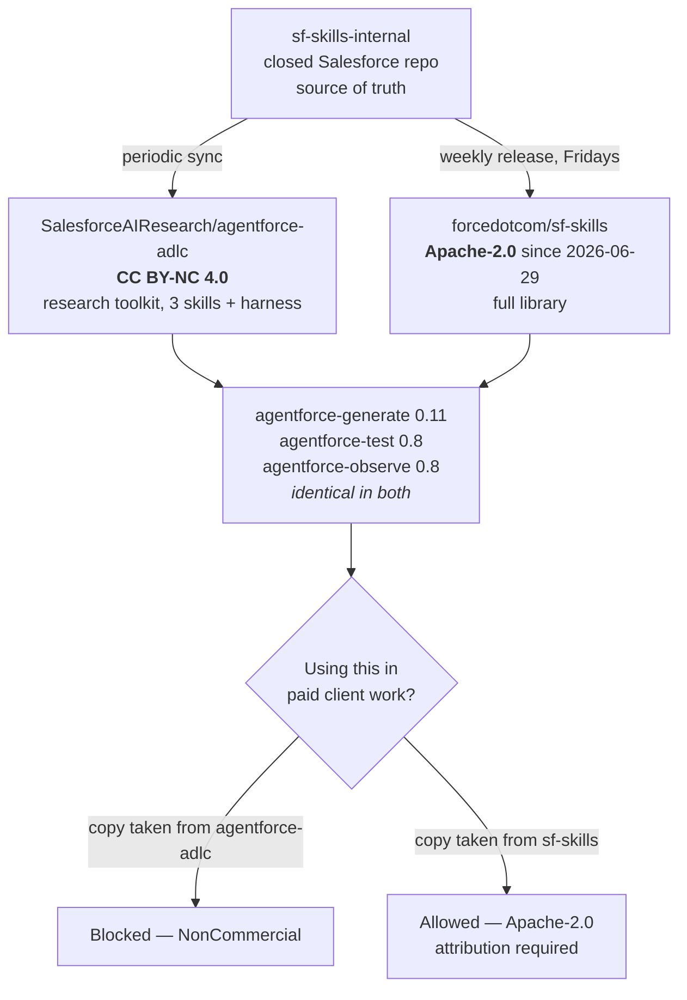

# Pricing and certification

Commercial model and exam changes — the two things clients and recruiters ask about that aren't in the release notes.

---

## 2026-08-01 · The same Agentforce skills ship under two licences — only one permits client work

**What changed.** The three `agentforce-*` Agent Skills are published in **two public repositories from one internal source**, at identical versions, under **different licences**.

| Repository | Licence | Commercial use |
|---|---|---|
| [`forcedotcom/sf-skills`](https://github.com/forcedotcom/sf-skills) | **Apache-2.0** (relicensed from Creative Commons on 2026-06-29, commit `a9a7700`) | **Allowed**, with attribution |
| [`SalesforceAIResearch/agentforce-adlc`](https://github.com/SalesforceAIResearch/agentforce-adlc) | **CC BY-NC 4.0** | **Blocked** — forbids use *"primarily for commercial advantage or monetary compensation"* |

**The evidence they are the same artifact.** `agentforce-generate` is `version: "0.11"` with `minApiVersion: "66.0"` and a word-for-word identical description in both repos; `agentforce-test` and `agentforce-observe` are both `0.8` in both. `agentforce-adlc` names its upstream as a closed repo called `sf-skills-internal`.

**Why it matters.** *NonCommercial* and *consulting deliverable* do not coexist — but the restriction attaches to **the copy you took, not to the skill**. So "can I use this at work?" is not a question about an artifact; it is a question about a **URL**.

The practical answer is therefore never "re-implement it from the ideas." It is "take it from the other repository."

**Gotchas:**
- **Default to `forcedotcom/sf-skills`** for the three `agentforce-*` skills. `forcedotcom` and `salesforce` are product-engineering orgs and trend permissive; `SalesforceAIResearch` is the research org and trends CC BY-NC.
- **This does not clear the whole ADLC repo.** `agentforce-adlc` carries a research harness `sf-skills` does not; "take it from sf-skills instead" covers the skills only.
- **Apache-2.0 is permissive, not public domain** — retain the licence and notice, and state your changes.
- **Record the licence at the commit you took.** The 2026-06-29 relicensing here and the July 30 AnchorBench rewrite both moved licence text with **no version number change**.
- The shared-upstream link is **inferred** from identical content and versions across two Salesforce orgs, one of which names `sf-skills-internal`. Salesforce does not state it.

**Study action:** in any repo where you have vendored Salesforce AI material, run `git log --diff-filter=M -- LICENSE LICENSE.txt` and confirm the licence at the commit you actually took — then record that commit SHA next to the vendored copy.

**Status:** Standing finding, surfaced **2026-08-01** while verifying the `sf-skills` 1.33.0 release. Neither repository is a supported Salesforce product. This **corrects the practical conclusion** of the 2026-07-31 scan note, which treated CC BY-NC 4.0 as a hard stop on the skills themselves; that note's description of `agentforce-adlc` remains accurate. Release itself: [developer-tooling-and-apis.md](developer-tooling-and-apis.md#2026-07-31--sf-skills-1330--a-help-agent-skill-and-skills-that-declare-their-own-preconditions).

**Sources:** [sf-skills LICENSE.txt](https://github.com/forcedotcom/sf-skills/blob/main/LICENSE.txt) · [relicensing commit `a9a7700` (2026-06-29)](https://github.com/forcedotcom/sf-skills/commit/a9a77002cb98c27a7fd77b866e6eef542403400c) · [sf-skills `agentforce-generate` SKILL.md](https://github.com/forcedotcom/sf-skills/blob/main/skills/agentforce-generate/SKILL.md) · [agentforce-adlc `agentforce-generate` SKILL.md](https://github.com/SalesforceAIResearch/agentforce-adlc/blob/main/skills/agentforce-generate/SKILL.md) · [Apache License 2.0](https://www.apache.org/licenses/LICENSE-2.0) · [CC BY-NC 4.0](https://creativecommons.org/licenses/by-nc/4.0/)

---

## 2026-07-24 · Certification retirements and renames — two hard dates

**24 certifications retire on February 1, 2027.** Registration for those exams **closed July 24, 2026**; the **last day to sit one is August 31, 2026**. Passing before the deadline still counts — the credential stays on your Trailblazer profile permanently, flagged as retired from February 1, 2027, and remains valid evidence of knowledge. What it loses is **public verification**: retired credentials stop appearing on the public verification pages.

**16 certifications were renamed on July 24, 2026**, with *Agentforce* replacing the old cloud branding. Cosmetic only — no content change, no exam-code change, no retake. Trailblazer profiles updated automatically.

| Old name | New name |
|---|---|
| Sales Cloud Consultant | Agentforce Sales Consultant |
| Service Cloud Consultant | Agentforce Service Consultant |
| Data Cloud Consultant | Data 360 Consultant _(renamed earlier, 2026-03-27; exam code `Data-Con-101` unchanged)_ |

**Why it matters.** The rename doesn't touch your CV, LinkedIn or email signature — and recruiters search the new terms. Also read it as directional: Salesforce is aligning the credential catalogue with the Agentforce 360 portfolio, so expect exam *content* to drift toward agentic material at the next refresh.

Full list in Salesforce's Certification Name Changes FAQ. Sources: [Salesforce Ben — retiring 24 certifications](https://www.salesforceben.com/salesforce-is-retiring-24-certifications-heres-what-you-need-to-know/) · [Apex Hours — 2027 retirements](https://www.apexhours.com/salesforce-2027-certification-retirements-everything-you-need-to-know/) · [Salesforce Time — retirements and renames](https://salesforcetime.com/2026/06/10/salesforce-certification-retirements-and-renames-explained/) · [The Salesforce Certification Lifecycle](https://www.salesforce.com/blog/salesforce-certification-lifecycle/)

---

## 2026-07-26 · Agentforce Flex Credits — the consumption model

**Headline numbers** (verify against a current quote before using in a proposal — public pricing moves):

| Item | Cost |
|---|---|
| Flex Credits | **$500 per 100,000 credits** |
| Standard action | 20 credits (~$0.10) |
| Voice action | 30 credits (~$0.15) |
| Sandbox / Testing Center action | 16 credits (~$0.08) |
| **Voice, per-minute alternative** | **60 credits/min** — ~$0.30 production, ~$0.24 sandbox _(added 2026-07-28)_ |

A single action costs about **$0.10**; a multi-step task costs a multiple of that, because **you pay per action, not per conversation**. That's the modelling trap — a "conversation" in a demo is one action, but a real resolution is often five to fifteen.

> **Backfill (2026-07-28): voice has two billing models, not one.** Alongside the 30-credit-per-action rate there is a **per-minute model at ~60 credits/min**. The two are not close to equivalent: a five-minute call with three actions costs ~90 credits per-action and ~300 credits per-minute. **Ask which model applies before modelling a voice deployment** — this single question can move a cost estimate by 3×. Secondary-sourced; verify against the contract. See [02-salesforce-ai/12-voice-and-contact-center](../02-salesforce-ai/12-voice-and-contact-center/notes.md).

**Three buying structures:**

- **Pre-purchase** — buy a block up front
- **Pay-as-you-go** — no commitment, highest unit cost
- **PreCommit** — favourable pricing against a forecast; if usage falls below commitment at term end, a true-up charge covers the difference. Suits organisations with a credible usage forecast that don't want cash tied up.

Flex Credits covers **every** Agentforce use case — customer-facing agents, employee-facing agents, and Agentforce Voice — and as of early 2026 is the recommended model for most new deployments.

**Why it matters architecturally, not just commercially.** Cost is now a function of agent design. An orchestrator that routes through three subagents costs three times a direct hit. Chatty grounding loops cost real money. This is the first time Salesforce agent architecture has had a direct, legible unit economics consequence — and it's the question a CFO will ask first.

---

## 2026-07-27 · Data 360 pricing — profiles, pooled credits, free Tableau

_Effective **March 2, 2026**. Added on 2026-07-27 as a gap-fill; see [02-data-cloud/2026-07-27.md](02-data-cloud/2026-07-27.md) for the full write-up._

| Change | Detail |
|---|---|
| **Profile-based SKU** | **~$240 per 1,000 profiles** (baseline) · **~$420 per 1,000** (premium) — bundles essential Data 360 actions into a flat per-profile cost |
| **Data 360 joins Flex Credits** | Data 360 and Agentforce consumption now draw from **one pooled, fungible credit balance** |
| **Tableau usage un-metered** | Querying Data 360 from Tableau no longer burns credits |

A "profile" is a **unified individual after identity resolution**, not a raw source row — so you are billed on the *output* of your identity-resolution ruleset.

**Why it changes design, not just the invoice.** Credit metering rewarded processing less. Profile pricing rewards **resolving fewer, better profiles** — duplicates and under-matches now inflate a recurring bill directly, which puts money behind identity-resolution quality for the first time. Credit pooling removes the "is this the data team's cost or the AI team's cost?" argument that stalls grounding projects. Tableau un-metering is a deliberate nudge toward using Data 360 as the reporting substrate.

Verify against a live quote before any commercial use — public list pricing moves and varies by region.

---

## 2026-07-26 · Pay-per-resolution (Agentforce Help Agent)

The new prepackaged Help Agent, GA July '26, introduces **pay-per-resolution** pricing — billed on outcomes rather than actions or conversations.

| Term | Detail |
|---|---|
| Price | **$2 per issue resolved autonomously end-to-end** |
| Human escalation | **No charge** |
| Negative feedback | **No charge** |
| Data 360 + Agentforce consumption during the interaction | **Unmetered** |

That last row is the one to remember: **pay-per-resolution does not stack on top of Flex Credits.** You are not billed twice for the same conversation.

**Why it matters.** It shifts delivery risk toward Salesforce and makes ROI arithmetic simple for a buyer ($2 vs. the fully-loaded cost of a human ticket — usually $5–$15+). Expect the model to spread. It also raises the stakes on grounding quality: an unresolved conversation earns Salesforce nothing, which is exactly why the Help Agent ships pre-tuned rather than as a blank canvas.

**Benchmarks for business cases:**

- **Salesforce's own** `help.salesforce.com` — **4.3 million inquiries, 70% resolved** by Agentforce. First-party, and the strongest number available.
- **Oviva** (European digital health) — **300,000+ inbound messages/month** handled autonomously, **half** of all inquiries deflected entirely, **40%** of operational support requests resolved without a human.

Deflection rates are heavily domain-dependent; use these as ceilings, not forecasts.

---

## 2026-07-26 · Agentforce Specialist certification restructured

> ⚠️ **Correction pending (2026-07-28): the ~5% figure below may be wrong, and a whole domain may be missing.** A second research pass found 2026 study resources reporting **Multi-Agent Interoperability at 15%** and a **Development Lifecycle and Observability domain at 15–20%** — a domain this radar never recorded. Sources disagree with each other and the official guide could not be read first-party (Trailhead truncates to automated fetching; `salesforce.com` and `help.salesforce.com` return 403). **If the higher numbers are right, the "not a reason to reallocate study time" advice below inverts** — lifecycle plus interoperability would be ~30% of the exam. Both readings are recorded side by side in [the exam guide](../02-salesforce-ai/_cert-agentforce-specialist/exam-guide.md); settle it from the official PDF. Also note a third, older breakdown still circulating (Prompt Engineering 30% / Agentforce Concepts 30% / Data Cloud 20% / Service 10% / Sales 10%) — that one contradicts the documented retirement of the Service and Sales sections, so treat it as stale rather than as a third opinion.

The exam was **significantly restructured in the Summer '25-aligned revision** (announced October 2025) and redesigned around how agents think, interact and collaborate — away from the older emphasis on configuration and prompt building.

**What changed:**

- **New AI Agents domain** replaces the older Agentforce Concepts, Service Cloud and Sales Cloud sections. The Service Cloud and Sales Cloud sections were retired outright; their relevant material folded into the AI Agents domain.
- **New Multi-Agent Interoperability section** — appears for the first time, covering the **Model Context Protocol (MCP)**, the **Agent-to-Agent (A2A) protocol** and the **Agent API**. Weighted at roughly **5%** of the exam.
- **More weight on deterministic behaviour**, filters and variables, plus how agents connect to channels like email and Slack.

**Why it matters for the study plan.** MCP and A2A moved from "adjacent Claude topic" to "examinable Salesforce topic" — so the Hosted MCP Servers work in [developer-tooling-and-apis.md](developer-tooling-and-apis.md) serves both the [02-salesforce-ai](../02-salesforce-ai/INDEX.md) and [03-claude-cca](../03-claude-cca/INDEX.md) tracks. Keep the weighting honest though: at ~5% it's a nice overlap, not a reason to reallocate serious study time.

**Open question:** the exam guide doesn't explicitly name **Agent Script**, despite it becoming the default authoring model in July 2026. Given the emphasis on deterministic behaviour, filters and variables, assume it's implicitly in scope and re-check the guide before booking. Salesforce exam guides lag GA by a release or two.

**Also worth noting:** Agentforce content has been added to the **Salesforce Administrator** exam. The topic is no longer a specialist silo.

Official prep: [Agentforce Specialist Certification Prep on Trailhead](https://trailhead.salesforce.com/content/learn/modules/cert-prep-agentforce-specialist/get-started-with-salesforce-agentforce-specialist-certification-prep).

**Naming note:** the Data Cloud Consultant certification is now the **Salesforce Certified Data 360 Consultant** — update any bookmarks or study plans referring to the old name.

---

## 2026-06-15 · Salesforce to acquire Fin

Salesforce signed a definitive agreement to acquire **Fin**, an SMB-focused autonomous customer service agent platform used by 30,000+ companies. Expected to close **Q4 FY27**.

**Why it matters.** Read alongside the Help Agent and pay-per-resolution: Salesforce is buying into the low-touch, fast-deploy, outcome-priced end of the market rather than only serving enterprise buildouts. For consulting positioning, it signals that the "configure a support agent" work will get commoditized from below — the durable value stays in grounding, data architecture and multi-agent orchestration.

---

## Sources

- [Salesforce Agentforce Credits & Cost Model: Complete Guide 2026 (Jitendra Zaa)](https://www.jitendrazaa.com/blog/salesforce/salesforce-agentforce-credits-cost-model-complete-guide-2026/)
- [Agentforce Pricing Explained 2026 (Enterprise Dreamin')](https://enterprisedreamin.org/articles/agentforce-pricing-explained-2026/)
- [Salesforce Announces Prepackaged Agentforce Help Agent](https://www.salesforce.com/news/stories/agentforce-help-agent-announcement/)
- [3 Big Changes to the Salesforce Agentforce Specialist Certification (Salesforce Ben)](https://www.salesforceben.com/3-big-changes-to-the-salesforce-agentforce-specialist-certification-you-should-know/)
- [The Salesforce Agentforce Specialist Exam Has Evolved (FocusOnForce)](https://focusonforce.com/blog/agentforce-specialist-exam-update/)
- [Salesforce commits $1 billion to Switzerland to expand Agentforce deployments](https://www.marketscale.com/industries/software-and-technology/salesforce-commits-1-billion-to-switzerland-over-five-years-to-expand-agentforce-deployments)
